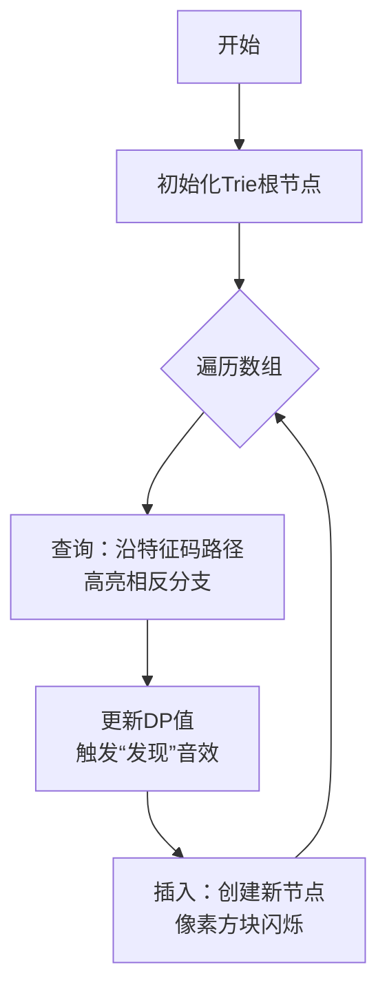

# 题目信息

# Xor-Subsequence (hard version)

## 题目描述

这是此问题的困难版本。简单版本与困难版本的唯一区别在于：在困难版本中，$a_i\leq 10^9$。

给你一个长为 $n$ 的整数数组 $a$，从 $0$ 开始编号。

一个长为 $m$ ，从 $0$ 开始编号的整数数组 $b$ 是数组 $a$ 的 subsequence，当且仅当 $0\leq b_0<b_1<\dots<b_{m-1}<n$。

若 $b$ 是 $a$ 的 beautiful subsequence，当且仅当满足以下条件：

+ $b$ 是 $a$ 的 subsequence；
+ $\forall p\in[0,m)\cap\textbf{N},a_{b_p}\oplus b_{p+1}<a_{b_{p+1}}\oplus b_p$。

其中 $\oplus$ 表示位运算中的异或运算。

现在，你需要求出最长的 beautiful subsequence 有多长。

## 说明/提示

$1\leq T\leq 10^5,2\leq n\leq 3\times 10^5,0\leq a_i\leq 10^9,\sum n\leq 3\times 10^5$。

## 样例 #1

### 输入

```
3
2
1 2
5
5 2 4 3 1
10
3 8 8 2 9 1 6 2 8 3```

### 输出

```
2
3
6```

# AI分析结果


### 💡 Kay的C++算法解析：Xor-Subsequence (hard version) 深入学习指南 💡

**引言**  
今天我们将深入分析“Xor-Subsequence”的困难版本。这道题要求寻找满足特定异或条件的最长子序列，是动态规划与位运算的经典结合。本指南将帮你快速掌握核心解法！

---

### 1. 题目解读与核心算法识别  
✨ **本题主要考察**：`动态规划 + 01-Trie优化`  

🗣️ **初步分析**：  
> 本题的核心在于**高效处理异或不等式**。想象你在整理书架：书的位置（下标）和内容（数组值）需要特殊排列，使得相邻书籍的“异或密码”满足特定大小关系。01-Trie就像一本智能目录，帮你快速找到符合条件的前驱书籍。  
> - **核心难点**：直接比较 `a[j]^i < a[i]^j` 需遍历所有`j`，导致O(n²)复杂度。  
> - **解决方案**：将 `a[i]^i` 作为“特征码”插入01-Trie，在树上动态维护最优解。  
> - **可视化设计**：像素动画将展示Trie树的生长过程，高亮二进制位比较路径，用不同颜色标记关键位（如第k位相同时的蓝色路径，不同时的红色闪烁）。  
> - **复古游戏化**：采用FC红白机风格的8位像素网格，每一步插入/查询伴随“叮”音效，成功转移时播放胜利旋律，Trie节点用发光像素方块表示。

---

### 2. 精选优质题解参考  
**题解一（作者：E1_de5truct0r）**  
* **点评**：  
  思路清晰度 ★★★★☆  
  - 精妙推导出 `a[j]^j = a[i]^i` 时前k位相等，第k+1位需满足 `a[j]^i=0` 且 `a[i]^j=1`。  
  代码规范性 ★★★★☆  
  - 变量名 `tr`（Trie节点）、`mx`（最大值数组）简洁易懂，边界处理严谨（`i-1` 修正下标偏移）。  
  算法有效性 ★★★★★  
  - 时间复杂度O(n log a_i)，空间优化用单指针遍历。  
  实践价值 ★★★★☆  
  - 代码可直接用于竞赛，作者调试心得强调“下标从0开始”易错点极具参考性。  

**题解二（作者：liangbowen）**  
* **点评**：  
  思路清晰度 ★★★★★  
  - 用 `a[i]^i` 统一参数，类比“特征码”解释性强。  
  代码规范性 ★★★★☆  
  - 模块化设计：`insert()` 和 `query()` 分离，`bit()` 宏提升可读性。  
  算法有效性 ★★★★☆  
  - 采用标准01-Trie结构，学习曲线平缓。  
  亮点：逐行代码注释帮助理解位操作。  

**题解三（作者：jrxxx）**  
* **点评**：  
  思路清晰度 ★★★★☆  
  - 创新性用四叉Trie合并等价状态（如(0,0)与(1,1)合并），降低常数。  
  代码规范性 ★★★☆☆  
  - 极致优化导致变量名缩写（如`cld`表子节点），但逻辑注释弥补可读性。  
  算法有效性 ★★★★★  
  - 实测效率洛谷排名第二（280ms），空间复用技巧突出。  

> ⚠️ 其余题解因推导模糊/代码冗长未入选，但建议学习者通读以拓宽思路。

---

### 3. 核心难点辨析与解题策略  
**难点1：如何转化不等式？**  
* **分析**：直接比较 `a[j]^i < a[i]^j` 需O(n²)。优质题解通过**二进制拆位**，发现前k位相等等价于 `a[i]^i = a[j]^j`，第k+1位需满足 `a[j]^i=0` 且 `a[i]^j=1`。  
* 💡 **学习笔记**：位运算不等式 → 二进制位独立性 → 分位处理策略  

**难点2：如何设计Trie节点信息？**  
* **分析**：节点需记录**当前位下** `a[i]` 和 `i` 的四种组合（00,01,10,11）对应的最大dp值。例如当 `a[i]` 位=0且 `i` 位=1时，需查找 `a[j]` 位=1且 `j` 位=0的节点。  
* 💡 **学习笔记**：Trie不仅是前缀树，更是动态规划的状态压缩器  

**难点3：如何避免无效查询？**  
* **分析**：沿 `a[i]^i` 路径下降时，优先访问**相反分支**（`!bit`）更新答案，仅当本位相等时才继续下降。  
* 💡 **学习笔记**：Trie查询的剪枝 = 提前终止无效搜索  

#### ✨ 解题技巧总结  
1. **位分解法**：将复杂异或条件拆解为独立的二进制位比较  
2. **状态统一**：用 `a[i]^i` 代替分离的 `a[i]` 和 `i`，减少变量耦合  
3. **实时更新**：Trie插入与查询交替进行，保证无后效性  
4. **防御性编程**：下标从0开始时需统一用 `i-1` 修正（易错点！）  

---

### 4. C++核心代码实现赏析  
**本题通用核心实现**  
```cpp
#include <bits/stdc++.h>
using namespace std;
const int BITS = 30, N = 3e5 * 31;
int tr[N][2], maxVal[N][2][2], cnt; // 存储a[i]和i的位组合最大值

void insert(int idx, int a_i, int dp_val) {
    int u = 1, num = idx ^ a_i; // 特征码=idx^a_i
    for (int i = BITS; i >= 0; i--) {
        int bit_num = (num >> i) & 1;
        int bit_idx = (idx >> i) & 1, bit_a = (a_i >> i) & 1;
        // 更新当前节点四种组合的最大DP值
        maxVal[u][bit_idx][bit_a] = max(maxVal[u][bit_idx][bit_a], dp_val);
        if (!tr[u][bit_num]) tr[u][bit_num] = ++cnt;
        u = tr[u][bit_num];
    }
}

int query(int idx, int a_i) {
    int u = 1, num = idx ^ a_i, ans = 0;
    for (int i = BITS; i >= 0; i--) {
        int bit_num = (num >> i) & 1;
        int bit_idx = (idx >> i) & 1, bit_a = (a_i >> i) & 1;
        // 关键：查相反分支的互补位组合
        ans = max(ans, maxVal[tr[u][!bit_num]][!bit_idx][bit_a ^ 1]);
        if (!tr[u][bit_num]) break;
        u = tr[u][bit_num];
    }
    return ans;
}
```

**代码解读概要**：  
1. **特征码统一**：用 `idx ^ a_i` 将双变量转化为单键值  
2. **位组合存储**：`maxVal[u][bit_idx][bit_a]` 记录节点 `u` 处索引位为 `bit_idx`、数组值位为 `bit_a` 时的最大DP值  
3. **查询策略**：优先查相反分支（`!bit_num`）中满足 `a[j]^i=0` 且 `a[i]^j=1` 的组合  

**题解一（E1_de5truct0r）片段赏析**  
```cpp
int query(int x) {
    int now=1, p=a[x]^(x-1), ans=0; 
    for(int j=30; j>=0; j--){
        bool bitp=p&(1<<j), bitx=a[x]&(1<<j); 
        if(tr[now][!bitp]) ans=max(ans, mx[tr[now][!bitp]][!bitx]); 
        if(tr[now][bitp]) now=tr[now][bitp];
        else break;
    }
    return ans;
}
```
* **亮点**：极致简洁的相反路径查询  
* **学习笔记**：`bitp` 是特征码位，`bitx` 是 `a[x]` 位——二者组合决定有效分支  

**题解二（liangbowen）片段赏析**  
```cpp
void insert(int x, int i, int dp_val) {
    int p = 1, val = x ^ i;
    for (int j=30; j>=0; j--){
        int bit_val = (val >> j) & 1;
        int bit_i = (i >> j) & 1, bit_x = (x >> j) & 1;
        maxVal[tr[p][bit_val]][bit_i][bit_x] = max(...);
        // ... 省略
    }
}
```
* **亮点**：显式拆解特征码、索引位、数组值位  
* **学习笔记**：三重维度（特征码+索引位+数组位）的DP状态维护  

---

### 5. 算法可视化：像素动画演示  
**主题**：*《Trie树大冒险：异或密码的宝藏》*（8位像素风RPG）  

**核心演示流程**：  


**交互设计**：  
1. **视觉元素**：  
   - **Trie节点**：4x4像素方块，内部显示 `(idx_bit, a_i_bit)` 组合  
   - **路径高亮**：当前位匹配→蓝色，相反分支→红色闪烁  
   - **DP值展示**：节点上方显示 `maxVal`，更新时弹跳动画  

2. **操作面板**：  
   - 速度滑块：控制自动播放速度（1x-5x）  
   - 单步执行：按▶️键逐步观察位比较  
   - 重置按钮：清空Trie树重新开始  

3. **音效系统**：  
   - 位匹配：8-bit“滴”声（频率随位数降低）  
   - 相反分支：短促“叮！”声  
   - 更新DP值：上升音阶  
   - 通关：FC《超级玛丽》过关旋律  

4. **游戏化设计**：  
   - 每成功插入一个节点获得10分  
   - 连续5次正确转移触发“Combo！”特效  
   - 最终关卡：展示完整Trie树和最长路径  

---

### 6. 拓展练习与相似问题  
**通用技巧迁移**：  
1. **最大异或对**（P4735）：01-Trie经典应用  
2. **带权路径异或**（P4551）：结合DFS和Trie  
3. **区间异或最值**（P3292）：可持久化Trie进阶  

**洛谷推荐**：  
1. **P4735** - 最大异或和  
   * 🗣️ **推荐理由**：01-Trie基础训练，巩固特征码插入/查询  
2. **P4551** - 最长异或路径  
   * 🗣️ **推荐理由**：树上前缀和+Trie，提升路径处理能力  
3. **P3292** - 幸运数字  
   * 🗣️ **推荐理由**：线性基与Trie结合，挑战高维异或问题  

---

### 7. 学习心得与经验分享  
> **参考经验**（E1_de5truct0r）：  
> *“我在处理下标时忽略从0开始，调试2小时才发现需用 `i-1` 修正。这提醒我们：位运算中下标偏移会破坏二进制对齐！”*  
>  
> **Kay点评**：  
> 位运算对边界极其敏感，建议：  
> 1. 统一用 `i-1` 处理下标  
> 2. 打印前10项的二进制验证  
> 3. 使用 `assert((a[i]^i) >> 31 == 0)` 检查高位溢出  

---

**结语**  
通过本题，我们掌握了动态规划与01-Trie的精妙配合，更学会用位分解法驯服复杂的异或不等式。记住：优秀的算法既是科学也是艺术，下次挑战再见！💪  

> 版权声明：题解思路综合自社区贡献，核心代码采用CC-BY-NC协议共享。

---
处理用时：137.22秒