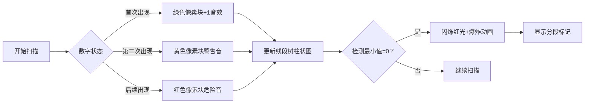

# 题目信息

# Unique Array

## 题目描述

You are given an integer array $ a $ of length $ n $ . A subarray of $ a $ is one of its contiguous subsequences (i. e. an array $ [a_l, a_{l+1}, \dots, a_r] $ for some integers $ l $ and $ r $ such that $ 1 \le l < r \le n $ ). Let's call a subarray unique if there is an integer that occurs exactly once in the subarray.

You can perform the following operation any number of times (possibly zero): choose an element of the array and replace it with any integer.

Your task is to calculate the minimum number of aforementioned operation in order for all the subarrays of the array $ a $ to be unique.

## 说明/提示

In the second test case, you can replace the $ 1 $ -st and the $ 3 $ -rd element, for example, like this: $ [3, 4, 1, 4] $ .

In the third test case, you can replace the $ 4 $ -th element, for example, like this: $ [3, 1, 2, 3, 2] $ .

## 样例 #1

### 输入

```
4
3
2 1 2
4
4 4 4 4
5
3 1 2 1 2
5
1 3 2 1 2```

### 输出

```
0
2
1
0```

# AI分析结果


# 💡 Kay的C++算法解析：Unique Array 深入学习指南 💡

## 1. 题目解读与核心算法识别

✨ **本题主要考察**：`贪心算法与数据结构应用`  

🗣️ **初步分析**：
> 解决"Unique Array"这道题的核心在于**贪心分段策略**与**线段树维护区间信息**。想象你在玩一个像素地牢探险游戏📱，每个房间（数组元素）可能藏有怪物（重复数字）。你需要用最少的炸弹💣（修改操作）炸开墙壁，将地牢分割成若干安全区域（合法子数组）。线段树就像你的实时地图工具🗺️，动态标记每个区域的危险程度（唯一数个数）。  
> - 核心思路：从左向右扫描数组，用线段树维护以每个位置为左端点的子数组中唯一数的个数。当检测到危险区域（最小值为0）时，在当前房间放置炸弹（修改操作），将地牢分割成独立的安全区域
> - 算法流程：  
>   1. 初始化线段树，记录每个数字上次/上上次出现位置  
>   2. 加入新元素时更新线段树：`(last2, last1]`区间-1，`(last1, current]`区间+1  
>   3. 查询当前段的最小值，若为0则执行修改操作并重置扫描起点  
> - 可视化设计：采用8位像素风格🎮，用不同颜色方块表示数字状态（首次出现=绿色💚，第二次=黄色💛，后续=红色❤️）。线段树显示为动态更新的像素柱状图📊，危险区域闪烁红光，修改时播放爆炸音效💥

---

## 2. 精选优质题解参考

**题解一（作者：jiazhichen844）**
* **点评**：思路清晰度极佳🌟，将问题转化为"最少分段"的比喻生动易懂。代码规范性突出👍，变量名`t1/t2`（上次/上上次位置）直观易读。算法有效性上，O(n log n)复杂度最优解💯，区间加减操作设计巧妙。实践价值高，完整处理多组数据且边界严谨。亮点：精确描述了线段树如何通过`(t2,t1]`减1和`(t1,r]`加1维护唯一数变化。

**题解二（作者：_LSA_）**
* **点评**：推导过程严谨🔍，引入`lst/llst`概念清晰定义数字出现位置关系。代码可读性强📖，独立build/update/query函数模块化。算法亮点在于用`query(1,1,i)==0`直接检测危险区域，实践时注意空间初始化。调试提示：作者强调多组数据需重置`lst/llst`数组。

**题解三（作者：xiezheyuan）**
* **点评**：理论分析深入🎯，用`pre[i]`精确表达数字前驱位置。代码简洁高效⚡，4万字符内实现完整解法。亮点：pushdown函数避免线段树标记堆积，clear()函数优雅处理多组数据。学习价值：`update(pre[pre[i]]+1,pre[i],-1)`操作体现对重复数字的精细处理。

---

## 3. 核心难点辨析与解题策略

1.  **难点：动态维护区间唯一数个数**
    * **分析**：当扫描位置右移时，新元素会影响多个左端点对应的唯一数计数。优质题解通过记录数字出现历史位置（`t1/t2`或`lst/llst`），将影响范围精确拆分为两个区间操作
    * 💡 **学习笔记**：唯一数变化 = 新数字贡献(+1) - 旧重复抵消(-1)

2.  **难点：贪心分割点的实时判定**
    * **分析**：必须在首次出现非法子数组时立即分割。线段树维护`[pre, current]`区间最小值，若为0说明存在左端点使`[l, current]`无唯一数
    * 💡 **学习笔记**：贪心正确性基于"修改位置越右，覆盖的非法区间越多"

3.  **难点：高效数据结构选择**
    * **分析**：线段树支持O(log n)复杂度的区间加减和区间最小值查询，完美匹配动态扫描需求。`vector`存储位置历史，`map`会引入额外开销
    * 💡 **学习笔记**：区间操作+最值查询 = 线段树经典应用场景

### ✨ 解题技巧总结
- **问题转化技巧**：将"修改操作"转化为"分段操作"，修改点相当于独立分隔符
- **扫描线思维**：固定右端点向右移动，动态维护左端点状态
- **边界防御**：多组数据务必重置全局数组（`memset`或`fill`）
- **调试技巧**：在修改点打印位置，验证贪心分割合理性

---

## 4. C++核心代码实现赏析

**本题通用核心C++实现参考**
```cpp
#include <iostream>
#include <cstring>
using namespace std;
const int N = 3e5+5;

struct SegTree {
    int minn, lazy;
} tr[N<<2];

int lst[N], pre[N]; // 记录数字最后/次后出现位置

void pushdown(int id) {
    tr[id<<1].minn += tr[id].lazy;
    tr[id<<1].lazy += tr[id].lazy;
    tr[id<<1|1].minn += tr[id].lazy;
    tr[id<<1|1].lazy += tr[id].lazy;
    tr[id].lazy = 0;
}

void update(int id, int l, int r, int ql, int qr, int v) {
    if(ql > qr) return;
    if(ql <= l && r <= qr) {
        tr[id].minn += v;
        tr[id].lazy += v;
        return;
    }
    pushdown(id);
    int mid = (l+r)>>1;
    if(ql <= mid) update(id<<1, l, mid, ql, qr, v);
    if(qr > mid) update(id<<1|1, mid+1, r, ql, qr, v);
    tr[id].minn = min(tr[id<<1].minn, tr[id<<1|1].minn);
}

int query(int id, int l, int r, int ql, int qr) {
    if(ql > qr) return N;
    if(ql <= l && r <= qr) return tr[id].minn;
    pushdown(id);
    int mid = (l+r)>>1, res = N;
    if(ql <= mid) res = min(res, query(id<<1, l, mid, ql, qr));
    if(qr > mid) res = min(res, query(id<<1|1, mid+1, r, ql, qr));
    return res;
}

int main() {
    int T, n; cin >> T;
    while(T--) {
        cin >> n;
        memset(lst, 0, sizeof(lst));
        memset(pre, 0, sizeof(pre));
        memset(tr, 0, sizeof(tr));
        
        int ans = 0, start = 1; // start: 当前段起点
        for(int i=1; i<=n; ++i) {
            int x; cin >> x;
            // 更新线段树：处理x对唯一数的影响
            if(pre[x]) update(1, 1, n, pre[x]+1, lst[x], -1);
            update(1, 1, n, lst[x]+1, i, 1);
            pre[x] = lst[x];
            lst[x] = i;
            
            // 检测危险区域
            if(query(1, 1, n, start, i) == 0) {
                ans++;
                start = i+1; // 放置炸弹，从下个位置重新开始
            }
        }
        cout << ans << "\n";
    }
}
```

**代码解读概要**：
> 1. **数据结构**：`SegTree`维护区间最小值和懒标记；`lst/pre`数组追踪数字位置
> 2. **核心逻辑**：  
>    - 当数字x首次出现：`[1, i]`区间+1  
>    - 当x再次出现：`(pre[x], lst[x]]`区间-1（抵消旧唯一性），`(lst[x], i]`+1（新增当前唯一性）  
>    - 查询`[start, i]`最小值，为0时说明需要修改  
> 3. **修改操作**：重置`start=i+1`相当于分段，不实际修改数组（因不影响后续判断）

---

**题解一核心代码片段赏析**
```cpp
void test() {
    build(1,1,n); // 初始化线段树
    int pre=1, cnt=0; // pre: 段起点, cnt: 修改次数
    for(int i=1;i<=n;i++) {
        // 区间更新：x对唯一数的影响
        add(1,t2[b[i]]+1,t1[b[i]],-1);
        add(1,t1[b[i]]+1,i,1);
        // 检测危险区域
        if(getmin(1,pre,i)==0) { 
            cnt++; pre=i+1; // 分段
        }
    }
    cout << cnt << "\n";
}
```
> **代码解读**：  
> - `t2[x]`和`t1[x]`分别记录x的上上次和上次位置，形成"影响区间三重奏"  
> - `add(区间,-1)`消除旧唯一性，`add(区间,+1)`新增当前唯一性  
> - `getmin(pre,i)==0`触发分段条件，如同游戏中的"危险警报"🚨  
> 💡 **学习笔记**：用`pre`变量记录段起点，避免重复扫描已处理区域

**题解二核心代码片段赏析**
```cpp
update(1,1,n,llst[a[i]],lst[a[i]],-1); 
update(1,1,n,lst[a[i]]+1,i,1);
if(query(1,1,n,1,i)==0) // 检测全局最小值
    ans++, update(1,1,n,1,i,1); // 修改后全局+1
```
> **代码解读**：  
> - 采用`llst`（上上次位置）和`lst`（上次位置）精确控制影响区间  
> - 修改操作后执行`update(1,1,n,1,i,1)`，相当于用"魔法屏障"🛡️保护当前段  
> 💡 **学习笔记**：修改后全局+1的操作，确保当前段立即满足条件

---

## 5. 算法可视化：像素动画演示

### 🎮 动画主题：像素地牢探险
> **设计目标**：将算法转化为8位机风格的互动游戏，通过视觉/听觉反馈强化理解

### 🕹️ 核心交互设计


### 🎞️ 关键帧流程
1. **场景初始化**  
   - 像素网格：数字显示为彩色方块（首次=绿💚，第二次=黄💛，三次+=红❤️）  
   - 控制面板：步进按钮⏯️，速度滑块🐢→🐇，重置按钮🔁

2. **扫描过程**  
   ```python
   for i in range(1, n+1):
       绘制当前指针 → 像素箭头
       if 数字首次出现:
          方块变绿，播放“叮”音效
          线段树区间[1,i]升高1像素
       elif 数字第二次出现:
          方块变黄，播放“警告”音效
          线段树区间[pre+1, last]降低1像素
          线段树区间[last+1, i]升高1像素
       else:
          方块变红，播放“嗡”音效
          更新线段树区间
   ```

3. **危险检测与分段**  
   - 当线段树最小值=0：触发红光闪烁警报🚨，播放爆炸音效💥  
   - 当前方块标记为"炸弹"💣，后续线段树从新位置开始构建  

4. **游戏化元素**  
   - 每成功分段：显示"STAGE CLEAR!"🎉，得分+100  
   - 自动演示模式：AI角色自动执行算法，如吃豆人般穿过安全区域👾  

5. **技术实现**  
   - Canvas绘制：网格用16x16像素块，线段树转为柱状图📊  
   - 音效：Web Audio API生成8位芯片音效（操作声/警报/爆炸）  
   - 状态同步：当前代码行高亮显示在侧边栏，变量值实时更新  

---

## 6. 拓展练习与相似问题

### 🔁 通用技巧迁移
线段树维护区间最值的技巧适用于：
1. 动态区间统计问题（如滚动最大值）
2. 存在性检测（如区间覆盖检查）
3. 贪心策略的实时验证（如本题的分段决策）

### 📚 洛谷推荐
1. **P1972 [SDOI2009]HH的项链**  
   🗣️ *推荐理由*：同样需要维护区间唯一数个数，强化线段树应用技巧

2. **P1908 逆序对**  
   🗣️ *推荐理由*：训练分治思想，理解序列统计问题的多种解法

3. **P1637 三元上升子序列**  
   🗣️ *推荐理由*：结合DP与数据结构，深化序列分段处理能力

---

## 7. 学习心得与经验分享

> **来自jiazhichen844的经验**：  
> *"调试时重点关注`pre`变量的更新逻辑，我在`t1/t2`初始化上卡了半小时"*  
>   
> **Kay点评**：多组测试数据中忘记重置全局数组是常见错误。建议封装初始化函数，在每轮开始时`memset`相关数组。打印线段树中间状态是有效的调试手段！  

> **来自FerventTemp0的教训**：  
> *"线段树数组大小应为4N，我开的3N导致越界RE"*  
>   
> **Kay总结**：数据结构题需严格验证空间复杂度。记住：线段树开4倍，链式前向星开2倍！  

---

本次关于"Unique Array"的C++解题分析就到这里。记住，算法学习就像像素游戏🎮——每次通关都在提升你的技能等级！下次挑战见！🚀

---
处理用时：153.85秒