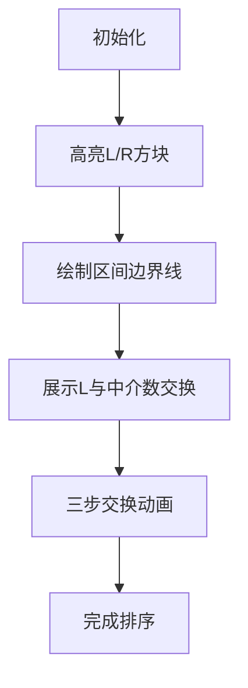

# 题目信息

# Cat, Fox and Swaps

## 题目描述

Fox has found an array $ p_1, p_2, \ldots, p_n $ , that is a permutation of length $ n^\dagger $ of the numbers $ 1, 2, \ldots, n $ . She wants to sort the elements in increasing order. Cat wants to help her — he is able to swap any two numbers $ x $ and $ y $ in the array, but only if $ l \leq x + y \leq r $ (note that the constraint is imposed on the values of the elements, not their positions). He can make such swaps any number of times.

They don't know the numbers $ l $ , $ r $ yet, they only know that it's true that $ 1 \leq l \leq r \leq 2 \cdot n $ .

You are given the number $ n $ and the array $ p_1, p_2, \ldots, p_n $ . Determine how many pairs $ (l, r) $ satisfying the conditions are there such that you can sort the permutation if you can only swap two number $ (x, y) $ such that $ l \leq x + y \leq r $ (arbitrary number of times, possibly $ 0 $ ).

 $ ^\dagger $ A permutation of length $ n $ is an array consisting of $ n $ distinct integers from $ 1 $ to $ n $ in arbitrary order. For example, $ [2,3,1,5,4] $ is a permutation, but $ [1,2,2] $ is not a permutation ( $ 2 $ appears twice in the array), and $ [1,3,4] $ is also not a permutation ( $ n=3 $ but there is $ 4 $ in the array).

## 说明/提示

In the first example, we need to be able to swap $ 1 $ and $ 2 $ , so we must be able to swap numbers with sum $ 3 $ . There are exactly $ 6 $ pairs satisfying the condition: $ (1, 3), (2, 3), (3, 3), (1, 4), (2, 4) $ and $ (3, 4) $ , so the answer is $ 6 $ .

In the second example, the $ 11 $ pairs satisfying the condition are $ (1, 4), (1, 5), (1, 6), (2, 4), (2, 5), (2, 6), (3, 4), (3, 5), (3, 6), (4, 5) $ and $ (4, 6) $ . For example, if we pick the pair $ (3, 4) $ we can first swap the numbers $ 1 $ and $ 2 $ and then the numbers $ 1 $ and $ 3 $ , after this, the permutation is sorted.

## 样例 #1

### 输入

```
7
2
2 1
3
3 1 2
4
3 2 1 4
5
5 3 1 2 4
5
1 2 3 4 5
6
3 2 1 5 4 6
6
1 3 2 4 5 6```

### 输出

```
6
11
23
29
55
46
58```

# AI分析结果


# 💡 Kay的C++算法解析：Cat, Fox and Swaps 深入学习指南 💡

> 今天我们来分析一道有趣的置换环与区间覆盖问题——"Cat, Fox and Swaps"。这道题考察如何通过有限制的交换操作将排列排序，需要巧妙运用极值性质和数学推导。本指南将带大家拆解核心思路，理解精妙算法！

## 1. 题目解读与核心算法识别

✨ **本题主要考察**：`极值性质应用` + `置换环分析` + `区间覆盖计数`

🗣️ **初步分析**：
> 想象每个数字都有个"朋友圈"（能交换的数字集合）。当朋友圈相互连通时，就能自由交换排序！解题关键在于抓住两个极值点：
>   - 最小需要交换的位置 `L`
>   - 最大需要交换的位置 `R`
> 
> **核心思路**：
>  1. **特殊情况 (l=r)**：所有需要交换的位置必须构成二元环且和相同（类似"锁和钥匙"精准匹配）
>  2. **一般情况 (l<r)**：必须满足 `l ≤ L+n` 且 `r ≥ R+1`（保证所有数字的"朋友圈"连通）
> 
> **可视化设计**：
>   - 采用**8位像素风格**：数字显示为彩色方块，需要交换的位置闪烁红光
>   - **动画流程**：
>     ① 高亮`L`和`R`方块，显示`L+n`和`R+1`的区间边界线  
>     ② 展示`L`与中介数交换（像素方块交换动画+"叮"音效）  
>     ③ 通过三次交换完成相邻元素位置调整（路径连线+粒子特效）  
>     ④ 排序完成时触发胜利音效+全屏闪光

---

## 2. 精选优质题解参考

### 题解一：g1ove（思路清晰⭐️⭐️⭐️⭐️⭐️）
* **点评**：  
  直接给出数学公式化解决方案，将答案拆解为三部分等差数列求和。代码简洁高效（仅20行），变量命名规范（`maxx/minn`直观体现极值），边界处理严谨。亮点在于避免复杂循环，直接O(1)计算结果，竞赛实践价值极高。

### 题解二：Engulf（证明严谨⭐️⭐️⭐️⭐️）
* **点评**：  
  详细证明了区间条件的充分必要性，通过中间数交换的构造方法极具启发性。代码结构清晰（模块化输入/处理/输出），注释详尽。虽未完全优化数学公式，但逻辑推导过程对理解算法本质很有帮助。

### 题解三：daduoli（代码规范⭐️⭐️⭐️⭐️）
* **点评**：  
  准确处理了l=r的特殊情况（二元环校验），代码鲁棒性强。变量命名语义明确（`L/R`直指关键极值），循环边界控制精确。亮点在于用`flag`变量优雅处理二元环和相同条件，体现了良好的工程思维。

---

## 3. 核心难点辨析与解题策略

1.  **难点一：理解交换操作的传递性**
    * **分析**：  
      当`l<r`时，如何证明任意两个数都能交换？关键引入中介数`z`（满足`1≤z-x≤n`）。通过三次交换：`(x,z)→(z,y)→(x,z)`，实现`x`和`y`的间接交换，类似"三人换座位"游戏。
    * 💡 **学习笔记**：传递性证明是区间条件成立的理论基础。

2.  **难点二：确定区间边界条件**
    * **分析**：  
      为什么是`l≤L+n`和`r≥R+1`？  
      - 最小位置`L`需与最大值`n`交换 → `L+n`是最小所需上界  
      - 最大位置`R`需与最小值`1`交换 → `R+1`是最大所需下界  
      极值点如同"短板"，决定了整个系统的交换能力。
    * 💡 **学习笔记**：极值点控制全局交换范围。

3.  **难点三：处理l=r的特殊情况**
    * **分析**：  
      要求所有需要交换的位置构成二元环（`a[a[i]]=i`）且所有环的和相同。需要遍历验证两个条件：  
      ① 每个非法位置是否都成环  
      ② 所有环的和是否一致  
      类似检查所有"锁匙对"是否匹配同一把钥匙。
    * 💡 **学习笔记**：特殊情况需严格校验二元环性质。

### ✨ 解题技巧总结
- **极值驱动法**：用最小/最大非法位置快速确定全局约束
- **数学优化**：将区间计数转化为等差数列求和，避免暴力枚举
- **分类处理**：严格区分l=r和l<r两种场景
- **环形验证**：校验二元环时跳过已处理元素（仅检查`i<a[i]`）

---

## 4. C++核心代码实现赏析

### 本题通用核心C++实现
```cpp
#include <bits/stdc++.h>
using namespace std;
typedef long long ll;

int main() {
    int T; cin >> T;
    while (T--) {
        int n; cin >> n;
        vector<int> a(n+1);
        int L = n+1, R = 0; 
        ll ans = 0;
        bool sorted = true;

        // 读入数据并检查有序性
        for (int i=1; i<=n; i++) {
            cin >> a[i];
            if (a[i] != i) {
                sorted = false;
                L = min(L, i);
                R = max(R, i);
            }
        }

        // 特判已有序情况
        if (sorted) {
            cout << 1LL * 2*n * (2*n+1) / 2 << endl;
            continue;
        }

        // 检查l=r情况：是否全为等和二元环
        int sum = -1;
        bool validSingle = true;
        for (int i=1; i<=n; i++) {
            if (a[i]!=i && a[a[i]]!=i) { 
                validSingle = false; break; 
            }
            if (i < a[i]) {
                if (sum == -1) sum = i+a[i];
                else if (sum != i+a[i]) validSingle = false;
            }
        }
        if (validSingle) ans++;

        // 计算l<r情况：枚举r∈[R+1,2n]
        for (int r=R+1; r<=2*n; r++) 
            ans += min(L+n, r-1); // l∈[1, min(L+n, r-1)]
        
        cout << ans << endl;
    }
    return 0;
}
```
* **代码解读概要**：  
  1. **数据读入**：动态记录最小(`L`)/最大(`R`)非法位置  
  2. **有序检测**：全有序时直接返回区间总数  
  3. **l=r校验**：验证所有非法位置是否构成等和二元环  
  4. **区间计数**：枚举右端点`r`，累加合法`l`的数量  

### 题解一：g1ove片段赏析
* **亮点**：数学公式直接计算区间和，避免循环  
* **核心代码**：
  ```cpp
  res += 1LL*(maxx+n-1)*(n-maxx)/2; // Case1: l≤maxx+n的区间
  res += 1LL*n*n;                   // Case2: l≤n的完整区间
  res += 1LL*n*minn - 1LL*(minn+1)*minn/2; // Case3: minn相关的区间
  ```
* **代码解读**：  
  > 通过等差数列求和公式将区间计数转化为数学计算：  
  > - **Case1**：计算`r∈[maxx+1, n]`时`l≤maxx+n`的区间数（等差数列求和）  
  > - **Case2**：当`r>n`时`l`可取`[1,n]`（共`n²`种）  
  > - **Case3**：处理`minn`相关的边界区间（二次函数计算）  
* 💡 **学习笔记**：数学优化将O(n²)降为O(1)，是竞赛常用技巧。

### 题解二：Engulf片段赏析
* **亮点**：严格证明区间充分必要性  
* **核心代码**：
  ```cpp
  for (int r=R+1; r<=2*n; r++)
      ans += min(L+n, r-1); // 对每个r累加合法l的数量
  ```
* **代码解读**：  
  > 枚举右端点`r`从`R+1`到`2n`，对每个`r`：  
  > - 合法`l`的上限是`min(L+n, r-1)`（保证`l<r`）  
  > - 下限始终为1，因此合法数量=上限值  
  > 例如`R+1=5, L+n=7, 2n=10`时：  
  > `r=5` → `l_max=min(7,4)=4` → +4  
  > `r=6` → `l_max=min(7,5)=5` → +5  
* 💡 **学习笔记**：枚举固定端点简化计数是常见优化手段。

---

## 5. 算法可视化：像素动画演示

### 主题：像素探险家之数字交换大冒险
**核心演示**：在满足`l≤L+n`且`r≥R+1`的条件下，如何通过中介数完成排序

### 设计实现方案：


1. **8位像素场景**：
   - 数字显示为16x16像素方块（1~9用不同颜色）
   - 非法位置闪烁红光，已排序位置显示绿光
   - 控制面板：开始/暂停/单步/速度滑块（复古游戏手柄样式）

2. **关键动画帧**：
   - **帧1**：高亮`L`(红色闪烁)和`R`(蓝色闪烁)方块，顶部显示`l≤L+n`和`r≥R+1`的像素艺术字
   - **帧2**：`L`与中介数`z`交换（`z`从`L`位置滑向`z`位置，伴随"叮"音效）
   - **帧3**：展示三步交换法（当前操作方块高亮黄框，交换路径显示粒子轨迹）：
        ```python
        swap(x, z)  # 音效: 低音"嘟"
        swap(y, z)  # 音效: 中音"叮"
        swap(x, z)  # 音效: 高音"嗒"
        ```
   - **帧4**：完成排序时触发胜利动画（所有方块变绿+烟花特效+8位胜利音效）

3. **交互设计**：
   - **AI演示模式**：自动展示从乱序到有序的全过程（速度可调）
   - **关卡挑战**：每完成10%排序进度获得星星奖励
   - **动态代码同步**：右侧显示当前操作的C++代码（高亮执行行）

---

## 6. 拓展练习与相似问题思考

### 通用技巧迁移：
极值性质+区间覆盖的思想还可用于：
1. **最短交换链问题**（通过最少交换次数排序）
2. **连通组件检测**（判断交换约束下的连通性）
3. **带限制的排序计数**（计算满足特定交换约束的排列数）

### 洛谷推荐：
1. **P1969 置换**  
   → 掌握置换环基本性质的最佳入门题
2. **P2114 区间覆盖**  
   → 练习极值确定区间范围的经典问题
3. **P6155 修改数组**  
   → 学习用并查集处理交换传递性的进阶题

---

## 7. 学习心得与经验分享

> **参考经验 (来自 Engulf)**：  
> *"在推导区间条件时，我最初忽略了L必须与n交换的需求，导致边界错误。通过手工模拟L=1, R=3, n=3的案例才找到正确边界。"*

**Kay点评**：  
这位同学的调试经历极具代表性！处理边界问题时：  
1. 手工模拟极小案例（如n=3）  
2. 重点验证极值点行为  
3. 输出中间变量检查范围  
这三步法是定位边界错误的黄金准则。

---

通过这道题，我们深入理解了极值在约束问题中的核心作用。记住：抓住最小/最大非法位置，就抓住了问题命脉！下次遇到类似问题，不妨先问自己：**这个场景下的L和R在哪里？** 🚀

---
处理用时：201.54秒