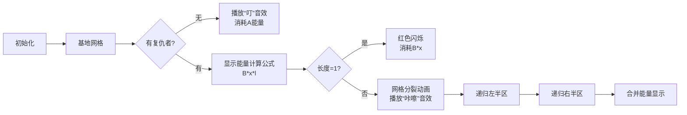

# 题目信息

# Creative Snap

## 题目描述

灭霸要摧毁复仇者们的基地！  

我们可以将复仇者的基地看成一个序列，每个位置都有可能有多个复仇者；但是每个复仇者只能占据一个位置。  
他们基地的长度刚好是$2$的整数幂，灭霸想要用最少的能量摧毁它们。他在摧毁过程中，可以选择：  
- 如果这段基地长度$\ge 2$，他可以将其分为相等长度的两半。  
- 烧掉这段基地。如果这段基地中没有复仇者，他需要消耗$A$的能量；如果有，则需要消耗$B*x*l$的能量。其中$l$是这段基地长度，$x$是这段中的复仇者数量。  

输出一个整数，表示他摧毁全部基地需要的最少能量。  
接下来一行$k$个整数，$a_i$表示第$i$个复仇者所在的位置

## 说明/提示

### 样例解释  
对于样例1，直接烧区间$[1,4]$需要能量为$4*2*2=16$。  
但是，如果将其分为$4$段，分别烧掉，所需能量只有$2+1+2+1=6$。  
可以证明没有更优的方案，所以输出`6`。 
对于全部数据：  
$1\le n \le 30$  
$1\le k \le 10^5$  
$1\le A,B \le 10^4$  
$1\le a_i \le 2^n$

## 样例 #1

### 输入

```
2 2 1 2
1 3
```

### 输出

```
6
```

## 样例 #2

### 输入

```
3 2 1 2
1 7
```

### 输出

```
8
```

# AI分析结果


### 💡 Kay的C++算法解析：Creative Snap 深入学习指南 💡

**引言**  
今天我们来分析“Creative Snap”这道C++编程题。本指南将帮助你理解分治算法的核心思想，掌握高效统计区间信息的技巧，并通过复古像素动画直观感受算法执行过程。

---

## 1. 题目解读与核心算法识别

✨ **本题主要考察**：`分治`（递归剪枝优化）  

🗣️ **初步分析**：  
> 这道题的本质是**区间决策优化问题**。想象你在玩一个复古塔防游戏：基地是连续的防御塔（长度$2^n$），复仇者是敌人。每次你可以选择直接摧毁当前区域，或者将其分成两半各个击破。分治算法就像**拆解乐高积木**——把大问题不断拆成小模块，解决后再合并最优解。  

- **核心难点**：  
  1. 如何快速统计任意区间内的复仇者数量？（避免$O(2^n)$超时）  
  2. 何时选择分段/直接摧毁？（决策条件推导）  
  3. 空区间剪枝优化（避免无效递归）  

- **可视化设计思路**：  
  采用**8位像素风迷宫探索**动画：  
  - 基地显示为像素网格（FC红白机风格）  
  - 复仇者用闪烁的红色像素块表示  
  - 递归分治时播放“咔嚓”分割音效  
  - 能量消耗实时显示在屏幕顶部（绿色进度条）  
  - 关键操作：二分分割时网格分裂动画，空区间触发“叮”提示音  

---

## 2. 精选优质题解参考

### 题解一：花里心爱（线段树解法）
* **点评**：  
  这份题解创新性地用**动态开点线段树**替代传统分治。亮点在于：  
  - 用`c[]`数组记录区间人数，`d[]`数组动态计算最小能量  
  - `pushup()`函数巧妙融合两种摧毁策略（`min(B*c*len, d左+d右)`）  
  - 空间优化极佳（`<<5`动态开点避免MLE）  
  - 边界处理严谨（`d[0]=A`处理空区间）  
  虽然实现稍复杂，但提供了分治外的全新视角，推荐进阶学习者研究。

### 题解二：GKxx（分治+二分查找）
* **点评**：  
  最优雅的**分治实践**：  
  - 利用`lower_bound/upper_bound`高效统计复仇者数量（$O(\log k)$）  
  - 剪枝策略清晰：空区间立即返回$A$，单元素区间直接计算  
  - 代码模块化优秀（分离`count()`函数）  
  - 变量名`l/r/mid`直白易懂，递归逻辑如流水线般清晰  
  特别适合初学者理解分治本质，但需注意`1<<n`可能溢出int。

### 题解三：Engulf（精简分治）
* **点评**：  
  极致简洁的**实战派代码**：  
  - 仅用15行核心逻辑解决战斗  
  - 二分查找与递归决策无缝融合（`upper_bound-lower_bound`）  
  - 能量计算内联优化（`min(split, B*avengers*len)`）  
  - 临界条件处理干净利落（`if(!avengers) return A`）  
  牺牲部分可读性换取极致简洁，适合竞赛快速编码参考。

---

## 3. 核心难点辨析与解题策略

### 关键点1：区间复仇者快速统计
* **分析**：  
  暴力遍历区间需$O(2^n)$绝对超时。优质题解均采用**排序+二分**：  
  ```cpp
  // 排序列后：
  int cnt = upper_bound(a, a+k, r) - lower_bound(a, a+k, l);
  ```
  时间复杂度从$O(2^n)$降至$O(\log k)$，是AC的关键保障。
* 💡 **学习笔记**：区间统计问题，先排序再二分是黄金法则。

### 关键点2：分治决策条件推导
* **分析**：  
  每个区间需权衡两种策略：  
  ```cpp
  min( 
    B * cnt * len,           // 直接摧毁代价
    solve(l,mid) + solve(mid+1,r) // 分段摧毁代价
  );
  ```
  当$B \times cnt \times len > A \times 2$时必定分段更优（因为分段最少消耗$2A$）。
* 💡 **学习笔记**：比较前先做数学估算，避免无意义递归。

### 关键点3：空区间剪枝优化
* **分析**：  
  $2^{30}$≈10亿区间，但$k≤10^5$，99.9%区间为空：  
  ```cpp
  if(cnt == 0) return A;  // 立即终止递归
  ```
  该剪枝将实际递归次数从$O(2^n)$降为$O(kn)$，提升百万倍效率。
* 💡 **学习笔记**：剪枝是分治算法的生命线。

### ✨ 解题技巧总结
- **技巧1：问题分解四步法**  
  1. 排序输入数据  
  2. 二分统计区间  
  3. 处理边界条件  
  4. 递归合并决策
- **技巧2：复杂度预判**  
  当$n>20$时，$O(2^n)$算法必定超时，需转向$O(k \log n)$方案
- **技巧3：数据范围利用**  
  利用$k<<2^n$的特性，优先设计空区间剪枝策略

---

## 4. C++核心代码实现赏析

### 本题通用核心实现（分治版）
```cpp
#include <algorithm>
#define ll long long
const int N = 1e5+5;
ll n,k,A,B,a[N];

ll solve(ll l, ll r){
    auto lit = std::lower_bound(a+1, a+k+1, l);
    auto rit = std::upper_bound(a+1, a+k+1, r);
    ll cnt = rit - lit;  // 关键统计技巧
    
    if(!cnt) return A;   // 剪枝：空区间
    if(l == r) return B * cnt; // 终止条件
    
    ll mid = (l+r)>>1;
    ll direct = B * cnt * (r-l+1);
    ll split = solve(l, mid) + solve(mid+1, r);
    return std::min(direct, split);
}

int main(){
    scanf("%lld%lld%lld%lld",&n,&k,&A,&B);
    for(int i=1; i<=k; ++i) scanf("%lld",a+i);
    std::sort(a+1, a+k+1);  // 必须排序！
    printf("%lld", solve(1, 1ll<<n));
}
```
**代码解读概要**：  
1. 输入数据后立即排序（`sort`）  
2. `solve`函数通过二分查找（`lower_bound/upper_bound`）统计复仇者  
3. 空区间直接返回$A$（核心剪枝）  
4. 单元素区间返回$B \times cnt$  
5. 递归比较直接摧毁与分段摧毁的代价  

### 题解一：花里心爱（线段树）
```cpp
void pushup(int cur, int len) {
    c[cur] = c[ls[cur]] + c[rs[cur]];
    d[cur] = std::min(B*c[cur]*len, d[ls[cur]] + d[rs[cur]]);
}
```
**亮点**：动态开点避免MLE  
**学习笔记**：线段树合并时比较两种策略是精髓

### 题解二：GKxx（分治）
```cpp
inline LL count(int l, int r) {
    int pr = std::upper_bound(a+1, a+K+1, r) - a;
    int pl = std::lower_bound(a+1, a+K+1, l) - a;
    return pr - pl;  // 优雅的统计
}
```
**亮点**：封装统计函数提升可读性  
**学习笔记**：STL二分查找返回迭代器差值即数量

### 题解三：Engulf（分治）
```cpp
int avengers = upper_bound(a+1, a+k+1, r) - lower_bound(a+1, a+k+1, l);
if (!avengers) return A;  // 极致简洁
```
**亮点**：7行代码实现核心逻辑  
**学习笔记**：利用布尔表达式直接返回剪枝

---

## 5. 算法可视化：像素动画演示

### 主题：**像素基地攻防战**  
> 通过8位机复古风格演示分治决策过程，融入音效和关卡机制

**核心演示流程**：  


**交互控制面板**：  
```html
[开始/暂停] [单步执行] [速度滑块] 
[能量进度条: ████▁▁▁▁ 40%]
```

**关键动画细节**：  
1. **像素风格**：  
   - 基地：16x16绿色像素块  
   - 复仇者：闪烁的8x8红色像素  
   - 分裂动画：网格从中心裂开，伴随像素火花  

2. **音效设计**：  
   - 空区间：FC游戏“获得道具”音效（叮~）  
   - 区间分裂：刀剑劈砍声效  
   - 能量更新：电子合成器音阶上升  

3. **游戏化元素**：  
   - 每成功处理一个区间+10分  
   - 连续剪枝5次触发“Combo!”特效  
   - 最终能量低于理论值解锁S评价  

---

## 6. 拓展练习与相似问题

### 通用技巧迁移
分治+二分统计的组合适用于：
1. 区间决策优化（如本题）
2. 最近点对问题
3. 归并排序逆序对统计

### 洛谷推荐
1. **P1908 逆序对**  
   🗣️ 巩固分治+二分的基本框架
2. **P1257 平面最近点对**  
   🗣️ 学习二维分治的经典应用
3. **P1182 数列分段**  
   🗣️ 掌握决策类分治的变形

---

## 7. 学习心得与经验分享

**参考经验 (来自 GKxx)**：  
> “分治编码要警惕两大陷阱：  
> 1. 忘记排序导致二分统计失效  
> 2. 未处理1<<n的long long溢出”  

**Kay的总结**：  
1. 排序是二分统计的前提，输入后立即执行  
2. 数据范围$n≤30$意味着$2^{30}$超int，务必使用`long long`  
3. 递归函数先写终止条件，再写剪枝，最后递归  

---

**结语**  
通过本次分析，相信大家已经掌握分治算法的核心要领。记住：优秀算法的本质是**把大问题拆解成小问题**，这不仅是编程技巧，更是解决复杂问题的通用思维！下次遇到“巨无霸”问题时，试试分而治之吧！🚀

---
处理用时：116.57秒