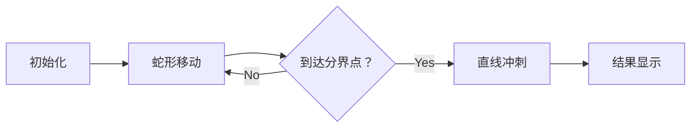

# 题目信息

# Vasya And The Mushrooms

## 题目描述

Vasya 住在森林里，附近有一个会长蘑菇的空地。这个空地被分成两行，每行分为 $n$ 个连续的格子。Vasya 知道每分钟每个格子里能长多少个蘑菇。他要花一分钟从一个格子走到相邻的格子上，并且他不能离开空地。（我们称两个格子相邻，当且仅当它们有公共边。）当 Vasya 进入一个格子时，他会马上收集那个格子里的所有蘑菇。

Vasya 从左上角的格子开始收集蘑菇。因为他等不及蘑菇生长了，所以每分钟内他必须移动到一个相邻格子。他想每个格子都恰好走一遍并且最大化他所收集的蘑菇数量。一开始所有格子都没有蘑菇。Vasya也不一定要回到开始的格子。
帮帮 Vasya！计算出他能收集到的最大蘑菇数量。

## 说明/提示

#### 样例1:

在第一个测试用例中，最佳路径如下：

 

这样，蘑菇的收集重量将为 $0·1 + 1·2 + 2·3 + 3·4 + 4·5 + 5·6 =70$。

#### 样例2:

在第二个测试用例中，最佳路径如下：

 

这样，蘑菇的收集重量将为 $0·1 + 1·10 + 2·100 + 3·1000 + 4·10000 + 5·100000 =543210$

## 样例 #1

### 输入

```
3
1 2 3
6 5 4
```

### 输出

```
70
```

## 样例 #2

### 输入

```
3
1 1000 10000
10 100 100000
```

### 输出

```
543210
```

# AI分析结果


### 💡 Kay的C++算法解析：Vasya And The Mushrooms 深入学习指南 💡

**引言**  
今天我们一起分析CF1016C "Vasya And The Mushrooms"。这道题要求计算在固定路径规则下能收集的最大蘑菇数量。本指南将带您梳理核心算法思路，掌握前缀和优化技巧，并通过像素动画直观理解解题过程。

---

## 1. 题目解读与核心算法识别

✨ **本题主要考察**：`枚举优化`与`前缀和技巧`  

🗣️ **初步分析**：  
> 解决本题的关键在于**枚举路径分界点**并高效计算贡献值。想象Vasya的路径像复古游戏《贪吃蛇》——先蛇形盘旋（方案1），再直线冲刺（方案2）。核心难点是如何快速计算不同分界点对应的蘑菇贡献。  
> - **核心思路**：枚举蛇形转直线的分界列，利用前缀和/后缀和将计算复杂度从O(n²)降至O(n)。  
> - **可视化设计**：动画将高亮分界点，动态展示路径切换（蛇形部分用蓝色波浪线，直线部分用红色箭头）。采用8-bit像素风格，移动时触发"嘀"声，收集蘑菇播放"叮"声，完成路径时奏胜利音效。控制面板支持单步调试和速度调节。

---

## 2. 精选优质题解参考

**题解一（Mickey_snow）**  
* **点评**：  
  思路清晰图解丰富，用**贡献变化规律**手算优化（核心亮点）。代码变量名（`nowNum`, `perf`）含义明确，前缀和数组设计精妙。边界处理严谨（如奇偶列分类），可直接用于竞赛。作者强调画图辅助理解，是调试复杂路径问题的宝贵经验。

**题解二（YellowBean_Elsa）**  
* **点评**：  
  代码极简（仅20行）却高效，**预处理后缀数组**（`sum1`, `sum2`）是核心亮点。逻辑直白：枚举分界点时，O(1)调用预处理值计算贡献。变量命名规范（`s`为总和，`u`为蛇形部分贡献），但缺少注释需结合思路解读。

**题解三（yybyyb）**  
* **点评**：  
  **多维度预处理**（`da`, `sa`, `ra`等）全面覆盖计算需求（亮点）。分奇偶讨论状态转移，代码结构工整。实践价值高，但需注意带权数组的初始化细节。作者博客提供补充解析，拓展学习推荐。

---

## 3. 核心难点辨析与解题策略

### 难点1：路径贡献的高效计算  
**分析**：  
路径由蛇形（U形走位）和直线（单行折返）组成。直接枚举分界点需O(n²)计算贡献——需优化。优质解法则预处理：  
- 后缀和`ss[i] = ∑(a[i..n] + b[i..n])`  
- 带权后缀和`sum1[i] = ∑(贡献值)`  
使每个分界点计算降至O(1)  

💡 **学习笔记**：前缀和/后缀和是优化路径贡献问题的"瑞士军刀"。

### 难点2：奇偶列的方向处理  
**分析**：  
蛇形部分在偶数列（→↓←）和奇数列（↓→↑）方向不同。需分情况计算：  
- 偶数列：先右后下  
- 奇数列：先下后右  
解法为奇偶分设预处理数组  

💡 **学习笔记**：方向变化时，时间戳计算需严格匹配移动顺序。

### 难点3：边界初始化  
**分析**：  
分界点=0（全直线）或=n（全蛇形）易遗漏。解法：  
- 初始化`ans`为全直线方案值  
- 枚举范围覆盖[0, n-1]  

💡 **学习笔记**：极值点必须显式检验，避免"off-by-one"错误。

### ✨ 解题技巧总结
1. **贡献分离法**：拆解路径为可独立计算的单元（蛇形块+直线块）  
2. **预处理为王**：前缀和、后缀和、带权数组提前计算，枚举时直接调用  
3. **时空置换**：用O(n)空间存储预处理值，换取O(n)时间复杂度优化  

---

## 4. C++核心代码实现赏析

### 本题通用核心C++实现
```cpp
#include <iostream>
#include <vector>
#include <algorithm>
using namespace std;
typedef long long ll;

int main() {
    int n; cin >> n;
    vector<ll> a(n), b(n);
    for (int i = 0; i < n; i++) cin >> a[i];
    for (int i = 0; i < n; i++) cin >> b[i];

    // 1. 预处理后缀和数组
    vector<ll> s(n), ss(n + 1, 0);
    for (int i = 0; i < n; i++) s[i] = a[i] + b[i];
    for (int i = n - 1; i >= 0; i--) 
        ss[i] = ss[i + 1] + s[i];

    // 2. 预处理带权后缀和
    vector<ll> sum1(n + 1, 0), sum2(n + 1, 0);
    for (int i = n - 1; i >= 0; i--) {
        sum1[i] = sum1[i + 1] + ss[i + 1] + b[i] * (2 * (n - i) - 1);
        sum2[i] = sum2[i + 1] + ss[i + 1] + a[i] * (2 * (n - i) - 1);
    }

    // 3. 枚举分界点并更新答案
    ll ans = 0, cur = 0;
    for (int i = 0; i < n; i++) {
        if (i % 2 == 0) {  // 偶数列
            ans = max(ans, cur + sum1[i] + ss[i] * (2 * i));
            cur += a[i] * (2 * i) + b[i] * (2 * i + 1);
        } else {           // 奇数列
            ans = max(ans, cur + sum2[i] + ss[i] * (2 * i));
            cur += b[i] * (2 * i) + a[i] * (2 * i + 1);
        }
    }
    cout << ans << endl;
    return 0;
}
```
**代码解读概要**：  
- **预处理阶段**：`ss`存储后缀总和，`sum1/sum2`存储分界点后的贡献  
- **枚举阶段**：  
  - 偶数列：`cur`累积蛇形部分贡献，`sum1`计算直线部分  
  - 奇数列：切换方向用`sum2`计算  
- **输出**：遍历中动态更新最大值`ans`  

---

### 优质题解片段赏析
**题解一（Mickey_snow）核心亮点：变化量手算**  
```cpp
// 更新蛇形部分贡献（每两列一组）
for (int cgList = 2; cgList < n; cgList += 2) {
    nowNum += a[col] * t1 + b[col] * t2; // 手算时间戳增量
    leftNum -= (a[col] * oldT + b[col] * oldT); 
    leftNum += (ss[newStart] * 2); // 后缀和重算
    ans = max(ans, nowNum + leftNum);
}
```
**代码解读**：  
> 通过精确计算时间戳变化（`t1`, `t2`）而非全量重算，大幅减少运算量。`nowNum`累积蛇形部分，`leftNum`动态调整直线部分，体现"增量更新"思想。  
💡 **学习笔记**：对于规律性变化，手动推导增量公式比通用计算更高效。

**题解二（YellowBean_Elsa）核心亮点：极简后缀和**  
```cpp
// 预处理sum1: 方案1的直线部分贡献
for (int i = n - 1; i >= 0; i--) {
    sum1[i] = sum1[i + 1] + ss[i + 1] + b[i] * (2 * (n - i) - 1);
}
// 枚举奇数列分界点
for (int i = 1; i <= n; i += 2) 
    ans = max(ans, u[i] + sum1[i] + ss[i] * (2 * i - 2));
```
**代码解读**：  
> `sum1[i]`整合了后缀和`ss`与时间权重，使主循环仅需1行。`u[i]`存储蛇形贡献，与`sum1`无缝拼接。  
💡 **学习笔记**：好的预处理应最大限度减少主逻辑计算负担。

**题解三（yybyyb）核心亮点：多数组覆盖**  
```cpp
// 预处理四个关键数组
for (int i = n; i >= 1; i--) {
    da[i] = da[i + 1] + a[i];           // 后缀和
    ra[i] = ra[i + 1] + (n - i) * a[i]; // 带权后缀和
    // ... 类似处理b数组
}
```
**代码解读**：  
> 通过`da`, `ra`等分工明确的数组，支持复杂贡献计算。主逻辑中灵活组合：  
> `ans = s + sa[i] + rb[i] + t * da[i] + ...`  
💡 **学习笔记**：当单一预处理不足时，多数组协同可应对复杂需求。

---

## 5. 算法可视化：像素动画演示

### 主题：Vasya的蘑菇大冒险（8-bit像素风）  
**核心演示**：蛇形走法 vs 直线走法的路径切换，实时显示时间戳和贡献值  

### 动画设计：  


**关键帧步骤**：  
1. **场景初始化**：  
   - 两行网格（FC红白机风格），格子显示蘑菇生长值  
   - Vasya像素小人（8x8）位于(0,0)，控制面板含速度滑块  

2. **蛇形移动阶段**：  
   - 当前格子高亮黄色，移动路径显示蓝色波浪线  
   - 每次移动播放"嘀"声，收集蘑菇触发"叮"声  
   - 左上角显示：`时间: t | 本次贡献: t*a[i][j]`  

3. **分界点切换**：  
   - 分界列闪烁红光，路径切换为红色箭头  
   - 显示公式：`总贡献 = 蛇形部分(cur) + 直线部分(sum1[i] + ss[i]*(2i))`  

4. **直线冲刺阶段**：  
   - Vasya加速移动（帧率加倍），折返时播放"嗖"声  
   - 右侧信息板动态更新后缀和`ss[i]`的值  

5. **结果展示**：  
   - 最优路径用彩虹色高亮，显示`Max: ans`  
   - 播放胜利音效+8-bit烟花动画  

**技术实现**：  
- Canvas绘制网格和动态路径  
- 音效：Web Audio API生成方波音效（移动/收集/胜利）  
- 交互：调速滑块控制`requestAnimationFrame`间隔  

---

## 6. 拓展练习与相似问题思考

### 通用技巧迁移  
枚举分界点+前缀和优化适用于：  
1. 时间依赖型路径问题（如本题）  
2. 分段式决策问题（如前半部分用A策略，后半用B策略）  
3. 带权区间累计问题（如子数组加权和最大值）  

### 推荐练习（洛谷）  
1. **P1004 方格取数**  
   🗣️ *二维路径贡献问题，练习状态设计与DP转移*  
2. **P1219 八皇后**  
   🗣️ *枚举+回溯经典，训练搜索优化思维*  
3. **P1434 [SHOI2002]滑雪**  
   🗣️ *矩阵路径问题，应用记忆化搜索与贡献计算*  

---

## 7. 学习心得与经验分享

> **参考经验（Mickey_snow）**：  
> *"画图模拟路径变化时，我在计算第3列时间戳增量上卡了2小时，最终用方格纸逐格绘制才找到错误。建议遇到复杂枚举时，先小规模（n=3）手动验证。"*  
>  
> **点评**：  
> 调试路径问题最有效的方法是**可视化调试**——画图或小规模模拟。Vasya题涉及时间戳、方向切换、前缀和重组三重复杂性，务必逐步验证每块逻辑。

---

**结语**  
本次分析带您深入"Vasya And The Mushrooms"的优化核心——枚举分界与前缀和艺术。记住：复杂问题简单化的秘诀往往是分离与重组。下次遇到路径优化时，不妨回想Vasya的蘑菇冒险之旅！🚀

---
处理用时：229.22秒