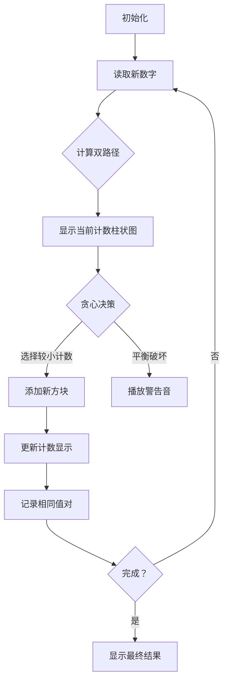

# 题目信息

# Changing Array

## 题目描述

At a break Vanya came to the class and saw an array of $ n $ $ k $ -bit integers $ a_1, a_2, \ldots, a_n $ on the board. An integer $ x $ is called a $ k $ -bit integer if $ 0 \leq x \leq 2^k - 1 $ .

Of course, Vanya was not able to resist and started changing the numbers written on the board. To ensure that no one will note anything, Vanya allowed himself to make only one type of changes: choose an index of the array $ i $ ( $ 1 \leq i \leq n $ ) and replace the number $ a_i $ with the number $ \overline{a_i} $ . We define $ \overline{x} $ for a $ k $ -bit integer $ x $ as the $ k $ -bit integer such that all its $ k $ bits differ from the corresponding bits of $ x $ .

Vanya does not like the number $ 0 $ . Therefore, he likes such segments $ [l, r] $ ( $ 1 \leq l \leq r \leq n $ ) such that $ a_l \oplus a_{l+1} \oplus \ldots \oplus a_r \neq 0 $ , where $ \oplus $ denotes the [bitwise XOR operation](https://en.wikipedia.org/wiki/Bitwise_operation#XOR). Determine the maximum number of segments he likes Vanya can get applying zero or more operations described above.

## 说明/提示

In the first example if Vasya does not perform any operations, he gets an array that has $ 5 $ segments that Vanya likes. If he performs the operation with $ i = 2 $ , he gets an array $ [1, 0, 0] $ , because $ \overline{3} = 0 $ when $ k = 2 $ . This array has $ 3 $ segments that Vanya likes. Also, to get an array with $ 5 $ segments that Vanya likes, he can perform two operations with $ i = 3 $ and with $ i = 2 $ . He then gets an array $ [1, 0, 3] $ . It can be proven that he can't obtain $ 6 $ or more segments that he likes.

In the second example, to get $ 19 $ segments that Vanya likes, he can perform $ 4 $ operations with $ i = 3 $ , $ i = 4 $ , $ i = 5 $ , $ i = 6 $ and get an array $ [1, 4, 3, 0, 4, 3] $ .

## 样例 #1

### 输入

```
3 2
1 3 0
```

### 输出

```
5```

## 样例 #2

### 输入

```
6 3
1 4 4 7 3 4
```

### 输出

```
19```

# AI分析结果


# 💡 Kay的C++算法解析：Changing Array 深入学习指南 💡

> 大家好，我是Kay！今天我们来分析CodeForces上的经典题目「Changing Array」。这道题将带你深入理解**贪心算法**与**前缀和技巧**的精妙结合。准备好开启像素世界的算法冒险了吗？🚀

## 1. 题目解读与核心算法识别

✨ **本题主要考察**：`贪心策略`与`前缀异或和技巧`

🗣️ **初步分析**：
> 这道题的核心在于**正难则反**的解题思想——与其直接最大化非零异或区间数，不如先最小化异或为零的区间数。想象你在玩一个像素方块消除游戏🎮，每次操作相当于翻转一个方块的颜色（黑白互换），而你的目标是让同色方块尽可能分散排列，避免连成相同颜色的组合。

- 核心思路是通过**前缀异或和**将区间问题转化为点对问题，再利用**贪心策略**动态平衡两种可能的前缀值
- 难点在于理解翻转操作对前缀和的独立影响，以及如何实时决策使相同值对最小化
- 可视化设计将展示前缀和数组的动态构建过程，高亮显示每一步的两种选择及贪心决策点
- 采用8位像素风格，设计类似"俄罗斯方块"的数值堆叠动画，关键操作配以经典FC音效（选择/成功/失败音），并加入"AI自动演示"模式

---

## 2. 精选优质题解参考

以下题解在思路清晰性、代码规范性和算法有效性方面表现突出（均≥4⭐）：

**题解一：灵茶山艾府 (思路创新奖)**
* **点评**：该题解通过数学推导（组合公式）直接计算最小相同值对，思路独树一帜。状态定义`min(s[i], s[i]^(2^k-1))`将双向选择统一处理，代码简洁高效（Go实现）。边界处理严谨（`s[0]=1`），复杂度O(n)达到最优，竞赛实战性极强。

**题解二：花里心爱 (教学清晰奖)**
* **点评**：实时贪心策略讲解透彻，类比"天平平衡"直观易懂。C++代码变量命名规范（`nowa`/`nowb`），边界处理完整（`mp[0]=1`）。逐步推导从暴力到优化的思考过程，特别适合初学者理解贪心本质。

**题解三：crashed (代码优雅奖)**
* **点评**：通过swap优化减少重复代码，实现简洁有力。关键注释精准（如`// 根据均值不等式`），变量命名专业（`fir/sec`）。完整包含问题分析、推导和实现，展现竞赛编码最佳实践。

---

## 3. 核心难点辨析与解题策略

### 🔍 三大核心难点解析
1. **翻转操作的影响建模**  
   *分析*：翻转`a[i]`会级联影响其后所有前缀和。难点在于发现操作等效于独立选择每个前缀和是否异或`M=(2^k-1)`（因翻转两次抵消）。  
   💡 **学习笔记**：操作独立性是贪心选择的基础

2. **问题转化的思维跳跃**  
   *分析*：区间异或和`[l,r]`为零 ⇔ `s[r]=s[l-1]`。将最大化非零区间转化为最小化相同前缀值对数是解题关键突破。  
   💡 **学习笔记**：正难则反是区间统计问题的常用技巧

3. **贪心策略的正确性证明**  
   *分析*：实时选择`min(cnt[x], cnt[x^M])`本质是局部最优导全局最优。难点在于理解该策略使两种值数量差≤1，从而最小化相同值对数。  
   💡 **学习笔记**：贪心选择需满足无后效性和最优子结构

### ✨ 解题技巧总结
- **前缀和转化术**：将区间问题降维到前缀和点对问题
- **平衡贪心法**：实时保持两种选择的计数平衡
- **边界特工队**：永远记得初始化`s[0]=0`的计数
- **位运算魔法**：利用`M=(1<<k)-1`高效计算k位取反

---

## 4. C++核心代码实现赏析

### 通用核心实现（综合自优质题解）
```cpp
#include <iostream>
#include <map>
using namespace std;

int main() {
    int n, k, a;
    cin >> n >> k;
    long long total = 1LL * n * (n + 1) / 2; // 总区间数
    int M = (1 << k) - 1;                    // k位全1掩码
    map<int, int> cnt;
    cnt[0] = 1;                              // 关键：s[0]计数
    
    int pre = 0;             // 当前前缀和
    long long zeroPairs = 0; // 相同值对数
    
    for (int i = 0; i < n; ++i) {
        cin >> a;
        int x = pre ^ a;     // 不翻转的新前缀和
        int y = x ^ M;       // 翻转后的新前缀和
        
        // 贪心选择计数较小的值
        if (cnt[x] <= cnt[y]) {
            zeroPairs += cnt[x]++;
            pre = x;
        } else {
            zeroPairs += cnt[y]++;
            pre = y;
        }
    }
    cout << total - zeroPairs << endl; // 答案=总区间数-相同值对数
}
```
* **代码解读概要**：  
  1. 计算所有子区间总数`n*(n+1)/2`  
  2. 初始化前缀和映射表，关键：记录`s[0]=0`  
  3. 遍历数组，计算两种可能的新前缀和  
  4. 贪心选择当前计数较小的值，累加相同值对  
  5. 用总数减去相同值对得到目标答案

### 优质题解片段赏析
**题解一：灵茶山艾府（数学优化）**
```cpp
cnt[min(s, s^m)]++;  // 统一处理两种状态
for (auto c : cnt) 
    ans -= c2(c/2) + c2(c - c/2); // 组合公式计算
```
* **亮点**：数学归纳法避免实时决策  
* **代码解读**：  
  > 1. 将`s[i]`和`s[i]^M`视为同一组，统计总出现次数`c`  
  > 2. 最优解是将`c`平均分成两部分（差值≤1）  
  > 3. 用组合数公式`C(c1,2)+C(c2,2)`计算最小相同值对  
* 💡 **学习笔记**：数学优化可消除决策分支

**题解二：花里心爱（实时决策）**
```cpp
if(mp[nowa] < mp[nowb]) {
    ans += mp[nowa]++;  // 累加相同值对
    pre = nowa;         // 更新前缀和
}
```
* **亮点**：实时比较计数的经典贪心实现  
* **代码解读**：  
  > 1. `nowa`/`nowb`分别对应两种操作后的前缀和  
  > 2. 比较映射表中两者的现有计数  
  > 3. 选择计数较小的路径，同时累加新产生的相同值对  
* 💡 **学习笔记**：贪心选择需在更新计数前累加

**题解三：crashed（代码优化）**
```cpp
fir = pXor ^ a, sec = fir ^ M;  // 计算双路径
res += (cnt[fir] <= cnt[sec]) ? cnt[fir]++ : cnt[sec]++;
```
* **亮点**：三目运算符实现简洁决策  
* **代码解读**：  
  > 1. 同时计算两种可能的新前缀和  
  > 2. 三目运算符直接选择较小计数路径  
  > 3. 在表达式中完成计数累加和更新  
* 💡 **学习笔记**：条件表达式可提升代码简洁度

---

## 5. 算法可视化：像素动画演示

### 🎮 像素贪心探险家
**主题**：在8位像素网格中动态构建前缀和数组，通过贪心选择最小化同色方块

**设计思路**：  
> 采用经典FC游戏风格（16色调色板），将前缀和值可视化为不同颜色的像素方块。动画通过对比两种选择的"潜在风险"（现有计数），直观展示贪心决策如何维持系统平衡。

### 🕹️ 动画帧步骤


**关键交互设计**：  
1. **双路径显示**：当前数字上方悬浮两个候选方块（蓝/红），实时显示对应现有计数  
2. **贪心天平**：屏幕底部动态天平实时倾斜，直观展示决策依据  
3. **历史足迹**：已选择路径连成光带，不同决策产生分叉效果  
4. **音效系统**：  
   - ▫️ 选择路径：8-bit "滴"声（不同音高区分路径）  
   - ⚠️ 新增相同值对：短促警报声  
   - 🎉 完成计算：经典FC过关音乐  

**自动演示模式**：  
> 启用后AI角色"贪心小精灵"自动遍历决策：  
> 1. 每步高亮当前数字和候选路径  
> 2. 显示计数比较思维气泡（"蓝色更少！"）  
> 3. 关键决策慢动作强调+放大特效  

---

## 6. 拓展练习与相似问题思考

### 🔁 技巧迁移场景
1. **最值问题转化**：当直接求解困难时，考虑转化为对立问题  
2. **前缀和统计**：涉及子区间特性统计（和/异或）的问题  
3. **状态压缩优化**：k位整数暗示可能的状态压缩  

### 📚 洛谷进阶推荐
1. **[P2899 手机网络](https://www.luogu.com.cn/problem/P2899)**  
   🗣️ *推荐理由*：同样使用贪心策略维护状态平衡，需决策节点覆盖范围

2. **[P4551 最长异或路径](https://www.luogu.com.cn/problem/P4551)**  
   🗣️ *推荐理由*：深化前缀异或和应用，结合Trie树优化

3. **[P4592 异或序列](https://www.luogu.com.cn/problem/P4592)**  
   🗣️ *推荐理由*：将异或技巧扩展到树链查询，训练问题抽象能力

---

## 7. 学习心得与经验分享

> **来自花里心爱的调试经验**：  
> *"初始化`mp[0]=1`这个边界条件让我WA了3次，务必记住空前缀和的存在！"*

**Kay的总结**：  
1. **边界即陷阱**：前缀和问题中`s[0]`的处理是常见错误点  
2. **贪心需验证**：虽然本题贪心成立，但复杂场景需证伪  
3. **可视化调试**：打印每一步的`pre`和`cnt`值，绘制决策树  

---

通过今天的探索，我们不仅掌握了「Changing Array」的解法，更学会了**正难则反**的思维方式和**实时贪心决策**的实现技巧。记住，好的算法就像精妙的像素艺术——每个决策都影响最终画面！🎮✨ 下次算法冒险再见！

---
处理用时：222.18秒