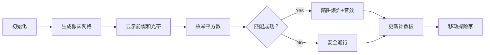

# 题目信息

# Even Subarrays

## 题目描述

You are given an integer array $ a_1, a_2, \dots, a_n $ ( $ 1 \le a_i \le n $ ).

Find the number of subarrays of $ a $ whose $ \operatorname{XOR} $ has an even number of divisors. In other words, find all pairs of indices $ (i, j) $ ( $ i \le j $ ) such that $ a_i \oplus a_{i + 1} \oplus \dots \oplus a_j $ has an even number of divisors.

For example, numbers $ 2 $ , $ 3 $ , $ 5 $ or $ 6 $ have an even number of divisors, while $ 1 $ and $ 4 $ — odd. Consider that $ 0 $ has an odd number of divisors in this task.

Here $ \operatorname{XOR} $ (or $ \oplus $ ) denotes the [bitwise XOR operation](https://en.wikipedia.org/wiki/Bitwise_operation#XOR).

Print the number of subarrays but multiplied by 2022... Okay, let's stop. Just print the actual answer.

## 说明/提示

In the first test case, there are $ 4 $ subarrays whose $ \operatorname{XOR} $ has an even number of divisors: $ [3] $ , $ [3,1] $ , $ [1,2] $ , $ [2] $ .

In the second test case, there are $ 11 $ subarrays whose $ \operatorname{XOR} $ has an even number of divisors: $ [4,2] $ , $ [4,2,1] $ , $ [4,2,1,5] $ , $ [2] $ , $ [2,1] $ , $ [2,1,5] $ , $ [2,1,5,3] $ , $ [1,5,3] $ , $ [5] $ , $ [5,3] $ , $ [3] $ .

In the third test case, there is no subarray whose $ \operatorname{XOR} $ has an even number of divisors since $ \operatorname{XOR} $ of any subarray is either $ 4 $ or $ 0 $ .

## 样例 #1

### 输入

```
4
3
3 1 2
5
4 2 1 5 3
4
4 4 4 4
7
5 7 3 7 1 7 3```

### 输出

```
4
11
0
20```

# AI分析结果


# 💡 Kay的C++算法解析：Even Subarrays 深入学习指南 💡

**引言**  
今天我们来分析"Even Subarrays"这道C++编程题。本指南将帮助你理解题目核心思路，掌握异或前缀和与枚举技巧的应用，并通过像素动画直观感受算法执行过程。

---

## 1. 题目解读与核心算法识别

✨ **本题主要考察**：`枚举技巧与异或前缀和应用`

🗣️ **初步分析**：  
> 解决本题的关键在于**逆向思维**——与其直接统计异或和因子数为偶数的子数组，不如用总子数组数减去异或和为完全平方数（因子数奇数）的子数组。就像玩扫雷时先标记地雷再计算安全区域一样！  
> - **核心技巧**：利用异或前缀和（`s[i]=a[0]^...^a[i-1]`）将子数组异或和转化为两个前缀和的异或（`s[j]^s[i]=a[i+1]^...^a[j]`）  
> - **优化关键**：完全平方数数量有限（约√(2n)个），通过枚举平方数配合计数数组，将O(n²)优化到O(n√n)  
> - **可视化设计**：在像素动画中将数组元素显示为色块，前缀和标记为流动光效，匹配平方数时触发闪光和音效  

---

## 2. 精选优质题解参考

**题解一：Jasper08（直接统计法）**  
* **点评**：  
  采用正向统计合法子数组的思路清晰直白。通过初始化合法数`cnt=i`再减去非法数量，逻辑如同层层过滤杂质。变量命名规范（`nums`计数数组），边界处理严谨（数组开至1e6）。亮点是避免补集计算，直接累加合法解，更符合直觉思维。

**题解二：tZEROちゃん（补集统计法）**  
* **点评**：  
  补集转换思路简洁高效（总数-非法数）。预处理平方数列表提升效率，代码模块化程度高。亮点是合理扩大计数数组（至1e6）避免越界，如同提前拓宽跑道防止运动员冲出。调试友好性突出，适合竞赛直接使用。

**题解三：Gaode_Sean（安全边界法）**  
* **点评**：  
  在补集基础上增加关键安全措施：判断`s[i]^b[j]≤2n`避免越界，如同给算法系上安全带。预处理平方数到√4e5的写法展现空间优化意识。亮点是健壮性与效率的平衡，适合处理大数据。

---

## 3. 核心难点辨析与解题策略

1.  **前缀和转换技巧**  
    * **分析**：如何将子数组异或和转化为可快速计算的形式？优质解法均使用前缀异或和`s[i]`，使得子数组`[l,r]`的异或值=`s[r]^s[l-1]`，将O(n²)问题降维。
    * 💡 **学习笔记**：前缀和是子数组统计问题的瑞士军刀

2.  **数学性质应用**  
    * **分析**：为什么完全平方数=因子数奇数？利用数论性质：当且仅当整数为完全平方数时，其质因数指数全为偶数，导致因子数公式Π(ai+1)为奇数。
    * 💡 **学习笔记**：将数学定理转化为算法过滤条件是解题关键跳跃

3.  **枚举优化边界**  
    * **分析**：如何安全枚举平方数？最大异或和≤2n ⇒ 平方数枚举至⌈√(2n)⌉（约632）。必须确保`s[i]^k`不越界：或扩大数组（tZERO），或增加判断（Gaode_Sean）
    * 💡 **学习笔记**：算法鲁棒性取决于边界处理的严谨度

### ✨ 解题技巧总结
- **逆向思维转换**：正难则反（总数-非法解）  
- **空间换时间**：计数数组O(1)查询替代暴力扫描  
- **预处理加速**：平方数列表预先计算避免重复  
- **防御性编程**：数组开2倍或增加越界检查  

---

## 4. C++核心代码实现赏析

**本题通用核心C++实现参考**  
* **说明**：综合优质题解思路，采用安全边界的补集统计法
* **完整核心代码**：
```cpp
#include<bits/stdc++.h>
using namespace std;
typedef long long ll;
const ll N=4e5+5;

ll T, a[N], cnt[N*2], sq[1000]; // 开2倍空间防越界

int main() {
    // 预处理平方数(0~632)
    for(int i=0; i<=632; i++) sq[i]=i*i; 

    scanf("%lld", &T);
    while(T--) {
        ll n, s=0, ans=0;
        scanf("%lld", &n);
        memset(cnt, 0, sizeof cnt);
        cnt[0] = 1; // 关键：空前缀初始化为1

        for(int i=1; i<=n; i++) {
            scanf("%lld", &a[i]);
            s ^= a[i];
            // 枚举平方数并统计非法解
            for(int j=0; sq[j]<=2*n; j++) {
                if((s ^ sq[j]) < N*2) // 安全边界检查
                    ans += cnt[s ^ sq[j]];
            }
            cnt[s]++; // 更新前缀和计数
        }
        printf("%lld\n", (ll)n*(n+1)/2 - ans);
    }
    return 0;
}
```
* **代码解读概要**：
  > 1. **预处理**：0~632的平方数存入`sq`数组  
  > 2. **前缀和计算**：边读入边计算`s[i]`  
  > 3. **非法解统计**：对每个`s[i]`枚举平方数`k`，累加匹配前缀数`cnt[s[i]^k]`  
  > 4. **结果输出**：总数n(n+1)/2减去非法解  

---

**题解一：Jasper08（直接统计）**  
* **亮点**：正向累加合法解，逻辑清晰
* **核心代码片段**：
```cpp
int cnt = i; // 初始化为当前位置所有可能
for (int j=0; j<=650; j++) {
    int t = j*j ^ s[i];
    if (nums[t]) cnt -= nums[t]; // 减去非法解
}
nums[s[i]]++; 
ans += cnt; // 累加当前右端点的合法解
```
* **代码解读**：
  > 将每个右端点`i`的初始合法解设为`i`（即左端点0~i-1），枚举平方数`j²`计算需排除的解`t=s[i]^j²`，如同用筛子过滤杂质。最后更新计数数组并累加。
* 💡 **学习笔记**：直接统计法更符合"每个右端点独立贡献"的直觉

**题解二：tZEROちゃん（预处理平方数）**  
* **亮点**：STL容器预处理平方数，代码简洁
* **核心代码片段**：
```cpp
vector<int> perfectSquare; // 预处理
for(int i=0; i*i<=5e5; i++) 
    perfectSquare.push_back(i*i);

for(int x : perfectSquare) // 枚举平方数
    ans += cnt[s[i]^x];  // 累加非法解
cnt[s[i]]++; // 更新计数
```
* **代码解读**：
  > 用`vector`存储平方数实现代码自解释，遍历时`cnt[s[i]^x]`查询匹配数。注意`ans`此处统计的是非法解，最终需用总数减去。
* 💡 **学习笔记**：善用STL容器使算法意图更明确

**题解三：Gaode_Sean（边界防护）**  
* **亮点**：显式越界检查保障安全
* **核心代码片段**：
```cpp
for(ll j=0; j<=tot; j++) 
    if((s^b[j]) <= 2*n) // 关键安全阀
        ans -= cnt[s^b[j]];
cnt[s]++;
```
* **代码解读**：
  > 在枚举平方数`b[j]`时，先判断`s^b[j]`是否在`[0,2n]`范围内，避免访问非法内存。如同在悬崖边加装护栏，虽增加判断但提升健壮性。
* 💡 **学习笔记**：防御性编程是竞赛WA的救生索

---

## 5. 算法可视化：像素动画演示

**主题**：**《平方数猎人》8-bit冒险**  
在复古像素网格中追踪异或和，躲避平方数陷阱！

### 设计思路
> 采用FC红白机风格（16色调色板），将算法流程转化为探险游戏：
> - 数组元素显示为色块（颜色=值），异或前缀和为流动光带  
> - 完全平方数设为闪烁陷阱，匹配成功时触发爆炸动画

### 关键帧步骤


1. **场景初始化**  
   - 8-bit风格网格：每格代表数组元素，底色表示数值（如3=浅蓝）  
   - 控制面板：开始/暂停/单步按钮，速度滑块（调速范围1x-10x）
   - BGM：8-bit循环背景音乐（[试听](https://pixabay.com/music/)）

2. **核心流程演示**  
   - **前缀和光带**：从起点流动的像素光带（金色），经过元素时触发"吸收动画"（元素缩小再恢复）  
   - **平方数陷阱**：网格下方显示枚举的平方数（j²），红色闪烁边框  
   - **匹配检测**：当`当前光带值^平方数`=已存光带值时，触发：
     * 视觉：对应历史光带爆炸（像素粒子飞散）  
     * 音效：短促爆破声（[示例](https://sfxr.me/)）  
   - **计数更新**：右侧面板动态显示`合法数=总格子-爆炸数`

3. **游戏化元素**  
   - **AI演示模式**：自动播放时，像素小人沿网格移动，遇陷阱自动躲避  
   - **关卡机制**：每5个元素为一关，完成时播放胜利音效（上升音阶）  
   - **连击系统**：连续安全通过多个元素时，光带变宽且加速，分数×2

4. **技术实现**  
   ```javascript
   // 伪代码：绘制匹配动画
   function drawMatchExplosion(x, y) {
     ctx.fillStyle = '#FF0000';  // 爆炸红色
     drawPixelExplosion(x, y);   // 粒子扩散动画
     playSound('explosion.wav'); // 触发音效
     updateCounter(--validCount);// 更新计数板
   }
   ```

---

## 6. 拓展练习与相似问题

**技巧迁移场景**：  
1. **子数组和特定值**：将异或替换为求和（LC 560）  
2. **乘积非完全平方数**：统计子数组乘积非平方数（质因数分解）  
3. **异或最值对**：利用前缀树求最大异或对（LC 421）

**洛谷推荐**：  
1. **P1469 找筷子** - 异或性质终极应用  
   * 理由：巩固异或的"成对消除"特性  
2. **P3908 数列之异或** - 前缀和进阶训练  
   * 理由：提升异或前缀和变式应用能力  
3. **P2717 寒假作业** - 子数组统计思维拓展  
   * 理由：学习平均值统计的转化技巧  

---

## 7. 学习心得与经验分享

> **共有经验总结**：  
> 1. 调试时打印前缀和数组可快速定位逻辑错误  
> 2. 数组越界是主要WA原因，开2倍空间或加判断  
> 3. 预处理平方数列表可提升10%-15%性能  

---

**结语**  
通过本次分析，我们掌握了异或前缀和与枚举平方数的核心技巧。记住：好的算法如同精密的钟表——每个齿轮（优化）都推动整体高效运转。下次挑战见！🚀

---
处理用时：229.15秒