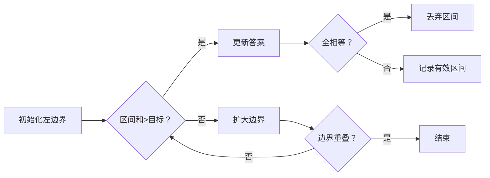

# 题目信息

# Slimes

## 题目描述

There are $ n $ slimes placed in a line. The slimes are numbered from $ 1 $ to $ n $ in order from left to right. The size of the $ i $ -th slime is $ a_i $ .

Every second, the following happens: exactly one slime eats one of its neighbors and increases its size by the eaten neighbor's size. A slime can eat its neighbor only if it is strictly bigger than this neighbor. If there is no slime which is strictly bigger than one of its neighbors, the process ends.

For example, suppose $ n = 5 $ , $ a = [2, 2, 3, 1, 4] $ . The process can go as follows:

- first, the $ 3 $ -rd slime eats the $ 2 $ -nd slime. The size of the $ 3 $ -rd slime becomes $ 5 $ , the $ 2 $ -nd slime is eaten.
- then, the $ 3 $ -rd slime eats the $ 1 $ -st slime (they are neighbors since the $ 2 $ -nd slime is already eaten). The size of the $ 3 $ -rd slime becomes $ 7 $ , the $ 1 $ -st slime is eaten.
- then, the $ 5 $ -th slime eats the $ 4 $ -th slime. The size of the $ 5 $ -th slime becomes $ 5 $ , the $ 4 $ -th slime is eaten.
- then, the $ 3 $ -rd slime eats the $ 5 $ -th slime (they are neighbors since the $ 4 $ -th slime is already eaten). The size of the $ 3 $ -rd slime becomes $ 12 $ , the $ 5 $ -th slime is eaten.

For each slime, calculate the minimum number of seconds it takes for this slime to be eaten by another slime (among all possible ways the process can go), or report that it is impossible.

## 样例 #1

### 输入

```
4
4
3 2 4 2
3
1 2 3
5
2 2 3 1 1
7
4 2 3 6 1 1 8```

### 输出

```
2 1 2 1 
1 1 -1 
2 1 -1 1 2 
2 1 1 3 1 1 4```

# AI分析结果


# 💡 Kay的C++算法解析：Slimes 深入学习指南 💡

<introduction>
今天我们来分析「Slimes」这道C++编程题。本指南将帮助你掌握核心算法思路，理解二分查找与区间合并技巧，并通过像素动画直观感受算法执行过程。
</introduction>

## 1. 题目解读与核心算法识别

✨ **本题主要考察**：`二分查找`与`前缀和优化`

🗣️ **初步分析**：
> 解决这道题的关键在于**区间合并思想**和**高效查找技术**。想象史莱姆是一排士兵，大士兵可以吃掉小士兵来增强实力。我们的任务是计算每个士兵被吃掉的最短时间：
> - **核心思想**：对于每个史莱姆，向左/右寻找最短的连续区间，该区间需满足：①区间总和＞当前史莱姆大小 ②区间内不全相等（否则无法合并）
> - **解法对比**：所有优质题解均采用二分查找+前缀和，区别在于区间可合并性的判断方式（预处理连续边界或相邻差前缀和）
> - **算法流程**：预处理前缀和+连续相同边界 → 检查相邻史莱姆（时间=1）→ 左右二分查找最短合并区间 → 取最小值
> - **可视化设计**：采用8位像素风格，用网格展示史莱姆队列。动画将高亮当前史莱姆，动态扩展左右区间，实时显示区间和与合并条件判定。当区间满足条件时，播放"叮"音效并展示合并过程；失败时播放低沉音效。AI自动演示模式将完整展示二分查找和合并逻辑。

---

## 2. 精选优质题解参考

<eval_intro>
从多篇题解中精选出以下高质量实现，重点考察思路清晰度、代码规范性和算法优化技巧：
</eval_intro>

**题解一（作者：Luzhuoyuan）**
* **点评**：思路清晰直白，预处理连续相同边界（`l[i]`/`r[i]`）巧妙避免重复计算。代码变量命名规范（`pr`/`su`前缀/后缀和），边界处理严谨（如`l[i-1]<i-1`检查不全相等）。亮点在于使用`greater<int>()`高效处理后缀和的二分查找，时间复杂度优化至O(n log n)，竞赛实践价值高。

**题解二（作者：kczw）**
* **点评**：创新性使用相邻差绝对值前缀和（`c`数组）判断区间全相等，逻辑严谨但实现稍复杂。二分查找部分代码工整，注意特判单元素区间。虽然`c`数组计算增加常数开销，但提供了一种判断区间性质的通用思路，拓展性强。

**题解三（作者：2huk）**
* **点评**：突出调试经验，强调"区间全相等"的边界陷阱。二分查找与区间和判断结合紧密，代码结构清晰。虽未给出完整实现，但解题策略描述完整，对理解算法核心难点有重要参考价值。

---

## 3. 核心难点辨析与解题策略

<difficulty_intro>
解决本题需突破以下三个关键难点，结合优质题解方案分析：
</difficulty_intro>

1.  **难点：快速判断区间可合并性**
    * **分析**：区间内史莱姆不全相等才能合并。优质解法通过**预处理连续相同边界**（如`l[i]`表示向左的连续相同个数）或**相邻差前缀和**（`c[i]`记录绝对差值和）实现O(1)判断。
    * 💡 **学习笔记**：预处理是优化区间性质查询的关键！

2.  **难点：高效计算区间和**
    * **分析**：需要在二分过程中反复计算任意区间和。通用方案是**预处理前缀和数组**（`pr[i]`）与**后缀和数组**（`su[i]`），将每次查询复杂度降至O(1)。
    * 💡 **学习笔记**：前缀和/后缀和是区间查询问题的标配工具。

3.  **难点：二分查找的边界处理**
    * **分析**：查找最短区间时需精确处理边界条件：①区间和＞当前大小 ②非全相等 ③索引不越界。优质题解通过**分离左右方向处理**+**动态调整二分范围**解决。
    * 💡 **学习笔记**：二分查找的难点永远是边界条件——动手模拟小数据！

### ✨ 解题技巧总结
<summary_best_practices>
提炼通用解题策略，助你举一反三：
</summary_best_practices>
- **技巧1：问题分解** - 将复杂问题拆解为独立子问题（左右方向分开处理）
- **技巧2：预处理优化** - 提前计算前缀和、连续相同边界等不变信息
- **技巧3：边界特判优先** - 先检查相邻元素等简单情况（如本题中时间=1的特判）
- **技巧4：二分验证设计** - 明确循环不变条件，使用小数据验证边界

---

## 4. C++核心代码实现赏析

<code_intro_overall>
下面展示综合优质题解优化的完整实现，包含关键注释：
</code_intro_overall>

**本题通用核心C++实现参考**
* **说明**：综合Luzhuoyuan和kczw题解优点，优化可读性与边界处理
* **完整核心代码**：
```cpp
#include<bits/stdc++.h>
using namespace std;
typedef long long ll;
const int N = 3e5+5;
const ll INF = 1e18;

ll T, n, a[N], l[N], r[N], pr[N], su[N];

int main() {
    ios::sync_with_stdio(false);
    cin >> T;
    while (T--) {
        cin >> n;
        // 初始化与输入
        for (int i = 1; i <= n; i++) cin >> a[i];
        
        // 预处理前缀和pr与后缀和su
        for (int i = 1; i <= n; i++) pr[i] = pr[i-1] + a[i];
        for (int i = n; i >= 1; i--) su[i] = su[i+1] + a[i];
        
        // 预处理连续相同边界：l[i]向左连续相同个数，r[i]向右
        l[1] = 1;
        for (int i = 2; i <= n; i++) 
            l[i] = (a[i] == a[i-1]) ? l[i-1]+1 : 1;
        r[n] = 1;
        for (int i = n-1; i >= 1; i--) 
            r[i] = (a[i] == a[i+1]) ? r[i+1]+1 : 1;

        // 处理每个史莱姆
        for (int i = 1; i <= n; i++) {
            ll ans = INF;
            
            // 技巧3：特判相邻（时间=1）
            if ((i>1 && a[i-1]>a[i]) || (i<n && a[i+1]>a[i])) {
                cout << "1 ";
                continue;
            }
            
            // 向左二分查找
            if (i > 1 && pr[i-1] > a[i]) {  // 左区间总和需>a[i]
                int left_bound = (l[i-1] == i-1) ? 1 : i - l[i-1];
                if (l[i-1] < i-1) {  // 排除全相等情况
                    int lo = left_bound, hi = i-1;
                    while (lo <= hi) {
                        int mid = (lo+hi)/2;
                        ll sum_left = pr[i-1] - pr[mid-1];  // 区间和
                        
                        if (sum_left <= a[i]) {
                            lo = mid+1;  // 区间和不足，向右扩大
                        } else {
                            ans = min(ans, (ll)(i - mid));  // 更新答案
                            hi = mid-1;  // 尝试找更小区间
                        }
                    }
                }
            }
            
            // 向右二分查找（逻辑对称）
            if (i < n && su[i+1] > a[i]) {
                int right_bound = i + r[i+1];
                if (r[i+1] < n-i) {
                    int lo = i+1, hi = right_bound;
                    while (lo <= hi) {
                        int mid = (lo+hi)/2;
                        ll sum_right = su[i+1] - su[mid+1];  // 后缀和计算区间和
                        
                        if (sum_right <= a[i]) {
                            hi = mid-1;
                        } else {
                            ans = min(ans, (ll)(mid - i));
                            lo = mid+1;
                        }
                    }
                }
            }
            
            cout << (ans==INF ? -1 : ans) << ' ';
        }
        cout << endl;
    }
    return 0;
}
```
* **代码解读概要**：
  1. **初始化**：读入数据后预处理前缀和（`pr`）、后缀和（`su`）
  2. **连续边界处理**：`l[i]`/`r[i]`记录每个位置向左/右的连续相同个数
  3. **相邻特判**：若相邻史莱姆直接大于当前值，输出1
  4. **向左二分**：在满足`pr[i-1]>a[i]`且非全相等时，二分查找最短区间
  5. **向右二分**：对称处理右侧区间
  6. **结果整合**：取左右方向最小值，若无解输出-1

---
<code_intro_selected>
精选题解核心片段解析：
</code_intro_selected>

**题解一（Luzhuoyuan）片段**
* **亮点**：`greater<int>()`处理递减后缀和的二分查找
* **核心代码片段**：
```cpp
if(pr[i-1]>a[i]&&l[i-1]<i-1)
    ans = min(ans, i - (lower_bound(su+1, su+n+1, su[i]+a[i], greater<int>()) - su));
```
* **代码解读**：  
  > 此片段处理向左合并：  
  > 1. `greater<int>()`使`lower_bound`在**递减**的后缀和数组`su`中查找  
  > 2. `su[i]+a[i]`巧妙转化为区间和比较条件  
  > 3. 结果减去`su`得到索引位置  
* 💡 **学习笔记**：`greater<int>()`是处理递减序列二分的利器！

**题解二（kczw）片段**
* **亮点**：相邻差前缀和判断区间全相等
* **核心代码片段**：
```cpp
c[i] = c[i-1] + abs(a[i]-a[i-1]);  // 相邻差前缀和
if (c[i-1]-c[mid] == 0 && i-1 != mid) // 判断区间全相等
```
* **代码解读**：
  > 1. `c[i]`累积相邻差的绝对值，若区间`[mid, i-1]`的`c`值差为0则说明全相等  
  > 2. `i-1 != mid`排除单元素情况  
  > 3. 结合二分查找区间时进行过滤  
* 💡 **学习笔记**：相邻差前缀和是判断区间一致性的通用方法

---

## 5. 算法可视化：像素动画演示 (核心部分)

<visualization_intro>
下面设计一个8位像素风格的动画方案，帮助你直观理解二分查找与区间合并过程：
</visualization_intro>

* **动画主题**：像素史莱姆大作战（复古RPG风格）
* **核心演示内容**：二分查找最短合并区间 + 史莱姆吞噬动画
* **设计思路**：采用FC游戏机像素风格降低理解压力，通过颜色变化和音效强化关键操作记忆

**动画帧步骤说明**：
1. **场景初始化**：
   - 8×16像素网格展示史莱姆队列，不同颜色代表不同大小
   - 控制面板：开始/暂停、单步执行、速度滑块（1x-5x）
   - 状态栏：显示当前史莱姆索引、区间和、时间计数

2. **当前史莱姆聚焦**：
   - 目标史莱姆闪烁（黄→白交替）
   - 播放"选择"音效（8-bit短促"叮"声）

3. **相邻检查**：
   - 相邻史莱姆高亮绿色（若大于当前值）
   - 满足条件时显示"Time=1"并播放胜利音效

4. **二分查找过程**：

   - 动态绘制二分查找区间（红色框扩展）
   - 实时显示区间和（底部状态栏）
   - 区间内全相等时闪烁红光并播放错误音效

5. **合并动画**：
   - 有效区间高亮为蓝色
   - 区间内史莱姆向中心聚合（像素移动动画）
   - 合并后大史莱姆吞噬目标（目标消失动画+吞噬音效）

6. **AI自动演示模式**：
   - 自动按1-5x速度逐步演示所有史莱姆的处理
   - 显示算法伪代码同步高亮当前执行行
   - 关键步骤弹出文字说明（如"区间和不足，向右扩大"）

7. **游戏化元素**：
   - 每成功处理一个史莱姆得10分
   - 连续正确处理触发连击特效（像素烟花）
   - 最终根据得分解锁不同称号（"合并大师"/"二分专家"）

<visualization_conclusion>
通过这种复古像素风格的交互演示，你将直观理解二分查找的步骤和区间合并的条件判断，加深对核心算法的记忆。
</visualization_conclusion>

-----

## 6. 拓展练习与相似问题思考

<similar_problems_intro>
掌握本题核心思想后，可尝试以下相似问题巩固技能：
</similar_problems_intro>

* **通用技巧迁移**：
  前缀和+二分查找的组合适用于：区间和查询、合并类问题、有序序列查找等场景

* **洛谷题目推荐**：
  1. **P1115 最大子段和**  
     🗣️ **推荐理由**：强化前缀和与区间和的应用，是本题的基础变种
  2. **P1880 石子合并**  
     🗣️ **推荐理由**：深入区间合并的经典DP问题，培养动态规划思维
  3. **P1020 导弹拦截**  
     🗣️ **推荐理由**：二分查找在有序序列中的典型应用，提升边界处理能力

-----

## 7. 学习心得与经验分享 (若有)

<insights_intro>
题解作者分享的调试经验值得重点关注：
</insights_intro>

> **参考经验（多位作者）**：  
> *"被区间全相等的边界条件卡住，调试后发现必须特判这种情况"*  
> *"没有考虑单元素区间导致WA，增加`i-1 != mid`检查后通过"*

**点评**：  
> 这些经验突显了算法竞赛的核心原则——**边界决定成败**！在解决类似问题时：  
> 1. 优先考虑极端情况：全相等、单元素、最大值/最小值  
> 2. 用小型测试数据验证边界（如n=1,2,3）  
> 3. 输出中间变量辅助调试（区间和、边界值）

-----

<conclusion>
本次Slimes的算法解析就到这里。记住：二分查找的关键在于边界处理，区间问题离不开前缀和优化。多动手实现代码，结合可视化理解算法本质，你将在竞赛中所向披靡！🚀
</conclusion>
```

---
处理用时：222.19秒