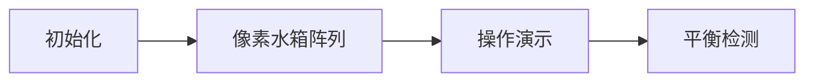

# 题目信息

# Minimize the Difference

## 题目描述

给你一个长度为 $n$ 的数 $a_1,a_2,…,a_n$ 我们可以对数组进行任意数量(可能是零)的运算。

在每次操作中，我们选择一个位置 $i$ ( $1 \le i \le n−1 $
 ) ，使 $a_i-1,a_{i+1}+1$

求 $max(a_1,a_2,…,a_n)−min(a_1,a_2,…,a_n)$ 的最小可能值。

## 说明/提示

在第三个测试案例中，您可以使用 $i=1$
 执行两次操作。
之后，数组为 $[2,3,2,3]$
 所以 $ans=max(2,3,2,3)−min(2,3,2,3)=3−2=1$
 。

## 样例 #1

### 输入

```
5
1
1
3
1 2 3
4
4 1 2 3
4
4 2 3 1
5
5 14 4 10 2```

### 输出

```
0
2
1
1
3```

# AI分析结果


### 💡 Kay的C++算法解析：Minimize the Difference 深入学习指南 💡

<introduction>
今天我们分析一道关于数组优化的题目：通过操作使数组极差最小化。我们将探索其数学本质，掌握核心解法，并通过可视化加深理解。
</introduction>

---

## 1. 题目解读与核心算法识别

✨ **本题主要考察**：`数学推导与贪心策略`

🗣️ **初步分析**：
> 解决本题的关键在于理解操作的本质是**数值的重新分配**（想象水流从高处流向低处）。核心思想是计算数组的"平衡点"——最小前缀平均值（地板值）和最大后缀平均值（天花板值），它们的差值即为最小极差。
> - **核心难点**：证明极差下限由平均值决定，以及处理取整的数学细节
> - **可视化设计**：采用"像素水箱平衡"动画（复古水管工风格），用不同高度水箱表示数组值，水流动画展示数值转移，高亮当前操作位置和极差变化
> - **游戏化元素**：操作成功时播放8-bit水滴音效，达成平衡时触发胜利音效，极差显示为像素分数牌

---

## 2. 精选优质题解参考

**题解一（作者：lsc72）**
* **点评**：直击问题核心，用简洁数学公式（前缀min平均-后缀max平均）解决问题。代码高效（O(n)时间复杂度），变量命名清晰（sum1/sum2，ans1/ans2）。亮点在于用取整运算优雅处理边界，实践价值高（可直接用于竞赛）。唯一不足是缺少数学证明。

**题解三（作者：wuxigk）**
* **点评**：提供严谨数学证明（引理一、二），完美解释解法正确性。代码结构规范（pre_avg/suf_avg分离），使用标准库函数提升可读性。亮点在于通过"平衡操作"概念将问题转化为单调序列，具有很强启发性。

**题解四（作者：Meickol）**
* **点评**：创新性使用二分答案，分别求最小值的最大值和最大值的最小值。亮点在于模拟"数值借贷"机制（res变量跟踪余量），展示不同解题视角。虽然效率稍低（O(n logV)），但提供了有价值的备选思路。

---

## 3. 核心难点辨析与解题策略

1.  **理解操作的本质影响**
    * **分析**：操作不改变数组总和，只允许数值从左向右流动。优质题解均通过不同方式证明：极差最小化等价于使数组尽可能平均分布
    * 💡 学习笔记：操作本质是数值的重新分配，总和守恒是关键突破口

2.  **处理平均值取整的数学细节**
    * **分析**：wuxigk的引理证明向下取整（⌊前缀平均⌋）是可达最小值上界，向上取整（⌈后缀平均⌉）是可达最大值下界。lsc72的代码用`(sum2-1)/(n-i+1)+1`精妙实现向上取整
    * 💡 学习笔记：取整方向决定极差的理论边界，需严格匹配问题要求

3.  **选择最优计算策略**
    * **分析**：对比数学方法（O(n)）和二分法（O(n logV)），前者效率更优。wuxigk的单调栈解法虽高效但实现复杂，lsc72的解法在效率与简洁性间取得最佳平衡
    * 💡 学习笔记：识别问题数学特征往往比复杂数据结构更高效

### ✨ 解题技巧总结
- **技巧A（问题数学化）**：将操作转化为不变量（数组总和），寻找平均值相关性质
- **技巧B（边界严谨性）**：仔细处理取整运算的方向和边界条件
- **技巧C（多解法验证）**：通过不同方法（如数学解与二分法）交叉验证思路正确性

---

## 4. C++核心代码实现赏析

**本题通用核心C++实现参考**
* **说明**：综合lsc72和wuxigk的最优数学解法，兼顾效率与可读性
* **完整核心代码**：
```cpp
#include <iostream>
#include <vector>
#include <climits>
using namespace std;

int main() {
    int T; cin >> T;
    while (T--) {
        int n; cin >> n;
        vector<long long> a(n+1);
        for (int i=1; i<=n; i++) cin >> a[i];
        
        // 计算最小前缀平均值（向下取整）
        long long sum_pre = 0, min_avg = LLONG_MAX;
        for (int i=1; i<=n; i++) {
            sum_pre += a[i];
            min_avg = min(min_avg, sum_pre / i);
        }
        
        // 计算最大后缀平均值（向上取整）
        long long sum_suf = 0, max_avg = LLONG_MIN;
        for (int i=n; i>=1; i--) {
            sum_suf += a[i];
            long long ceil_val = (sum_suf + (n-i)) / (n-i+1); // 向上取整技巧
            max_avg = max(max_avg, ceil_val);
        }
        cout << max_avg - min_avg << '\n';
    }
    return 0;
}
```
* **代码解读概要**：
  > 1. 读入多组测试数据
  > 2. 正向遍历计算前缀和的最小平均值（整除实现向下取整）
  > 3. 反向遍历计算后缀和的最大平均值（通过`(sum_suf + (n-i)) / (n-i+1)`实现向上取整）
  > 4. 输出两个平均值的差值作为最小极差

---

**题解一核心代码（lsc72）**
* **亮点**：简洁高效的数学实现
* **核心代码片段**：
```cpp
for (int i=1;i<=n;i++) 
    sum1+=a[i], ans1=min(ans1,sum1/i);
for (int i=n;i>=1;i--) 
    sum2+=a[i], ans2=max(ans2,((sum2-1)/(n-i+1)+1);
```
* **代码解读**：
  > - 第一循环：`sum1`累加前缀和，`sum1/i`计算当前前缀平均值，`ans1`记录最小值
  > - 第二循环：`sum2`累加后缀和，`(sum2-1)/(n-i+1)+1`等价于`⌈sum2/(n-i+1)⌉`
  > - 为什么`(x-1)/k+1`能实现向上取整？想象分糖果：若需分8颗给3人，`(8-1)/3+1=2+1=3`正是每人上限
* 💡 学习笔记：整数除法的向上取整可通过`(x+k-1)/k`实现

**题解三核心代码（wuxigk）**
* **亮点**：严格遵循数学证明的实现
* **核心代码片段**：
```cpp
for (int i=0; i<n; i++)
    pre_avg[i] /= i+1; // 前缀向下取整
for (int i=n-1; i>=0; i--)
    suf_avg[i] = (suf_avg[i] + (n-i-1)) / (n-i); // 后缀向上取整
```
* **代码解读**：
  > - `pre_avg`存储前缀和，直接整除实现向下取整
  > - 后缀向上取整通过`(sum + k-1)/k`实现（k为元素数）
  > - 标准库函数`ranges::max_element`/`min_element`简化极值查找
* 💡 学习笔记：标准库算法可提升代码简洁性和表达力

**题解四核心代码（Meickol）**
* **亮点**：二分答案中的"数值借贷"机制
* **核心代码片段**：
```cpp
bool check(LL x){
    LL res=0;
    for(int i=1;i<=n;i++){
        if(a[i]>x) res += a[i]-x;   // 高出部分存入"银行"
        if(a[i]<x){
            if(res < x-a[i]) return false; // 余额不足
            res -= x-a[i];          // 从"银行"取款补足
        }
    }
    return true;
}
```
* **代码解读**：
  > - `res`变量模拟可分配的数值余量
  > - 当`a[i]>x`：将多余数值存入`res`
  > - 当`a[i]<x`：尝试用`res`补足缺口，不足则`x`过大
  > - 循环结束后若`res≥0`说明`x`可行
* 💡 学习笔记：用"银行存取"模型能直观理解数值分配问题

---

## 5. 算法可视化：像素动画演示

* **主题**："像素水管工：平衡水箱任务"（复古8-bit游戏风格）
* **核心演示**：数组值->水箱高度，操作->水流转移，极差->水位计波动

### 动画设计（Canvas实现）


1. **场景初始化**  
   - 8-bit像素网格：每个水箱用4×4像素块表示，高度=数组值×缩放系数
   - 控制面板：开始/暂停按钮、速度滑块、极差显示板（像素数字）

2. **操作动画（关键帧）**  
   ```python
   # 伪代码：单步操作动画
   def animate_step(i):
       highlight(i, RED)       # 高亮当前操作位置
       water_flow(i, i+1)      # 像素水滴从i流向i+1（渐变移动）
       play_sound('drip.wav')  # 8-bit水滴音效
       update_levels()         # 更新水箱高度
       update_diff_meter()      # 更新极差显示
   ```

3. **平衡检测**  
   - 当极差≤理论最小值时，触发胜利动画：所有水箱闪烁绿色，播放胜利音效
   - 水位计同步显示：`当前极差 | 理论最小值`

4. **游戏化元素**  
   - **音效设计**：
     - 操作成功：短促"滴"声（Web Audio合成）
     - 达成平衡：8-bit胜利旋律
     - 操作错误：低沉警告音
   - **关卡进度**：每10次操作自动存档，极差每减少10%解锁新关卡

5. **技术实现**  
   - 使用Canvas绘制水箱阵列（每帧重绘高度）
   - 水流动画：通过计算中间帧坐标实现水滴移动
   - 状态同步：当前数组值映射到水箱高度

---

## 6. 拓展练习与相似问题思考

* **技巧迁移**：平均值极值法还可用于：
  1. 最小化最大等待时间（任务调度）
  2. 公平分配问题（如分糖果）
  3. 带约束的资源分配（如CPU负载均衡）

* **洛谷推荐**：
  1. **P1115 最大子段和**  
     🗣️ 推荐理由：同样考察前缀和极值应用，巩固数组扫描技巧
  2. **P1255 数楼梯**  
     🗣️ 推荐理由：练习高精度运算与递推关系，强化边界处理能力
  3. **P1902 刺杀大使**  
     🗣️ 推荐理由：二分答案+路径验证的经典应用，深化二分思想

---

## 7. 学习心得与经验分享

> **参考经验（wuxigk）**：  
> "证明过程中最关键的突破点是意识到操作不改变数组总和，且可通过平衡操作构造单调序列。这提醒我们：在涉及元素转移的问题中，守恒量往往是解题钥匙。"  
>   
> **点评**：作者的经验直击问题本质——守恒量（数组总和）是连接操作与数学性质的核心桥梁。在类似问题中，首先寻找不变量能快速定位解题方向。

---

<conclusion>
通过本次分析，我们掌握了数组极差最小化的数学本质与实现技巧。记住：识别守恒量+利用平均值性质是解决此类问题的黄金组合。下次遇到"数值流动"问题时，不妨回想"像素水箱"的平衡之旅！💪
</conclusion>

---
处理用时：121.76秒