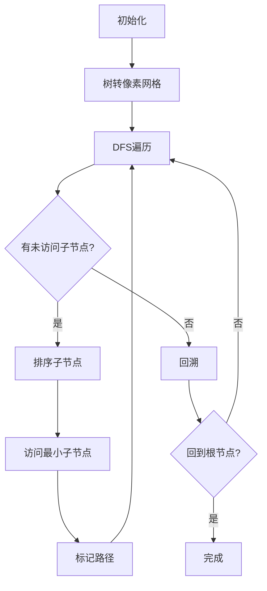

# 题目信息

# Military Problem

## 题目描述

在这个问题中你需要帮助伯兰（？？我没找到有Berland这个国家）军队组织他们的指挥系统

伯兰军队中一共有n个军官。第一个官员是军队的指挥官，他并没有任何上级。其他的军官都有且只有一个直接的上级。如果一个军官a是军官b的上级，那么你也可以说军官b就是军官a的下属

如果满足下列条件，那么军官x就是军官y的下属（直接或非直接）：

1.y是x的直接上级 2.x的直接上级是y的下属

举个例子，下图的官员3的下属有:5,6,7,8,9

所以，在伯兰军队的结构中，除了指挥官，其他人都是指挥官的下属

形式上的，让我们把伯兰军队看成一棵拥有n个节点的树，树的节点u就代表了军官u。根（即一号节点）就相当于指挥官

伯兰战争部门命令你对q个查询给出答案。这q个查询会以（ui，ki）的形式给出，ui代表了某个军官，ki是正整数。你需要输出，编号为ui的军官下达命令后，第ki个得知此命令的军官编号是多少，如果传达人数不足ki个，输出-1。

要处理第i个查询，想象一下ui的命令如何我下达到ui的下属。这里使用了典型的DFS（深度优先搜索）算法。

假设现在的军官是a，他要下达一个命令。a军官选择一个军官b——还没有收到这个命令的直接下属（即在树上的一个孩子）。如果有许多这样的直接下属，那么A选择编号最小的那一个。A军官向B军官发出命令。之后，B使用完全相同的方式将命令扩展到它的子树。在B完成命令后，军官A再次选择下一个直接下属（使用相同的策略）。当军官A不能选择任何还没有接到命令的直接下属时，军官A下达命令完成。

让我们看一下下面这个例子（看下面的图）：

如果军官1下达了命令，军官们收到命令的顺序是：1,2,3,5,6,8,7,9,4

如果军官3下达了命令，军官们收到命令的顺序是：3,5,6,8,7,9

如果军官7下达了命令，军官们收到命令的顺序是：7,9

如果军官9下达了命令，军官们收到命令的顺序是：9

你应当分开处理这些查询。一个查询不会影响其他查询的结果。

## 样例 #1

### 输入

```
9 6
1 1 1 3 5 3 5 7
3 1
1 5
3 4
7 3
1 8
1 9
```

### 输出

```
3
6
8
-1
9
4
```

# AI分析结果


# 💡 Kay的C++算法解析：Military Problem 深入学习指南 💡

## 1. 题目解读与核心算法识别

✨ **本题主要考察**：树遍历与DFS序应用

🗣️ **初步分析**：
> 这道题的核心在于理解**DFS序在树结构中的连续性特性**。想象一棵树就像一本家谱，当我们按"长辈优先、同辈按年龄排序"的方式记录家庭成员时，每个小家庭的记录都是整本家谱中连续的一页。在本题中：
> - **核心思路**：预处理整棵树的DFS序，记录每个节点的访问顺序、子树大小及反向映射
> - **关键难点**：确保遍历顺序符合"编号最小优先"规则，需要排序子节点
> - **解决方案**：DFS前对每个节点的子节点排序，使遍历顺序符合题目要求
> - **可视化设计**：在像素动画中将树转化为网格迷宫，军官化为像素小人，DFS遍历过程转为探险路径。高亮当前访问节点，用不同音效标记关键操作（访问新节点：叮，回溯：噗，查询完成：胜利音效）

---

## 2. 精选优质题解参考

**题解一：(来源：The_foolishest_OIer)**
* **点评**：此解法思路清晰，特别强调了对子节点排序的关键步骤，确保DFS顺序严格符合题目要求。代码结构规范，使用`vector`存储子节点并显式排序，变量命名合理（`dfn`、`rdfn`、`sz`）。算法实现中预处理DFS序和子树大小，查询响应O(1)，空间优化得当。调试技巧方面关闭流同步加速IO，实践参考价值高。

**题解二：(来源：Asphy7xia)**
* **点评**：题解系统性强，从题意分析到复杂度论证完整。亮点在于用树链剖分的连续性类比DFS序，帮助理解子树遍历的连续性。代码实现中`pre`数组存储子节点并排序，`val`和`kth`数组双向映射节点与DFS序，逻辑缜密。解释中强调无解判断（`siz[u]<k`），边界处理严谨，可直接用于竞赛。

**题解三：(来源：jr_zch)**
* **点评**：解法简洁高效，博客图文并茂增强理解。虽然未显式子节点排序（依赖输入顺序），但核心预处理逻辑完备。亮点在于用`sor`、`pre`、`siz`三个数组清晰解耦功能，查询时数学推导直接（`pre[u]+val-1`）。代码可读性极佳，变量命名简短精准，适合初学者理解DFS序核心思想。

---

## 3. 核心难点辨析与解题策略

1.  **难点：确保DFS遍历顺序符合题目要求**
    * **分析**：题目要求军官选择"编号最小"的子节点传递命令。若直接按输入顺序DFS，子节点乱序时会导致遍历顺序错误。优质题解通过`sort(children[u])`显式排序解决
    * 💡 **学习笔记**：树遍历中顺序决定行为，显式排序是满足特定遍历序的可靠方法

2.  **难点：理解子树DFS序的连续性**
    * **分析**：DFS序的关键特性——任何子树的遍历序列都是整树DFS序的连续子串。通过记录节点起始位置(`dfn[u]`)和子树大小(`siz[u]`)，可将子树查询转化为序列区间查询
    * 💡 **学习笔记**：`dfn[u]`到`dfn[u]+siz[u]-1`的区间完整对应u的子树

3.  **难点：高效响应多组查询**
    * **分析**：预处理阶段O(n)完成DFS序和子树大小计算，将查询复杂度降至O(1)。关键是用`id`数组实现"时间戳→节点"的反向映射，通过`id[dfn[u]+k-1]`直接定位答案
    * 💡 **学习笔记**：预处理是优化多组查询的利器，空间换时间策略的经典应用

### ✨ 解题技巧总结
- **子树区间映射**：将树问题转化为序列问题，利用`(dfn[u], siz[u])`元组定位子树区间
- **双数组反向映射**：`dfn[u]`记录节点时间戳，`id[time]`记录对应节点，实现O(1)正反查询
- **边界防御编程**：查询前先判`siz[u] >= k`，避免非法访问
- **加速IO技巧**：`ios::sync_with_stdio(false)`加速流读写，应对大数据量

---

## 4. C++核心代码实现赏析

**本题通用核心C++实现参考**
```cpp
#include <iostream>
#include <vector>
#include <algorithm>
using namespace std;

const int N = 2e5+5;
vector<int> g[N];   // 邻接表存树
int dfn[N];         // dfn[u]: u的DFS进入时间
int id[N];          // id[time]: 该时间访问的节点
int sz[N];          // sz[u]: u的子树大小
int cnt;            // 全局时间戳

void dfs(int u) {
    dfn[u] = ++cnt;     // 记录进入时间
    id[cnt] = u;        // 记录时间戳对应节点
    sz[u] = 1;          // 初始化子树大小(包含自身)
    sort(g[u].begin(), g[u].end()); // 关键！按编号排序子节点
    for(int v : g[u]) {
        dfs(v);
        sz[u] += sz[v]; // 累加子树大小
    }
}

int main() {
    ios::sync_with_stdio(false);
    cin.tie(0);
    
    int n, q; cin >> n >> q;
    for(int i=2; i<=n; i++) {
        int p; cin >> p;
        g[p].push_back(i); // 建树
    }
    
    dfs(1); // 预处理DFS序
    
    while(q--) {
        int u, k; cin >> u >> k;
        if(k > sz[u]) cout << -1 << '\n';
        else cout << id[dfn[u] + k - 1] << '\n'; // 定位子树第k节点
    }
}
```

**题解一核心片段赏析**
```cpp
// 显式排序确保遍历顺序
for(int i=1; i<=n; i++) 
    sort(g[i].begin(), g[i].end());

void dfs(int u, int f) {
    dfn[u] = ++cnt;
    id[cnt] = u;        // 时间戳→节点映射
    sz[u] = 1;
    for(int v : g[u]) {
        if(v == f) continue;
        dfs(v, u);
        sz[u] += sz[v];
    }
}
```
> **亮点**：显式排序子节点，严格满足题目要求  
> **代码解读**：  
> 1. 预处理循环对所有节点的子节点排序，确保DFS按编号升序访问  
> 2. `dfn[u]`记录访问次序，`id[]`实现时间戳到节点的逆映射  
> 3. 递归后累加子树大小，注意避免重复计算父节点(`f`)  
> 💡 **学习笔记**：树遍历中显式排序是控制访问顺序的可靠方法

**题解二核心片段赏析**
```cpp
void dfs(int u) {
    dfn[u] = ++cnt;
    id[cnt] = u;        // 双向映射
    sz[u] = 1;
    sort(children[u].begin(), children[u].end()); // 实时排序
    for(int v : children[u]) {
        dfs(v);
        sz[u] += sz[v];
    }
}
```
> **亮点**：DFS内部排序，逻辑更内聚  
> **代码解读**：  
> 1. 在DFS递归前对当前节点的子节点即时排序  
> 2. 双向映射体系：`dfn[u]`(节点→时间戳) + `id[]`(时间戳→节点)  
> 3. 递归后更新子树大小，注意子节点遍历顺序已被排序保证  
> 💡 **学习笔记**：实时排序减少预处理阶段，但可能增加总排序次数

**题解三核心片段赏析**
```cpp
void dfs(int u) {
    siz[u] = 1;
    sor[++cnt] = u;     // 记录DFS序列
    pre[u] = cnt;       // 节点→位置映射
    for(int v : g[u]) {
        dfs(v);
        siz[u] += siz[v];
    }
}
```
> **亮点**：极简变量命名，聚焦核心逻辑  
> **代码解读**：  
> 1. `sor[]`数组直接存储DFS序列，`pre[u]`记录u的起始位置  
> 2. 查询时直接`sor[pre[u]+k-1]`获取子树第k节点  
> 3. 注意：实际使用需补充子节点排序逻辑  
> 💡 **学习笔记**：数组命名应平衡简洁性与表意性（如`sor`→`dfs_order`更佳）

---

## 5. 算法可视化：像素动画演示

**主题**：像素军官的DFS冒险  
**核心演示**：DFS遍历树结构，动态显示访问顺序和子树区间  

### 动画设计


1. **像素化树结构**：
   - 军官转为8-bit像素人（1号指挥官戴军帽）
   - 树结构转为方格迷宫（根在顶部，子节点在下）
   - 不同状态颜色：未访问（灰）、当前节点（红）、已访问（绿）

2. **DFS过程动画**：
   - **步骤1**：从指挥官(1)开始，红色高亮，播放"集结号"音效
   - **步骤2**：自动排序子节点（显示排序动画，子节点冒泡排序）
   - **步骤3**：访问最小子节点，像素人沿连接线移动，脚步声效
   - **步骤4**：递归到底部后回溯，虚线路径+噗声音效
   - **步骤5**：完成遍历，所有节点变绿，播放胜利音乐

3. **查询交互演示**：
   - 输入`(u,k)`：u节点闪烁，显示`dfn[u]`和`siz[u]`
   - 自动高亮区间`[dfn[u], dfn[u]+siz[u]-1]`
   - 按步追踪第k个节点（1→2→...→k），完成后该节点金色闪烁

4. **控制面板**：
   - 速度滑块：调节动画速度
   - 单步/连续模式：空格暂停/继续
   - 重置按钮：恢复初始状态
   - 音效开关：开启/关闭8-bit音效

---

## 6. 拓展练习与相似问题思考

1. **洛谷 P3916** - 图的遍历  
   🗣️ **推荐理由**：将树上的DFS序扩展到有向图，练习反向建图+DFS技巧

2. **洛谷 P3379** - 最近公共祖先  
   🗣️ **推荐理由**：深化树遍历应用，学习倍增法求LCA，理解DFS序与RMQ结合

3. **洛谷 P1087** - FBI树  
   🗣️ **推荐理由**：二叉树DFS遍历的经典问题，练习后序遍历与分治思想

---

## 7. 学习心得与经验分享

> **参考经验 (来自 Anguei)**：  
> "调试时使用`#ifdef yyfLocal`配合`freopen`，避免反复复制测试样例"  
>  
> **点评**：条件编译实现本地测试与OJ提交的无缝切换，是竞赛编程的实用技巧。建议学习者建立标准调试模板，提升效率

---

通过本次分析，我们深入理解了DFS序在树查询中的应用本质——将树结构转化为线性序列，利用预处理实现高效查询。记住：**显式排序保证顺序，子树大小确定边界，双向映射实现定位**。下次遇到树查询问题时，不妨先思考能否转化为DFS序区间问题！💪

---
处理用时：203.58秒