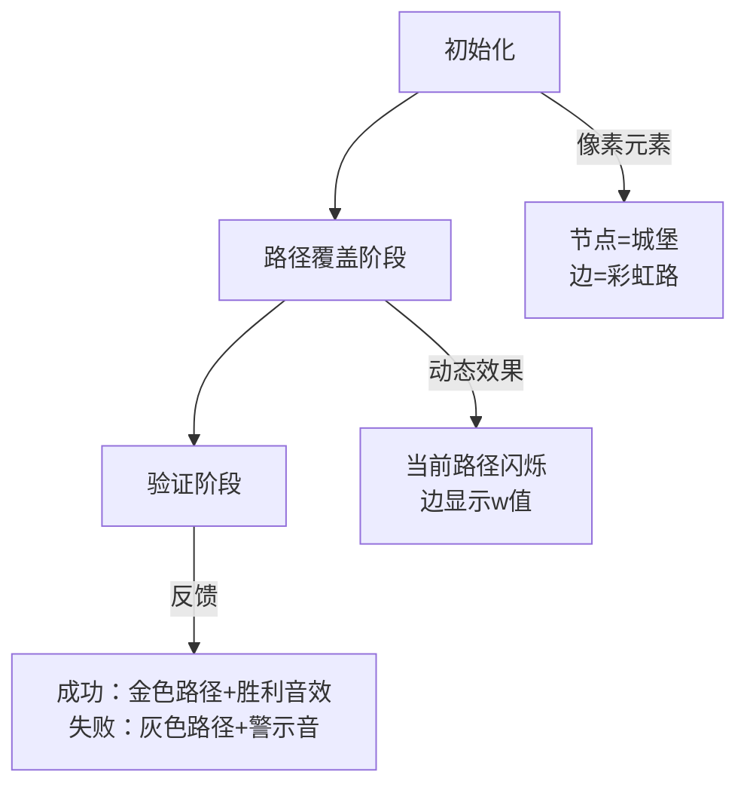

# 题目信息

# Berland Beauty

## 题目描述

There are $ n $ railway stations in Berland. They are connected to each other by $ n-1 $ railway sections. The railway network is connected, i.e. can be represented as an undirected tree.

You have a map of that network, so for each railway section you know which stations it connects.

Each of the $ n-1 $ sections has some integer value of the scenery beauty. However, these values are not marked on the map and you don't know them. All these values are from $ 1 $ to $ 10^6 $ inclusive.

You asked $ m $ passengers some questions: the $ j $ -th one told you three values:

- his departure station $ a_j $ ;
- his arrival station $ b_j $ ;
- minimum scenery beauty along the path from $ a_j $ to $ b_j $ (the train is moving along the shortest path from $ a_j $ to $ b_j $ ).

You are planning to update the map and set some value $ f_i $ on each railway section — the scenery beauty. The passengers' answers should be consistent with these values.

Print any valid set of values $ f_1, f_2, \dots, f_{n-1} $ , which the passengers' answer is consistent with or report that it doesn't exist.

## 样例 #1

### 输入

```
4
1 2
3 2
3 4
2
1 2 5
1 3 3```

### 输出

```
5 3 5```

## 样例 #2

### 输入

```
6
1 2
1 6
3 1
1 5
4 1
4
6 1 3
3 4 1
6 5 2
1 2 5```

### 输出

```
5 3 1 2 1```

## 样例 #3

### 输入

```
6
1 2
1 6
3 1
1 5
4 1
4
6 1 1
3 4 3
6 5 3
1 2 4```

### 输出

```
-1```

# AI分析结果


### 💡 Kay的C++算法解析：Berland Beauty 深入学习指南 💡

#### 1. 题目解读与核心算法识别
✨ **本题主要考察**：`贪心` + `树上的遍历(LCA)`  
🗣️ **初步分析**：  
> 解决"Berland Beauty"的关键在于运用贪心策略。想象给道路设置限速牌：每条边权值必须满足所有经过它的路径要求，我们取每条边"最低限速要求"中的最大值作为实际限速（权值）。具体步骤：  
> - 将乘客要求按$w$升序排序，依次覆盖路径上的边权（确保后处理的更大$w$不会破坏前序约束）  
> - 用LCA定位路径，暴力更新边权（$n≤5000$允许$O(nm)$复杂度）  
> - 最后验证所有路径最小值是否匹配原$w$  
>  
> **可视化设计**：  
> 采用8-bit像素树地图（节点=像素城堡，边=彩虹道路）。处理路径时：  
> 1. 高亮当前路径（闪烁动画），播放"叮"音效  
> 2. 路径边显示$w$值（像素数字弹出）  
> 3. 验证阶段：成功时路径变金色+胜利音效，失败时变灰色+警示音  

---

#### 2. 精选优质题解参考
**题解一（ix35）**  
* **点评**：思路清晰直击核心——证明边权应取约束最大值。代码亮点：  
  - 用倍增LCA高效定位路径（$O(\log n)$跳转）  
  - `num[]`数组巧妙映射边与端点，避免显式存储边  
  - 边界处理严谨（未覆盖边设为1）  
  > *"当前$w_i$已是最小可能值，若验证失败则无解"* —— 作者对贪心本质的洞察极具启发性  

**题解二（Awdrgysxc）**  
* **点评**：突出实践价值：  
  - DFS预处理父节点深度，简化路径遍历  
  - 用`vector<pair>`存储邻接表，增强可扩展性  
  - 检查阶段实时计算路径最小值（避免预存全路径）  
  > 虽未优化复杂度，但模块化设计便于理解树结构操作  

---

#### 3. 核心难点辨析与解题策略
1. **难点：确定边权下界**  
   * **分析**：每条边权$f_i ≥ \max(\text{经过该边的路径} w_j)$。若不取等号（$f_i$更大），虽仍满足约束，但会导致后续验证失败（最小路径值可能>原$w_j$)  
   * 💡 **学习笔记**：贪心策略中"取最小可能值"是平衡约束的关键  

2. **难点：高效路径覆盖**  
   * **分析**：暴力跳父亲($O(n)$/路径) vs 倍增LCA($O(\log n)$/路径)。本题$n$较小，但LCA写法更具普适性  
   * 💡 **学习笔记**：`dep[u]>dep[v]`时先跳$u$保证同步——避免漏边  

3. **难点：验证的正确性**  
   * **分析**：必须重新计算每条路径最小值！因后续覆盖可能修改边权，仅检查原始约束会遗漏矛盾  
   * 💡 **学习笔记**：最终验证是贪心算法"自检"的必要步骤  

✨ **解题技巧总结**  
- **技巧1：约束排序**—— 处理多条件时，按强度升序/降序排序可避免冲突  
- **技巧2：LCA双指针同步**—— 写`while(u!=lca)`时，从两端向LCA跳转防遗漏  
- **技巧3：缺省值处理**—— 未覆盖边权取1（满足$[1,10^6]$约束且不影响最小值）  

---

#### 4. C++核心代码实现赏析
**通用核心实现（综合自ix35与Awdrgysxc）**  
```cpp
#include <iostream>
#include <vector>
#include <algorithm>
using namespace std;
const int N = 5005;

struct Query { int u, v, w; };
vector<int> G[N];
int dep[N], fa[N], edge_id[N]; // edge_id[v]: v到fa[v]的边编号
int ans[N]; // 边权答案
Query qry[N];

void dfs(int u, int f) {
    for (int v : G[u]) 
        if (v != f) {
            fa[v] = u, dep[v] = dep[u] + 1;
            dfs(v, u);
        }
}

void update_path(int u, int v, int w) {
    while (u != v) {
        if (dep[u] < dep[v]) swap(u, v);
        ans[edge_id[u]] = max(ans[edge_id[u]], w);
        u = fa[u];
    }
}

int main() {
    int n, m; cin >> n;
    for (int i = 1; i <= n-1; ++i) {
        int u, v; cin >> u >> v;
        G[u].push_back(v);
        G[v].push_back(u);
    }
    dfs(1, 0);
    cin >> m;
    for (int i = 0; i < m; ++i) 
        cin >> qry[i].u >> qry[i].v >> qry[i].w;
    
    sort(qry, qry+m, [](auto a, auto b) { return a.w < b.w; });
    for (int i = 0; i < m; ++i) 
        update_path(qry[i].u, qry[i].v, qry[i].w);
    
    // 验证与输出
    for (int i = 1; i <= n-1; ++i) 
        cout << (ans[i] ? ans[i] : 1) << " ";
}
```

**题解一（ix35）片段赏析**  
```cpp
void modify(int u, int v, int we) {
    int l = lca(u, v);
    while (u != l) { 
        w[num[u]] = we;  // num[u]存储u到父节点的边编号
        u = f[u][0];     // 倍增跳转
    }
    while (v != l) { 
        w[num[v]] = we;
        v = f[v][0];
    }
}
```
> **代码解读**：  
> - `lca(u,v)`定位最近公共祖先，分割路径为`u→lca`和`v→lca`两段  
> - `num[u]`巧妙设计：DFS时记录`u`到父节点的边编号，避免显式边结构  
> - 双循环独立处理两段路径，确保覆盖所有边  

**题解二（Awdrgysxc）片段赏析**  
```cpp
void modify(int u, int v, int w) {
    if (dep[u] < dep[v]) swap(u, v);
    while (dep[u] > dep[v]) { 
        f[id[u]] = max(f[id[u]], w); // id[u]: u到父节点的边编号
        u = fa[u];
    }
    while (u != v) { 
        f[id[u]] = max(f[id[u]], w);
        f[id[v]] = max(f[id[v]], w);
        u = fa[u], v = fa[v];
    }
}
```
> **代码解读**：  
> - 先同步深度：深度大的节点`u`先跳至与`v`同层  
> - 双向同步跳转：当`u,v`同深后同步向根移动，避免LCA计算  
> - `max(f[id],w)`保证不破坏已处理的更强约束  

---

#### 5. 算法可视化：像素动画演示
**主题**：8-bit风格"树边权值探险"  
**核心交互流程**：  


**关键动画帧设计**：  
1. **场景初始化**  
   - 树结构化为8-bit网格地图（参考FC《塞尔达》风格）  
   - 控制面板：速度滑块/单步/暂停按钮（复古像素UI）  

2. **路径覆盖演示**  
   - 当前路径彩虹闪烁（`u→v`动态延伸）  
   - 边权更新：像素数字弹出动画 + "叮"音效  
   - 数据结构可视化：右侧面板显示`ans[]`数组实时变化  

3. **验证阶段**  
   - 路径遍历：像素马车沿路径移动（步进动画）  
   - 实时计算最小值：马车经过边时显示当前最小值  
   - 结果反馈：成功时马车变金色 + 16-bit胜利BGM；失败时路径变灰 + 低沉音效  

> **设计原理**：像素动画将抽象树结构具象化，游戏化反馈（音效/颜色）强化对算法流程的理解，特别是贪心覆盖与验证的因果关系  

---

#### 6. 拓展练习与相似问题思考
**通用技巧迁移**：  
树路径约束问题核心三步骤：  
1. **约束分析** → 转化边权上下界  
2. **覆盖策略** → 排序处理避免冲突  
3. **暴力/LCA** → 树路径遍历实现  

**洛谷推荐**：  
1. **P1967 货车运输**  
   > 🗣️ 最大生成树+LCA路径最小值，深化贪心思想应用  
2. **P3258 松鼠的新家**  
   > 🗣️ 路径覆盖差分技巧，训练高效区间更新  
3. **P2486 染色**  
   > 🗣️ 树链剖分+线段树，进阶掌握路径维护数据结构  

---

#### 7. 学习心得与经验分享
> **ix35的调试经验**：  
> *"若验证失败则无解——因$w_i$已取理论最小值"*  
>   
> **Kay点评**：  
> 深刻揭示了贪心算法的自洽性。调试类似问题时，重点验证：  
> 1. 约束是否按强度排序  
> 2. 边界值是否覆盖极端情况（如单边路径）  
> 3. LCA实现是否正确处理同节点情况  

---

掌握树约束问题的贪心本质，理解LCA的路径分割思想，你就能征服这类"美丽"的难题！下次遇到树结构问题，记得先画像素树哦~ 💪

---
处理用时：179.39秒