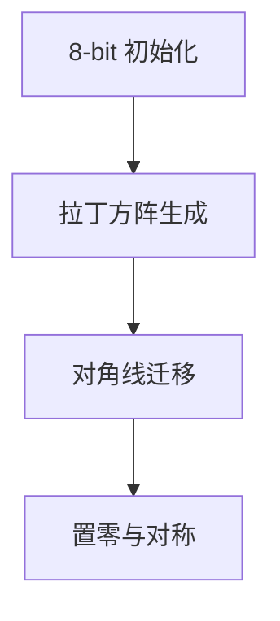

# 题目信息

# Start of the season

## 题目描述

在伯兰的足球节开幕式中有一个奇怪的魔术秀。最有经验的魔术师会找一个n×n的矩阵（n为偶数）。足球节没有这个魔术秀绝对不会开始。这个矩阵应该包含0~n-1的正整数，且包含以下三条规则：

1、主对角线上的数应该都是0

2、且整个矩阵应该都是对称的

3、每行每列上的数都是不同的。

魔术师很不喜欢一遍又一遍的接矩阵（魔术师真懒），于是就请你写一个程序来帮助他们解决矩阵问题。

## 样例 #1

### 输入

```
2
```

### 输出

```
0 1
1 0
```

## 样例 #2

### 输入

```
4
```

### 输出

```
0 1 3 2
1 0 2 3
3 2 0 1
2 3 1 0
```

# AI分析结果


### Kay的C++算法解析：Start of the season 深入学习指南

#### 1. 题目解读与核心算法识别
✨ **本题主要考察**：`矩阵构造技巧` (编程技巧应用)  

🗣️ **初步分析**：
> 这道题要求构造一个满足三个严格条件的特殊矩阵。就像玩魔方时需要同时对齐六个面，这里需要同时满足对角线归零、矩阵对称和行列不重复三个约束。核心技巧是**分步构造法**：  
> 1. 先忽略对角线约束，构建一个(n-1)×(n-1)的拉丁方阵（每行每列都是1~n-1的排列）
> 2. 将对角线元素移动到新增的最后一行/列
> 3. 将对角线置零并补全对称元素  
> 
> **可视化设计思路**：动画将用三种颜色像素块表示数字（0=黑色，1~n-1=彩色），分三阶段演示：①拉丁方阵生成（数字雨动画）②对角线元素移动（箭头轨迹）③置零与对称补全（闪烁效果）。复古音效包括：数字填充的"滴"声，元素移动的"嗖"声，置零的"叮"声。

---

#### 2. 精选优质题解参考
**题解一 (来源：Durancer)**
* **点评**：思路直击本质，将复杂问题分解为拉丁方阵构建+对角线调整两个清晰步骤。代码中`jux[j][i]=k; k=(k+1)%n;`巧妙利用模运算生成循环排列，逻辑如齿轮般精密。变量命名`jux`(矩阵)虽简但意，边界处理`jux[i][n]=jux[n][i]`体现对称思想。亮点在于用数学思维降维打击问题复杂度。

**题解二 (来源：米奇奇米)**
* **点评**：代码极简主义典范，核心逻辑仅用`map[i][j]=(i+j)%n+1`一行实现拉丁方阵构造。虽省略注释，但精炼的对称处理`map[i][n]=map[n][i]=map[i][i]`如诗般优雅。特别值得学习其用`n--`统一处理维度的技巧，展现对问题本质的深刻把握。

**题解三 (来源：yzc20100218)**
* **点评**：最具教学价值的题解，不仅给出代码，更用数学原理论证构造正确性。提到"模n完全剩余系"概念，解释`(i+j) mod n+1`为何能保证不重复性。亮点在于将编程与数论结合，`a[i][n]=a[i][i]`的平移操作配合对角线归零，形成闭环逻辑。

---

#### 3. 核心难点辨析与解题策略
1.  **难点1：构建初始排列矩阵**
    * **分析**：需创建(n-1)×(n-1)矩阵，满足行列不重复且不含0。优质题解采用**模运算循环排列**：`a[i][j] = (i+j) % (n-1) + 1`，这保证每行都是1~n-1的偏移排列，如同旋转的密码盘。
    * 💡 **学习笔记**：循环偏移是生成排列矩阵的利器

2.  **难点2：对角线归零与对称保持**
    * **分析**：直接置零会破坏对称性。题解巧用**对角线元素迁移法**：将`a[i][i]`备份到新增的最后一行/列对应位置（`a[i][n]=a[n][i]=a[i][i]`），再置零原位置。这如同象棋的"垫将"战术，牺牲局部保全整体。
    * 💡 **学习笔记**：通过维度扩展解决约束冲突

3.  **难点3：验证最终矩阵性质**
    * **分析**：需确认调整后每行/列仍是0~n-1排列。由于拉丁方阵原含1~n-1，迁移操作使每行新增0和缺失值（原对角线值），而该值恰被补到行末，构成完整集合。
    * 💡 **学习笔记**：集合论思维验证构造正确性

### ✨ 解题技巧总结
- **降维构造法**：将n维问题转化为(n-1)维解决
- **模运算艺术**：用`(i+j)%k`生成循环排列
- **对称迁移术**：通过对角线元素位移保持矩阵对称

---

#### 4. C++核心代码实现赏析
**通用核心实现参考**
```cpp
#include <iostream>
using namespace std;

int main() {
    int n; cin >> n;
    int mat[1001][1001]{};
    
    // 构造(n-1)阶拉丁方阵
    for(int i=0; i<n-1; ++i)
        for(int j=0; j<n-1; ++j)
            mat[i][j] = (i+j) % (n-1) + 1;
    
    // 迁移对角线元素并置零
    for(int i=0; i<n-1; ++i) {
        mat[i][n-1] = mat[i][i];  // 迁移到行末
        mat[n-1][i] = mat[i][i];  // 迁移到列末
        mat[i][i] = 0;            // 主对角线归零
    }
    mat[n-1][n-1] = 0;            // 右下角置零
    
    // 输出
    for(int i=0; i<n; ++i) {
        for(int j=0; j<n; ++j)
            cout << mat[i][j] << " ";
        cout << '\n';
    }
}
```
**代码解读概要**：  
> 1. 首先生成(n-1)×(n-1)拉丁方阵，核心是`(i+j)%(n-1)+1`的循环排列  
> 2. 将对角线元素`mat[i][i]`迁移至新增的最后一列和最后一行  
> 3. 清空主对角线和右下角为0  
> 4. 输出最终矩阵  

**题解一核心片段赏析**  
```cpp
for(int i=1;i<=n-1;i++) {
    int k=i;
    for(int j=1;j<=n-1;j++) {
        jux[j][i]=k;
        k = (k % n == n-1) ? 1 : k+1;
    }
}
```
> **亮点**：动态生成列循环排列  
> **解读**：  
> - 外层`i`控制列号，内层`j`生成该列数字  
> - `k`初始为列号`i`，每步自增  
> - 当`k`达到`n`时重置为1，形成循环  
> **学习笔记**：列生成比行生成更易控制循环偏移  

**题解二核心片段赏析**  
```cpp
n--;
for(int i=0;i<n;i++)
    for(int j=0;j<n;j++)
        map[i][j]=(i+j)%n+1;
```
> **亮点**：极致简洁的拉丁方阵实现  
> **解读**：  
> - 先用`n--`统一维度处理  
> - `(i+j)%n+1`保证每行都是1~n的循环排列  
> - 模运算自动处理数字回绕  
> **学习笔记**：巧用数论特性替代条件判断  

**题解三核心片段赏析**  
```cpp
for(int i=1;i<=n-1;i++) {
    for(int j=1;j<=n-1;j++)
        a[i][j] = (i+j) % (n-1) + 1;
    a[i][n] = a[i][i];
    a[n][i] = a[i][i];
    a[i][i] = 0;
}
```
> **亮点**：严谨的数学推导支持  
> **解读**：  
> - 数学证明`(i+j) mod (n-1)+1`形成完全剩余系  
> - 同步处理行/列迁移和置零  
> - 显式处理右下角元素  
> **学习笔记**：数学证明提升代码可信度

---

#### 5. 算法可视化：像素动画演示
**主题**："矩阵魔法师"的像素工坊  
**核心演示**：拉丁方阵构造→对角线迁移→对称补全三幕剧  

##### 像素动画设计：


**动画帧步骤**：  
1. **初始化**（复古蓝网格）：  
   - 像素画布初始化为n×n深蓝网格，对角线亮白  
   - 控制面板含步进/调速/重置按钮，背景播放8位芯片音乐  

2. **拉丁方阵生成**（数字雨特效）：  
   ```python
   for i in 0..n-2:
     for j in 0..n-2:
       值 = (i+j) % (n-1) + 1
       像素块从顶部落下(伴随"滴"声)
       颜色 = 预设值对应色盘[值]
   ```
   - 每填满一行播放"叮咚"音效  

3. **对角线大迁移**（箭头轨迹）：  
   - 对角线像素块沿虚线箭头滑向边缘（"嗖"声效）  
   - 移动轨迹残留光痕，原位置变红闪烁  

4. **零的诞生**（圣光特效）：  
   - 对角线位置迸发白光后变为黑色0（"嗡"声效）  
   - 新增行列同步高亮黄框（"叮"声效）  

5. **自动演示模式**：  
   - 点击"AI运行"后，魔法师像素小人沿路径施法  
   - 每完成一阶段，右上角星数+1（共3星）  

**教育设计**：  
- 旁白提示："注意！对角线搬家时带走自己的值"  
- 错误示范：直接置零导致对称破坏（显示红色叉动画）  
- 成功时：魔法师帽喷出彩带，播放胜利音效  

---

#### 6. 拓展练习与相似问题思考
**技巧迁移场景**：  
1. 幻方构造（行/列/对角线求和相等）  
2. 数独生成（九宫格约束）  
3. 循环编码矩阵（信息论应用）  

**洛谷推荐**：  
1. **P1498 南蛮图腾**  
   → 同类构造思维，分形艺术应用  
2. **P1005 矩阵取数游戏**  
   → 矩阵对称性+动态规划综合应用  
3. **P1219 八皇后**  
   → 排列约束验证的经典问题  

---

#### 7. 学习心得与经验分享
> **参考经验 (Asrit)**："先满足条件3忘了条件2，调试时用`cout`打印中间矩阵才发现对称性破坏"  
>  
> **点评**：这位作者的调试经历极具代表性。构造类问题需**同步验证多个约束**，建议：  
> 1. 每完成一个构造阶段输出中间矩阵  
> 2. 编写验证函数检查对称/排列等属性  
> 3. 小规模测试（n=2,4）优先  

> **参考经验 (Timmy)**："想象矩阵如同魔方，转动一个面会影响多个约束"  
>  
> **点评**：空间想象力能提升构造效率，推荐：  
> - 用三维视角理解矩阵变换  
> - 纸笔模拟n=4的变换过程  

---

本次构造技巧的核心在于**分步解决冲突约束**，如同解开交织的绳结。记住：复杂问题往往有优雅的数学解，下次遇到矩阵构造时，不妨尝试拉丁方阵这把万能钥匙！🎮✨

---
处理用时：166.89秒