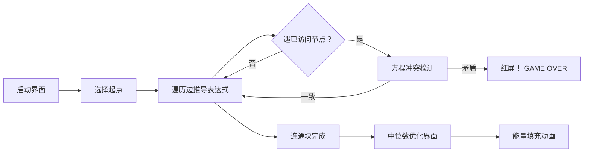

# 题目信息

# Graph

## 题目描述

You are given an undirected graph where each edge has one of two colors: black or red.

Your task is to assign a real number to each node so that:

- for each black edge the sum of values at its endpoints is $ 1 $ ;
- for each red edge the sum of values at its endpoints is $ 2 $ ;
- the sum of the absolute values of all assigned numbers is the smallest possible.

Otherwise, if it is not possible, report that there is no feasible assignment of the numbers.

## 说明/提示

Note that in the second example the solution is not unique.

## 样例 #1

### 输入

```
4 4
1 2 1
2 3 2
1 3 2
3 4 1```

### 输出

```
YES
0.5 0.5 1.5 -0.5```

## 样例 #2

### 输入

```
2 1
1 2 1```

### 输出

```
YES
0.3 0.7```

## 样例 #3

### 输入

```
3 2
1 2 2
2 3 2```

### 输出

```
YES
0 2 0```

## 样例 #4

### 输入

```
3 4
1 2 2
2 2 1
2 1 1
1 2 2```

### 输出

```
NO```

# AI分析结果


# 💡 Kay的C++算法解析：Graph 深入学习指南 💡

> 今天我们来分析CF1387A "Graph" 这道图论题。本指南将帮助你理解如何为无向图节点赋值，满足边权约束并最小化绝对值之和，同时掌握方程组求解和图遍历的核心技巧。

## 1. 题目解读与核心算法识别

✨ **本题主要考察**：`图论`（连通块处理）与`数学`（线性方程组求解）

🗣️ **初步分析**：
> 想象每个节点是一个魔法水晶，黑边要求相连水晶的能量值之和为1，红边要求为2。我们需要给水晶充能（可正可负），满足所有连接要求，并使总耗能（绝对值之和）最小。  
> - **核心思路**：将每条边转化为方程（`x_u + x_v = w`），对每个连通块独立处理：  
>   • 设定起点变量 `x`，通过BFS/DFS推导其他节点的线性表达式 `a_i*x + b_i`  
>   • 遇到环时检查方程一致性（无解则终止）  
>   • 若无矛盾，取中位数最小化绝对值之和  
> - **可视化设计**：  
>   采用复古RPG地图风格，节点为像素化水晶（起点绿色，其他蓝色）。遍历时高亮当前边（黑/红色闪烁），实时显示节点表达式。解方程时切换数轴界面，动态展示绝对值函数叠加和中位数的选取过程，伴随8-bit音效（成功时播放《塞尔达》过关旋律）。

---

## 2. 精选优质题解参考

**题解一（作者：chen_hx）**
* **点评**：思路清晰完整，代码规范性强：  
  - **推导逻辑**：使用`pair<int,int>`存储系数`(a,b)`，BFS遍历时通过`a_v = -a_u, b_v = w - b_u`递推表达式  
  - **代码亮点**：用整数运算避免浮点误差，环检测时直接比较系数（`a1==a2但b1≠b2`则无解）  
  - **实践价值**：边界处理严谨（如连通块单点特判），可直接用于竞赛  

**题解二（作者：Zikl）**
* **点评**：创新性优化数学处理：  
  - **推导逻辑**：将边权`×2`确保全程整数运算，输出时`÷2`避免浮点精度问题  
  - **代码亮点**：显式注释矛盾检测条件（`a[u]+a[v]==0 && b[u]+b[v]!=w`）  
  - **实践价值**：提供浮点问题的整数化解决思路，但`×2`技巧增加了理解门槛  

---

## 3. 核心难点辨析与解题策略

1. **难点1：连通块内自由元与约束的平衡**  
   * **分析**：每个连通块初始有1个自由变量`x`。遍历时若遇到环（访问过的节点），则生成一个关于`x`的方程，可能固定`x`值或发现矛盾  
   * 💡 **学习笔记**：自由变量数量=1（无环） - 环的数量，类似物理中的自由度概念  

2. **难点2：最小化绝对值之和**  
   * **分析**：当`x`自由时，目标函数为`Σ|a_i*x + b_i|`（`a_i=±1`）。通过代数变换转化为`Σ|x - c_i|`，取`c_i`的中位数可使总和最小  
   * 💡 **学习笔记**：绝对值之和最小化 = 求中位数，类似仓库选址问题  

3. **难点3：避免浮点精度陷阱**  
   * **分析**：直接浮点计算可能导致本应相等的值被判不等  
   * 💡 **学习笔记**：可通过整数运算（如Zikl的`×2`法）或设置误差容忍度（`eps=1e-6`）解决  

### ✨ 解题技巧总结
- **分治处理**：独立处理每个连通块，降低问题复杂度  
- **代数映射**：将图遍历转化为线性方程组推导  
- **几何优化**：利用中位数性质解决绝对值最小化问题  
- **整数防御**：优先整数运算避免浮点误差  

---

## 4. C++核心代码实现赏析

**本题通用核心实现（综合优化版）**
```cpp
#include <iostream>
#include <vector>
#include <queue>
#include <algorithm>
using namespace std;

const double eps = 1e-6;
struct Edge { int to, w; };

pair<bool, vector<double>> solveGraph(int n, vector<vector<Edge>>& graph) {
    vector<int> vis(n+1, 0);
    vector<double> ans(n+1, 0);
    vector<pair<double, double>> coeff(n+1); // {a, b} for a*x + b

    for (int i = 1; i <= n; ++i) {
        if (vis[i]) continue;
        
        queue<int> q;
        vector<int> comp;
        q.push(i);
        vis[i] = 1;
        comp.push_back(i);
        coeff[i] = {1.0, 0.0}; // 起点设为 x

        bool hasEquation = false;
        double solution = 0;

        while (!q.empty()) {
            int u = q.front(); q.pop();
            for (auto& e : graph[u]) {
                int v = e.to, w = e.w;
                if (!vis[v]) {
                    vis[v] = 1;
                    coeff[v] = {-coeff[u].first, w - coeff[u].second};
                    q.push(v);
                    comp.push_back(v);
                } 
                else { // 环检测
                    double sumA = coeff[u].first + coeff[v].first;
                    double sumB = coeff[u].second + coeff[v].second;
                    if (abs(sumA) < eps) {
                        if (abs(sumB - w) > eps) 
                            return {false, {}}; // 矛盾
                    } 
                    else {
                        double x_val = (w - sumB) / sumA;
                        if (!hasEquation) {
                            solution = x_val;
                            hasEquation = true;
                        } 
                        else if (abs(solution - x_val) > eps) {
                            return {false, {}};
                        }
                    }
                }
            }
        }

        // 未确定解时取中位数
        if (!hasEquation) {
            vector<double> points;
            for (int u : comp) {
                double c = (coeff[u].first > 0) ? 
                           -coeff[u].second : coeff[u].second;
                points.push_back(c);
            }
            sort(points.begin(), points.end());
            solution = points[points.size() / 2];
        }

        // 计算节点值
        for (int u : comp) 
            ans[u] = coeff[u].first * solution + coeff[u].second;
    }
    return {true, ans};
}
```

**代码解读概要**：  
> 1. **连通块遍历**：用`vis`标记已访问节点，每个块从起点开始BFS  
> 2. **系数推导**：`coeff[v] = {-a_u, w - b_u}` 由边权`w`和父节点系数计算  
> 3. **矛盾检测**：环产生方程 `(a_u+a_v)x + (b_u+b_v) = w`，检查解一致性  
> 4. **中位数优化**：自由变量时收集`-b_i/a_i`排序取中位数  
> 5. **结果计算**：用确定的`solution`计算所有节点值  

---

## 5. 算法可视化：像素动画演示

**主题**：8-bit水晶能量平衡大冒险  

### 动画设计


### 关键交互
1. **场景设计**：
   - 节点：闪烁的像素水晶（16×16px），起点为绿色，其他为蓝/紫色
   - 边：黑边=黑色像素链，红边=红色像素链，标注目标值（1/2）

2. **遍历过程**：
   - 当前节点高亮闪烁，边遍历时播放"滴"声
   - 新节点显示表达式：`-x+1`（复古字体）
   - 冲突检测：表达式不等时屏幕震动，显示"CONFLICT!"（红字）

3. **中位数优化**：
   - 底部数轴动态显示点集 `c_i = -b_i/a_i`
   - 移动像素滑块选择`x`，实时计算并显示绝对值之和
   - 选定中位数时播放"叮咚"音效

4. **游戏化元素**：
   - 每连通块完成解锁成就徽章
   - 成功通关播放《塞尔达传说》音效改编的8-bit胜利曲
   - 控制面板：步进/自动播放（调速）、重置、静音开关

---

## 6. 拓展练习与相似问题思考

**通用技巧迁移**：  
> 线性方程组求解+绝对值最小化模型还可用于：  
> 1. 电网平衡（节点电压/电流约束）  
> 2. 物流中心选址（距离绝对值最小）  
> 3. 数据拟合（L1范数优化）  

**推荐练习**：  
1. [洛谷P1991](https://www.luogu.com.cn/problem/P1991)  
   → **推荐理由**：类似边约束的方程组求解，强化连通块处理能力  
2. [洛谷P1525](https://www.luogu.com.cn/problem/P1525)  
   → **推荐理由**：约束差值问题（延伸为 `x_u - x_v = d` 的方程）  
3. [洛谷P3384](https://www.luogu.com.cn/problem/P3384)  
   → **推荐理由**：树上的路径约束（练习链式方程推导）  

---

## 7. 学习心得与经验分享

**经验摘录（chen_hx）**：  
> "码力很重要——推导再完美，实现时也要注意边界条件！"  

**Kay点评**：  
> 此题精确处理三种场景体现了编程严谨性：  
> 1. 单点连通块（直接赋0）  
> 2. 自由变量块（中位数优化）  
> 3. 矛盾方程（立即终止）  
> **建议**：动手模拟样例2（单边）和样例4（矛盾）的调试过程，加深理解  

---

> 本次解析结束！记住：图论问题本质是关系的数学表达。多练习连通块处理和中位数优化技巧，你将成为图论魔法师！✨

---
处理用时：175.86秒