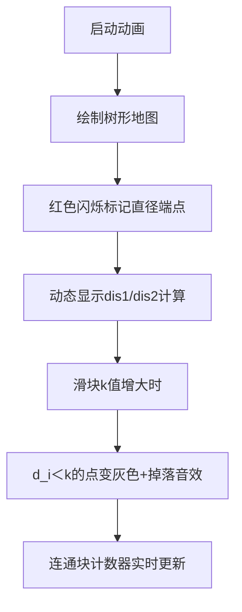

# 题目信息

# A Wide, Wide Graph

## 题目描述

给定一棵 $n$（$2\leq n\leq 10^5$）个节点的无根树，对于每个 $k$（$1\leq k \leq n$），定义一个无向图 $G_k$，其中由边连接的两个节点 $u$ 和 $v$ 的距离至少为 $k$。请你计算 $G_k$ 的连通块个数。

## 说明/提示

$2\leq n\leq 10^5$


第一个样例中，当$k=1$时，所有的点都连通；当$k=4$时，只有$(4,6)$和$(5,6)$两条边连通，所以连通块个数为4。

第二个样例中，当$k=3$时，节点1、4、5构成一个连通块，其余两个节点分别为一个连通块。

## 样例 #1

### 输入

```
6
1 2
1 3
2 4
2 5
3 6```

### 输出

```
1 1 2 4 6 6```

## 样例 #2

### 输入

```
5
1 2
2 3
3 4
3 5```

### 输出

```
1 1 3 5 5```

# AI分析结果


### 💡 Kay的C++算法解析：A Wide, Wide Graph 深入学习指南 💡

#### 1. 题目解读与核心算法识别
✨ **本题主要考察**：`树的直径` + `贪心计数`  

🗣️ **初步分析**：  
> 想象一棵树是一张探险地图🌲，直径端点如同地图上最远的两个宝藏点💎。当k增大时，只有距离足够远的点才能"通信"（连边）。解题关键在于：
> - 树的直径性质：任意点的最远点必是直径端点之一（类似"地图边缘"）
> - 贪心策略：每个点只保留与最远点的潜在连接
> 
> **核心流程**：  
> 1. 用两次DFS找到直径端点（先随机起点找最远点A，再从A找最远点B）
> 2. 计算所有点到A、B的距离（dis1/dis2）
> 3. 对每个点取max(dis1,dis2)作为其"生存阈值"d_i
> 4. 当k>d_i时点i成为孤立点，用桶统计d_i+1位置
> 
> **可视化设计**：  
> - 像素风格：FC红白机风格（16色），树节点为8-bit像素方块  
> - 关键动画：  
>   - 直径端点闪烁红光，距离计算时显示数字标签  
>   - k增大时，d_i<k的点变为灰色（孤立）并播放"掉落音效"  
> - 控制面板：滑动条调节k值，单步执行观察连通块分裂

---

#### 2. 精选优质题解参考
**题解一（lihongqian__int128）**  
* **点评**：  
  - 思路直击核心，完整呈现"找直径→算距离→桶计数"三步骤  
  - 代码规范：用`dis1/dis2`数组明确存储距离，`s[]`桶命名合理  
  - 亮点：直径端点y的特殊处理（不加入桶）精妙确保计数正确性  
  - 调试提示：作者强调DFS后重置`vis`数组避免遍历错误  

**题解二（Demeanor_Roy）**  
* **点评**：  
  - 创新性用`ex[]`标记访问状态，节省了`vis`数组空间  
  - 代码简洁性突出：仅用三个DFS完成全部计算  
  - 亮点：断言式注释帮助理解（如"若x到所有点距离≤k则独立成块"）  
  - 实践价值：边界处理严谨（如`dis[u]=-0x3f`初始化）  

**题解三（RainySoul）**  
* **点评**：  
  - 变量命名极清晰（`pl/pr`表直径端点，`ans`直接存储结果）  
  - 算法优化：合并DFS与距离计算（`dfs2`同时更新`dis1`）  
  - 亮点：输出时用`min(ans,n)`避免越界，增强鲁棒性  

---

#### 3. 核心难点辨析与解题策略
1. **难点：如何确定k增大时的连通块变化规律？**  
   * **分析**：通过树的直径性质推导出：连通块数=1（主块）+孤立点数。孤立点判定条件为k>max(点到端点的距离)  
   * 💡 **学习笔记**：直径是树的"骨架"，所有点依附着它  

2. **难点：为何只需考虑直径端点？**  
   * **分析**：数学归纳法可证，任意点u的最远点必是直径端点。若u与v非端点能连边，则通过端点路径必然更优  
   * 💡 **学习笔记**：最远点=直径端点 → 减少无效边计算  

3. **难点：如何高效统计孤立点？**  
   * **分析**：桶计数技巧（d_i+1处+1），前缀和实现O(1)状态转移  
   * 💡 **学习笔记**：桶是离散化计数的利器  

✨ **解题技巧总结**  
- **问题分解法**：将连通块问题拆解为（直径搜索+距离计算+计数）  
- **空间换时间**：用`dis1/dis2`存储距离避免重复计算  
- **边界防御**：k>直径长度时直接返回n（如`min(ans,n)`）  

---

#### 4. C++核心代码实现赏析
**通用核心实现（综合优化版）**  
```cpp
#include <bits/stdc++.h>
using namespace std;
const int N=1e5+5;

vector<int> g[N];
int disA[N], disB[N], bucket[N];

// 计算从起点出发的所有距离
void dfs(int u, int fa, int dis[]) {
    for(int v:g[u]) 
        if(v!=fa) {
            dis[v]=dis[u]+1;
            dfs(v,u,dis);
        }
}

int main() {
    int n; cin>>n;
    for(int i=1,u,v;i<n;++i) {
        cin>>u>>v;
        g[u].push_back(v);
        g[v].push_back(u);
    }

    // 第一次DFS：找直径端点A
    disA[1]=0; 
    dfs(1,0,disA);
    int A=1;
    for(int i=1;i<=n;++i) 
        if(disA[i]>disA[A]) A=i;

    // 第二次DFS：计算到A的距离并找端点B
    disA[A]=0;
    dfs(A,0,disA);
    int B=A;
    for(int i=1;i<=n;++i) 
        if(disA[i]>disA[B]) B=i;

    // 第三次DFS：计算到B的距离
    disB[B]=0;
    dfs(B,0,disB);

    // 桶计数（排除端点B）
    for(int i=1;i<=n;++i) 
        if(i!=B) 
            bucket[max(disA[i],disB[i])+1]++;

    // 前缀和计算答案
    int sum=1; // 初始连通块
    for(int k=1;k<=n;++k) {
        sum += bucket[k];
        cout<<min(sum,n)<<' '; 
    }
}
```
**代码解读概要**：  
> 1. **DFS三重奏**：首次定位直径端点A，二次计算各点到A距离，三次计算到B距离  
> 2. **桶的精髓**：`bucket[d_i+1]++`标记孤立点发生时刻  
> 3. **sum的递推**：sum=1表示初始连通块，随k增大逐步增加孤立点  

---

#### 5. 算法可视化：像素动画演示
**主题**：`像素探险家之连通块分裂`（8-bit风格）  
**核心演示**：  

**交互设计**：  
- **控制面板**：  
  ```plaintext
  [▶] 自动播放  [|>] 下一步  [↻] 重置
  速度：|=======O---| (可拖动)
  ```
- **音效方案**：  
  - 直径端点发现：🎮 8-bit胜利音效  
  - 点变孤立：💥 像素爆炸声（短促）  
  - k超直径：🔚 游戏结束音  
- **动画逻辑**：  
  - 用Canvas绘制树节点（坐标预先计算）  
  - 距离更新时显示数字标签渐变动画  
  - 孤立点自由落体+粒子消散效果  

---

#### 6. 拓展练习与相似问题思考
**技巧迁移场景**：  
1. 网络延迟分析（节点间最大距离）  
2. 灾害预警站点选址（最小化最远距离）  
3. 社交网络影响力计算（直径端点类比核心用户）  

**洛谷推荐**：  
1. **P5536** 核心城市 → 巩固直径性质+贪心选址  
2. **P4408** 逃学的小孩 → 直径端点距离的变式  
3. **P3629** 巡逻 → 直径在动态规划中的应用  

---

#### 7. 学习心得与经验分享
> **lihongqian__int128的调试经验**：  
> *"DFS遍历时vis数组必须重置，否则二次遍历会漏节点——用memset(vis,0,sizeof vis)比手动重置更可靠"*  
> **Kay总结**：  
> 1. 直径类问题必写DFS模板（含fa防回环）  
> 2. 桶计数的下标=事件发生时刻（d_i+1即孤立触发点）  
> 3. 变量名`disA/disB`比`d1/d2`更易维护  

---
掌握树的直径，就能握住连通问题的命脉！下次探索再见~ 🚀

---
处理用时：455.55秒