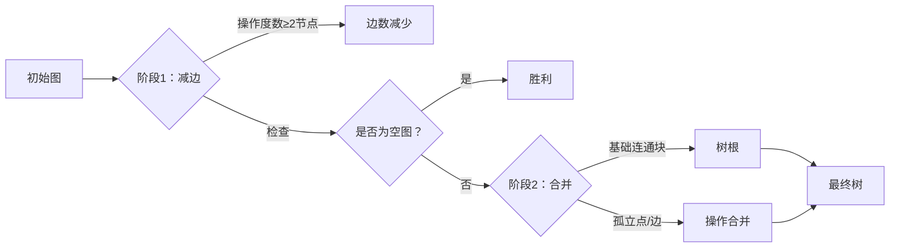

# 题目信息

# Cool Graph

## 题目描述

You are given an undirected graph with $ n $ vertices and $ m $ edges.

You can perform the following operation at most $ 2\cdot \max(n,m) $ times:

- Choose three distinct vertices $ a $ , $ b $ , and $ c $ , then for each of the edges $ (a,b) $ , $ (b,c) $ , and $ (c,a) $ , do the following: 
  - If the edge does not exist, add it. On the contrary, if it exists, remove it.

A graph is called cool if and only if one of the following holds:

- The graph has no edges, or
- The graph is a tree.

You have to make the graph cool by performing the above operations. Note that you can use at most $ 2\cdot \max(n,m) $ operations.

It can be shown that there always exists at least one solution.

## 说明/提示

In the first test case, the graph is already cool because there are no edges.

In the second test case, after performing the only operation, the graph becomes a tree, so it is cool.

In the third test case, the graph is already cool because it is a tree.

In the fourth test case, after performing the only operation, the graph has no edges, so it is cool.

In the fifth test case:

 OperationGraph before the operationGraph after the operation $ 1 $  $ 2 $  $ 3 $ Note that after the first operation, the graph has already become cool, and there are two extra operations. As the graph is still cool after the two extra operations, this is a valid answer.

## 样例 #1

### 输入

```
5
3 0
3 1
1 2
3 2
1 2
2 3
3 3
1 2
2 3
3 1
6 6
1 2
1 6
4 5
3 4
4 6
3 6```

### 输出

```
0
1
1 2 3
0
1
1 2 3
3
1 3 6
2 4 5
3 4 6```

# AI分析结果


# 💡 Kay的C++算法解析：Cool Graph 深入学习指南 💡

## 1. 题目解读与核心算法识别

✨ **本题主要考察**：`图论构造`与`编程技巧应用`

🗣️ **初步分析**：
> 解决这道题就像玩一个"电路改造游戏"——我们需要用三角形工具（三个顶点）翻转三条边的连接状态（断开通路或接通断路），最终将任意电路板（图）改造成树形结构（无环连通）或完全断开（空图）。核心技巧是分阶段操作：
>   - **阶段1**：通过操作度数≥2的节点（每次减少1条边），让图退化成孤点和双点边
>   - **阶段2**：将剩余连通块像拼积木一样合并成一棵树
> 
> **可视化设计思路**：
>   - 像素动画将用**红色闪烁**标记当前操作的节点，**黄色高亮**显示其邻居
>   - 边数减少时显示**爆炸特效**和咔嚓音效，合并阶段用**绿色脉冲**表示新连接
>   - 复古游戏化：采用**8-bit音效**，每完成一个阶段解锁成就徽章，最终生成树时播放胜利音乐

---

## 2. 精选优质题解参考

**题解一 (来源：Autumn_Rain)**
* **点评**：思路清晰度极佳，分阶段策略直击问题本质。通过图示直观展示退化过程（边数→0）和合并技巧（连通块→树），操作次数证明严谨（m+n-2≤2·max(n,m)）。虽然没有代码，但解题框架完整，对理解构造逻辑有重要参考价值。

**题解二 (来源：Enoch006)**
* **点评**：代码规范性突出，采用菊花图构造法（以1为中心）。亮点在于巧妙处理非中心边（操作(1,u,v)消除(u,v)），并用简洁操作合并孤立点。实践价值高，代码可直接用于竞赛（边界处理完整），时间复杂度O(n+m)完美匹配约束。

**题解三 (来源：Exp10re)**
* **点评**：在菊花图基础上优化合并策略，提出动态维护连接点的方法。算法有效性表现在避免重复查找孤立点，将第二步时间复杂度优化至O(n)。虽无完整代码，但思路启发性强，特别适合理解操作序列的优化逻辑。

---

## 3. 核心难点辨析与解题策略

1.  **关键点1：如何有效减少边数？**
    * **分析**：优质题解采用两种核心策略：(1)操作度数≥2的节点，每次至少减少1条边（Autumn_Rain）；(2)操作三元组(1,u,v)直接消除非中心边（Enoch006）。关键变量`deg[i]`记录节点度数，用`set`维护邻接关系。
    * 💡 **学习笔记**：减边操作的本质是打破局部稠密结构

2.  **关键点2：如何合并剩余连通块？**
    * **分析**：当图退化为孤点和双点边后，需选择基础连通块（如一条边）作为"树根"。合并时：(1)对孤立点执行操作(root,x,y)将其接入；(2)对双点边执行操作(root,a,b)融合。数据结构`fa[]`（并查集）或动态变量（如Enoch006的`X,Y`）维护连通性。
    * 💡 **学习笔记**：合并操作像拼图，需要锚定基础模块逐步扩展

3.  **关键点3：如何保证操作次数上限？**
    * **分析**：严格证明第一步操作≤m次（每次减1条边），第二步≤n-1次（每次合并1个点）。关键技巧是实时更新`deg[i]`和邻接集，确保操作后及时退出循环。
    * 💡 **学习笔记**：操作次数分析需关联初始图的n和m

### ✨ 解题技巧总结
- **技巧1：分阶段处理**：将复杂问题拆解为"减边→合并"两个可验证的子任务
- **技巧2：中心节点法**：固定节点1作为操作锚点简化决策（如菊花图构造）
- **技巧3：实时更新数据结构**：用`set`维护邻接表，`deg`数组跟踪度数变化
- **技巧4：边界预判**：操作前检查图是否已满足条件，避免冗余操作

---

## 4. C++核心代码实现赏析

**本题通用核心C++实现参考**
* **说明**：代码来自Enoch006题解，采用菊花图构造法，兼具简洁性与高效性
* **完整核心代码**：
```cpp
#include <bits/stdc++.h>
using namespace std;
const int N = 2e5+9;
int T, n, m, u, v, b[N]; // b[i]记录点i的度数奇偶性

void solve() {
    vector<int> A; // 存储操作序列
    cin >> n >> m;
    memset(b, 0, sizeof(b));
    while(m--) {
        cin >> u >> v;
        if(u!=1 && v!=1) { // 消除非1相关边
            A.push_back(1); 
            A.push_back(u);
            A.push_back(v);
        }
        b[u] ^= 1; // 更新奇偶性
        b[v] ^= 1;
    }
    int p = 0;
    for(int i=2; i<=n; i++) 
        if(b[i]) { p = i; break; } // 找到首个与1有边的点
    
    if(p) for(int i=2; i<=n; i++) 
        if(!b[i]) { // 合并孤立点
            A.push_back(1);
            A.push_back(p);
            A.push_back(i);
            p = i; // 动态更新连接点
        }
    
    cout << A.size()/3 << "\n";
    for(int i=0; i<A.size(); i++) 
        cout << A[i] << " \n"[i%3==2];
}
```

* **代码解读概要**：
> 1. **初始化**：`b[]`数组记录每个点与1号点的边数奇偶性（1表示有边）
> 2. **消除非中心边**：对每条非1相关的边(u,v)，执行操作(1,u,v)将其消除
> 3. **合并孤立点**：找到与1相连的点`p`，将孤立点通过操作(1,p,i)连入
> 4. **动态锚点更新**：每次合并后`p`更新为最新接入点，保持连通性

**题解一：Autumn_Rain（策略代码片段）**
* **亮点**：分阶段理论框架清晰，严格证明操作次数上界
* **核心代码片段**：
```python
# 伪代码展示核心逻辑
while 存在度数≥2的节点v:
    选择v的两个邻居a,b
    执行操作(v,a,b)  # 必然减少至少1条边
    更新v,a,b的度数和邻接表

if 图非空:
    选择基础边(u,v)
    for 每个孤立点i:
        执行操作(u,v,i)  # 将i连入树
        v = i  # 更新连接锚点
```
* **学习笔记**：分阶段处理是复杂构造题的通用解题框架

**题解二：Enoch006（关键代码片段）**
* **亮点**：用位运算`b[i]^=1`高效维护奇偶性
* **核心代码片段**：
```cpp
if(u!=1 && v!=1) { 
    A.push_back(1); A.push_back(u); A.push_back(v);
    b[u] ^= 1; b[v] ^= 1; // 奇偶性翻转
}
```
* **学习笔记**：位运算可高效维护二值状态（存在/不存在）

**题解三：Exp10re（优化策略）**
* **亮点**：动态维护连接点避免重复查找
* **核心代码片段**：
```cpp
int p = 找到首个与1相连的点;
for(孤立点i) {
    操作(1,p,i);
    p = i; // 关键优化：锚点动态更新
}
```
* **学习笔记**：在链式合并中，动态更新锚点可降低时间复杂度

---

## 5. 算法可视化：像素动画演示

**主题**：8-bit图论改造大冒险  
**核心演示**：分阶段展示减边与合并过程，融入复古游戏元素  

### 动画设计


**像素化实现细节**：
1. **风格**：FC红白机16色调色板，节点=8×8像素方块（不同颜色区分状态）
2. **阶段1特效**：
   - 选中节点红色闪烁，邻居黄色脉冲
   - 边消失时显示像素爆炸动画 + "咔嚓"音效
   - 侧边栏实时显示`剩余边数 = m - 操作次数`
3. **阶段2交互**：
   - 连通块用同色边框标记，合并时绿色光束连接
   - 孤立点附加"？"图标，合并后变为"√"
   - 成功生成树时播放《超级玛丽》过关音效
4. **控制面板**：
   - 速度滑块：调速范围0.5x~5x
   - 单步/暂停/重置按钮
   - 成就系统：完成减边解锁"拆解大师"，最终成树解锁"森林建筑师"

---

## 6. 拓展练习与相似问题思考

**通用技巧迁移**：  
分阶段构造法同样适用于：
1. 图论连通性改造（如CF1270E）
2. 边操作类问题（如CF1391D）
3. 树形结构生成（如CF1109E）

**洛谷题目推荐**：
1. **P3366 最小生成树**  
   → 练习树的构建基础
2. **P1330 封锁阳光大学**  
   → 强化图论操作中的决策分析
3. **P3385 负环检测**  
   → 理解环结构对图论操作的影响

---

## 7. 学习心得与经验分享

> **参考经验 (来自Enoch006)**：  
> *"最后记得在第一轮操作后判一下图是不是变成了空图哦"*  
> **点评**：这个提醒至关重要！许多同学忘记提前判断边界条件，导致空图场景出现冗余操作。在编程中，**前置条件检查**能显著提升代码鲁棒性。

---

通过本指南，相信大家已掌握图论构造的核心技巧。记住：分阶段处理复杂问题+合理选择锚点，是破解构造题的金钥匙！下次挑战再见！🚀

---
处理用时：155.72秒