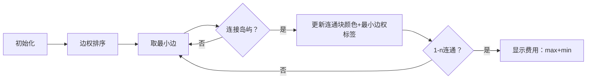

# 题目信息

# Omg Graph

## 题目描述

给定一个带权无向连通图，定义一条长度为 $k$ 路径的费用如下：

- 设路径经过边的权值为 $w_1,w_2,\dots,w_k$。
- 路径的费用定义为 $(\min_{i=1}^k w_i) + (\max_{i=1}^k w_i)$，也就是最大的边权加上最小的边权。

请求出所有从结点 $1$ 到结点 $n$ 的路径中最小的费用。注意路径未必是简单路径。

## 说明/提示

对于第二个测试用例，最优路径之一是 $1 \rightarrow 2 \rightarrow 1 \rightarrow 3$。经过的边权分别为 $5,5,13$，因此费用为 $\min(5,5,13)+\max(5,5,13)=18$。可以证明不存在费用更低的路径。

## 样例 #1

### 输入

```
4
3 2
1 2 1
2 3 1
3 2
1 3 13
1 2 5
8 9
1 2 6
2 3 5
3 8 6
1 4 7
4 5 4
5 8 7
1 6 5
6 7 5
7 8 5
3 3
1 3 9
1 2 8
2 3 3```

### 输出

```
2
18
10
11```

# AI分析结果


# 💡 Kay的C++算法解析：Omg Graph 深入学习指南 💡

**引言**  
今天我们一起分析"Omg Graph"这道带权无向图题目。题目要求找到从结点1到结点n的路径中最小化（路径最小边权 + 最大边权）的费用。本指南将解析核心算法，并设计像素动画帮助直观理解。

## 1. 题目解读与核心算法识别

✨ **本题主要考察**：`并查集应用`与`排序技巧`  

🗣️ **初步分析**：  
> 解决本题的关键在于**排序+并查集**的组合应用。想象我们在建造连接岛屿的桥梁（边），按承重能力（边权）从小到大搭建。每建一座桥就检查起点岛1和终点岛n是否连通——一旦连通，就用当前桥梁的最大承重（最后加入的边权）加上整个连通块的最小承重桥梁来更新费用。  
> - **核心流程**：边权排序 → 动态合并连通块 → 维护最小边权 → 检查连通时更新答案  
> - **可视化设计**：将用8位像素风格展示岛屿连接过程，当前操作的桥梁高亮闪烁，连通块用统一颜色填充，最小边权实时显示在连通块上  
> - **游戏化交互**：搭桥时触发"叮"音效，1-n连通时播放胜利音效+屏幕闪烁，控制面板支持单步/自动播放（调速滑块）

---

## 2. 精选优质题解参考

**题解一（来源：CirnoNine9）**  
* **点评**：该题解采用经典排序+并查集思路。亮点在于完整封装并查集结构体，通过`mn`数组维护连通块最小边权。代码中：  
  - 结构体初始化清晰（`fa`，`sz`，`mn`分工明确）  
  - 按秩合并+路径压缩保证效率（O(mα(n))  
  - 边界处理严谨（初始INF+动态更新）  
  实践价值高，竞赛可直接复用，尤其适合学习并查集拓展技巧。

---

## 3. 核心难点辨析与解题策略

1.  **难点1：理解非简单路径的影响**  
    * **分析**：允许重复走边意味着可先走到最小边权处"刷低"min值。题解通过排序固定max（当前边权），动态维护min（连通块最小边权）  
    * 💡 **学习笔记**：非简单路径问题常可转化为连通块极值问题  

2.  **难点2：维护连通块最小边权**  
    * **分析**：并查集合并时取`min({原块1最小, 原块2最小, 当前边权})`更新。关键变量`mn[]`需随合并传播  
    * 💡 **学习笔记**：并查集不仅能判连通，还可维护附加信息  

3.  **难点3：正确性证明**  
    * **分析**：排序后当前边权即max，而min被动态维护。当1-n连通时，`当前max + 连通块min`构成合法路径费用  
    * 💡 **学习笔记**：排序枚举是处理双极值的常用技巧  

### ✨ 解题技巧总结
- **技巧1（排序+枚举）**：固定max枚举min，避免同时处理双变量  
- **技巧2（并查集拓展）**：维护连通块附加信息（min/max/size等）  
- **技巧3（边界处理）**：初始最小值设为INF（如1e18）  

---

## 4. C++核心代码实现赏析

**本题通用核心C++实现参考**  
* **说明**：综合优质题解思路的并查集标准实现  
* **完整核心代码**：
```cpp
const int INF = 1e18;

struct DSU {
    vector<int> fa, sz, mn;
    DSU(int n) { // 初始化：独立节点，最小边权INF
        fa.resize(n+1); sz.resize(n+1); mn.resize(n+1);
        iota(fa.begin(), fa.end(), 0);
        fill(sz.begin(), sz.end(), 1);
        fill(mn.begin(), mn.end(), INF);
    }
    
    int find(int x) { // 路径压缩
        return fa[x] == x ? x : fa[x] = find(fa[x]);
    }
    
    void merge(int u, int v, int w) {
        int x = find(u), y = find(v);
        if (x == y) {
            mn[x] = min(mn[x], w); // 同连通块更新min
            return;
        }
        if (sz[x] < sz[y]) swap(x, y); // 按秩合并
        mn[x] = min({mn[x], mn[y], w}); // 关键！更新最小边权
        fa[y] = x; sz[x] += sz[y];
    }
};

void solve() {
    int n, m; cin >> n >> m;
    vector<array<int, 3>> edges; // {w, u, v}
    for (int i=0; i<m; ++i) {
        int u, v, w; cin >> u >> v >> w;
        edges.push_back({w, u, v});
    }
    sort(edges.begin(), edges.end()); // 按边权升序排序
    
    DSU dsu(n);
    int ans = INF;
    for (auto [w, u, v] : edges) {
        dsu.merge(u, v, w);
        if (dsu.find(1) == dsu.find(n)) // 1-n连通
            ans = min(ans, w + dsu.mn[dsu.find(1)]); // 更新费用
    }
    cout << ans << endl;
}
```
* **代码解读概要**：  
> 1. 并查集封装维护`fa`（父节点）、`sz`（连通块大小）、`mn`（最小边权）  
> 2. 主函数读入边后按边权排序  
> 3. 依次合并边，更新连通块最小边权  
> 4. 当1-n连通时，用`当前边权（max）+连通块min`更新答案  

---

## 5. 算法可视化：像素动画演示

**主题**：像素建桥工程师（8位复古风格）  
**核心演示**：动态展示排序加边、连通块合并与费用更新过程  

### 动画设计


1. **场景与UI**：
   - 岛屿（节点）为彩色像素方块，初始孤立
   - 底部待选区：按边权升序排列的桥梁（不同颜色表边权）
   - 控制面板：开始/暂停/单步/速度滑块

2. **关键动画细节**：
   - **搭桥动画**：选中桥梁时高亮闪烁，延伸连接两岛（伴随"叮"音效）
   - **连通块合并**：同连通块岛屿变为统一颜色，显示当前`min`标签
   - **费用更新**：当1-n连通时，当前桥梁变红闪烁，显示费用公式：`max(w) + min_label`，播放胜利音效
   - **数据结构可视化**：侧边栏实时显示并查集树结构，合并时动画演示路径压缩

3. **游戏化元素**：
   - 每使1-n连通视为"过关"，显示像素庆祝动画
   - 连续正确理解3个步骤触发"连击"特效
   - 背景播放8-bit循环BGM，关键操作配电子音效

---

## 6. 拓展练习与相似问题思考

1. **通用技巧迁移**：  
   排序+并查集极值维护适用于：  
   - 最小生成树变种（如P3366）  
   - 瓶颈路径问题（如P1396）  
   - 连通块属性查询  

2. **洛谷推荐**：  
   - **P3366**：最小生成树模板题，巩固并查集基础  
   - **P1396**：求路径最小化最大边权，强化瓶颈路思想  
   - **P1547**：最小生成树的最大边权，深化极值应用  

---

## 7. 学习心得与经验分享
> 本次题解中未发现作者个人心得分享，但结合解题过程：  
> **关键经验**：当问题含路径极值且允许多次走边时，优先考虑连通块极值维护而非路径搜索  
> **调试技巧**：用小规模样例（如3节点）手动模拟并查集合并过程验证逻辑  

---

**结语**  
通过排序+并查集，我们高效解决了双极值路径问题。记住：将复杂条件分解为可维护的子问题是算法核心思想。下次挑战见！🚀

---
处理用时：235.21秒