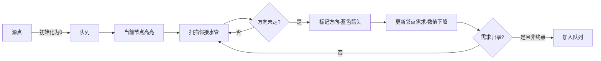

# 题目信息

# Flawed Flow

## 题目描述

Emuskald considers himself a master of flow algorithms. Now he has completed his most ingenious program yet — it calculates the maximum flow in an undirected graph. The graph consists of $ n $ vertices and $ m $ edges. Vertices are numbered from 1 to $ n $ . Vertices $ 1 $ and $ n $ being the source and the sink respectively.

However, his max-flow algorithm seems to have a little flaw — it only finds the flow volume for each edge, but not its direction. Help him find for each edge the direction of the flow through this edges. Note, that the resulting flow should be correct maximum flow.

More formally. You are given an undirected graph. For each it's undirected edge ( $ a_{i} $ , $ b_{i} $ ) you are given the flow volume $ c_{i} $ . You should direct all edges in such way that the following conditions hold:

1. for each vertex $ v $ $ (1&lt;v&lt;n) $ , sum of $ c_{i} $ of incoming edges is equal to the sum of $ c_{i} $ of outcoming edges;
2. vertex with number $ 1 $ has no incoming edges;
3. the obtained directed graph does not have cycles.

## 说明/提示

In the first test case, 10 flow units pass through path , and 5 flow units pass directly from source to sink: .

## 样例 #1

### 输入

```
3 3
3 2 10
1 2 10
3 1 5
```

### 输出

```
1
0
1
```

## 样例 #2

### 输入

```
4 5
1 2 10
1 3 10
2 3 5
4 2 15
3 4 5
```

### 输出

```
0
0
1
1
0
```

# AI分析结果


# 💡 Kay的C++算法解析：Flawed Flow 深入学习指南 💡

**引言**  
今天我们一起分析"Flawed Flow"这道图论题目。本题要求将无向图中的边定向，满足流量守恒、无环等条件。本指南将详解核心算法原理、实现技巧，并通过像素动画帮助大家直观理解算法过程。

---

## 1. 题目解读与核心算法识别

✨ **本题主要考察**：`图论` + `拓扑排序应用`

🗣️ **初步分析**  
> 本题可类比为"水流管道定向"问题：给定管道网络（无向图），我们需要将每条管道标记流向，使中转站（非源/汇点）的流入等于流出，且整个网络无循环水流。核心思想是**拓扑排序**——从源点开始逐层确定流向，如同水流自然扩散。

- **题解思路**：计算每个点流量需求（相邻边权和/2），从源点BFS遍历，确定边方向并更新邻点流量需求
- **核心难点**：理解流量守恒的数学本质（非源/汇点流量需求=边权和/2），以及如何通过BFS实现无环定向
- **可视化设计**：动画将用像素水流效果展示BFS过程，当前处理节点高亮为黄色，已定向边显示蓝色箭头，流量需求变化实时显示。采用8位音效（水流声、完成音效）增强沉浸感

---

## 2. 精选优质题解参考

**题解一：灵茶山艾府 (5星)**  
* **点评**：思路最清晰的典范。将流量需求计算（total_flow/2）与拓扑排序BFS完美结合。代码中：
  - 用`f[]`数组记录各点剩余流量需求
  - BFS从源点开始，每确定一条边`u->v`，就将`f[v]`减去该边流量
  - 当非汇点的`f[v]`归零时加入队列
  **亮点**：变量命名精准（`f`表示flow需求），边界处理严谨（跳过汇点），空间复杂度O(n)最优

**题解二：OIer_ACMer (4星)**  
* **点评**：采用链式前向星存图，通过`liuliang[]`数组（初始为2倍流量需求）和`flag`标记实现。核心亮点：
  - 每次定向后`liuliang[v] -= 2*c`的数学设计
  - 详细中文注释帮助理解  
  **注意点**：减2c的思路需深入理解（初始值=2倍需求，每次确定方向消除1个流入+1个流出需求）

**题解三：SFlyer (4星)**  
* **点评**：最简洁的C++实现。关键创新：
  - 方向标记存储于`ans[]`数组，避免复杂数据结构
  - 用`deg[]`命名流量需求，物理意义明确
  - 显式处理源点`deg[1]=0`
  **亮点**：14行核心逻辑清晰呈现算法本质，适合竞赛快速编码

---

## 3. 核心难点辨析与解题策略

1. **难点1：流量守恒的数学转化**  
   *分析*：非源/汇点需满足`入流=出流`。设点v的相邻边权和为S，则其流量需求`f[v]=S/2`。优质题解都通过`f[v]=total_flow/2`初始化  
   💡 **学习笔记**：`f[v]`本质是v还需"接收的净流量"

2. **难点2：无环条件的拓扑实现**  
   *分析*：BFS从源点开始，总向未处理节点扩散。每次确定边方向`u->v`后更新`f[v]`，确保不会反向形成环  
   💡 **学习笔记**：拓扑序天然避免环路，类似"水流只从高往低"

3. **难点3：源/汇点的特殊处理**  
   *分析*：源点无入边故`f[1]=0`直接开始BFS；汇点不参与守恒计算，即使`f[n]≠0`也不入队  
   💡 **学习笔记**：源点是水流起点，汇点是终点，二者不受守恒约束

### ✨ 解题技巧总结
- **技巧1：需求驱动定向**：将边定向转化为"满足邻点流量需求"问题
- **技巧2：拓扑BFS框架**：队列存储已平衡节点，逐步扩散到全图
- **技巧3：增量更新**：每确定一条边，立即更新邻点需求（减c或2c）
- **技巧4：双向边标记**：用`(id, id+m)`标记无向边的两个方向

---

## 4. C++核心代码实现赏析

### 本题通用核心C++实现
```cpp
#include <bits/stdc++.h>
using namespace std;
const int N = 2e5+5;

struct Edge { int to, c, id; };
vector<Edge> g[N];
int n, m, f[N], ans[N];

int main() {
    cin >> n >> m;
    for (int i=1; i<=m; ++i) {
        int u, v, c; cin >> u >> v >> c;
        g[u].push_back({v, c, i});
        g[v].push_back({u, c, i+m}); // 反向边id
        f[u] += c; f[v] += c;       // 累加边权
    }
    for (int i=2; i<n; ++i) f[i] /= 2; // 非源/汇点需求减半
    f[1] = 0; // 源点无入边需求

    queue<int> q;
    q.push(1);
    while (!q.empty()) {
        int u = q.front(); q.pop();
        for (auto e : g[u]) {
            if (ans[e.id] != 0) continue; // 已定向则跳过
            ans[e.id] = (e.id <= m) ? 0 : 1; // 标记方向
            f[e.to] -= e.c;              // 更新邻点需求
            if (e.to != n && f[e.to] == 0) // 非汇点且平衡
                q.push(e.to);
        }
    }
    for (int i=1; i<=m; ++i) 
        cout << ans[i] << '\n';
}
```
* **代码解读概要**：  
  1. 读入无向图，用`g`存储邻接表，`f`累计边权和  
  2. 非源/汇点需求减半，源点需求归零  
  3. BFS从源点开始：对每条未定向边标记方向，更新邻点需求  
  4. 当邻点需求归零（且非汇点）时入队  
  5. 输出所有边的方向标记

---

### 优质题解片段赏析

**题解一：灵茶山艾府（Go转C++风格）**  
```cpp
// 初始化后核心循环：
q.push(1);
while (!q.empty()) {
    int u = q.front(); q.pop();
    for (auto e : g[u]) {
        if (ans[e.id] != -1) continue;
        ans[e.id] = e.d;         // d为预存方向(0/1)
        f[e.to] -= e.c;          // 更新邻点需求
        if (e.to != n && f[e.to] == 0)
            q.push(e.to);
    }
}
```
* **代码解读**：  
  > `ans[e.id]=e.d`巧用建图时预存的方向标记。`f[e.to]-=e.c`体现"需求减少c"的核心思想。当邻点需求归零且非汇点时，说明其流入已满足，可继续处理出边  
  💡 **学习笔记**：预存方向标记可避免运行时判断

**题解二：OIer_ACMER**  
```cpp
// 确定方向后更新：
liuliang[v] -= 2 * e.w; 
dirc[e.id] = e.d;
if (!liuliang[v] && v != n) 
    q.push(v);
```
* **代码解读**：  
  > 为什么减`2*c`？初始`liuliang[v]`=2倍需求，确定方向`u->v`意味着：  
  - 对v：获得`c`流入（需求-c）  
  - 对v：失去`c`流出可能（需求-c）  
  共减`2c`。当`liuliang[v]`归零表示v的流量平衡  
  💡 **学习笔记**：2倍需求设计可统一处理入/出流量

**题解三：SFlyer**  
```cpp
deg[1] = 0; // 源点无需求
q.push(1);
while (!q.empty()) {
    int u = q.front(); q.pop();
    for (auto [v, c, id] : g[u]) {
        if (deg[v] == 0) continue;
        ans[id>m ? id-m : id] = (id>m); // 方向判断
        deg[v] -= c;
        if (deg[v] == 0 && v != n) 
            q.push(v);
    }
}
```
* **代码解读**：  
  > `ans[id>m ? id-m : id] = (id>m)` 巧妙利用反向边id>m的特性，压缩方向存储。`deg[1]=0`确保源点率先入队  
  💡 **学习笔记**：利用反向边ID特征可省略方向标记字段

---

## 5. 算法可视化：像素动画演示

* **主题**：”水管工大冒险“ - 8位像素风格水流定向模拟  
* **核心演示**：BFS拓扑排序确定水管方向的过程  

### 动画设计


1. **像素场景**：  
   - 节点：16x16像素方块（源点绿色，汇点红色，普通点蓝色）  
   - 边：灰色管道，定向后变蓝色箭头管道  
   - 控制面板：开始/暂停/单步/重置按钮，速度滑块  

2. **关键动画**：  
   - **步骤1**：源点闪烁绿光入队（音效：水滴声）  
   - **步骤2**：当前处理节点u亮黄光，扫描邻边（音效：扫描声）  
   - **步骤3**：确定方向`u->v`时：  
     * 管道显示蓝色流动动画（音效：水流声）  
     * 节点v上方显示`f[v]-=c`（红色数字下降）  
   - **步骤4**：当v需求归零时：  
     * v节点闪烁白光（音效：叮~）  
     * 加入队列（音效：入队声）  

3. **游戏化元素**：  
   - 每完成一个节点，右上角+100分  
   - 所有边定向后，播放胜利音乐（8-bit风格）  
   - 支持"AI自动演示"（类似贪吃蛇AI自动闯关）  

---

## 6. 拓展练习与相似问题

* **通用技巧迁移**：  
  拓扑排序+BFS的需求满足框架还可用于：  
  1. 课程表问题（判断依赖关系能否满足）  
  2. 任务调度（按依赖顺序执行）  
  3. 电网负载分配（类似流量定向）  

* **洛谷练习推荐**：  
  1. **P1113 拓扑排序**  
     🗣️ *推荐理由*：基础拓扑排序应用，巩固队列实现  
  2. **P1347 网络延迟**  
     🗣️ *推荐理由*：结合最短路与拓扑排序，拓展BFS应用  
  3. **P4016 负载平衡问题**  
     🗣️ *推荐理由*：流量分配类问题，强化需求分析能力  

---

## 7. 学习心得与经验分享

> **参考经验 (来自 OIer_ACMer)**：  
> “我在理解`liuliang[v] -= 2*c`时卡了很久，后来画图模拟小数据才明白：初始值2X包含入/出需求各X，定向一条边同时消除1单位入需求和1单位出需求。”  
>  
> **点评**：  
> 这位同学的调试经验极具价值！**当算法难以理解时，构造最小测试案例（如3个点）逐步模拟是最有效的学习方式**。这也提醒我们：  
> - 对数学推导要追溯物理意义  
> - 边界情况（如n=2）必须单独验证  

---

**结语**  
通过本次分析，我们掌握了图定向问题的拓扑排序解法与流量需求计算的核心思想。记住：**好的算法如同水流——寻找阻力最小的路径自然前进**。继续用BFS思维探索更多算法吧！💪

---
处理用时：344.19秒