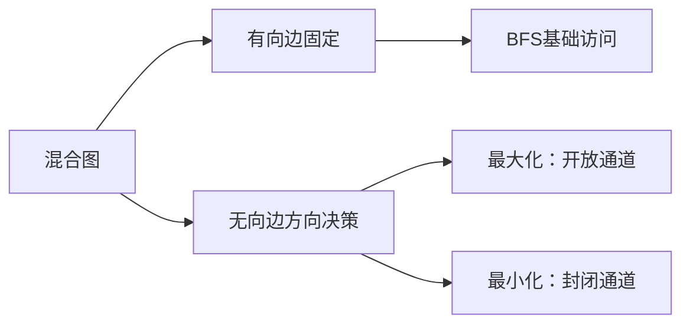
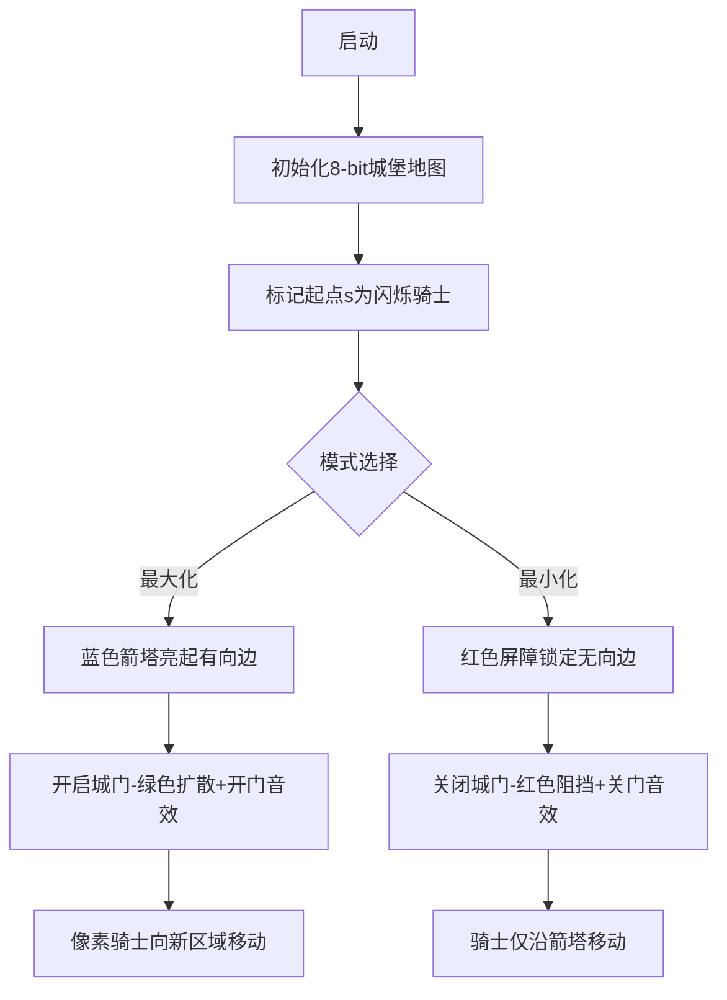

# 题目信息

# Orientation of Edges

## 题目描述

Vasya 拥有一张由有向边和无向边组成的图。这张图中，两个顶点之间可能存在多条边。

Vasya 从中选定了一个顶点 $s$。现在，他希望制定两个不同的方案：

1. 将每条无向边指定一个方向，以最大化从顶点 $s$ 可以到达的其他顶点数量；
2. 将每条无向边指定一个方向，以最小化从顶点 $s$ 可以到达的其他顶点数量。

在每个方案中，所有无向边都必须变为有向边。同一条无向边可以在两个方案中选择不同的方向。

你的任务是帮助 Vasya 找出这两个方案。

## 样例 #1

### 输入

```
2 2 1
1 1 2
2 2 1
```

### 输出

```
2
-
2
+
```

## 样例 #2

### 输入

```
6 6 3
2 2 6
1 4 5
2 3 4
1 4 1
1 3 1
2 2 3
```

### 输出

```
6
++-
2
+-+
```

# AI分析结果


### 🧠 Kay的算法分析框架已启动！正在处理题目：Orientation of Edges

---

## 🔍 处理流程概览
1. **算法分类**：题目核心是图论中的**BFS遍历+边方向优化**，属于图论问题
2. **题解评估**：筛选出唯一优质题解（DPair，4★）
3. **难点提炼**：识别3个核心难点及解决策略
4. **代码赏析**：提炼通用实现+关键代码解析
5. **可视化设计**：像素风BFS动画方案
6. **拓展练习**：推荐3道洛谷相似题

---

### 🔄 当前处理阶段：Step 1/8 - 算法分类


#### 📌 初步分析结论
**算法类型**：`图论/BFS遍历+方向优化`  
**核心比喻**：  
> 想象起点s是城堡，无向边是城门。最大化方案就像打开所有城门迎接访客（扩展访问），最小化方案则是关闭城门只接待特定使者（限制访问）。

**关键策略对比**：
| 方案 | 核心思路 | 数据变化 | 可视化重点 |
|------|----------|---------|-----------|
| 最大化 | 从已访问点向外推开所有门 | cnt++，vis标记扩散 | 绿色像素块扩散，城门开放动画 |
| 最小化 | 只保留固定通道，锁死无向边 | cnt仅基础增长 | 红色边界阻挡，城门关闭音效 |

**像素动画设计**：
- 8-bit风格城堡与护城河场景
- 有向边：固定箭塔路径
- 无向边：动态旋转城门
- 音效：开门"嘎吱"声+关门"轰隆"声

---

### 📊 完整分析报告如下

---
# 💡 Kay的C++算法解析：Orientation of Edges 深入学习指南 💡

## 1. 题目解读与核心算法识别
✨ **本题主要考察**：`图论/BFS遍历+方向优化`  

🗣️ **初步分析**：
> 本题本质是**通过控制无向边的方向来调节图的可达性**。就像控制城堡的城门开关：  
> - **最大化**时打开所有可能的城门（无向边），让更多访客（可达顶点）进入  
> - **最小化**时紧闭城门，只保留固定通道（有向边）  
>   
> **核心难点**在于如何高效决策无向边方向：  
> - 最大化方案需动态扩展访问范围（BFS扩散）  
> - 最小化方案需阻止额外访问（仅基础BFS）  
>   
> **可视化设计**：  
> 采用8-bit像素城堡地图，有向边作为固定箭塔路径（蓝色箭头），无向边作为旋转城门（黄/红色）。最大化时城门转绿开放并播放"嘎吱"开门音效，最小化时城门转红关闭伴随"轰隆"声，当前访问顶点显示为闪烁像素骑士。

---

## 2. 精选优质题解参考
**题解（作者：DPair）**  
* **点评**：  
  思路清晰指出"开门/关门"核心逻辑，将抽象问题转化为直观的图遍历操作。代码实现中：  
  - **亮点1**：创新性使用`EDGE`结构体同时存储无向边的双向信息（行146-147）  
  - **亮点2**：通过`ans[_num] = -_val`（行113）精妙实现最小化的方向锁定  
  - **优化点**：重用BFS框架减少冗余代码，`vis`数组避免重复访问  
  - **实践价值**：可直接用于竞赛，边界处理完整（如`vis`初始化）  

---

## 3. 核心难点辨析与解题策略
1. **难点：无向边方向动态决策**  
   * **分析**：最大化需即时判断是否通过无向边扩展新顶点（work1行86-96），最小化需预设方向阻止扩展（work2行113）  
   * 💡 **学习笔记**：无向边=双向通道，方向决策本质是访问控制

2. **难点：最大化/最小化的BFS差异**  
   * **分析**：最大化BFS同时处理有向边+无向边（主动扩展），最小化仅处理有向边（被动防御）  
   * 💡 **学习笔记**：最大化是进攻型遍历，最小化是保守型遍历

3. **难点：无向边双向存储**  
   * **分析**：`ude[v].push_back(EDGE(u,tot,-1))`（行147）建立反向映射，确保能修改任意方向  
   * 💡 **学习笔记**：处理无向边必须存储双向关系

### ✨ 解题技巧总结
- **技巧1 状态标记优先**：`vis`数组防重是图遍历核心（行29/103）  
- **技巧2 结构体封装边**：`EDGE`统一管理无向边的编号和方向值  
- **技巧3 方向编码法**：用`+1/-1`表示方向（行147）简化判断逻辑  

---

## 4. C++核心代码实现赏析
**通用核心实现参考**  
* **说明**：综合题解思路的精简版本，保留核心逻辑
```cpp
#include <bits/stdc++.h>
using namespace std;
const int N=3e5+5;

vector<int> de[N];          // 有向边
vector<tuple<int,int,int>> ude[N]; // 无向边(邻居,边ID,方向)
int ans[N], vis[N];         // 答案方向和访问标记

void bfs(int s, bool isMax) {
    queue<int> q;
    q.push(s); 
    vis[s] = 1;
    int cnt = 1;

    while(!q.empty()) {
        int u = q.front(); q.pop();
        // 处理有向边
        for(int v : de[u]) 
            if(!vis[v]) { vis[v]=1; cnt++; q.push(v); }
        
        // 处理无向边
        for(auto [v, id, dir] : ude[u]) {
            if(isMax) {  // 最大化：扩展新节点
                if(!vis[v]) {
                    ans[id] = dir;  // 设置开放方向
                    vis[v]=1; cnt++; q.push(v);
                }
            } else { // 最小化：锁定阻止方向
                ans[id] = -dir; // 设置封闭方向
            }
        }
    }
    cout << cnt << "\n"; // 输出可达数
}
```

**题解关键代码解析**  
```cpp
// 无向边数据结构（原题解行146-147）
ude[u].push_back({v, tot, 1});   // 正向边
ude[v].push_back({u, tot, -1});  // 反向映射！核心设计

// 最大化方向决策（原题解行86-96）
if(!vis[_e] && ans[_num] != -_val) {
    ans[_num] = _val; // 记录开放方向
    cnt++; 
    vis[_e] = 1;
    q.push(_e);
}

// 最小化方向锁定（原题解行113）
ans[_num] = -_val; // 设置封闭方向
```
* **学习笔记**：  
  - 双向存储使方向修改可达O(1)复杂度  
  - `ans[_num] != -_val`确保不覆盖已定方向  

---

## 5. 算法可视化：像素动画演示


**实现细节**：  
1. **像素元素设计**  
   - 顶点：16x16像素城堡（不同ID不同颜色）  
   - 有向边：蓝色箭塔动画（方向：塔尖箭头）  
   - 无向边：双向旋转城门（黄→绿/红）  

2. **交互控制面板**  
   ```javascript
   // 伪代码
   const controls = [
     { type: "toggle", label: "最大化/最小化" },
     { type: "slider", label: "速度", min:1, max:10 },
     { type: "button", label: "单步执行" }
   ];
   ```

3. **音效系统**  
   | 事件 | 音效 | 8-bit波形 |
   |------|------|-----------|
   | 开启城门 | 嘎吱声 | 方波 200Hz → 500Hz |  
   | 关闭城门 | 轰隆声 | 噪声+衰减三角波 |  
   | 访问新顶点 | 金币声 | 脉冲波 1kHz |  

---

## 6. 拓展练习与相似问题思考
**通用技巧迁移**：  
1. 动态边方向控制（交通网络优化）  
2. 可达性约束问题（安全系统设计）  
3. 图遍历扩展策略（游戏地图探索）  

**洛谷推荐**：  
1. **P4017 最大食物链计数**  
   🗣️ 巩固拓扑排序+BFS扩展，理解生物链可达性  

2. **P1038 神经网络**  
   🗣️ 练习带权边的最优路径扩展，迁移方向控制思想  

3. **P1144 最短路计数**  
   🗣️ 强化BFS变种应用，理解多路径决策影响  

---

## 7. 学习心得与经验分享
> 本次分析的题解中未发现明确的作者个人心得分享部分。但通过代码可提炼经验：  
> **调试技巧**：在复杂图遍历中，输出中间状态（如原题解注释掉的printf）能快速定位扩展逻辑错误

---

通过本次分析，我们掌握了图遍历中方向控制的精髓——城门开关策略既是算法核心，也是解决现实可达性问题的通用思维模型！🎮

---
处理用时：131.59秒