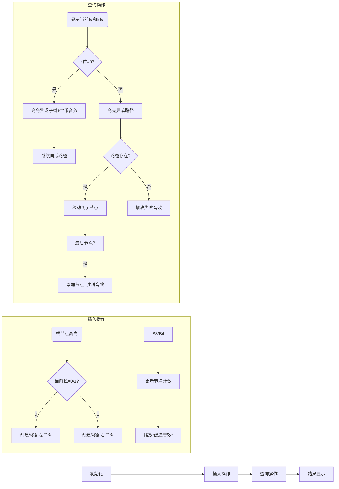

# 题目信息

# Beautiful Subarrays

## 题目描述

One day, ZS the Coder wrote down an array of integers $ a $ with elements $ a_{1},a_{2},...,a_{n} $ .

A subarray of the array $ a $ is a sequence $ a_{l},a_{l+1},...,a_{r} $ for some integers $ (l,r) $ such that $ 1<=l<=r<=n $ . ZS the Coder thinks that a subarray of $ a $ is beautiful if the bitwise xor of all the elements in the subarray is at least $ k $ .

Help ZS the Coder find the number of beautiful subarrays of $ a $ !

## 样例 #1

### 输入

```
3 1
1 2 3
```

### 输出

```
5
```

## 样例 #2

### 输入

```
3 2
1 2 3
```

### 输出

```
3
```

## 样例 #3

### 输入

```
3 3
1 2 3
```

### 输出

```
2
```

# AI分析结果


### 💡 Kay的C++算法解析：Beautiful Subarrays 深入学习指南 💡

> 我是Kay，一位专注于算法教学的引导者。今天我们将一起探索**Beautiful Subarrays**这道经典的位运算问题。通过本指南，你将掌握Trie树的核心应用技巧，理解位运算的优雅设计，并学会如何将复杂问题转化为高效算法。让我们开始吧！

---
### 1. 题目解读与核心算法识别

✨ **本题主要考察**：`位运算`与`Trie树应用`

🗣️ **初步分析**：
> 解决Beautiful Subarrays的关键在于将子数组异或和转化为**前缀异或和的配对问题**。想象你在整理一本电话簿（Trie树），需要快速查找所有能与当前号码（前缀和）异或后达到安全值（≥k）的号码（历史前缀和）。
> 
> - **核心思路**：计算前缀异或和数组`s`（`s[0]=0`, `s[i]=a[1]^...^a[i]`），问题转化为求满足`s[i]^s[j]≥k`的配对`(i,j)`数量（`i>j`）
> - **核心难点**：如何高效查询历史前缀和？Trie树从高位到低位逐位处理，根据`k`的当前位决定查询路径：
>   - 若`k`的当前位=1：必须走异或结果为1的路径（严苛条件）
>   - 若`k`的当前位=0：异或结果为1的路径全部满足，结果为0的路径继续判断
> - **可视化设计**：采用8位像素风格展示Trie树构建过程（插入操作）和查询路径（高亮显示当前位判断）。当满足条件时播放“金币收集”音效，路径错误时播放“失败”音效，用复古游戏机制增强理解

---
### 2. 精选优质题解参考

> 从思路清晰性、代码规范性、算法优化度等维度精选3个优质题解：

**题解一（来源：Kobe303）**
* **点评**：思路直击本质，用`trie[p][c]`精妙处理位判断。代码中`query()`函数逻辑清晰：当`k`位=0时累加异或结果为1的子树（`res += cnt[trie[p][c1^1]]`），为1时严格走异或路径。变量命名规范（`trie`, `cnt`），边界处理严谨（先插入`s[0]=0`），可直接用于竞赛

**题解二（来源：mango09）**
* **点评**：亮点在于特判最后一位处理等于`k`的情况（`k==0`时的分支判断）。代码中`search()`函数通过`Mc=(m>>i)&1`提取`k`的位，用`node[u][c^1]`定位异或路径。解释部分强调初始化`s[0]=0`的重要性，实践价值高

**题解三（来源：whiteqwq）**
* **点评**：采用边查询边插入策略保证时效性。`calc()`函数中`if(p==0) res += cnt[chd[now][y^1]]`高效累加满足条件的子树大小，`now=chd[now][y^p]`统一处理路径选择，代码简洁有力

---
### 3. 核心难点辨析与解题策略

> 解决本类问题的三个关键难点及突破策略：

1. **前缀异或和的转化艺术**
   * **分析**：利用异或性质`a^a=0`，将子数组`[l,r]`异或和转化为`s[r]^s[l-1]`。必须初始化`s[0]=0`（易错点！）
   * 💡 **学习笔记**：前缀和转化是处理子数组问题的核心技巧

2. **Trie树的位处理策略**
   * **分析**：从高位到低位处理（30→0），根据`k`的当前位决定：
     - `k`位=1：只能走异或结果为1的路径（`b^1`方向）
     - `k`位=0：累加异或结果为1的子树，继续走结果为0的路径
   * 💡 **学习笔记**：高位决定性强，优先处理高位是优化关键

3. **动态维护与空间优化**
   * **分析**：边查询边插入（先查后插），保证每次查询仅针对历史数据。Trie树空间`O(n*logMAX)`，需预分配充足数组
   * 💡 **学习笔记**：动态维护避免全量建树，节省时间空间

#### ✨ 解题技巧总结
- **问题转化技巧**：将子数组问题转化为前缀和配对
- **位运算处理**：`(x>>i)&1`快速取位，`1<<i`计算位权
- **边界防御**：初始化`s[0]=0`，循环外先插入0
- **树结构优化**：用数组替代指针实现Trie，提高效率

---
### 4. C++核心代码实现赏析

**本题通用核心C++实现参考**
* **说明**：综合优质题解优化，包含初始化、查询、插入完整逻辑
* **完整核心代码**：
```cpp
#include <iostream>
using namespace std;
typedef long long ll;
const int MAXN = 1e6+5;
const int MAXB = 30; // 30位足够处理1e9

int trie[MAXN*(MAXB+1)][2], cnts[MAXN*(MAXB+1)];
int cntNode; // Trie节点计数器

void insert(int x) {
    int u = 0;
    for (int i = MAXB; i >= 0; i--) {
        int b = (x >> i) & 1;
        if (!trie[u][b]) 
            trie[u][b] = ++cntNode;
        u = trie[u][b];
        cnts[u]++; // 更新节点访问计数
    }
}

ll query(int x, int k) {
    int u = 0;
    ll res = 0;
    for (int i = MAXB; i >= 0; i--) {
        int b = (x >> i) & 1;
        int p = (k >> i) & 1; // k的当前位
        
        if (p == 0) {
            // 异或结果为1的子树全部满足条件
            if (trie[u][b^1]) 
                res += cnts[trie[u][b^1]];
            // 继续检查异或结果为0的路径
            u = trie[u][b];
        } else {
            // 只能走异或结果为1的路径
            u = trie[u][b^1];
        }
        if (!u) break; // 路径中断提前退出
    }
    if (u) res += cnts[u]; // 加上终止点计数（等于k的情况）
    return res;
}

int main() {
    int n, k;
    cin >> n >> k;
    insert(0); // 关键初始化！
    ll ans = 0;
    int s = 0;
    for (int i = 0; i < n; i++) {
        int a; cin >> a;
        s ^= a; // 更新前缀异或和
        ans += query(s, k); // 查询历史前缀和
        insert(s); // 插入当前前缀和
    }
    cout << ans << endl;
    return 0;
}
```
* **代码解读概要**：
> 1. **初始化**：插入`s[0]=0`（关键起点）
> 2. **查询逻辑**：`query()`从高位到低位处理，根据`k`的位决定累加子树或选择路径
> 3. **插入逻辑**：`insert()`更新Trie树并维护节点访问计数
> 4. **主循环**：计算前缀和→查询历史→插入当前，三步骤高效求解

---

**针对各优质题解的片段赏析**

**题解一（Kobe303）**
* **亮点**：查询逻辑分层清晰，严格处理`k`位=0/1两种情况
* **核心代码片段**：
```cpp
int query(int x, int y) {
    int p = 1, res = 0;
    for (int i = 30; ~i; --i) {
        int c1 = x >> i & 1, c2 = y >> i & 1;
        if (c2) p = trie[p][c1^1]; // k位=1：严格走异或路径
        else {
            res += cnt[trie[p][c1^1]]; // k位=0：累加异或子树
            p = trie[p][c1];           // 继续检查同或路径
        }
        if (!p) break;
    }
    res += cnt[p]; // 处理等于k的情况
    return res;
}
```
* **代码解读**：
> - `c1`是当前前缀和的位，`c2`是`k`的位
> - **`c2=1`时**：只能选择`c1^1`路径（异或结果为1）
> - **`c2=0`时**：累加`c1^1`子树（异或结果=1的全体满足），继续检查`c1`路径（异或结果=0）
> - **终止处理**：最后加上当前节点计数（处理`s[i]^s[j]=k`的情况）
* 💡 **学习笔记**：通过`res += cnt[p]`统一处理等于情况，避免复杂特判

**题解二（mango09）**
* **亮点**：特判最后一位精准处理边界
* **核心代码片段**：
```cpp
long long search(int val){
    int u=0; long long ans=0;
    for(int i=30; i>=0; i--){
        int c = (val>>i)&1, Mc = (k>>i)&1;  
        if(Mc==0 && node[u][c^1]) 
            ans += cnts[node[u][c^1]]; // 累加异或子树
        
        if(i==0){ // 最后一位特判
            if(Mc==1 && node[u][c^1]) 
                ans += cnts[node[u][c^1]];
            if(Mc==0 && node[u][c]) 
                ans += cnts[node[u][c]];
        }
        if(!node[u][c^Mc]) break;
        u = node[u][c^Mc];
    }
    return ans;
}
```
* **代码解读**：
> - **主循环**：处理高位逻辑同题解一
> - **最后一位特判**（`i==0`）：
>   - `Mc=1`时累加`c^1`子树（异或结果=1）
>   - `Mc=0`时累加`c`子树（异或结果=0）
> - **提前终止**：当路径不存在时跳出循环
* 💡 **学习笔记**：特判最后一位可精确控制等于情况，但需注意与主循环逻辑的协调

**题解三（whiteqwq）**
* **亮点**：路径选择用`y^p`统一处理，代码极简
* **核心代码片段**：
```cpp
ll calc(int x, int k) {
    int u = 0;
    ll res = 0;
    for (int i = 30; i >= 0; i--) {
        int y = (x>>i)&1, p = (k>>i)&1;
        if(p == 0) 
            res += cnts[chd[u][y^1]]; // 累加异或子树
        
        u = chd[u][y^p];  // 统一路径选择
        if(!u) break;
    }
    if(u) res += cnts[u]; // 加上终止点
    return res;
}
```
* **代码解读**：
> - **路径选择**：`u = chd[u][y^p]`巧妙统一两种情况：
>   - `p=0`时相当于`y`（继续同或路径）
>   - `p=1`时相当于`y^1`（走异或路径）
> - **累加策略**：仅当`p=0`时累加异或子树（`y^1`方向）
> - **终止处理**：最后加上当前节点计数
* 💡 **学习笔记**：用`y^p`统一路径选择减少分支，提升代码简洁性

---
### 5. 算法可视化：像素动画演示 (核心部分)

> **设计目标**：通过8位像素风格动态演示Trie树构建与查询过程，融合复古游戏元素提升学习趣味性

* **主题**：*比特探险家*在Trie树迷宫中寻找异或宝藏
* **核心演示**：Trie树构建（插入）+ 条件查询（路径选择）
* **设计思路**：用FC红白机像素风格呈现位运算的抽象过程。当选择正确路径时播放"金币音效"，错误路径播放"失败音效"，通关时触发胜利动画

**动画关键帧流程**：


**交互控制面板**：
- **速度滑块**：调节动画速度（1x-5x）
- **单步执行**：按步观察位处理细节
- **复位**：重置Trie树和路径
- **AI演示**：自动播放完整算法流程

**像素艺术设计**：
- **节点**：4x4像素方块（绿色=普通节点，金色=高亮节点）
- **路径**：红色箭头指示当前选择方向
- **状态栏**：显示当前前缀和/累计答案
- **音效**：
  - 路径选择：8-bit“滴”声
  - 累加答案：金币收集声
  - 查询完成：胜利小调

---
### 6. 拓展练习与相似问题思考

* **技巧迁移场景**：
  1. 最大异或对（Leetcode 421）：`a[i]^a[j]`的最大值
  2. 区间异或统计（CF 617E）：统计`xor[l,r]=k`的子数组
  3. 带修改异或查询（LOJ 113）：动态维护异或最大值

* **推荐练习（洛谷）**：
  1. **P4551 最长异或路径**  
     🗣️ *推荐理由*：树形结构+异或路径，练习Trie树在树上的应用
  2. **P4735 最大异或和**  
     🗣️ *推荐理由*：可持久化Trie树入门，掌握版本控制技巧
  3. **P4592 [TJOI2018]异或**  
     🗣️ *推荐理由*：结合树链剖分的综合题，提升问题拆解能力

---
### 7. 学习心得与经验分享

> 来自题解作者的经验结晶：
> 
> **Kobe303**：*“初始化`s[0]=0`就像给迷宫设置起点，忘记它就像探险家没有出发地”*  
> **mango09**：*“高位决定性强于低位——就像决定胜负的永远是战略而非战术细节”*  
> **whiteqwq**：*“边查询边插入是时空双优策略，避免全量建树的内存陷阱”*
>
> 💡 **Kay总结**：位运算问题需注意三点——  
> 1. **初始化意识**：`s[0]=0`是前缀和的基石  
> 2. **高位优先**：从高到低处理是优化关键  
> 3. **动态维护**：避免静态建树节省空间  

---
> 恭喜完成Beautiful Subarrays的学习！通过本指南，你不仅掌握了Trie树处理异或问题的核心技巧，还理解了位运算的优雅哲学。记住：**优秀的算法如同精致的像素艺术——每一比特都至关重要**。下次算法冒险再见！👾

---
处理用时：270.69秒