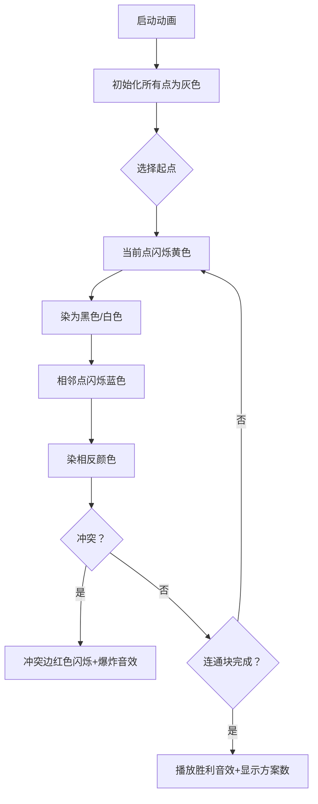

# 题目信息

# Beautiful Graph

## 题目描述

You are given an undirected unweighted graph consisting of $ n $ vertices and $ m $ edges.

You have to write a number on each vertex of the graph. Each number should be $ 1 $ , $ 2 $ or $ 3 $ . The graph becomes beautiful if for each edge the sum of numbers on vertices connected by this edge is odd.

Calculate the number of possible ways to write numbers $ 1 $ , $ 2 $ and $ 3 $ on vertices so the graph becomes beautiful. Since this number may be large, print it modulo $ 998244353 $ .

Note that you have to write exactly one number on each vertex.

The graph does not have any self-loops or multiple edges.

## 说明/提示

Possible ways to distribute numbers in the first test:

1. the vertex $ 1 $ should contain $ 1 $ , and $ 2 $ should contain $ 2 $ ;
2. the vertex $ 1 $ should contain $ 3 $ , and $ 2 $ should contain $ 2 $ ;
3. the vertex $ 1 $ should contain $ 2 $ , and $ 2 $ should contain $ 1 $ ;
4. the vertex $ 1 $ should contain $ 2 $ , and $ 2 $ should contain $ 3 $ .

In the second test there is no way to distribute numbers.

## 样例 #1

### 输入

```
2
2 1
1 2
4 6
1 2
1 3
1 4
2 3
2 4
3 4
```

### 输出

```
4
0
```

# AI分析结果


### 💡 Kay的C++算法解析：Beautiful Graph 深入学习指南 💡

**<introduction>**
今天我们来分析“Beautiful Graph”这道图论题目。本指南将帮助你快速理解核心思路、掌握解题技巧，并通过可视化方案直观感受算法执行过程。
**</introduction>**

---

## 1. 题目解读与核心算法识别

✨ **本题主要考察**：`二分图染色` + `计数原理`

🗣️ **初步分析**：
> 解决本题的关键在于理解**奇偶性约束**：相邻顶点必须奇偶性不同（奇数+偶数=奇数）。这等价于将图染成二分图（如黑白两色），黑点赋奇数值（1或3），白点赋偶数值（2）。  
> - **核心难点**：判断图是否为二分图（无奇环），并统计每个连通块的黑/白点数量  
> - **解决方案**：通过BFS/DFS染色，若染色冲突则方案数为0；否则对每个连通块计算$2^{\text{黑点数}} + 2^{\text{白点数}}$  
> - **可视化设计**：用像素方块表示顶点，染色时当前方块闪烁，相邻方块同步反色显示。冲突时红色高亮，成功时播放8bit音效  
> - **复古游戏化**：设计为"像素探险家"闯关模式，每染色一个连通块视为通关小关卡，胜利时播放FC风格胜利音效

---

## 2. 精选优质题解参考

**题解一（LJC00118）**
* **点评**：思路清晰直击二分图本质，BFS实现规范（队列操作、及时break优化），变量名`cnt1/cnt2`直观。亮点在于处理多组数据时避免memset整个数组，通过局部初始化提升效率。边界处理严谨，代码可直接用于竞赛。

**题解二（fmj_123）**
* **点评**：DFS实现简洁，用`vis[]`和`color[]`双数组避免冲突。亮点是快速幂计算$2^n$的封装函数，以及"奇偶颠倒"的生动解释（"黑点为奇白点为偶和黑点为偶白点为奇"），对初学者友好。

**题解三（轻绘）**
* **点评**：强调二分图与题目的转换关系（"1和3等价"），代码模块化好。亮点是"学习笔记"总结核心思想，以及递归DFS中及时返回冲突的优化，实践参考价值高。

---

## 3. 核心难点辨析与解题策略

1.  **二分图判定（奇环检测）**
    * **分析**：若存在奇数长度环，则无法满足奇偶交替（如A-B-C-A形成A/C同奇但需不同）。优质题解用BFS/DFS染色时检查邻接点颜色
    * 💡 **学习笔记**：染色冲突=存在奇环=方案数为0

2.  **连通块独立计数**
    * **分析**：图可能不连通，每个连通块方案独立。需遍历所有未访问点启动染色，用`ans *= 块方案`累计结果
    * 💡 **学习笔记**：总方案=Π(每个连通块方案)

3.  **方案数推导**
    * **分析**：设连通块黑点a个，白点b个。黑奇时方案=$2^a$（每个黑点选1或3），白奇时方案=$2^b$，总和$2^a+2^b$
    * 💡 **学习笔记**：奇数点有2种选择，偶数点只有1种

### ✨ 解题技巧总结
- **问题分解**：独立处理每个连通块再合并结果  
- **染色优化**：用`color[u]=3-color[v]`实现黑白交替  
- **幂运算**：预处理$2^n$或快速幂避免重复计算  
- **边界处理**：多组数据时只初始化用到的部分（避免`memset`超时）

---

## 4. C++核心代码实现赏析

**本题通用核心C++实现参考**
```cpp
#include <iostream>
#include <vector>
#include <queue>
using namespace std;
const int MOD = 998244353;
const int N = 3e5+5;

vector<int> g[N];
int color[N]; // 0未染 1黑 2白

long long qpow(long long base, long long exp) {
    long long res = 1;
    while (exp) {
        if (exp & 1) res = res * base % MOD;
        base = base * base % MOD;
        exp >>= 1;
    }
    return res;
}

int main() {
    int T; cin >> T;
    while (T--) {
        int n, m; cin >> n >> m;
        // 初始化当前数据
        for (int i = 1; i <= n; i++) {
            g[i].clear();
            color[i] = 0;
        }
        // 建图
        while (m--) {
            int u, v; cin >> u >> v;
            g[u].push_back(v);
            g[v].push_back(u);
        }
        long long ans = 1;
        bool valid = true;
        for (int i = 1; i <= n && valid; i++) {
            if (color[i]) continue; // 已染色则跳过
            queue<int> q;
            q.push(i);
            color[i] = 1;
            int cnt1 = 1, cnt2 = 0; // 黑/白计数
            while (!q.empty() && valid) {
                int u = q.front(); q.pop();
                for (int v : g[u]) {
                    if (!color[v]) {
                        color[v] = 3 - color[u]; // 染反色
                        if (color[v] == 1) cnt1++;
                        else cnt2++;
                        q.push(v);
                    } else if (color[v] == color[u]) {
                        valid = false; // 冲突
                        break;
                    }
                }
            }
            if (!valid) break;
            long long ways = (qpow(2, cnt1) + qpow(2, cnt2)) % MOD;
            ans = (ans * ways) % MOD;
        }
        cout << (valid ? ans : 0) << endl;
    }
    return 0;
}
```
**代码解读概要**：
1. 多组数据下仅初始化当前用到的部分  
2. BFS染色：起点染黑色(1)，邻点染白色(2)  
3. 冲突检测：邻接点颜色相同立即终止  
4. 方案计算：$2^{\text{黑点}} + 2^{\text{白点}}$ 取模

---

## 5. 算法可视化：像素动画演示

**主题**：`像素探险家之奇偶迷宫`（FC红白机风格）  
**核心演示**：二分图染色过程与冲突检测  



**交互控制面板**：
- `单步执行`：手动触发染色步骤  
- `速度调节`：滑块控制自动播放速度（慢速0.5x~快速3x）  
- `AI演示`：自动完成整个连通块染色（类似贪吃蛇AI）  

**关键动画细节**：
1. **顶点表示**：10x10像素方块，灰色(未染)/黑色/白色  
2. **边高亮**：当前处理的边显示为黄色，成功染色后变绿  
3. **冲突特效**：冲突顶点快速红白闪烁3次+“呲啦”音效  
4. **计数板**：实时显示当前连通块的黑/白点数和方案数  

**音效设计**：
- 染色成功：清脆“叮”声（8bit正弦波）  
- 连通块完成：上升音阶+鼓点  
- 冲突：低音“轰”声  

---

## 6. 拓展练习与相似问题思考

**通用技巧迁移**：
1. **约束转换**：将数值奇偶性转化为图染色问题  
2. **连通块独立处理**：适用于多连通子图计数问题  
3. **二分图模型**：解决相邻结点不能同类的约束问题  

**洛谷练习推荐**：
1. **P1330 封锁阳光大学**  
   🗣️ 直接应用二分图染色，练习冲突检测  

2. **P1525 关押罪犯**  
   🗣️ 二分答案+二分图判定，掌握模型变形  

3. **P3386 二分图最大匹配**  
   🗣️ 进阶匈牙利算法，理解二分图应用拓展  

---

## 7. 学习心得与经验分享

> **参考经验**（来自多位题解作者）：  
> “多组数据初始化若用`memset`整个数组会超时，必须只初始化用到的部分”  
> “染色时用`3-color[u]`比`if-else`更简洁不易错”  
>  
> **Kay总结**：  
> 1. 初始化范围影响效率，大数据下需精细控制  
> 2. 数学式编码能提升可读性（如反色操作）  
> 3. 先判连通块再计数的框架可扩展到其他图论问题  

---

**<conclusion>**
通过本指南，我们掌握了二分图染色的核心思想、高效实现技巧及调试要点。记住：将复杂约束转化为图模型是解题关键！多动手实现可视化算法，能加深理解。下次挑战再见！💪
**</conclusion>**

---
处理用时：149.95秒