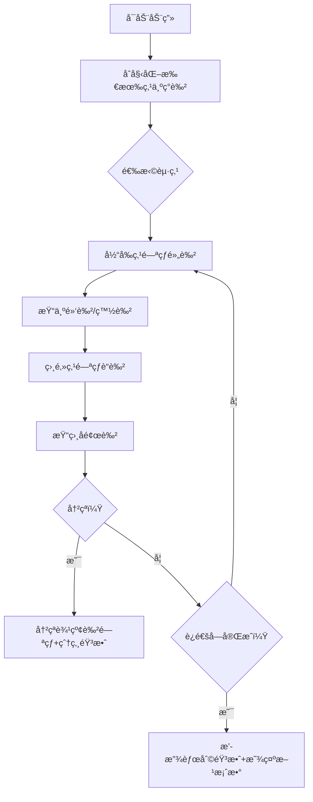

# 题目信æ¯

# Beautiful Graph

## 题目æè¿°

You are given an undirected unweighted graph consisting of $ n $ vertices and $ m $ edges.

You have to write a number on each vertex of the graph. Each number should be $ 1 $ , $ 2 $ or $ 3 $ . The graph becomes beautiful if for each edge the sum of numbers on vertices connected by this edge is odd.

Calculate the number of possible ways to write numbers $ 1 $ , $ 2 $ and $ 3 $ on vertices so the graph becomes beautiful. Since this number may be large, print it modulo $ 998244353 $ .

Note that you have to write exactly one number on each vertex.

The graph does not have any self-loops or multiple edges.

## 说æ˜/æ示

Possible ways to distribute numbers in the first test:

1. the vertex $ 1 $ should contain $ 1 $ , and $ 2 $ should contain $ 2 $ ;
2. the vertex $ 1 $ should contain $ 3 $ , and $ 2 $ should contain $ 2 $ ;
3. the vertex $ 1 $ should contain $ 2 $ , and $ 2 $ should contain $ 1 $ ;
4. the vertex $ 1 $ should contain $ 2 $ , and $ 2 $ should contain $ 3 $ .

In the second test there is no way to distribute numbers.

## 样例 #1

### 输入

```
2
2 1
1 2
4 6
1 2
1 3
1 4
2 3
2 4
3 4
```

### 输出

```
4
0
```

# AI分æ结æœ


### 💡 Kayçš„C++算法解æ：Beautiful Graph æ·±å…¥å­¦ä¹ æŒ‡å— ğŸ’¡

**<introduction>**
今天我们æ¥åˆ†æ“Beautiful Graphâ€è¿™é“图论题目。本指å—将帮助你快速ç†è§£æ ¸å¿ƒæ€è·¯ã€æŒæ¡è§£é¢˜æŠ€å·§ï¼Œå¹¶é€šè¿‡å¯è§†åŒ–方案直观感å—算法执行过程。
**</introduction>**

---

## 1. 题目解读ä¸æ ¸å¿ƒç®—法识别

✨ **本题主è¦è€ƒå¯Ÿ**：`二分图染色` + `计数åŸç†`

ğŸ—£ï¸ **åˆæ­¥åˆ†æ**：
> 解决本题的关键在äºç†è§£**奇å¶æ€§çº¦æŸ**：相邻顶点必须奇å¶æ€§ä¸åŒï¼ˆå¥‡æ•°+å¶æ•°=奇数）。这等价äºå°†å›¾æŸ“æˆäºŒåˆ†å›¾ï¼ˆå¦‚黑白两色），黑点赋奇数值（1或3），白点赋å¶æ•°å€¼ï¼ˆ2）。  
> - **核心难点**：判断图是å¦ä¸ºäºŒåˆ†å›¾ï¼ˆæ— å¥‡ç¯ï¼‰ï¼Œå¹¶ç»Ÿè®¡æ¯ä¸ªè¿é€šå—的黑/ç™½ç‚¹æ•°é‡  
> - **解决方案**：通过BFS/DFS染色，若染色冲çªåˆ™æ–¹æ¡ˆæ•°ä¸º0ï¼›å¦åˆ™å¯¹æ¯ä¸ªè¿é€šå—计算$2^{\text{黑点数}} + 2^{\text{白点数}}$  
> - **å¯è§†åŒ–设计**：用åƒç´ æ–¹å—表示顶点，染色时当å‰æ–¹å—é—ªçƒï¼Œç›¸é‚»æ–¹å—åŒæ­¥å色显示。冲çªæ—¶çº¢è‰²é«˜äº®ï¼ŒæˆåŠŸæ—¶æ’­æ”¾8bit音效  
> - **å¤å¤æ¸¸æˆåŒ–**：设计为"åƒç´ æ¢é™©å®¶"闯关模å¼ï¼Œæ¯æŸ“色一个è¿é€šå—视为通关å°å…³å¡ï¼Œèƒœåˆ©æ—¶æ’­æ”¾FCé£æ ¼èƒœåˆ©éŸ³æ•ˆ

---

## 2. 精选优质题解å‚考

**题解一（LJC00118）**
* **点评**：æ€è·¯æ¸…晰直击二分图本质，BFSå®ç°è§„范（队列æ“作ã€åŠæ—¶break优化），å˜é‡å`cnt1/cnt2`直观。亮点在äºå¤„ç†å¤šç»„æ•°æ®æ—¶é¿å…memset整个数组，通过局部åˆå§‹åŒ–æå‡æ•ˆç‡ã€‚边界处ç†ä¸¥è°¨ï¼Œä»£ç å¯ç›´æ¥ç”¨äºç«èµ›ã€‚

**题解二（fmj_123）**
* **点评**：DFSå®ç°ç®€æ´ï¼Œç”¨`vis[]`å’Œ`color[]`åŒæ•°ç»„é¿å…冲çªã€‚亮点是快速幂计算$2^n$çš„å°è£…函数，以åŠ"奇å¶é¢ å€’"的生动解释（"黑点为奇白点为å¶å’Œé»‘点为å¶ç™½ç‚¹ä¸ºå¥‡"），对åˆå­¦è€…å‹å¥½ã€‚

**题解三（轻绘）**
* **点评**：强调二分图ä¸é¢˜ç›®çš„转æ¢å…³ç³»ï¼ˆ"1å’Œ3等价"），代ç æ¨¡å—化好。亮点是"学习笔记"总结核心æ€æƒ³ï¼Œä»¥åŠé€’å½’DFS中åŠæ—¶è¿”å›å†²çªçš„优化，å®è·µå‚考价值高。

---

## 3. 核心难点辨æä¸è§£é¢˜ç­–ç•¥

1.  **二分图判定（奇ç¯æ£€æµ‹ï¼‰**
    * **分æ**：若存在奇数长度ç¯ï¼Œåˆ™æ— æ³•æ»¡è¶³å¥‡å¶äº¤æ›¿ï¼ˆå¦‚A-B-C-Aå½¢æˆA/CåŒå¥‡ä½†éœ€ä¸åŒï¼‰ã€‚优质题解用BFS/DFS染色时检查邻æ¥ç‚¹é¢œè‰²
    * 💡 **学习笔记**：染色冲çª=存在奇ç¯=方案数为0

2.  **è¿é€šå—独立计数**
    * **分æ**：图å¯èƒ½ä¸è¿é€šï¼Œæ¯ä¸ªè¿é€šå—方案独立。需éå†æ‰€æœ‰æœªè®¿é—®ç‚¹å¯åŠ¨æŸ“色，用`ans *= å—方案`累计结æœ
    * 💡 **学习笔记**：总方案=Π(æ¯ä¸ªè¿é€šå—方案)

3.  **方案数æ¨å¯¼**
    * **分æ**：设è¿é€šå—黑点a个，白点b个。黑奇时方案=$2^a$（æ¯ä¸ªé»‘点选1或3），白奇时方案=$2^b$，总和$2^a+2^b$
    * 💡 **学习笔记**：奇数点有2ç§é€‰æ‹©ï¼Œå¶æ•°ç‚¹åªæœ‰1ç§

### ✨ 解题技巧总结
- **问题分解**：独立处ç†æ¯ä¸ªè¿é€šå—å†åˆå¹¶ç»“æœ  
- **染色优化**：用`color[u]=3-color[v]`å®ç°é»‘白交替  
- **幂è¿ç®—**：预处ç†$2^n$或快速幂é¿å…é‡å¤è®¡ç®—  
- **边界处ç†**：多组数æ®æ—¶åªåˆå§‹åŒ–用到的部分（é¿å…`memset`超时）

---

## 4. C++核心代ç å®ç°èµæ

**本题通用核心C++å®ç°å‚考**
```cpp
#include <iostream>
#include <vector>
#include <queue>
using namespace std;
const int MOD = 998244353;
const int N = 3e5+5;

vector<int> g[N];
int color[N]; // 0未染 1黑 2白

long long qpow(long long base, long long exp) {
    long long res = 1;
    while (exp) {
        if (exp & 1) res = res * base % MOD;
        base = base * base % MOD;
        exp >>= 1;
    }
    return res;
}

int main() {
    int T; cin >> T;
    while (T--) {
        int n, m; cin >> n >> m;
        // åˆå§‹åŒ–当å‰æ•°æ®
        for (int i = 1; i <= n; i++) {
            g[i].clear();
            color[i] = 0;
        }
        // 建图
        while (m--) {
            int u, v; cin >> u >> v;
            g[u].push_back(v);
            g[v].push_back(u);
        }
        long long ans = 1;
        bool valid = true;
        for (int i = 1; i <= n && valid; i++) {
            if (color[i]) continue; // 已染色则跳过
            queue<int> q;
            q.push(i);
            color[i] = 1;
            int cnt1 = 1, cnt2 = 0; // 黑/白计数
            while (!q.empty() && valid) {
                int u = q.front(); q.pop();
                for (int v : g[u]) {
                    if (!color[v]) {
                        color[v] = 3 - color[u]; // 染å色
                        if (color[v] == 1) cnt1++;
                        else cnt2++;
                        q.push(v);
                    } else if (color[v] == color[u]) {
                        valid = false; // 冲çª
                        break;
                    }
                }
            }
            if (!valid) break;
            long long ways = (qpow(2, cnt1) + qpow(2, cnt2)) % MOD;
            ans = (ans * ways) % MOD;
        }
        cout << (valid ? ans : 0) << endl;
    }
    return 0;
}
```
**代ç è§£è¯»æ¦‚è¦**：
1. 多组数æ®ä¸‹ä»…åˆå§‹åŒ–当å‰ç”¨åˆ°çš„部分  
2. BFS染色：起点染黑色(1)，邻点染白色(2)  
3. 冲çªæ£€æµ‹ï¼šé‚»æ¥ç‚¹é¢œè‰²ç›¸åŒç«‹å³ç»ˆæ­¢  
4. 方案计算：$2^{\text{黑点}} + 2^{\text{白点}}$ å–模

---

## 5. 算法å¯è§†åŒ–：åƒç´ åŠ¨ç”»æ¼”示

**主题**：`åƒç´ æ¢é™©å®¶ä¹‹å¥‡å¶è¿·å®«`（FC红白机é£æ ¼ï¼‰  
**核心演示**：二分图染色过程ä¸å†²çªæ£€æµ‹  



**交互æ§åˆ¶é¢æ¿**：
- `å•æ­¥æ‰§è¡Œ`：手动触å‘染色步骤  
- `速度调节`：滑å—æ§åˆ¶è‡ªåŠ¨æ’­æ”¾é€Ÿåº¦ï¼ˆæ…¢é€Ÿ0.5x~快速3x）  
- `AI演示`：自动完æˆæ•´ä¸ªè¿é€šå—染色（类似贪åƒè›‡AI）  

**关键动画细节**：
1. **顶点表示**：10x10åƒç´ æ–¹å—，ç°è‰²(未染)/黑色/白色  
2. **边高亮**：当å‰å¤„ç†çš„边显示为黄色，æˆåŠŸæŸ“色åå˜ç»¿  
3. **冲çªç‰¹æ•ˆ**：冲çªé¡¶ç‚¹å¿«é€Ÿçº¢ç™½é—ªçƒ3次+“呲啦â€éŸ³æ•ˆ  
4. **计数æ¿**：å®æ—¶æ˜¾ç¤ºå½“å‰è¿é€šå—的黑/白点数和方案数  

**音效设计**：
- 染色æˆåŠŸï¼šæ¸…脆“å®â€å£°ï¼ˆ8bit正弦波）  
- è¿é€šå—完æˆï¼šä¸Šå‡éŸ³é˜¶+鼓点  
- 冲çªï¼šä½éŸ³â€œè½°â€å£°  

---

## 6. 拓展练习ä¸ç›¸ä¼¼é—®é¢˜æ€è€ƒ

**通用技巧è¿ç§»**：
1. **约æŸè½¬æ¢**：将数值奇å¶æ€§è½¬åŒ–为图染色问题  
2. **è¿é€šå—独立处ç†**：适用äºå¤šè¿é€šå­å›¾è®¡æ•°é—®é¢˜  
3. **二分图模å‹**：解决相邻结点ä¸èƒ½åŒç±»çš„约æŸé—®é¢˜  

**洛谷练习æ¨è**：
1. **P1330 å°é”阳光大学**  
   ğŸ—£ï¸ ç›´æ¥åº”用二分图染色，练习冲çªæ£€æµ‹  

2. **P1525 关押罪犯**  
   ğŸ—£ï¸ äºŒåˆ†ç­”æ¡ˆ+二分图判定，æŒæ¡æ¨¡å‹å˜å½¢  

3. **P3386 二分图最大匹é…**  
   ğŸ—£ï¸ è¿›é˜¶åŒˆç‰™åˆ©ç®—æ³•ï¼Œç†è§£äºŒåˆ†å›¾åº”用拓展  

---

## 7. 学习心得ä¸ç»éªŒåˆ†äº«

> **å‚考ç»éªŒ**（æ¥è‡ªå¤šä½é¢˜è§£ä½œè€…）：  
> “多组数æ®åˆå§‹åŒ–若用`memset`整个数组会超时，必须åªåˆå§‹åŒ–用到的部分† 
> “染色时用`3-color[u]`比`if-else`更简æ´ä¸æ˜“错† 
>  
> **Kay总结**：  
> 1. åˆå§‹åŒ–范围影å“效ç‡ï¼Œå¤§æ•°æ®ä¸‹éœ€ç²¾ç»†æ§åˆ¶  
> 2. æ•°å­¦å¼ç¼–ç èƒ½æå‡å¯è¯»æ€§ï¼ˆå¦‚å色æ“作）  
> 3. 先判è¿é€šå—å†è®¡æ•°çš„框æ¶å¯æ‰©å±•åˆ°å…¶ä»–图论问题  

---

**<conclusion>**
通过本指å—，我们æŒæ¡äº†äºŒåˆ†å›¾æŸ“色的核心æ€æƒ³ã€é«˜æ•ˆå®ç°æŠ€å·§åŠè°ƒè¯•è¦ç‚¹ã€‚è®°ä½ï¼šå°†å¤æ‚约æŸè½¬åŒ–为图模å‹æ˜¯è§£é¢˜å…³é”®ï¼å¤šåŠ¨æ‰‹å®ç°å¯è§†åŒ–算法，能加深ç†è§£ã€‚下次挑战å†è§ï¼ğŸ’ª
**</conclusion>**

---
处ç†ç”¨æ—¶ï¼š149.95秒