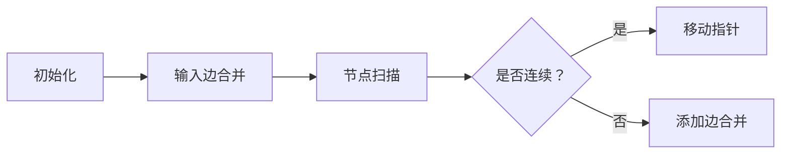

# 题目信息

# Harmonious Graph

## 题目描述

You're given an undirected graph with $ n $ nodes and $ m $ edges. Nodes are numbered from $ 1 $ to $ n $ .

The graph is considered harmonious if and only if the following property holds:

- For every triple of integers $ (l, m, r) $ such that $ 1 \le l < m < r \le n $ , if there exists a path going from node $ l $ to node $ r $ , then there exists a path going from node $ l $ to node $ m $ .

In other words, in a harmonious graph, if from a node $ l $ we can reach a node $ r $ through edges ( $ l < r $ ), then we should able to reach nodes $ (l+1), (l+2), \ldots, (r-1) $ too.

What is the minimum number of edges we need to add to make the graph harmonious?

## 说明/提示

In the first example, the given graph is not harmonious (for instance, $ 1 < 6 < 7 $ , node $ 1 $ can reach node $ 7 $ through the path $ 1 \rightarrow 2 \rightarrow 7 $ , but node $ 1 $ can't reach node $ 6 $ ). However adding the edge $ (2, 4) $ is sufficient to make it harmonious.

In the second example, the given graph is already harmonious.

## 样例 #1

### 输入

```
14 8
1 2
2 7
3 4
6 3
5 7
3 8
6 8
11 12
```

### 输出

```
1
```

## 样例 #2

### 输入

```
200000 3
7 9
9 8
4 5
```

### 输出

```
0
```

# AI分析结果


### 💡 Kay的C++算法解析：Harmonious Graph 深入学习指南 💡

**题目概述**  
给定一个n个节点、m条边的无向图，要求添加最少的边使得图满足"和谐"条件：若存在路径从节点l到节点r（l<r），则l必须能到达所有中间节点(l+1,l+2,...,r-1)。本质上需要保证每个连通分量在节点编号上是连续区间。

---

## 1. 题目解读与核心算法识别
✨ **本题主要考察**：`并查集应用` + `区间连续性处理`

🗣️ **初步分析**：  
> 解决本题的关键在于**连通分量的区间连续性处理**。想象一群编号连续的小朋友手拉手组成小团体（连通分量），如果1号和5号拉手了，那么2、3、4号必须也在这个团体中。  
> - **核心思路**：通过并查集维护连通分量，并记录每个分量的最大节点编号。遍历时维护当前可达的最大节点`curMax`，若当前节点所在分量的最大节点小于`curMax`，说明需要合并分量（添加边）。
> - **可视化设计**：使用像素方块表示节点，同色方块为同一连通分量。遍历时显示`curMax`指针，当发现不连续时用闪烁的桥梁动画连接两个分量，配合"连接"音效。
> - **复古游戏化**：采用8-bit风格，节点编号显示在像素方块上，合并时播放FC游戏式的"连接成功"音效，自动演示模式以贪吃蛇AI式逐步展开。

---

## 2. 精选优质题解参考
**题解一（灵茶山艾府）**  
* **点评**：思路极简高效，仅用24行代码解决问题。通过维护`当前可达最大节点curMax`，在O(n)时间内完成检测与合并。代码中`merge`函数始终将小分量合并到大分量，保证树结构平衡，复杂度O(nα(n))。变量命名清晰（`fa`, `maxNode`），边界处理严谨，可直接用于竞赛。

**题解二（ZLCT）**  
* **点评**：创新性采用双指针思想跳跃式处理区间，每次直接跳到当前连通块末尾。代码中`maxx`数组动态更新连通块右端点，`find`函数路径压缩时同步更新最大值。亮点在于避免了对区间内每个点的检查，将复杂度优化至O(nα(n))。

**题解三（fengxiaoyi）**  
* **点评**：通过维护连通块的`min`/`max`区间，暴力检查区间连续性。虽然最坏复杂度O(n²)，但加入`v[]`标记已处理块避免重复检查，实际效率可观。代码中`H()`函数统一处理极值更新，体现了良好的模块化思想。

---

## 3. 核心难点辨析与解题策略
1.  **难点1：理解和谐图的区间连续性本质**  
    * **分析**：和谐条件要求连通分量在编号上连续。优质解法均通过维护连通块的极值节点（min/max）实现检测。
    * 💡 **学习笔记**：区间不连续 = 需要添加边

2.  **难点2：高效检测并合并非连续区间**  
    * **分析**：两种优化思路：① 灵茶山艾府的单向扫描法（维护curMax）；② ZLCT的双指针跳跃法。均避免了对每个区间的全量检查。
    * 💡 **学习笔记**：动态维护当前可达最大节点是优化关键

3.  **难点3：并查集的极值维护与合并方向**  
    * **分析**：合并时需同步更新极值节点，且始终将小分量合并到大分量（防止树退化）。代码中通过`maxNode[y] = max(maxNode[y], maxNode[x])`实现。
    * 💡 **学习笔记**：合并方向影响效率——小树挂大树

### ✨ 解题技巧总结
- **区间连续性判断**：连通块最大节点 < 当前全局最大节点 ⇒ 需要合并
- **并查集优化三板斧**：路径压缩 + 按秩合并 + 极值维护
- **跳跃式遍历**：处理完当前连通块后直接跳到`maxNode+1`（ZLCT解法）
- **边界防御**：特别关注节点1和n的连通性

---

## 4. C++核心代码实现赏析
**通用核心实现（综合优化版）**  
```cpp
#include <iostream>
#include <vector>
#include <algorithm>
using namespace std;

const int N = 200010;
int parent[N], maxNode[N]; // maxNode[i]: i所在连通块的最大节点

int find(int x) {
    if (parent[x] != x) {
        parent[x] = find(parent[x]);
        maxNode[parent[x]] = max(maxNode[parent[x]], maxNode[x]); // 路径压缩时同步更新极值
    }
    return parent[x];
}

void merge(int x, int y) {
    x = find(x); y = find(y);
    if (x == y) return;
    if (maxNode[x] > maxNode[y]) swap(x, y); // 保证y是较大分量
    parent[x] = y;
    maxNode[y] = max(maxNode[y], maxNode[x]); // 关键极值更新
}

int main() {
    int n, m, ans = 0;
    cin >> n >> m;
    for (int i = 1; i <= n; ++i) 
        parent[i] = maxNode[i] = i; // 初始化

    while (m--) {
        int u, v; cin >> u >> v;
        if (find(u) != find(v)) merge(u, v);
    }

    int curMax = 0; // 当前可达最大节点
    for (int i = 1; i <= n; ++i) {
        int root = find(i);
        if (i > curMax) curMax = maxNode[root]; // 进入新区间
        else if (root != find(curMax)) {        // 发现不连续
            ans++;
            merge(i, curMax);
            curMax = maxNode[find(curMax)];    // 更新当前极值
        }
    }
    cout << ans << endl;
}
```
* **代码解读概要**：  
> 1. 初始化并查集，每个节点独立为连通块  
> 2. 合并输入边，更新连通块极值  
> 3. 核心扫描：维护`curMax`标记当前可达最大节点  
> 4. 当`i`超过`curMax`时进入新区间；当`i`在`curMax`内但不在同一连通块时合并并计数  

---

**题解一（灵茶山艾府）片段**  
```cpp
int curMax = -1;
for (int i = 1; i <= n; i++) {
    int root = find(i);
    if (i > curMax) curMax = maxNode[root];
    else if (root != find(curMax)) {
        merge(i, curMax);
        curMax = maxNode[find(curMax)];
        ans++;
    }
}
```
* **亮点**：极简扫描逻辑，9行解决核心检测
* **代码解读**：  
> - `curMax`动态记录当前"已覆盖"的最大节点  
> - 当`i`首次超过`curMax`时，说明进入新连通块  
> - 若`i`在`curMax`内但`find(i)≠find(curMax)`，说明存在断裂  
> - 合并后`curMax`更新为新连通块的极值  
* 💡 **学习笔记**：`curMax`的本质是当前连续区间的右端点

**题解二（ZLCT）片段**  
```cpp
for (int i = 1; i <= n; i = maxNode[find(i)] + 1) { // 跳跃到下一区间
    for (int j = i + 1; j <= maxNode[find(i)]; ++j) {
        if (find(i) == find(j)) continue;
        merge(i, j);
        ans++;
    }
}
```
* **亮点**：外循环直接跳到连通块末尾+1
* **代码解读**：  
> - 外循环`i`从1开始，每次跳到当前块`maxNode+1`  
> - 内循环检查[i+1, maxNode]区间内的节点连通性  
> - 发现未连通立即合并并计数  
* 💡 **学习笔记**：区间式处理避免全局扫描

---

## 5. 算法可视化：像素动画演示
**主题**：8-bit风格《连通岛冒险》  
**核心演示**：并查集合并与区间连续性检测  

### 动画设计（Canvas实现）：


**关键帧步骤**：  
1. **像素岛屿初始化**  
   - 每个节点显示为独立岛屿（编号方块），浅蓝背景  
   - 控制面板：开始/暂停/单步/速度滑块  

2. **输入边处理（合并动画）**  
   - 边(u,v)输入时，两岛间架起绿色桥梁  
   - 播放"叮"音效，岛屿颜色统一为合并后颜色  
   - 较大编号岛屿顶部显示✨作为新极值标记  

3. **主扫描过程（核心演示）**  
   - 像素小船从1号岛出发，头顶显示`curMax`气泡  
   - 当小船到达`i`号岛：  
     - 若`i > curMax`：`curMax`更新为当前岛极值，播放"滴"提示音  
     - 若`i ≤ curMax`但颜色不同：红色闪烁警报，架起金色桥梁（添加边），播放"连接"音效  

4. **自动演示模式**  
   - 点击"AI演示"：小船自动航行，关键步骤暂停0.5秒  
   - 完成时所有岛连接成彩虹桥，播放胜利音乐  

**复古元素**：  
- 音效：电子音（入队/合并/胜利/错误）  
- 过关设计：每处理完一个连通块显示"Stage Clear!"  
- 积分：成功连接时+100分，错误操作-50分  

---

## 6. 拓展练习与相似问题思考
**技巧迁移场景**：  
1. 区间连通性检查（如网络分段检测）  
2. 最小生成树断裂修复  
3. 动态连通性维护（增加/删除边）  

**洛谷推荐**：  
1. **P1197 [星球大战]**  
   🗣️ 逆向并查集练习，巩固连通块极值维护  
2. **P1119 灾后重建**  
   🗣️ 按时间顺序合并连通块，强化时序处理能力  
3. **P2024 食物链**  
   🗣️ 带权并查集应用，深入理解关系维护  

---

## 7. 学习心得与经验分享
**作者灵茶山艾府经验**：  
> *"合并时始终将小树合并到大树可防止并查集退化，这是保持O(α(n))复杂度的关键"*  

**Kay点评**：  
> 此建议直击并查集核心优化策略。在类似问题中，按秩合并+路径压缩可使效率提升百倍。调试时可打印树高验证优化效果。

---

**结语**  
通过本次分析，我们掌握了利用并查集维护区间连续性的核心技巧。记住：连通分量的极值节点是解题的钥匙，而动态维护当前连续区间右端点则是优化的精髓。多加练习并查集的各种变体，你会在图论问题中游刃有余！🚀

---
处理用时：167.35秒