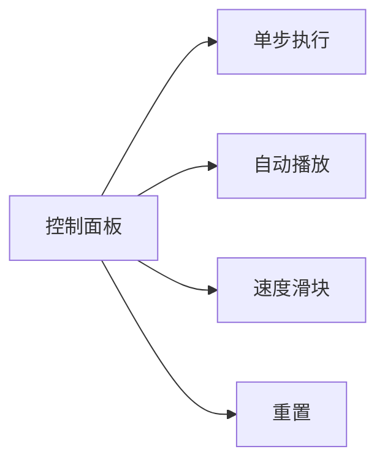

# 题目信息

# The Number of Imposters

## 题目描述

Theofanis started playing the new online game called "Among them". However, he always plays with Cypriot players, and they all have the same name: "Andreas" (the most common name in Cyprus).

In each game, Theofanis plays with $ n $ other players. Since they all have the same name, they are numbered from $ 1 $ to $ n $ .

The players write $ m $ comments in the chat. A comment has the structure of " $ i $ $ j $ $ c $ " where $ i $ and $ j $ are two distinct integers and $ c $ is a string ( $ 1 \le i, j \le n $ ; $ i \neq j $ ; $ c $ is either imposter or crewmate). The comment means that player $ i $ said that player $ j $ has the role $ c $ .

An imposter always lies, and a crewmate always tells the truth.

Help Theofanis find the maximum possible number of imposters among all the other Cypriot players, or determine that the comments contradict each other (see the notes for further explanation).

Note that each player has exactly one role: either imposter or crewmate.

## 说明/提示

In the first test case, imposters can be Andreas $ 2 $ and $ 3 $ .

In the second test case, imposters can be Andreas $ 1 $ , $ 2 $ , $ 3 $ and $ 5 $ .

In the third test case, comments contradict each other. This is because player $ 1 $ says that player $ 2 $ is an imposter, and player $ 2 $ says that player $ 1 $ is a crewmate. If player $ 1 $ is a crewmate, then he must be telling the truth, so player $ 2 $ must be an imposter. But if player $ 2 $ is an imposter then he must be lying, so player $ 1 $ can't be a crewmate. Contradiction.

## 样例 #1

### 输入

```
5
3 2
1 2 imposter
2 3 crewmate
5 4
1 3 crewmate
2 5 crewmate
2 4 imposter
3 4 imposter
2 2
1 2 imposter
2 1 crewmate
3 5
1 2 imposter
1 2 imposter
3 2 crewmate
3 2 crewmate
1 3 imposter
5 0```

### 输出

```
2
4
-1
2
5```

# AI分析结果


### 💡 Kay的C++算法解析：The Number of Imposters 深入学习指南 💡

**引言**  
今天我们一起分析"内鬼数量"这道逻辑推理题。题目要求基于玩家的陈述推断最大可能的内鬼数量，若矛盾则输出-1。本指南将解析核心算法、代码实现难点，并通过像素动画帮助直观理解解题过程。

---

### 1. 题目解读与核心算法识别  
✨ **本题主要考察**：`图论建模与并查集应用`  

🗣️ **初步分析**：  
> 本题核心是将玩家陈述转化为图关系：用扩展域并查集（每个玩家拆分为"船员"和"内鬼"两个节点）或二分图染色建模身份关系。  
> - **关键难点**：处理"船员说真话/内鬼说谎"的约束时，需保证关系传递无矛盾（如：A说B是内鬼，B说A是船员会导致死锁）  
> - **解法对比**：扩展域并查集通过合并对立集合处理关系；DFS染色用边权异或校验一致性  
> - **可视化设计**：动画将用双色像素方块表示玩家正/反域（蓝=船员，红=内鬼），合并时显示集合联动（见第5节）  
> - **游戏化元素**：采用FC红白机像素风格，关键操作配"叮"音效，矛盾时播放"失败"音效，成功统计播放"胜利"旋律  

---

### 2. 精选优质题解参考  
**题解一（PragmaGCC）**  
* **点评**：  
  思路清晰，用扩展域并查集将玩家拆分为正反域（i=船员，i+n=内鬼）。代码规范：  
  - 合并操作处理两种陈述（crewmate/imposter）逻辑严谨  
  - 用`siz`数组实时统计集合大小，避免重复访问  
  - 检查`find(i)==find(i+n)`高效检测矛盾  
  - 边界处理完整（如统计后清空`siz`），可直接用于竞赛  

**题解二（智子）**  
* **点评**：  
  与题解一思路相似但统计方法不同：  
  - 预处理所有反域节点（i>n）的内鬼计数  
  - 用`vis`标记已统计集合，避免重复累加  
  - 代码注释详细，变量命名清晰（如`cnt`统计内鬼数）  
  - 稍逊于题解一在实时更新集合大小的优化  

**题解三（vectorwyx）**  
* **点评**：  
  采用DFS二分图染色方案：  
  - 边权1/0表示"身份对立/相同"（类比异或）  
  - 对每个连通块两次染色（假设首节点为船员/内鬼）  
  - 取内鬼数最大值，时间复杂度O(n+m)  
  - 代码简洁但依赖递归深度，可能栈溢出  

---

### 3. 核心难点辨析与解题策略  
**难点1：关系转换抽象**  
- **分析**：需将"i说j是X"转化为逻辑约束（同色/异色）。优质解法用并查集合并或边权建模，如：  
  `crewmate→(i,j)同色`，`imposter→(i,j)异色`  
- 💡 **学习笔记**：将自然语言转为数学模型是解题基石  

**难点2：矛盾检测机制**  
- **分析**：当同一玩家的"船员"和"内鬼"节点属于同一集合时矛盾。在DFS中表现为染色冲突（相邻节点异或值不符）  
- 💡 **学习笔记**：矛盾检测本质是判断"身份互斥性"是否被破坏  

**难点3：最大化统计实现**  
- **分析**：每个连通块独立统计，取正/反域内鬼数的最大值（反域代表内鬼集合）  
- 💡 **学习笔记**：局部最优解求和=全局最优解  

#### ✨ 解题技巧总结  
- **拆点法**：扩展域并查集通过虚拟节点降维复杂关系  
- **逆向思维**：最大化内鬼数≡最小化船员数，统计时取较大值  
- **防御性编程**：合并后立即检查矛盾，避免无效计算  

---

### 4. C++核心代码实现赏析  
**通用核心实现（综合优化版）**  
```cpp
#include <iostream>
#include <cstring>
using namespace std;
const int N = 4e5 + 5;
int fa[N], siz[N], vis[N], T, n, m;

int find(int x) {
    return fa[x] == x ? x : fa[x] = find(fa[x]);
}

void merge(int x, int y) {
    int fx = find(x), fy = find(y);
    if (fx != fy) {
        siz[fx] += siz[fy];
        fa[fy] = fx;
    }
}

int main() {
    cin >> T;
    while (T--) {
        cin >> n >> m;
        // 初始化：1~n为船员域, n+1~2n为内鬼域
        for (int i = 1; i <= 2*n; i++) {
            fa[i] = i;
            siz[i] = (i > n); // 内鬼域初始化为1
            vis[i] = 0;
        }

        // 处理陈述
        while (m--) {
            int i, j; string s;
            cin >> i >> j >> s;
            if (s[0] == 'c') { // 同色关系
                merge(i, j);
                merge(i + n, j + n);
            } else { // 异色关系
                merge(i, j + n);
                merge(i + n, j);
            }
        }

        // 检查矛盾 & 统计
        int ans = 0;
        for (int i = 1; i <= n; i++) {
            if (find(i) == find(i + n)) {
                ans = -1; break;
            }
            int crew = find(i), imp = find(i + n);
            if (!vis[crew]) {
                ans += max(siz[crew], siz[imp]);
                vis[crew] = vis[imp] = 1;
            }
        }
        cout << ans << endl;
    }
}
```
**代码解读概要**：  
> 1. **初始化**：每个玩家拆为船员域(i)和内鬼域(i+n)，内鬼域初始计数为1  
> 2. **关系处理**：根据陈述类型合并对应集合（同色合并正正/负负，异色交叉合并）  
> 3. **矛盾检测**：任意玩家正反域同属一集合则矛盾  
> 4. **统计优化**：对未访问集合累加正反域内鬼数最大值  

---

### 5. 算法可视化：像素动画演示  
**主题**：`像素侦探：身份谜局`（仿FC侦探游戏风格）  

**核心演示内容**：  
- 玩家显示为双联像素方块（左蓝=船员域，右红=内鬼域）  
- 陈述触发时动态连接对应方块（同色=同色光带，异色=闪烁红蓝闪电）  
- 实时显示并查集森林结构（用像素树可视化）  

**关键交互设计**：  


**动画流程**：  
1. **初始化**：8-bit风格网格，玩家排列成环，控制面板含速度调节  
2. **陈述处理**：  
   - 点击"下一陈述"按钮，高亮当前陈述玩家  
   - 根据crewmate/imposter播放不同音效（"叮"或"滋啦"）  
   - 同色合并时蓝色光波扩散，异色合并时红蓝粒子对撞  
3. **矛盾检测**：  
   - 若玩家蓝红方块重叠→闪烁红光+警报音效  
   - 显示冲突路径（如：A→B→C→A矛盾环）  
4. **统计阶段**：  
   - 成功时：内鬼域泛红光，船员域泛蓝光  
   - 按连通块播放"金币掉落"音效（块内鬼数=金币数）  
   - 总分栏显示累计内鬼数  

**技术实现**：  
- 用Canvas绘制像素网格，每个玩家占2×2单元  
- 合并动画采用颜色插值算法（RGB线性渐变）  
- 音效用Web Audio API合成8-bit音效  

---

### 6. 拓展练习与相似问题思考  
**通用技巧迁移**：  
扩展域并查集适用于所有二元关系传递问题：  
1. 敌对关系（如P1892团伙）  
2. 食物链（如P2024）  
3. 性别分类（如P1525关押罪犯）  

**洛谷推荐**：  
1. **P2024 食物链**  
   → 学会处理三类生物关系（同类/捕食/被捕食）  
2. **P1525 关押罪犯**  
   → 最大化最小冲突值，二分答案+染色判定  
3. **P1892 团伙**  
   → 基础关系合并（朋友合并，敌人间接关联）  

---

### 7. 学习心得与经验分享  
本次题解未包含作者个人调试心得。但需注意：  
> **调试技巧**：当出现矛盾时，可打印最后一条导致冲突的陈述，回溯关系链  

---

**结语**  
通过扩展域并查集，我们高效解决了身份推理问题。记住：将现实约束转化为数学模型是算法核心能力！下次挑战见！💪

---
处理用时：131.80秒