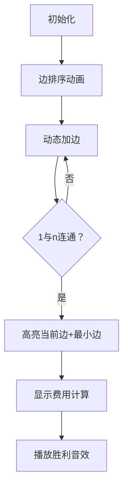

# 题目信息

# Omg Graph

## 题目描述

给定一个带权无向连通图，定义一条长度为 $k$ 路径的费用如下：

- 设路径经过边的权值为 $w_1,w_2,\dots,w_k$。
- 路径的费用定义为 $(\min_{i=1}^k w_i) + (\max_{i=1}^k w_i)$，也就是最大的边权加上最小的边权。

请求出所有从结点 $1$ 到结点 $n$ 的路径中最小的费用。注意路径未必是简单路径。

## 说明/提示

对于第二个测试用例，最优路径之一是 $1 \rightarrow 2 \rightarrow 1 \rightarrow 3$。经过的边权分别为 $5,5,13$，因此费用为 $\min(5,5,13)+\max(5,5,13)=18$。可以证明不存在费用更低的路径。

## 样例 #1

### 输入

```
4
3 2
1 2 1
2 3 1
3 2
1 3 13
1 2 5
8 9
1 2 6
2 3 5
3 8 6
1 4 7
4 5 4
5 8 7
1 6 5
6 7 5
7 8 5
3 3
1 3 9
1 2 8
2 3 3```

### 输出

```
2
18
10
11```

# AI分析结果


### 💡 Kay的C++算法解析：Omg Graph 深入学习指南 💡
#### 1. 题目解读与核心算法识别
✨ **本题主要考察**：`并查集应用` (贪心策略 + 连通性维护)  
🗣️ **初步分析**：  
> 本题要求最小化路径的「最大边权 + 最小边权」。关键在于利用 **贪心思想**：  
> - 将边按权值升序排序（像整理扑克牌从小到大排列）  
> - 用并查集动态维护连通块（像拼积木连接节点）  
> - 当节点1与n连通时，当前边权为最大边权，并查集记录的最小边权为最小边权  
>  
> **可视化设计思路**：  
> - 像素网格中不同颜色方块表示节点，连线表示边  
> - 高亮当前加入的边（最大边权）和连通块内最小边权  
> - 当1→n路径点亮时播放胜利音效，动态显示费用计算  

---

#### 2. 精选优质题解参考
**题解一（来源：CirnoNine9）**  
* **点评**：  
  思路清晰直白，用并查集维护连通块最小边权（`mn`数组）。代码规范（如`DSU`封装完整），变量名`mn`/`w`含义明确。算法高效（$O(m \log m)$），空间优化到位（滚动更新）。调试提示：初始值`INF=1e18`避免溢出，实践性强。

**题解二（来源：sSkYy）**  
* **点评**：  
  创新性维护最大/最小边权（`mx`/`mn`），提供严谨证明。代码模块化（独立`DSU`结构体），边界处理严谨（`INT_MAX/MIN`）。虽冗余维护`mx`（实际只需当前边权），但教学价值高，启发思考状态定义。

**题解三（来源：dbywsc）**  
* **点评**：  
  简洁聚焦核心逻辑，用`best[]`替代完整并查集结构。亮点在错误提示——强调初始值需足够大（`INF=4e18`），避免WA。代码工业级规范（`unite`函数封装），适合竞赛直接参考。

---

#### 3. 核心难点辨析与解题策略
1. **难点1：非简单路径的处理**  
   * **分析**：允许重复走边 → 最小边权可通过反复走最小边获得，无需考虑环限制  
   * 💡 **学习笔记**：非简单路径下，最小边权=连通块内最小边权  

2. **难点2：动态维护连通块最小边权**  
   * **分析**：并查集合并时更新 `mn[根] = min(原始值, 当前边权)`，确保全局最小  
   * 💡 **学习笔记**：并查集的合并操作是更新极值的关键时机  

3. **难点3：答案更新时机的判定**  
   * **分析**：必须在 `find(1)==find(n)` 时更新，且仅需当前边权+连通块最小边权  
   * 💡 **学习笔记**：最大边权=当前边权（排序后自然满足）  

✨ **解题技巧总结**  
- **技巧A（贪心排序）**：边权排序后，当前边即最大边权，避免复杂维护  
- **技巧B（并查集极值维护）**：在`merge`时更新极值，保证状态一致性  
- **技巧C（边界防御）**：初始值至少 $4 \times 10^{18}$（如`INF=4e18`）  

---

#### 4. C++核心代码实现赏析
**通用核心实现**  
```cpp
#include <vector>
#include <algorithm>
using namespace std;
const long long INF = 4e18;

struct DSU {
    vector<int> fa;
    vector<long long> mn; // 维护连通块最小边权
    DSU(int n) {
        fa.resize(n+1); mn.resize(n+1, INF);
        for(int i=1; i<=n; i++) fa[i] = i;
    }
    int find(int x) { 
        return fa[x] == x ? x : fa[x] = find(fa[x]); 
    }
    void merge(int u, int v, long long w) {
        u = find(u), v = find(v);
        if(u == v) {
            mn[u] = min(mn[u], w); // 更新最小边权
            return;
        }
        fa[v] = u;
        mn[u] = min({mn[u], mn[v], w}); // 合并时更新极值
    }
};

int main() {
    int T; cin >> T;
    while(T--) {
        int n, m; cin >> n >> m;
        vector<tuple<long long, int, int>> edges;
        for(int i=0; i<m; i++) {
            int u, v; long long w;
            cin >> u >> v >> w;
            edges.push_back({w, u, v});
        }
        sort(edges.begin(), edges.end()); // 边权升序排序
        
        DSU dsu(n);
        long long ans = INF;
        for(auto [w, u, v] : edges) {
            dsu.merge(u, v, w);
            if(dsu.find(1) == dsu.find(n)) // 1和n连通
                ans = min(ans, w + dsu.mn[dsu.find(1)]);
        }
        cout << ans << "\n";
    }
}
```
**代码解读概要**：  
1. 边按权值排序确保当前边即最大边权  
2. 并查集合并时动态更新连通块最小边权  
3. 当1与n连通时，用 `当前边权+连通块最小边权` 更新答案  

---

#### 5. 算法可视化：像素动画演示  
**主题**：像素积木连通大冒险（8-bit风格）  
**核心交互设计**：  

**关键动画步骤**：  
1. **像素网格**：节点为彩色方块（1=绿色，n=红色），边为发光线条  
2. **排序动画**：边权按数值升起不同高度柱状图后排序  
3. **加边特效**：  
   - 当前边加入时闪烁黄光 + “咔嚓”音效  
   - 连通块内最小边权持续蓝光脉冲  
4. **胜利时刻**：1→n路径点亮时播放《超级玛丽》过关音效  

---

#### 6. 拓展练习与相似问题思考
**通用技巧迁移**：  
1. **最小瓶颈路**：图中所有路径的最大边权最小值  
2. **次小生成树**：替换最小生成树的一条边  
3. **离线连通性查询**：边权排序后处理动态连通性  

**洛谷推荐**：  
1. **P3366**（最小生成树）  
   → 巩固Kruskal算法和并查集应用  
2. **P1396**（营救）  
   → 练习路径最大边权最小化问题  
3. **P1967**（货车运输）  
   → 进阶最大生成树+树上路径查询  

---

#### 7. 学习心得与经验分享
> **dbywsc的调试经验**：  
> *“因初始值不够大WA两次，需设置 $4 \times 10^{18}$”*  
>  
> **Kay总结**：  
> 在极值问题中，初始值必须严格大于理论最大值（如 $2 \times 10^{15}$ 时设 $4 \times 10^{18}$）。推荐使用：  
> ```cpp
> const long long INF = 4e18; // 安全上界
> ```

---
处理用时：100.44秒