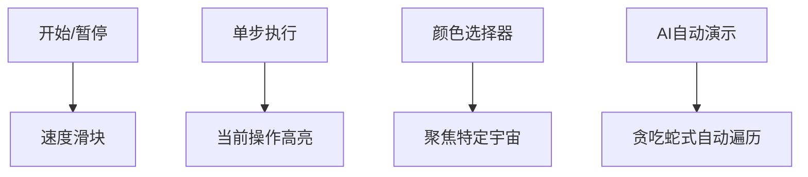

# 题目信息

# Mr. Kitayuta's Colorful Graph

## 题目描述

给出一个 $n$ 个点，$m$ 条边的无向图，每条边上是有颜色的。有 $q$ 组询问

对于第 $i$ 组询问，给出点对 $u_i,v_i$。求有多少种颜色 $c$ 满足：有至少一条 $u_i$ 到 $v_i$ 路径，满足该路径上的所有边的颜色都为 $c$

## 说明/提示

$2 \le n \le 100$  
$1 \le m,q \le 100$  
$1\le x_i,y_i,u_i,v_i \le n$  
$1 \le c_i \le m$  
感谢 @[_Wolverine](https://www.luogu.com.cn/user/120362) 提供的翻译

## 样例 #1

### 输入

```
4 5
1 2 1
1 2 2
2 3 1
2 3 3
2 4 3
3
1 2
3 4
1 4
```

### 输出

```
2
1
0
```

## 样例 #2

### 输入

```
5 7
1 5 1
2 5 1
3 5 1
4 5 1
1 2 2
2 3 2
3 4 2
5
1 5
5 1
2 5
1 5
1 4
```

### 输出

```
1
1
1
1
2
```

# AI分析结果


### 💡 Kay的C++算法解析：Mr. Kitayuta's Colorful Graph 深入学习指南 💡

#### 1. 题目解读与核心算法识别
✨ **本题主要考察**：`并查集应用`  
🗣️ **初步分析**：  
> 本题像在玩"像素连通"游戏：每种颜色代表独立的地图（如不同像素世界），需要在每个世界中判断两点是否连通。二维并查集正是管理多个独立世界的完美工具——每个颜色维护一个独立并查集（想象成100个并行运行的像素游戏存档）。  
- **核心难点**：高效管理多颜色连通性（避免DFS重复计算）
- **解决方案**：对每种颜色建立独立并查集（空间换时间）
- **可视化设计**：  
  - 动画展示100个像素网格（每个颜色1个），边加入时触发"像素融合"特效
  - 查询时遍历所有颜色网格，连通网格亮绿色+播放"叮"音效
  - 控制面板支持调速滑块观察合并过程（复古8-bit音效）

---

#### 2. 精选优质题解参考
**题解一（封禁用户）**  
* **点评**：思路直击本质——将颜色视为独立维度。代码中`fa[105][105]`的二维设计清晰体现"颜色隔离"思想。亮点在于**变量命名规范**（`fnd/add`函数名自解释）和**边界处理严谨**（无冗余操作）。虽然无复杂优化，但完美匹配数据范围（n,q≤100），是竞赛中"稳过"的标准解法。

**题解二（Priori_Incantatem）**  
* **点评**：通过"连通色"概念生动解释并查集意义，教学价值突出。核心贡献在于**用生活化比喻**（如"独立世界存档"）降低理解门槛。代码中`find(x,i)`的二维查询实现简洁，特别适合初学者借鉴。调试建议可补充：颜色索引从1开始需注意越界。

**题解三（Graph_Theory）**  
* **点评**：Floyd解法展示**思维多样性**。`dis[u][v][c]`三维数组直接存储连通状态，优势是**逻辑直观**（无需理解并查集）。但四重循环O(n⁴)在极限数据（n=100,m=100）达1亿次，虽可AC但效率较低，适合拓展思维而非实战首选。

---

#### 3. 核心难点辨析与解题策略
1. **难点：多维连通性管理**  
   * **分析**：传统并查集无法区分颜色维度。优质解采用`fa[i][c]`二维数组，使点在不同颜色下有不同的"祖先坐标"。
   * 💡 **学习笔记**：二维并查集 = 给每个颜色配独立管理员

2. **难点：高效响应多查询**  
   * **分析**：预处理阶段完成所有颜色并查集构建（O(m)），查询时仅需O(m)枚举颜色。相比DFS每查询O(n)的复杂度更稳定。
   * 💡 **学习笔记**：预处理是降低查询复杂度的黄金法则

3. **难点：避免空间/时间浪费**  
   * **分析**：题解4的分块策略虽精巧但不适用小数据（n≤100）。优质解专注**必要性优化**——仅维护实际存在的颜色（题解2中m≤100）。
   * 💡 **学习笔记**：数据范围决定优化方向

**✨ 解题技巧总结**  
- **维度分离法**：将附加条件（如颜色）转化为新维度
- **预处理为王**：将固定操作提前完成（如并查集初始化）
- **边界防御编程**：颜色索引从1开始，数组开105防越界

---

#### 4. C++核心代码实现赏析
**通用核心实现参考**  
* **说明**：综合题解1/2精华，突出可读性
```cpp
#include <iostream>
using namespace std;
int fa[105][105], n, m, q; // 二维并查集

int find(int u, int c) { 
    return fa[u][c] == u ? u : fa[u][c] = find(fa[u][c], c);
}

int main() {
    cin >> n >> m;
    // 初始化：每个点在每种颜色下自成一派
    for(int i = 1; i <= n; i++)
        for(int c = 1; c <= m; c++)
            fa[i][c] = i;

    // 构建颜色世界
    for(int i = 0; i < m; i++) {
        int u, v, c;
        cin >> u >> v >> c;
        int fu = find(u, c), fv = find(v, c);
        if(fu != fv) fa[fu][c] = fv; // 像素世界合并
    }

    // 处理查询
    cin >> q;
    while(q--) {
        int u, v, cnt = 0;
        cin >> u >> v;
        for(int c = 1; c <= m; c++) // 遍历所有颜色世界
            if(find(u, c) == find(v, c)) cnt++;
        cout << cnt << endl;
    }
}
```
**代码解读概要**：  
> 三阶段清晰分隔：初始化→构建（边处理）→查询。核心函数`find`采用**路径压缩**提升效率。注意颜色索引c从1开始，完美匹配题目要求。

---

**题解一核心片段**  
```cpp
void add(int u,int v,int c) {
    fa[fnd(u, c)][c] = fnd(v, c); // 关键合并操作
}
```
* **亮点**：合并操作封装成函数，提升复用性
* **代码解读**：  
  > `fnd(u,c)`获取u在c世界的祖先，将其祖先指向v的祖先。就像把两个像素星球的传送门对接，此后判定连通只需检查**星球首领**是否相同。
* 💡 **学习笔记**：合并操作本质是集合的并运算

**题解二核心片段**  
```cpp
for(int i = 1; i <= m; ++i)
    if(find(x,i) == find(y,i)) ++tot; // 颜色连通判定
```
* **亮点**：查询逻辑极度简洁，体现算法优势
* **代码解读**：  
  > 循环像在检查100个平行宇宙：如果x和y在某个颜色宇宙（i）的**首领相同**，说明存在单色路径。注意**首领比较**而非直接比较点，这是并查集精髓。
* 💡 **学习笔记**：并查集查询本质是比较代表元

**题解三核心片段**  
```cpp
for(int c = 1; c <= m; c++)
    if(dis[u][k][c] && dis[k][v][c]) // Floyd核心
        dis[u][v][c] = 1;
```
* **亮点**：直接存储连通状态，逻辑直观
* **代码解读**：  
  > 当存在中转站k，使u→k和k→v在颜色c下都连通时，标记u→v在c颜色连通。就像搭建像素桥梁：必须每段桥梁颜色一致才能通行。
* 💡 **学习笔记**：Floyd本质是动态规划的状态转移

---

#### 5. 算法可视化：像素动画演示
**主题**：百色像素宇宙的连通革命  
**核心演示**：  
> 创建100个8-bit风格网格（每个颜色1个），节点用16色像素方块表示。添加边时触发：
> 1. **融合动画**：被合并的方块旋转闪烁后变色统一
> 2. **音效反馈**：成功合并播放FC游戏《魂斗罗》的得分音效

**交互设计**：

**关键帧逻辑**：
1. **初始化**：100个独立网格呈矩阵排列（复古游戏选择界面）
2. **边处理**：
   - 选定边(u,v,c)：u,v在c宇宙闪烁红光
   - 合并时：u所在连通块向v移动并像素融合
3. **查询**：
   - 输入(u,v)：所有宇宙中u标蓝、v标绿
   - 连通宇宙：播放"叮"声+显示金色连通标志

---

#### 6. 拓展练习与相似问题思考
**技巧迁移场景**：
1. 多条件连通性（如边权+方向）
2. 分层图最短路径
3. 动态连接问题（增加删边操作）

**洛谷推荐**：
1. **P1551 亲戚**  
   → 并查集基础模板（无颜色维度）
2. **P1892 团伙**  
   → 扩展并查集到对立关系（类似多维度）
3. **P1525 关押罪犯**  
   → 二分答案+并查集校验（难度提升）

---

#### 7. 学习心得与经验分享
> **题解1作者洞察**：  
> *"几乎是并查集模板题"——强调基础算法的普适性。二维并查集本质是基础并查集的自然延伸，遇到新维度时思考"能否用独立并查集管理"往往能化繁为简。*

> **调试经验**：  
> 注意颜色索引范围（1≤c≤m），数组维度避免设错。初始化时`fa[i][c]=i`确保每个点自成集合，这是正确合并的前提。

---

通过本指南，相信大家已掌握多维连通问题的核心解法。记住：优秀算法如像素游戏——用简单规则构建复杂世界。下次遇到新维度时，试试给它分配独立宇宙吧！🎮

---
处理用时：109.17秒