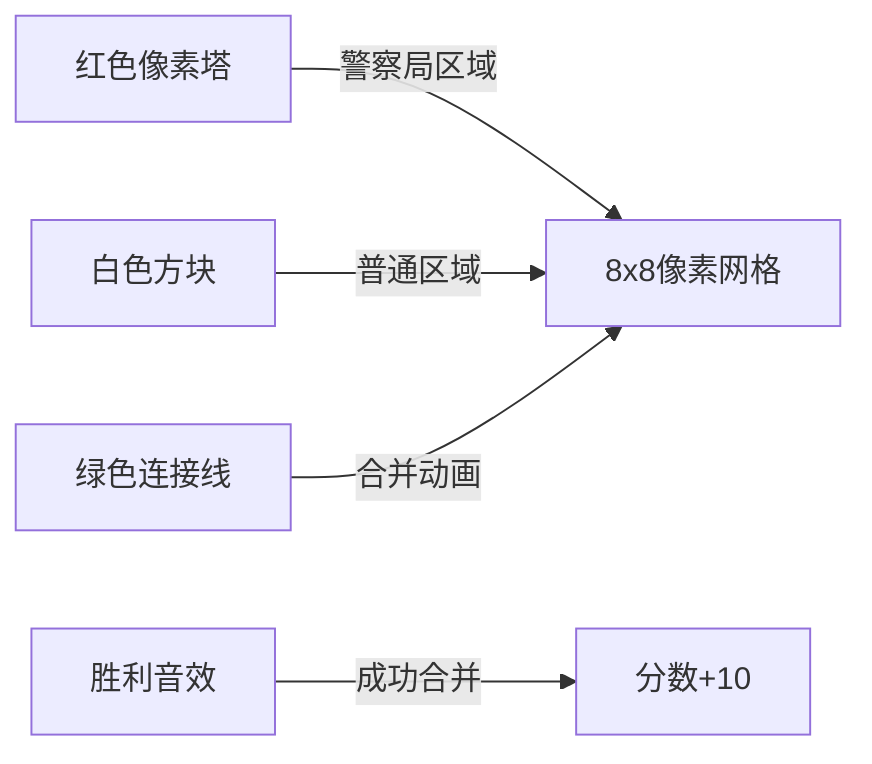

# 题目信息

# Hongcow Builds A Nation

## 题目描述

## CF744A Hongcow Builds A Nation

给出一张 $n$ 个点， $m$ 条边的无向图，其中有$k$个点是警察局

一个稳定的图要满足以下条件：  

- 无重边
- 无自环
- 每个连通块内最多只有一个警察局

你的任务是求最多**还能**加多少条边，使得加完边后的图还能是稳定的

## 说明/提示

$1 \le k \le n \le 1000$  
$0 \le m\le 10^5$

**数据保证初始时给出的图是稳定的**  
感谢 @_Wolverine 提供的翻译

## 样例 #1

### 输入

```
4 1 2
1 3
1 2
```

### 输出

```
2
```

## 样例 #2

### 输入

```
3 3 1
2
1 2
1 3
2 3
```

### 输出

```
0
```

# AI分析结果


### Kay的C++算法解析：Hongcow Builds A Nation 深入学习指南

#### 1. 题目解读与核心算法识别
✨ **本题主要考察**：`并查集` + `贪心策略`  
🗣️ **初步分析**：
> 解决本题如同建设城市网络：警察局是特殊枢纽（红色信号塔），普通区域是白色居民区。我们需要最大化道路建设，但确保每个区域最多一个红色信号塔。核心思想是通过并查集管理区域连通性，再用贪心策略合并普通区域到最优信号塔区域。

- **核心流程**：  
  1. 用并查集划分连通块，统计各块节点数、警察局状态  
  2. 独立计算各连通块内部可添加边数  
  3. 将无警察局区域合并到**最大**的有警察局区域  
  4. 计算合并后新区域的完全图边数  
- **可视化设计**：  
  用8位像素风呈现：  
  - 警察局区域显示为红色像素塔，普通区域为白色方块  
  - 合并时显示绿色连接线+“叮”音效  
  - 自动演示模式像《吃豆人》般逐步吞并区域，每合并成功播放胜利音效

---

#### 2. 精选优质题解参考
**题解一（作者：Atserckcn）**  
* **点评**：思路清晰展现并查集与贪心的结合。亮点在于：  
  - 用`pol[findfa(i)] |= pol[i]`高效标记警察局状态  
  - 变量`maxn`动态追踪最大连通块，`num`累计普通区域  
  - 代码规范：`getnum()`函数封装数学公式提高可读性  

**题解二（作者：友利奈緒）**  
* **点评**：突出实践价值，重点解决合并时的边数计算陷阱：  
  - 用`vis[]`避免重复计算连通块  
  - `ans += tot[fa(i)]*maxn`精准计算跨区域边数  
  - 调试心得强调“合并时需重置父节点计数”  

**题解三（作者：啊吧怪）**  
* **点评**：最简洁高效的实现：  
  - 用`police[find(i)] |= police[i]`位运算优化  
  - 仅用`maxx`和`summ`两个关键变量完成贪心合并  
  - 数学推导清晰：最终边数=Σ(独立区域完全图)+合并区域完全图-初始边数  

---

#### 3. 核心难点辨析与解题策略
1. **连通块状态管理**  
   *分析*：需同时跟踪节点数、警察局状态、已有边数。优质题解用并查集+辅助数组`cnt_node[]`和`pol[]`，通过`findfa(i)`统一状态更新  
   💡 **学习笔记**：并查集的`findfa()`不仅是路径压缩，更是状态聚合点  

2. **合并策略选择**  
   *分析*：普通区域必须合并到有警察局区域，且选择**最大区域**可使新增边数最大化（边数=两区域点数乘积）。贪心策略在此至关重要  
   💡 **学习笔记**：合并如同滚雪球——从最大核心开始能加速扩张  

3. **边数去重计算**  
   *分析*：初始边数`m`需在最终减去。题解三的`ans-m`看似简单，实际依赖前期独立的完全图计算  
   💡 **学习笔记**：分阶段计算（独立区域+合并区域）避免边数重复  

✨ **解题技巧总结**  
- **问题分解**：拆解为连通块划分→独立计算→合并优化三阶段  
- **数学封装**：将$n(n-1)/2$封装成`getnum()`函数提升可读性  
- **边界测试**：测试单警察局/无普通区域等边界用例  

---

#### 4. C++核心代码实现赏析
**通用核心实现（综合题解三）**  
```cpp
#include<bits/stdc++.h>
using namespace std;
int n,m,k,fa[1010],sum[1010],police[1010],ans,maxx,summ;

int find(int x) { return fa[x]==x ? x : fa[x]=find(fa[x]); }

int main() {
    cin>>n>>m>>k;
    for(int i=1;i<=n;i++) fa[i]=i;
    for(int i=1,x;i<=k;i++) cin>>x, police[x]=1;
    
    // 并查集合并
    for(int i=1,u,v;i<=m;i++) {
        cin>>u>>v;
        fa[find(u)]=find(v);
    }
    
    // 统计连通块状态
    for(int i=1;i<=n;i++) {
        sum[find(i)]++;
        police[find(i)] |= police[i];
    }
    
    // 独立计算各区域完全图边数
    for(int i=1;i<=n;i++) {
        int f=find(i);
        if(f!=i) continue;
        if(police[f]) {
            if(sum[f]>maxx) {
                ans += maxx*(maxx-1)/2; // 结算前最大区域
                maxx=sum[f];            // 更新最大区域
            } else ans += sum[f]*(sum[f]-1)/2;
        } else summ += sum[f]; // 累计普通区域
    }
    ans += (maxx+summ)*(maxx+summ-1)/2; // 合并后完全图
    cout<<ans-m; // 减去初始边数
}
```
**代码解读概要**：  
1. **初始化**：并查集父指针初始化  
2. **合并输入边**：动态连接连通块  
3. **状态统计**：`sum[]`记录节点数，`police[]`用位运算聚合状态  
4. **贪心计算**：非最大警察局区域立即结算，普通区域累计到`summ`  
5. **终极合并**：最终计算合并区域的完全图边数  

---

### 5. 算法可视化：像素动画演示
**主题**：《像素城市建造者》—— 用复古游戏演示区域合并  

**核心演示流程**：  


**关键交互设计**：  
1. **初始化阶段**  
   - 网格显示：警察局区域=红色像素塔（闪烁），普通区域=白色方块  
   - 控制面板：速度滑块/暂停/重置按钮 + 8-bit背景音乐  

2. **并查集合并**  
   - 输入边处理：两个方块间显示蓝色连线 + 清脆“连接”音效  
   - 实时显示父节点：从方块向父节点绘制黄色箭头  

3. **贪心合并演示**  
   - 最大警察局区域：红色塔增大+金色边框  
   - 普通区域合并：绿色脉冲线连接 + “叮”音效  
   - 动态公式显示：左下角实时更新：  
     `新增边 = ${当前区域大小} × ${被并区域大小}`  

4. **胜利结算**  
   - 最终合并：全屏绿色闪烁 + 播放《超级马里奥》过关音效  
   - 分数展示：`总边数 = ${完全图} - ${初始边数}`  

**技术实现**：  
- 用Canvas绘制网格，每个方块用10x10像素表示  
- 音效触发：合并时调用Web Audio API播放8-bit音效  
- 自动演示：setInterval控制步进，调速滑块调整interval值  

---

### 6. 拓展练习与相似问题思考
**通用技巧迁移**：  
并查集+贪心策略适用于：  
1. 网络连通性优化（如城市供电规划）  
2. 社交网络社群合并  
3. 资源分配中的最优聚合  

**洛谷题目推荐**：  
1. **P3367 【模板】并查集**  
   🗣️ 巩固并查集基本操作  
2. **P1196 [NOI2002] 银河英雄传说**  
   🗣️ 学习带权并查集在距离统计中的应用  
3. **P1456 Monkey King**  
   🗣️ 掌握并查集+堆维护贪心策略  

---

### 7. 学习心得与经验分享
> **来自题解二的调试经验**：  
> “合并时发现边数异常，最终发现未重置父节点计数——这提醒我们：并查集合并后需同步更新父节点状态”  
>   
> **Kay总结**：  
> 并查集的父子关系如同家族族谱，合并后务必让所有子节点认准新族长！

---

通过本次分析，我们深入掌握了并查集与贪心策略的配合技巧。记住：算法学习如同建造城市——先夯实基础（连通块），再规划发展（合并策略）！下次挑战再见！💪

---
处理用时：186.29秒