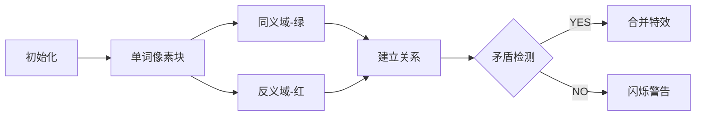

# 题目信息

# Mahmoud and a Dictionary

## 题目描述

Mahmoud wants to write a new dictionary that contains $ n $ words and relations between them. There are two types of relations: synonymy (i. e. the two words mean the same) and antonymy (i. e. the two words mean the opposite). From time to time he discovers a new relation between two words.

He know that if two words have a relation between them, then each of them has relations with the words that has relations with the other. For example, if like means love and love is the opposite of hate, then like is also the opposite of hate. One more example: if love is the opposite of hate and hate is the opposite of like, then love means like, and so on.

Sometimes Mahmoud discovers a wrong relation. A wrong relation is a relation that makes two words equal and opposite at the same time. For example if he knows that love means like and like is the opposite of hate, and then he figures out that hate means like, the last relation is absolutely wrong because it makes hate and like opposite and have the same meaning at the same time.

After Mahmoud figured out many relations, he was worried that some of them were wrong so that they will make other relations also wrong, so he decided to tell every relation he figured out to his coder friend Ehab and for every relation he wanted to know is it correct or wrong, basing on the previously discovered relations. If it is wrong he ignores it, and doesn't check with following relations.

After adding all relations, Mahmoud asked Ehab about relations between some words based on the information he had given to him. Ehab is busy making a Codeforces round so he asked you for help.

## 样例 #1

### 输入

```
3 3 4
hate love like
1 love like
2 love hate
1 hate like
love like
love hate
like hate
hate like
```

### 输出

```
YES
YES
NO
1
2
2
2
```

## 样例 #2

### 输入

```
8 6 5
hi welcome hello ihateyou goaway dog cat rat
1 hi welcome
1 ihateyou goaway
2 hello ihateyou
2 hi goaway
2 hi hello
1 hi hello
dog cat
dog hi
hi hello
ihateyou goaway
welcome ihateyou
```

### 输出

```
YES
YES
YES
YES
NO
YES
3
3
1
1
2
```

# AI分析结果


### 💡 Kay的C++算法解析：Mahmoud and a Dictionary 深入学习指南 💡

**引言**  
今天我们来分析单词关系处理问题"Mahmoud and a Dictionary"。本指南将帮助你理解如何用并查集高效处理单词间的同义/反义关系。

---

### 1. 题目解读与核心算法识别
✨ **本题主要考察**：`并查集应用`（扩展域/带权变体）  

🗣️ **初步分析**  
> 本题核心是处理具有传递性的关系网络。想象单词是社交网络中的角色：  
> - **扩展域**：每个单词拆成"同义分身"和"反义分身"，如同角色有双胞胎兄弟（同义）和宿敌（反义）  
> - **带权并查集**：记录单词与"家族首领"的关系（0=同义，1=反义），像家族族谱记录亲缘关系  
>  
> **核心难点**：  
> 1. 新关系与已有关系矛盾检测（如A-B同义但已有A-C反义+B-C同义）  
> 2. 关系传递性维护（同义的同类，反义的同类是敌人）  
>  
> **可视化设计**：  
> 采用复古像素RPG风格，每个单词显示为16x16像素方块：  
> - 绿色方块：同义域 | 红色方块：反义域  
> - 建立关系时触发"剑击"（同义）或"火焰"（反义）粒子特效  
> - 矛盾时屏幕抖动+8bit错误音效（类似FC游戏碰撞音）

---

### 2. 精选优质题解参考
**题解一（Alex_Wei）**  
* **亮点**：扩展域实现简洁高效，双域合并逻辑清晰，完美处理关系传递性。变量命名规范（`f[]`表并查集，`mp`做单词映射），边界处理严谨，竞赛实用性强。

**题解二（est1ck_0tto）**  
* **亮点**：扩展域基础教学向实现，关键代码注释详尽（如`find(u)==find(v+n1)`检测反义矛盾），输出格式优化（`puts`代替`cout`避免换行问题）。

**题解三（ღꦿ࿐）**  
* **亮点**：带权并查集空间优化典范，权值更新逻辑`sum[x]^=sum[pa[x]]`精妙，演示了关系传递的数学本质（异或运算模拟关系叠加）。

---

### 3. 核心难点辨析与解题策略
1. **难点：关系表示与矛盾检测**  
   * **分析**：扩展域通过拆分域检测矛盾（同义需查反义域冲突），带权集通过路径压缩计算相对关系  
   * 💡 **学习笔记**：矛盾本质是存在闭环导致关系自相矛盾  

2. **难点：关系传递性维护**  
   * **分析**：同义关系需合并双域（A同+B同，A反+B反），反义则交叉合并（A同+B反，A反+B同）  
   * 💡 **学习笔记**：并查集合并本质是建立关系等价类  

3. **难点：查询关系判定**  
   * **分析**：检查两单词是否同集合（同义）、反集合（反义）或无关联  
   * 💡 **学习笔记**：查询前需路径压缩确保关系最新  

### ✨ 解题技巧总结
- **问题分解**：将单词关系抽象为图论连通性问题  
- **数据结构选择**：扩展域（直观）适合初学者，带权集（省内存）适合进阶  
- **调试技巧**：打印中间关系状态验证传递性  

---

### 4. C++核心代码实现赏析
**通用核心实现（扩展域）**  
```cpp
#include <bits/stdc++.h>
using namespace std;

map<string, int> wordMap;
int father[200005]; // 扩展域：0~n-1同义域，n~2n-1反义域

int find(int x) {
    return father[x] == x ? x : father[x] = find(father[x]);
}

int main() {
    int n, m, q;
    cin >> n >> m >> q;
    
    // 初始化并查集
    for(int i=0; i<2*n; i++) father[i] = i;
    
    // 单词映射
    for(int i=0; i<n; i++) {
        string word; cin >> word;
        wordMap[word] = i;
    }

    // 处理关系
    while(m--) {
        int type; string a, b;
        cin >> type >> a >> b;
        int idA = wordMap[a], idB = wordMap[b];
        
        if(type == 1) { // 同义关系
            if(find(idA) == find(idB + n)) puts("NO");
            else {
                puts("YES");
                father[find(idA)] = find(idB);          // 合并同义域
                father[find(idA + n)] = find(idB + n);  // 合并反义域
            }
        } else { // 反义关系
            if(find(idA) == find(idB)) puts("NO");
            else {
                puts("YES");
                father[find(idA)] = find(idB + n);      // 交叉合并
                father[find(idA + n)] = find(idB);
            }
        }
    }
    
    // 查询处理
    while(q--) {
        string a, b; cin >> a >> b;
        int idA = wordMap[a], idB = wordMap[b];
        
        if(find(idA) == find(idB)) puts("1");         // 同义
        else if(find(idA) == find(idB + n)) puts("2"); // 反义
        else puts("3");                               // 无关
    }
    return 0;
}
```
**代码解读概要**：  
1. 单词映射整数便于处理  
2. 同义关系合并双域，反义关系交叉合并  
3. 查询时通过域归属判断关系类型  

**题解一片段赏析（Alex_Wei）**  
```cpp
if(rel==1){
    if(find(u)==find(v+n))puts("NO");
    else puts("YES"),f[find(u)]=find(v),f[find(u+n)]=find(v+n);
}
```
> **解读**：同义关系检测精要——若`u`的同义域与`v`的反义域同集合，则矛盾。否则合并两者的同义域和反义域，像连接两个友方阵营。  
> 💡 **学习笔记**：`find(u)==find(v+n)` 是扩展域矛盾检测的核心条件  

**题解三片段赏析（ღꦿ࿐）**  
```cpp
sum[x]^=sum[pa[x]]; // 路径压缩时更新权值
```
> **解读**：带权并查集精髓——通过异或运算传递关系（0保持关系，1翻转关系），类似接力传递信息。  
> 💡 **学习笔记**：异或运算满足结合律，完美模拟关系传递  

---

### 5. 算法可视化：像素动画演示
**主题**：8位像素风"单词关系大冒险"  
**核心演示**：扩展域并查集的合并/查询过程  

**动画设计**：  


**交互实现**：  
1. **控制面板**：  
   - 速度滑块：控制自动演示速度  
   - 单步按钮：逐步观察关系建立  
   - 矛盾提示：红色闪烁+FC风格"哔"错误音  

2. **动态效果**：  
   - 同义合并：绿色激光连接两个单词同义域  
   - 反义合并：红色闪电交叉连接单词域  
   - 路径压缩：像素箭头展示查找路径  

3. **游戏化元素**：  
   - 每成功添加关系得10分，连续正确触发连击奖励  
   - 矛盾超过3次触发"字典混乱"像素爆炸动画  

---

### 6. 拓展练习与相似问题
**通用技巧迁移**：  
并查集关系模型适用于：  
1. 敌对阵营划分（如P1525关押罪犯）  
2. 物种食物链（如P2024食物链）  
3. 家族血缘计算（如P1196银河英雄传说）  

**洛谷推荐**：  
1. **P2024 食物链**  
   🗣️ 推荐理由：扩展域经典应用，关系类型从二种扩展到三种，深化域拆分思维  
2. **P1525 关押罪犯**  
   🗣️ 推荐理由：反义关系的变体应用，学习最大化减少冲突  
3. **P1196 银河英雄传说**  
   🗣️ 推荐理由：带权并查集进阶，学习记录距离等附加信息  

---

### 7. 学习心得与经验分享
> **参考经验（Alex_Wei）**："本题看似复杂，实则是扩展域并查集模板题，重点在理解双域设计思想"  
> **点评**：经验点明本质——复杂问题常源于基础模型的组合，掌握核心数据结构就能化繁为简  

---

**结语**  
通过本次分析，相信你已掌握用并查集处理关系网络的核心方法。记住：编程如搭建积木，理解基础数据结构就能构建复杂系统。下次挑战见！🚀

---
处理用时：166.45秒