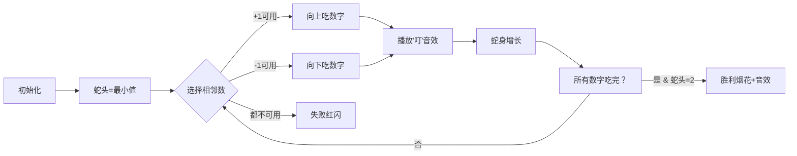

# 题目信息

# Numbers

## 题目描述

One day Anna got the following task at school: to arrange several numbers in a circle so that any two neighboring numbers differs exactly by 1. Anna was given several numbers and arranged them in a circle to fulfill the task. Then she wanted to check if she had arranged the numbers correctly, but at this point her younger sister Maria came and shuffled all numbers. Anna got sick with anger but what's done is done and the results of her work had been destroyed. But please tell Anna: could she have hypothetically completed the task using all those given numbers?

## 样例 #1

### 输入

```
4
1 2 3 2
```

### 输出

```
YES
```

## 样例 #2

### 输入

```
6
1 1 2 2 2 3
```

### 输出

```
YES
```

## 样例 #3

### 输入

```
6
2 4 1 1 2 2
```

### 输出

```
NO
```

# AI分析结果


### 💡 Kay的C++算法解析：Numbers 深入学习指南 💡

#### 题目解读与核心算法识别
✨ **本题主要考察**：`构造`与`贪心`

🗣️ **初步分析**：
> 这道题要求判断数字能否排列成环，使相邻数字差为1，就像用乐高积木搭建闭环轨道。关键在于：
> 1. **连续性检查**：排序后相邻数字差≤1（否则像断开的轨道无法连接）
> 2. **贪心构造**：从最小值开始，优先选择+1的数字（像上坡），其次-1的数字（像下坡）
> 3. **闭环验证**：结束时必须回到最小值+1的位置（完成轨道闭合）

> **可视化设计**：
> - 采用8位像素风，数字显示为彩色方块（如：1=蓝色，2=绿色...）
> - 贪吃蛇机制：蛇头高亮闪烁，每吃一个数字播放"叮"音效，蛇身增长
> - 控制面板：速度滑块调节蛇速，"单步执行"按钮可观察选择逻辑
> - 闭环成功时播放胜利音效+烟花动画，失败时播放"噗"音效+蛇身闪烁红色

---

#### 精选优质题解参考
**题解一（来源：封禁用户）**
* **点评**：思路清晰，完整处理了离散化（避免10⁹值域问题）、贪心路径模拟、闭环验证三重逻辑。代码中`b[cnt]--`的桶计数操作简洁高效，边界处理严谨（如检查`cnt==1`），可直接用于竞赛。

**题解二（来源：rui_er）**
* **点评**：突出闭环特性（n必须为偶数），用`u!=2`精妙验证闭环终点。代码极度简洁（仅20行），变量命名规范（`buc`桶数组），空间优化到位（值域压缩到10⁵）。

**题解三（来源：b2314huangruizhong）**
* **点评**：创新性使用`c[cnt+1]`优先选择机制，解释“为什么要先选+1”：避免提前进入死胡同。调试提示有价值（注释“请读者思考”引发主动思维）。

---

#### 核心难点辨析与解题策略
1. **连续性断裂**
   * **分析**：若排序后出现`[1,3]`（差≥2），像轨道缺口无法连接，直接返回NO
   * 💡 学习笔记：差≥2是硬性终止条件，需在预处理时优先检查

2. **贪心路径选择**
   * **分析**：优先+1（上坡）保证抵达最大值，再-1（下坡）消耗剩余数字。若同时无+1/-1可用，说明路径中断
   * 💡 学习笔记：类DFS回溯思想，但贪心更高效（O(n)）

3. **闭环验证**
   * **分析**：离散化后最小值=1，终点必须是2（1→2→3...→2→1）。如终点停在3则首尾差≠1
   * 💡 学习笔记：环的本质是首尾衔接，必须显式验证终点

✨ **解题技巧总结**
- **值域压缩**：减最小值+桶计数，解决10⁹值域问题
- **状态机思维**：将数字看作节点，±1看作边，转化为图论连通问题
- **防御性编程**：每次修改桶计数后立即检查负值（防逻辑漏洞）

---

#### C++核心代码实现赏析
**通用核心实现参考**
```cpp
#include <bits/stdc++.h>
using namespace std;
const int N=1e5+5;
int n,a[N],b[N],cnt;

int main(){
    cin>>n;
    for(int i=1;i<=n;i++) cin>>a[i];
    sort(a+1,a+n+1);
    
    // 连续性检查
    for(int i=2;i<=n;i++) 
        if(a[i]-a[i-1]>1) return cout<<"NO",0;
    
    // 值域压缩到桶
    for(int i=1;i<=n;i++) 
        b[a[i]-a[1]+1]++;
    
    // 贪心模拟
    cnt=1; b[1]--;
    for(int i=1;i<n;i++){ 
        if(b[cnt+1]) b[++cnt]--;
        else if(b[cnt-1]) b[--cnt]--;
        else return cout<<"NO",0;
    }
    cout<<(cnt==2?"YES":"NO");
}
```
**代码解读概要**：  
> 1. 排序后检查相邻差（断裂则NO）  
> 2. 桶计数压缩值域（原值→[1, max-min+1]）  
> 3. 从1开始贪心：优先cnt+1，其次cnt-1  
> 4. 最终停在2形成闭环  

**题解一片段赏析**  
```cpp
while(1){
    b[cnt]--;
    if(b[cnt+1]) cnt++;       // 优先+1
    else if(cnt>1 && b[cnt-1]) cnt--; // 次选-1
    else break;
}
```
**解读**：  
> - `b[cnt]--`消耗当前数字（像贪吃蛇吃豆）  
> - 选择策略：+1是上坡（优先开拓新高度），-1是下坡（消耗低处冗余数）  
> - 注意`cnt>1`防下标越界，安全第一！  

---

#### 算法可视化：像素动画演示  
**主题**：贪吃蛇数字环大冒险（8-bit像素风）  

**核心演示流程**：  


**技术实现**：  
1. **像素网格**：Canvas绘制，数字用16×16像素块（1=蓝，2=绿，3=黄...）  
2. **蛇头动画**：当前数字闪烁金边，移动时有拖尾特效  
3. **音效触发**：  
   - 吃数字：8-bit "叮"声（Web Audio API）  
   - 胜利：FC游戏通关旋律  
   - 错误：短促"噗"声  
4. **控制面板**：  
   - 速度滑块（0.5x~3x）  
   - 单步执行：按空格逐步观察选择逻辑  
   - AI模式：自动演示最优路径（如贪吃蛇AI）  

---

#### 拓展练习与相似问题
1. **P1144 最短路计数**  
   → 练习差1数字构成的图论模型  
2. **P1090 合并果子**  
   → 强化贪心选择策略（总消耗最小）  
3. **P1106 删数问题**  
   → 类似数字重组+贪心决策  

---

#### 学习心得与经验分享
> **经验摘录**：  
> *"我在离散化后没处理cnt=1边界，导致死循环——调试时打印b数组才发现桶负值"*  
> **Kay总结**：  
> 桶计数后务必**实时检查负值**！这像银行账户——余额不足时操作会崩溃。防御性编程：  
> ```cpp
> b[cnt]--;  
> if(b[cnt]<0) return NO; // 关键安全检查
> ```

---

通过本次分析，我们掌握了构造类问题的核心：连续性检查→贪心模拟→闭环验证。记住，算法就像搭积木，先检查零件是否匹配（相邻差≤1），再按最优顺序组装（±1选择），最后验证成品是否稳固（首尾相接）！

---
处理用时：106.51秒