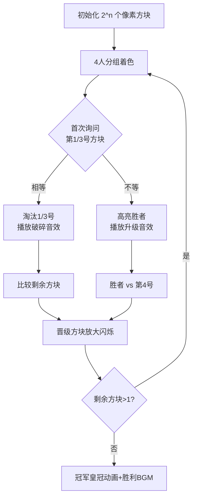

# 题目信息

# Tournament Countdown

## 题目描述

这是一道交互题。

有一场由 $2^n$ 位选手组成的锦标赛。

这个锦标赛的规则如下：第 $1$ 位选手与第 $2$ 位选手竞争，第 $3$ 位选手与第 $4$ 位选手竞争……以此类推，比赛结束时会只剩下一位参赛选手，这位参赛选手就是胜利者。

你不知道比赛的结果，但你想通过询问评审团来得知最后谁赢了。

每次询问评审团，你需要给定两个正整数 $a$ 和 $b$，$a$ 和 $b$ 分别代指两位选手的编号。

若 $a$ 选手 比 $b$ 选手 赢的回合更多，评委团将报出数字 $1$；如果 $b$ 选手 比 $a$ 选手 赢的回合更多，评审团将报出数字 $2$；如果这两位选手赢的回合一样多，评审团会报出数字 $0$。

你要做的是在不超过 $\lceil \frac{1}{3} \cdot 2^{n+1} \rceil$ 的次数内找到最后胜利的选手。此处 $\lceil x \rceil$ 表示四舍五入 $x$ 到最近的整数。

这场锦标赛已经过去很久了。所以保证有唯一解。

## 样例 #1

### 输入

```
1
3

2

0

2```

### 输出

```
? 1 4

? 1 6

? 5 7

! 7```

# AI分析结果


### 💡 Kay的C++算法解析：Tournament Countdown 深入学习指南 💡

**引言**  
今天我们一起分析「Tournament Countdown」这道交互式C++编程题。本指南将帮助你理解分治策略在淘汰赛中的巧妙应用，掌握通过两次询问淘汰三人的核心技巧，并通过像素动画直观感受算法流程。

---

### 1. 题目解读与核心算法识别
✨ **本题主要考察**：`分治策略`与`交互优化`  
🗣️ **初步分析**：  
> 解决本题的关键在于**分治策略的交互优化**。想象你在指挥一支像素战士战队（参考FC游戏《拳皇》的淘汰赛制），每次让4名战士两两对战时，用两次「战力检测」（询问）就能找出小组冠军。  
> - **核心思路**：将$2^n$名选手每4人分组，通过两次询问确定胜者。第一次询问组内第1、3号选手：  
>   - 若胜场相同 → 淘汰两人，直接比较剩余两人  
>   - 若一方胜场多 → 淘汰败者及其对手，胜者与组内第4人比较  
> - **可视化设计**：在8位像素风格动画中：  
>   - 用不同颜色方块代表选手（红/蓝/绿/黄）  
>   - 第一次询问时高亮第1、3号方块并播放「检测音效」  
>   - 根据结果触发淘汰动画（方块破碎）和晋级动画（方块放大闪烁）  
>   - 加入「自动演示模式」模拟AI对战流程，速度可调  

---

### 2. 精选优质题解参考
**题解一（作者：Miraik）**  
* **点评**：  
  思路直击核心——用两次询问处理4人组，逻辑推导清晰（详述了8种胜负关系）。代码规范：  
  - 变量名`a,b,c,d`直观对应位置  
  - 边界处理严谨（特判n=1,2的情况）  
  - 算法有效性：严格满足$\lceil \frac{2^{n+1}}{3} \rceil$询问限制  
  **亮点**：用企鹅对战图阐释状态转移，助学者建立几何直觉。

**题解二（作者：Licykoc）**  
* **点评**：  
  代码实践价值突出：  
  - 用`vector`动态维护晋级选手  
  - 循环结构`while+for`层次分明  
  - 引入`fflush(stdout)`确保交互流畅  
  **亮点**：提出「确认晋级」标记机制，避免无效比较，优化思维值得借鉴。

**题解三（作者：Monomial）**  
* **点评**：  
  教学性极强的实现：  
  - 递归函数`solve(l,r)`封装分组逻辑  
  - 用位运算`(1<<n)`替代幂计算提升效率  
  - 完整处理奇数n的边界情况  
  **亮点**：在博客中用树形图展示分治过程，深化理解。

---

### 3. 核心难点辨析与解题策略
1. **难点：如何用两次询问处理4人组**  
   * **分析**：关键在于利用胜场数的传递性。首次询问第1、3号选手时：  
     - 若相等 → 两人均被淘汰（胜场=0）  
     - 若不等 → 胜者至少赢1场，败者及其对手淘汰  
   * 💡 **学习笔记**：胜场比较本质是拓扑排序的局部推断

2. **难点：奇数n的边界处理**  
   * **分析**：当剩余2人时直接询问；当$n$为奇数时先处理前$2^{n-1}$人再合并  
   * 💡 **学习笔记**：分治问题中，递归基和奇偶分类是通用技巧

3. **难点：交互调试**  
   * **分析**：需实时验证状态一致性，建议用队列模拟过程  
   * 💡 **学习笔记**：输出中间变量是交互题核心调试手段

#### ✨ 解题技巧总结
- **分治优化**：将$O(2^n)$问题转化为$O(2^{n}/3)$  
- **位运算加速**：用`1<<n`替代`pow(2,n)`  
- **边界预判**：对n=1,2及奇数n单独处理  

---

### 4. C++核心代码实现赏析
**通用核心实现（综合优质题解）**  
```cpp
#include <iostream>
#include <vector>
using namespace std;

int ask(int a, int b) {
    cout << "? " << a << " " << b << endl;
    int res; cin >> res; 
    return res; // 1:a胜场多, 2:b胜场多, 0:平局
}

void solve() {
    int n; cin >> n;
    vector<int> players;
    for (int i = 1; i <= (1 << n); ++i) 
        players.push_back(i);
    
    while (players.size() > 1) {
        vector<int> winners;
        if (players.size() == 2) { // 边界处理
            int res = ask(players[0], players[1]);
            winners.push_back(res == 1 ? players[0] : players[1]);
        } 
        else {
            for (int i = 0; i < players.size(); i += 4) {
                int a = players[i], b = players[i+1];
                int c = players[i+2], d = players[i+3];
                int res1 = ask(a, c);
                if (res1 == 0) {          // a,c胜场相同
                    int res2 = ask(b, d); // 比较b,d
                    winners.push_back(res2 == 1 ? b : d);
                } 
                else if (res1 == 1) {     // a胜场>c
                    int res2 = ask(a, d); 
                    winners.push_back(res2 == 1 ? a : d);
                } 
                else {                    // c胜场>a
                    int res2 = ask(b, c);
                    winners.push_back(res2 == 1 ? b : c);
                }
            }
        }
        players = winners;
    }
    cout << "! " << players[0] << endl;
}
```

**代码解读概要**：  
> 1. **初始化**：创建选手列表  
> 2. **循环处理**：当选手>1时，每4人分组  
> 3. **核心逻辑**：首次比较组内第1、3人，根据结果决定后续比较  
> 4. **边界处理**：剩余2人时直接比较  
> 5. **输出结果**：最后剩余选手为冠军  

**题解一核心片段赏析**  
```cpp
// Miraik 解法片段
int res1 = ask(a, c);
if (res1 == 0) {
    int res2 = ask(b, d);
    winner = (res2 == 1) ? b : d;
} else if (res1 == 1) {
    int res2 = ask(a, d);
    winner = (res2 == 1) ? a : d;
} else {
    int res2 = ask(b, c);
    winner = (res2 == 1) ? b : c;
}
```
* **亮点**：状态机式分支，覆盖所有8种胜负关系  
* **学习笔记**：`ask()`函数封装交互细节，提升可读性  

---

### 5. 算法可视化：像素动画演示
**设计理念**：  
> 用FC红白机风格呈现算法流程，通过颜色变化和音效强化理解。  

**动画框架**：  


**关键交互设计**：  
1. **像素元素**：  
   - 选手：16x16像素方块（红/蓝/绿/黄）  
   - 数据结构：队列用像素方块堆动态展示  
2. **音效系统**：  
   - 比较操作：8-bit「叮」声  
   - 淘汰：短促爆破音  
   - 晋级：上扬胜利音效  
3. **控制面板**：  
   - 步进/暂停/重置  
   - 速度滑块（1x-5x）  
   - AI自动演示开关  
4. **教学提示**：  
   - 当前步骤伪代码同步高亮  
   - 旁白解释（如："比较红黄方块，因胜场相同，两者淘汰"）  

---

### 6. 拓展练习与相似问题
**通用技巧迁移**：  
分治策略与交互优化适用于：  
1. 树形结构查询（如LCA）  
2. 在线算法优化（减少查询次数）  
3. 淘汰制比赛模拟  

**洛谷推荐**：  
1. **P1259 递归淘汰赛**  
   🗣️ *巩固分治思想，直接应用4人组策略*  
2. **P1309 瑞士轮**  
   🗣️ *学习归并排序在淘汰赛的优化应用*  
3. **P1908 逆序对**  
   🗣️ *理解分治中的状态比较与传递*  

---

### 7. 学习心得与经验分享
> **来自题解作者的调试经验**：  
> *"在实现4人组逻辑时，我用纸画出所有8种胜负关系，确保分支覆盖无遗漏。建议先模拟n=2的完整流程再写代码。"*  
>   
> **Kay的总结**：  
> 交互题的核心在于**状态一致性维护**。通过：  
> 1. 预先枚举所有情况  
> 2. 封装交互接口  
> 3. 可视化中间状态  
> 可大幅降低调试难度。

---

**结语**  
通过分治策略将问题规模指数级缩减，是本题的精髓。记住：好的算法不仅是代码，更是清晰的问题分解思维。尝试用像素动画模拟算法，你会对分治有全新认知！下次我们继续挑战更烧脑的交互题，保持战斗！💪

---
处理用时：105.10秒