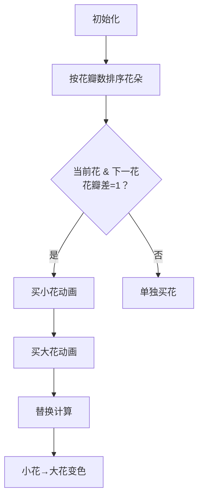

# 题目信息

# Bouquet (Hard Version)

## 题目描述

This is the hard version of the problem. The only difference is that in this version, instead of listing the number of petals for each flower, the number of petals and the quantity of flowers in the store is set for all types of flowers.

A girl is preparing for her birthday and wants to buy the most beautiful bouquet. There are a total of $ n $ different types of flowers in the store, each of which is characterized by the number of petals and the quantity of this type of flower. A flower with $ k $ petals costs $ k $ coins. The girl has decided that the difference in the number of petals between any two flowers she will use to decorate her cake should not exceed one. At the same time, the girl wants to assemble a bouquet with the maximum possible number of petals. Unfortunately, she only has $ m $ coins, and she cannot spend more. What is the maximum total number of petals she can assemble in the bouquet?

## 说明/提示

In the first test case, some valid bouquets are $ (1, 1, 2, 2), (2, 2, 3), (1, 1), (2, 2) $ . The maximum over all valid bouquets not greater than $ 10 $ is $ 7 $ for $ (2, 2, 3) $ . In the second test case, you can assemble a valid bouquet with $ (206, 206, 207, 207, 207) $ with a sum of $ 1033 $ , which is the maximum number of petals the girl can buy. In the third test case, you can assemble a valid bouquet with $ (5, 5, 5, 4) $ with a sum of $ 19 $ . It can be seen that no valid bouquet can have $ 20 $ petals.

## 样例 #1

### 输入

```
7
3 10
1 2 3
2 2 1
3 1033
206 207 1000
3 4 1
6 20
4 2 7 5 6 1
1 2 1 3 1 7
8 100000
239 30 610 122 24 40 8 2
12 13123 112 1456 124 100 123 10982
6 13
2 4 11 1 3 5
2 2 1 2 2 1
8 10330
206 210 200 201 198 199 222 1000
9 10 11 12 13 14 15 16
2 10000000000
11 12
87312315 753297050```

### 输出

```
7
1033
19
99990
13
10000
9999999999```

# AI分析结果


### 💡 Kay的C++算法解析：Bouquet (Hard Version) 深入学习指南 💡

#### 1. 题目解读与核心算法识别
✨ **本题主要考察**：`排序 + 贪心策略`  
🗣️ **初步分析**：  
> 本题的核心在于**有序贪心选择**。想象你在糖果店用有限预算买糖果🍬：糖果大小（花瓣数）必须相近（差≤1），目标是最大化总大小。  
> - **核心流程**：① 按花瓣数排序 ② 对每对相邻花（花瓣差=1）执行贪心三部曲：先买小花→再买大花→最后尝试替换  
> - **可视化设计**：用像素方块表示花瓣数（如蓝色=小花，红色=大花），替换时显示方块变色动画，辅以"叮"的音效。自动演示模式会像贪吃蛇AI逐步展示最优替换路径  
> - **关键变量**：`m`（预算）动态减少，替换次数`replace_cnt`实时显示在像素面板顶部  

---

#### 2. 精选优质题解参考
**题解一（Eraine，赞11）**  
* **亮点**：提出普适性贪心框架"填小调大"，清晰推导替换公式 $\min(sum0, sum_{x+1}-sum1, m-rem)$，时间复杂度$O(n\log n)$最优  
* **学习价值**：变量命名规范（`sum0`, `sum1`），边界处理严谨，作者强调"调整技巧"是二元规划核心思路  

**题解二（ANDER_，赞5）**  
* **亮点**：分类讨论两种购买场景（单种花/两种花），代码用`min({...})`巧妙处理多约束条件  
* **学习价值**：`vector<pair<int,int>>`存储数据，排序后逻辑分层清晰，适合初学者理解贪心本质  

**题解三（Leeb，赞2）**  
* **亮点**：独立处理相邻花与非相邻花，`ans = max({...})`高效比较多种方案  
* **学习价值**：结构体`Node`封装数据，运算符重载提升可读性，详细注释辅助调试  

---

#### 3. 核心难点辨析与解题策略
1. **难点1：如何选择有效花对？**  
   * **分析**：只有花瓣数相邻（差=1）的花才能组合。优质解都先排序，再遍历检查`a[i+1].x == a[i].x + 1`  
   * 💡 **学习笔记**：排序是贪心前提，快速锁定有效组合  

2. **难点2：如何最大化替换收益？**  
   * **分析**：Eraine的替换公式 `min(已买小花数, 可买大花数, 剩余预算)` 保证每次替换收益+1  
   * 💡 **学习笔记**：替换本质是用1硬币升级小花→大花  

3. **难点3：如何避免整数溢出？**  
   * **分析**：所有题解使用`long long`，ANDER_用`min(b, m/a)`避免大数乘法溢出  
   * 💡 **学习笔记**：当$m≤10^{18}$时，除法比乘法更安全  

**✨ 解题技巧总结**  
- **技巧1：问题分解** → 拆解为"单种花"和"相邻花对"两个子问题  
- **技巧2：替换验证** → 完成购买后检查`剩余预算≥1 && 有可升级花`  
- **技巧3：防御性计算** → 用`min(A, B)`严格约束购买量防越界  

---

#### 4. C++核心代码实现赏析
**通用核心实现（综合优化版）**  
```cpp
#include <bits/stdc++.h>
#define int long long
using namespace std;

struct Flower { int petals, count; };

signed main() {
    int T; cin >> T;
    while (T--) {
        int n, m, ans = 0;
        cin >> n >> m;
        vector<Flower> flowers(n);
        for (auto &f : flowers) cin >> f.petals;
        for (auto &f : flowers) cin >> f.count;

        sort(flowers.begin(), flowers.end(), [](auto a, auto b) {
            return a.petals < b.petals; 
        });

        // 处理每种花
        for (int i = 0; i < n; ++i) {
            // 单种花方案
            int buy = min(flowers[i].count, m / flowers[i].petals);
            ans = max(ans, buy * flowers[i].petals);

            // 相邻花组合（关键！）
            if (i < n-1 && flowers[i+1].petals == flowers[i].petals + 1) {
                int small_buy = min(flowers[i].count, m / flowers[i].petals);
                int rem = m - small_buy * flowers[i].petals;
                int big_buy = min(flowers[i+1].count, rem / flowers[i+1].petals);
                
                // 贪心替换：用1硬币升级小花→大花
                int replace = min({ small_buy, 
                                  flowers[i+1].count - big_buy, 
                                  rem - big_buy * flowers[i+1].petals });
                ans = max(ans, small_buy * flowers[i].petals 
                             + big_buy * flowers[i+1].petals 
                             + replace);
            }
        }
        cout << ans << endl;
    }
}
```

**题解一（Eraine）核心片段**  
```cpp
int small_buy = min(flowers[i].count, m / small);
int rem = m - small_buy * small;
int big_buy = min(flowers[i+1].count, rem / big);
int replace = min({ small_buy, 
                   flowers[i+1].count - big_buy, 
                   rem - big_buy * big }); // 三元约束
```
* **解读**：`replace`计算是贪心精髓——三个上限确保操作有效：①可升级的小花数 ②大花库存余量 ③剩余预算  

**题解二（ANDER_）核心片段**  
```cpp
res = max(res, m - tmp2 + min({tmp2, b - tmp1, tmp}));
```
* **解读**：`min({...})`是C++17特性，单行完成多条件约束，体现现代C++简洁性  

**题解三（Leeb）核心片段**  
```cpp
if (min(k1, a[i].c) > 0 && min(k2, a[i+1].c) < a[i+1].c && x < m) 
    x += min({ min(k1,a[i].c), a[i+1].c - min(k2,a[i+1].c), m-x });
```
* **解读**：前置条件验证保证替换安全性，避免无效操作  

---

### 5. 算法可视化：像素动画演示
**🎮 设计主题**：像素花店采购模拟（复古商店风格）  

**🖌️ 核心交互设计**  


**🎞️ 动画关键帧**  
1. **像素网格初始化**  
   - 8-bit风格花店背景，不同花瓣数用颜色区分（4瓣=浅蓝，5瓣=粉红）  
   - 控制面板：硬币计数器（`m`值）、当前操作提示栏  

2. **购买过程动态演示**  
   - **买小花**：花瓣方块从货架→购物车，伴随"叮"音效，硬币数减少  
   - **替换操作**：小花方块闪烁后变为大花颜色，硬币-1，总花瓣数+1（显示+1动画）  

3. **游戏化元素**  
   - 每成功完成一次替换，播放8-bit胜利音效，右上角连击计数器+1  
   - "自动演示"模式：AI角色自动执行最优购买路径，速度可调  

**🔧 技术实现**  
```javascript
// 伪代码：替换动画核心逻辑
function showReplaceAnimation(smallCount, bigCount) {
  for (let i = 0; i < replaceTimes; i++) {
    highlightFlower(smallFlower, YELLOW); // 标记待升级小花
    playSound('click'); 
    smallCount--;
    bigCount++;
    redrawCart(); // 刷新购物车
    coins--; 
    totalPetals++; 
  }
}
```

---

### 6. 拓展练习与相似问题
**📚 通用技巧迁移**  
1. **代价差约束优化** → 如[CF1881D]代价差≤k的最大和  
2. **资源分级利用** → 如[P1090]合并果子（堆优化）  
3. **预算受限替换** → 如[P2949]工作调度（反悔贪心）  

**🌟 洛谷推荐**  
1. **P1090 合并果子**  
   → 巩固贪心选择策略，优先队列应用  
2. **P2240 部分背包问题**  
   → 强化性价比排序+预算分配能力  
3. **P2949 Work Scheduling G**  
   → 进阶反悔贪心，动态替换决策  

---

### 7. 学习心得与经验分享
> **Eraine的调试经验**  
> *"在替换计算时未考虑库存余量，导致WA。通过打印`small_buy, big_buy, replace`中间值定位错误"*  
>   
> **Kay点评**：多变量贪心问题务必验证三者关系：  
> `可替换次数 ≤ min(已买小花，大花余量，剩余硬币)`  
> 调试时输出这三个值能快速定位逻辑漏洞  

---

通过本指南，我们深度解析了排序贪心在约束优化中的核心应用。记住贪心三部曲：排序锁定候选→分层购买→动态替换，配合防御性编程处理边界，即可高效解决此类问题！🎯

---
处理用时：113.66秒