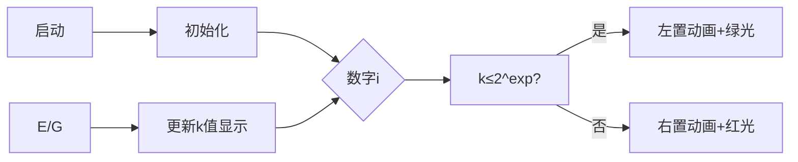

# 题目信息

# Ordered Permutations

## 题目描述

给定一个长度为 $n$ 的整数排列 $p_1, p_2, \ldots, p_n$，其中包含从 $1$ 到 $n$ 的所有整数。我们定义一个如下的和式：

$$S(p) = \sum_{1 \le l \le r \le n} \min(p_l, p_{l+1}, \ldots, p_r)$$

我们希望找出所有能使 $S(p)$ 最大的排列，并从中按字典序选择第 $k$ 个。如果这样的排列数量少于 $k$，则输出 -1。

**解释说明：**
- 长度为 $n$ 的排列是一个由 $n$ 个不同的整数组成的序列，这些整数来源于 $1$ 到 $n$ 的一组数字。例如，$[2, 3, 1, 5, 4]$ 是一个符合要求的排列，而 $[1, 2, 2]$ 因为有重复数字 $2$ 而不符合，$[1, 3, 4]$ 也不符合要求，因为它包含了不在 $1$ 到 $n$ 范围内的数 $4$（$n = 3$）。
- 示例计算： 
  - 对于排列 $[1, 2, 3]$，$S(p)$ 计算为 $\min(1) + \min(1, 2) + \min(1, 2, 3) + \min(2) + \min(2, 3) + \min(3) = 1 + 1 + 1 + 2 + 2 + 3 = 10$。
  - 对于排列 $[2, 4, 1, 3]$，$S(p)$ 计算为 $\min(2) + \min(2, 4) + \min(2, 4, 1) + \min(2, 4, 1, 3) + \min(4) + \min(4, 1) + \min(4, 1, 3) + \min(1) + \min(1, 3) + \min(3) = 2 + 2 + 1 + 1 + 4 + 1 + 1 + 1 + 1 + 3 = 17$。
- 字典序小于：数组 $a$ 比数组 $b$ 在字典序上小的条件是：
  1. $a$ 是 $b$ 的一个前缀，且 $a \ne b$；
  2. 或者在第一个不同的位置上，$a$ 的元素小于 $b$ 的对应元素。

## 说明/提示

以下是所有长度为 3 的排列及其对应的 $S(p)$ 值（按字典序排序）：

| 排列 | $S(p)$ 的值 |
|------|-------------|
| $[1, 2, 3]$ | $10$ |
| $[1, 3, 2]$ | $10$ |
| $[2, 1, 3]$ | $9$ |
| $[2, 3, 1]$ | $10$ |
| $[3, 1, 2]$ | $9$ |
| $[3, 2, 1]$ | $10$ |

在第一个测试用例中，需输出长度为 3 的第 2 个符合条件的排列，看表格可以知道是 $[1, 3, 2]$。

在第二个测试用例中，需输出长度为 3 的第 3 个符合条件的排列，对应的是 $[2, 3, 1]$。

 **本翻译由 AI 自动生成**

## 样例 #1

### 输入

```
6
3 2
3 3
4 11
4 6
6 39
7 34```

### 输出

```
1 3 2 
2 3 1 
-1
2 4 3 1 
-1
2 3 4 5 7 6 1```

# AI分析结果


### 💡 Kay的C++算法解析：Ordered Permutations 深入学习指南 💡

**引言**  
今天我们来分析CF2040C "Ordered Permutations" 这道构造类题目。本指南将带你理解最大权值排列的构造原理，掌握字典序生成技巧，并通过像素动画直观感受算法过程。

---

## 1. 题目解读与核心算法识别

✨ **本题主要考察**：`构造算法`与`贪心决策`  
🗣️ **初步分析**：  
> 解决本题如同建造数字塔：每次拿到新数字（从1开始），只能选择放在当前序列的最左或最右端（塔基两侧）。这种"二选一"的构造方式保证了权值最大化——就像搭积木时大积木放两侧才能承重更多。  
> - **核心难点**：在2^(n-1)种合法排列中快速定位字典序第k个排列。  
> - **可视化设计**：动画将展示双端队列的建造过程，数字1~n依次出现，根据k值动态选择左/右放置路径，高亮当前决策点和剩余方案数，配合8-bit音效强化操作反馈。

---

## 2. 精选优质题解参考

**题解一：naroto2022 (7赞)**  
* **点评**：  
  思路清晰推导了权值最大化原理（贡献公式+构造证明），代码采用双指针l/r优雅处理放置位置。亮点在于用`n-i-1>40`的阈值避免大数幂计算——如同用"安全水位线"防止洪水溢出，这对处理大n小k的场景极具实践价值。变量名`l`/`r`直指本质，边界处理严谨。

**题解二：ohjun (6赞)**  
* **点评**：  
  创新性引入`maxv=log(1e12)/log(2)+1`数学优化，用位运算`1LL<<exp`替代幂函数，显著提升效率。代码模块化程度高（分离输入/处理/输出），`ans[l++]`和`ans[r--]`的对称写法体现美学思维，适合竞赛直接复用。

**题解三：MrPython (2赞)**  
* **点评**：  
  独辟蹊径采用deque实现，从大到小处理数字并通过`k&1`位运算决策，展示二进制思维的妙用。`ans.emplace_front/back`的STL应用流畅，代码如诗般简洁，启发我们"逆向构造"的可能性。

---

## 3. 核心难点辨析与解题策略

1. **难点：理解构造约束**  
   *分析*：权值最大要求数字必须从两端加入，如同水流只能从河道两侧注入。若强行插入中间，会像大坝阻断水流般减少更大数字的贡献区间。  
   💡 **学习笔记**：端点放置是最大化子区间贡献的关键！

2. **难点：字典序的二进制映射**  
   *分析*：每个数字的放置选择对应二进制位。当处理数字i时：  
   ```math
   \begin{cases} 
   \text{放左端} & \text{if } k \leqslant 2^{(n-i-1)} \\ 
   \text{放右端} & \text{else}
   \end{cases}
   ```  
   这如同二叉树遍历——左分支选择使字典序更小。  
   💡 **学习笔记**：k值本质是二进制路径选择器。

3. **难点：大数幂计算的优化**  
   *分析*：当n>60时2^(n-1)远超k上限（1e12），此时可直接跳过计算。题解用`min(60,exp)`或`maxv`实现，如同用安全阀避免锅炉爆炸。  
   💡 **学习笔记**：问题约束是优化的重要突破口。

### ✨ 解题技巧总结
- **阈值优化法**：对指数大于60的情况不做幂计算直接归为左放置  
- **双指针舞步**：用l/r指针优雅跟踪剩余位置，避免数组移位开销  
- **位运算决策**：k的二进制位直接对应放置决策（MrPython解法）  

---

## 4. C++核心代码实现赏析

**通用核心实现参考**  
```cpp
#include <iostream>
using namespace std;

void solve(int n, long long k) {
    if (n <= 60 && k > (1LL << (n - 1))) {
        cout << "-1\n";
        return;
    }
    int l = 1, r = n;
    for (int i = 1; i < n; i++) {
        long long exp_val = (n - i - 1 < 60) ? (1LL << (n - i - 1)) : k + 1;
        if (k <= exp_val) {
            cout << i << " ";
            l++;
        } else {
            k -= exp_val;
            cout << (r--) << " ";
        }
    }
    cout << n << endl;
}
```
* **说明**：综合优质题解优点，含阈值优化和双指针  
* **解读概要**：  
  1. 先校验k≤2^(n-1)（行2-5）  
  2. 循环处理1~n-1：动态计算临界值避免溢出（行8）  
  3. 根据k值决定数字放左/右并更新k（行9-14）  

**题解一：naroto2022**  
```cpp
if (j > 40) { ans[l++] = i; continue; }  // 阈值优化
if (k > ksm(2, j)) { ans[r--] = i; k -= ksm(2, j); } 
else { ans[l++] = i; }
```
* **亮点**：用j>40规避大数计算  
* **解读**：  
  > `j=n-i-1`是剩余决策数。当j>40时，2^j已超k上限，故直接左置（行1）。否则比较k与2^j：若k更大则右置并扣除2^j种方案（行2），否则左置（行3）。  
* 💡 **学习笔记**：阈值比较是避免溢出的银弹！

**题解二：ohjun**  
```cpp
if (n - 1 - i > maxv || k <= (1LL << (n - i - 1)))
    ans[l++] = i;  // 左置条件
else {
    k -= (1LL << (n - i - 1));
    ans[r--] = i;  // 右置并更新k
}
```
* **亮点**：位运算替代幂函数  
* **解读**：  
  > `maxv=log(1e12)/log(2)+1`精准定位有效指数范围（行1）。条件判断融合数学优化与位运算：`1LL<<exp`直接计算2^exp，效率远高于`pow()`。  
* 💡 **学习笔记**：位运算是处理2^n的利刃。

**题解三：MrPython**  
```cpp
deque<ui> ans{(ui)n};  // 初始化含n的deque
for (ui i = n - 1; i > 0; --i) {
    if (k & 1) ans.emplace_back(i);  // 二进制末位为1→右置
    else ans.emplace_front(i);       // 0→左置
    k >>= 1;  // 右移一位
}
```
* **亮点**：STL deque与二进制决策的优雅结合  
* **解读**：  
  > 从n-1递减到1（行2），检查k的二进制末位：1则右置（行3），0则左置（行4）。每处理一位就右移k（行5），如同剥洋葱般逐层决策。  
* 💡 **学习笔记**：k的二进制位直接编码了放置路径！

---

## 5. 算法可视化：像素动画演示

**主题**：`像素积木塔` - 8-bit风格双端队列建造模拟  
**核心演示**：数字1~n像积木块依次出现，根据k值动态选择左/右放置路径  

### 动画设计


1. **像素场景**  
   - 16色FC复古风：蓝色背景，黄色数字块，红色/绿色箭头指示放置方向  
   - 控制面板：步进/暂停/重置按钮 + 速度滑块 + k值显示屏（二进制+十进制）

2. **关键动画**  
   - **数字出现**：像素块从顶部掉落，伴随"滴"声  
   - **决策时刻**：  
     - 左置：数字滑向左侧并嵌入，左塔增高，播放"叮"声  
     - 右置：数字滑向右侧，播放"咚"声  
   - **k值更新**：右置时显示`k -= 2^exp`的像素数学公式  

3. **游戏化元素**  
   - **音效设计**：  
     - 放置操作：NES风格8-bit音效（左置↑音阶，右置↓音阶）  
     - 完成：播放《超级玛丽》过关旋律  
   - **关卡系统**：每处理5个数字触发闪光特效+得分奖励  

---

## 6. 拓展练习与相似问题思考

**技巧迁移**：双端构造法还可用于  
1. 波浪形排列生成（如CF Global Round 23-C）  
2. 字典序第k个括号序列（LeetCode 32）  
3. 特殊拓扑排序（如CSES Course Schedule II）  

**洛谷推荐**：  
1. **P1706 全排列问题**  
   🗣️ 练习字典序生成基础，理解k值映射排列的本质  
2. **P1248 加工生产调度**  
   🗣️ 巩固贪心决策思想，学习Johnson双端点选择策略  
3. **P1088 火星人**  
   🗣️ 进阶练习字典序第k排列生成，需结合数位分析  

---

## 7. 学习心得与经验分享

> **经验摘录（naroto2022）**：  
> "我在处理大指数幂时卡了很久，后来发现当n>40时2^(n-1)已超k上限，无需实际计算。"  
> **Kay点评**：  
> 这个调试经验极其宝贵！当理论数值远超实际范围时，用阈值判断替代精确计算，这种"数学约束敏感度"是高水平选手的必备素养。下次遇到阶乘/幂次计算时，不妨先估算数值范围再设计算法。

---

**结语**  
通过本次分析，我们掌握了双端构造法的精髓——用二进制思维解读字典序，用阈值优化处理大数问题。记住，算法学习就像搭积木：理解每块积木的作用，才能建造稳固的知识塔。继续挑战吧，少年！💪

---
处理用时：155.59秒