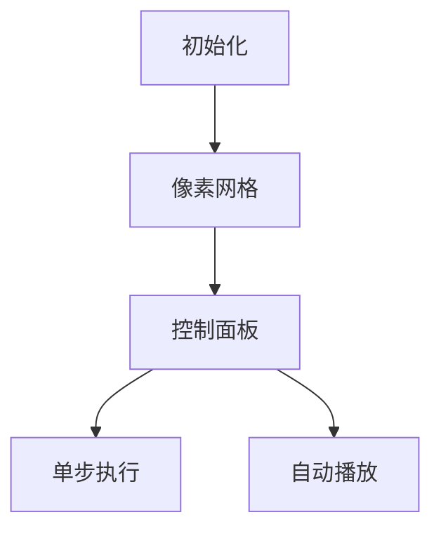

# 题目信息

# Refined Product Optimality

## 题目描述

As a tester, when my solution has a different output from the example during testing, I suspect the author first.

— Chris, [a comment](https://codeforces.com/blog/entry/133116?#comment-1190579)


Although Iris occasionally sets a problem where the solution is possibly wrong, she still insists on creating problems with her imagination; after all, everyone has always been on the road with their stubbornness... And like ever before, Iris has set a problem to which she gave a wrong solution, but Chris is always supposed to save it! You are going to play the role of Chris now:

- Chris is given two arrays $ a $ and $ b $ , both consisting of $ n $ integers.
- Iris is interested in the largest possible value of $ P = \prod\limits_{i=1}^n \min(a_i, b_i) $ after an arbitrary rearrangement of $ b $ . Note that she only wants to know the maximum value of $ P $ , and no actual rearrangement is performed on $ b $ .
- There will be $ q $ modifications. Each modification can be denoted by two integers $ o $ and $ x $ ( $ o $ is either $ 1 $ or $ 2 $ , $ 1 \leq x \leq n $ ). If $ o = 1 $ , then Iris will increase $ a_x $ by $ 1 $ ; otherwise, she will increase $ b_x $ by $ 1 $ .
- Iris asks Chris the maximum value of $ P $ for $ q + 1 $ times: once before any modification, then after every modification.
- Since $ P $ might be huge, Chris only needs to calculate it modulo $ 998\,244\,353 $ .

Chris soon worked out this problem, but he was so tired that he fell asleep. Besides saying thanks to Chris, now it is your turn to write a program to calculate the answers for given input data.

Note: since the input and output are large, you may need to optimize them for this problem.

For example, in C++, it is enough to use the following lines at the start of the main() function:

```
<pre class="lstlisting">```
int main() {<br></br>    std::ios::sync_with_stdio(false);<br></br>    std::cin.tie(nullptr); std::cout.tie(nullptr);<br></br>}<br></br>
```
```

## 说明/提示

In the first test case:

- Before the modifications, Chris can rearrange $ b $ to $ [1, 2, 3] $ so that $ P = \prod\limits_{i=1}^n \min(a_i, b_i) = 1 \cdot 1 \cdot 2 = 2 $ . We can prove that this is the maximum possible value. For example, if Chris rearranges $ b = [2, 3, 1] $ , $ P $ will be equal $ 1 \cdot 1 \cdot 1 = 1 < 2 $ , which is not optimal.
- After the first modification, Chris can rearrange $ b $ to $ [1, 2, 3] $ so that $ P = 1 \cdot 1 \cdot 3 = 3 $ , which is maximized.
- After the second modification, Chris can rearrange $ b $ to $ [2, 2, 3] $ so that $ P = 1 \cdot 1 \cdot 3 = 3 $ , which is maximized.
- After the third modification, Chris can rearrange $ b $ to $ [2, 2, 3] $ so that $ P = 6 $ , which is maximized.
- After the fourth modification, Chris can rearrange $ b $ to $ [2, 2, 4] $ so that $ P = 6 $ , which is maximized.

## 样例 #1

### 输入

```
4
3 4
1 1 2
3 2 1
1 3
2 3
1 1
2 1
6 8
1 4 2 7 3 5
7 6 5 6 3 3
2 5
1 6
1 5
1 5
1 5
2 3
2 3
1 6
13 8
7 7 6 6 5 5 5 2 2 3 4 5 1
1 4 1 9 6 6 9 1 5 1 3 8 4
2 2
2 11
2 4
2 4
1 7
1 1
2 12
1 5
5 3
10000000 20000000 30000000 40000000 50000000
10000000 20000000 30000000 40000000 50000000
1 1
2 2
2 1```

### 输出

```
2 3 3 6 6
840 840 1008 1344 1680 2016 2016 2016 2352
2116800 2646000 3528000 3528000 3528000 4233600 4838400 4838400 4838400
205272023 205272023 205272023 264129429```

# AI分析结果


### 💡 Kay的C++算法解析：Refined Product Optimality 深入学习指南 💡

**引言**  
今天我们来分析CF2053D这道题。题目要求通过重排数组b最大化∏min(ai, bi)，并支持动态修改a/b数组元素值。本指南将帮助你掌握核心贪心策略、动态维护技巧和模运算优化。

---

## 1. 题目解读与核心算法识别

✨ **本题主要考察**：贪心策略 + 动态维护 + 模运算优化  

🗣️ **初步分析**：  
> 解决本题的核心在于**排序不等式**的变种应用。想象两个队伍按身高排队握手，高个子与高个子握手会产生"浪费"，最优策略是让两队都按身高排序后依次握手（取min值）。  

- **核心难点**：动态修改时如何高效维护排序状态和乘积答案  
- **解决方案**：  
  1. 初始时将a/b排序，计算对应位置min值的乘积  
  2. 修改时用二分找到最后一个等于原值的元素位置  
  3. 用逆元撤销旧贡献，更新值后重新计算贡献  
- **可视化设计**：  
  采用8位像素风格展示两个排序数组，修改时高亮目标位置并显示逆元计算过程。关键动画包括：  
  - 排序数组的像素条状可视化  
  - 修改位置闪烁红光 + "叮"音效  
  - 答案更新公式：`ans = ans * inv(old) * new % mod`  

---

## 2. 精选优质题解参考

**题解一（作者：cjh20090318）**  
* **点评**：  
  思路清晰度 ★★★★☆（严谨证明排序最优性）  
  代码规范性 ★★★★☆（变量命名`c/d`表排序数组，边界处理完善）  
  算法有效性 ★★★★★（O(n log n + q log n)复杂度）  
  实践价值 ★★★★★（可直接用于竞赛，含快速幂逆元模板）  
  **亮点**：用邻项交换法严格证明贪心策略，代码模块化程度高  

**题解二（作者：Drifty）**  
* **点评**：  
  思路清晰度 ★★★★☆（简洁说明贪心本质）  
  代码规范性 ★★★★★（C++20标准库应用，类型别名提升可读性）  
  算法有效性 ★★★★☆（相同时间复杂度）  
  实践价值 ★★★★☆（适合掌握现代C++特性的学习者）  
  **亮点**：使用`vector`替代原生数组，避免越界风险  

**题解三（作者：Eason_cyx）**  
* **点评**：  
  思路清晰度 ★★★★☆（详细解释二分定位原理）  
  代码规范性 ★★★☆☆（维护原始数组和排序数组）  
  算法有效性 ★★★★☆（相同时间复杂度）  
  实践价值 ★★★☆☆（包含调试心得，适合初学者）  
  **亮点**：独立解题的思考过程分享，强调边界情况处理  

---

## 3. 核心难点辨析与解题策略

1. **贪心策略证明**  
   * **分析**：需严格证明排序后对应位置取min是最优解。通过邻项交换法分析：若存在逆序对，交换后结果不会更优（6种情况分类讨论）  
   * 💡 学习笔记：排序不等式是贪心基础，掌握邻项交换法证明技巧  

2. **动态维护有序性**  
   * **分析**：修改单个元素时，通过二分查找最后一个等于原值的元素位置进行更新（`upper_bound -1`），保证数组保持有序  
   * 💡 学习笔记：修改有序数组时，优先操作末尾元素可避免破坏有序性  

3. **模运算更新**  
   * **分析**：乘积需模998244353（质数），更新时用费马小定理求逆元：`inv(a) = a^(mod-2) % mod`  
   * 💡 学习笔记：模质数下的除法等价于乘逆元，快速幂实现O(log mod)  

### ✨ 解题技巧总结
- **技巧A 问题分解**：将动态维护分解为排序、定位、更新三步骤  
- **技巧B 边界处理**：特别注意二分查找的边界条件（`upper_bound`返回值）  
- **技巧C 逆元优化**：预先编写快速幂模板避免重复编码  

---

## 4. C++核心代码实现赏析

**本题通用核心C++实现**  
```cpp
#include<bits/stdc++.h>
#define int long long
using namespace std;
const int mod = 998244353;
const int N = 2e5+5;

int qpow(int a, int b=mod-2) {
    int res = 1;
    for(; b; b>>=1, a=a*a%mod) 
        if(b&1) res=res*a%mod;
    return res;
}

void solve() {
    int n, q; cin >> n >> q;
    vector<int> a(n+1), b(n+1), sa(a), sb(b);
    
    for(int i=1; i<=n; i++) cin >> sa[i];
    for(int i=1; i<=n; i++) cin >> sb[i];
    sort(sa.begin()+1, sa.end());
    sort(sb.begin()+1, sb.end());
    
    int ans = 1;
    for(int i=1; i<=n; i++) 
        ans = ans * min(sa[i], sb[i]) % mod;
    
    cout << ans << " ";
    while(q--) {
        int op, x; cin >> op >> x;
        auto& arr = (op==1 ? sa : sb);
        auto& orig = (op==1 ? a : b);
        int pos = upper_bound(arr.begin(), arr.end(), orig[x]) - arr.begin() - 1;
        
        ans = ans * qpow(min(sa[pos], sb[pos])) % mod;
        orig[x]++; arr[pos]++;
        ans = ans * min(sa[pos], sb[pos]) % mod;
        
        cout << ans << " ";
    }
    cout << "\n";
}

signed main() {
    ios::sync_with_stdio(0);
    cin.tie(0);
    int T; cin >> T;
    while(T--) solve();
}
```

**代码解读概要**：  
1. 使用`vector`存储原始数组和排序数组  
2. `qpow`实现快速幂求逆元  
3. 修改时通过`upper_bound`定位最后一个等于原值的位置  
4. 先撤销旧贡献（乘逆元），更新值后计算新贡献  

---

## 5. 算法可视化：像素动画演示

**主题**："排序守卫者"像素冒险  
**核心演示**：动态维护有序数组的修改过程  

### 动画设计细节：


1. **场景设计**：
   - 8位像素风格，双色条形图表示排序后的a/b数组
   - 控制面板：开始/暂停、单步、速度滑块（调速范围0.5x-2x）

2. **关键帧流程**：
   ```python
   # 伪代码逻辑
   def update_animation(op, x):
       highlight_target(x)        # 闪烁红光标记修改位置
       play_sound('select')       # 选择音效
       pos = binary_search(x)      # 显示二分查找过程
       show_formula(f"ans /= {old}")  # 显示逆元计算
       increment_value(pos)        # 目标位置+1
       show_formula(f"ans *= {new}")  # 显示新贡献
       play_sound('success' if new>old else 'neutral')
   ```

3. **游戏化元素**：
   - 每成功处理一次修改获得★奖励
   - 连续正确触发"Combo!"特效
   - 背景音乐：8-bit风格循环BGM
   - 音效设计：
     * 选择元素：NES经典"咔哒"声
     * 正确更新：马里奥吃金币音效
     * 错误操作：塞尔达警告音

4. **技术实现**：
   - Canvas绘制排序数组条形图
   - 修改时调用`requestAnimationFrame`更新
   - 音效使用Web Audio API

---

## 6. 拓展练习与相似问题

1. **洛谷 P1106** - 删数问题  
   * 🗣️ **推荐理由**：强化贪心策略训练，理解局部最优到全局最优

2. **洛谷 P1908** - 逆序对  
   * 🗣️ **推荐理由**：深入掌握分治/归并排序，理解有序性维护

3. **洛谷 P1496** - 火烧赤壁  
   * 🗣️ **推荐理由**：区间类贪心问题，训练问题抽象能力

---

## 7. 学习心得与经验分享

> **参考经验（来自 Eason_cyx）**：  
> "第一次自己做出Div.2D，调试时发现二分边界处理错误，通过打印中间变量定位问题。这提醒我们：二分查找必须验证边界！"  
>   
> **点评**：边界条件是二分法的核心难点，建议：  
> 1. 测试空数组/单元素等边界情况  
> 2. 使用`assert`验证查找位置  
> 3. 理解`upper_bound/lower_bound`返回值意义  

---

**结语**  
通过本题我们掌握了贪心策略的证明方法、动态维护技巧和模运算优化。记住：编程能力提升源于持续实践和深度思考。下次挑战见！🚀

---
处理用时：109.32秒