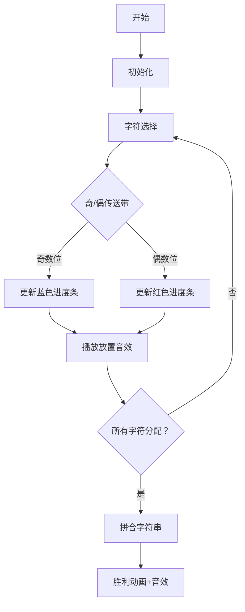

# 题目信息

# Even String

## 题目描述

你需要构造一个由小写拉丁字母组成的字符串 $s$，满足以下条件：
- 对于任意两个满足 $s_{i} = s_{j}$ 的下标 $i$ 和 $j$，这两个下标之差的绝对值为偶数，即 $|i - j| \bmod 2 = 0$。

构造任意字符串太简单了，因此你会被给定一个包含 $26$ 个数字的数组 $c$ —— 表示字符串 $s$ 中每个字母必须出现的次数。也就是说，对于每个 $i \in [1, 26]$，拉丁字母表中的第 $i$ 个字母必须恰好出现 $c_i$ 次。

你的任务是计算满足所有这些条件的不同字符串 $s$ 的数量。由于答案可能非常大，请输出其对 $998\,244\,353$ 取模后的结果。

## 说明/提示

- 在第一个测试用例中，有 $4$ 个满足条件的字符串："abak"、"akab"、"baka" 和 "kaba"。


翻译由 DeepSeek V3 完成

## 样例 #1

### 输入

```
5
2 1 0 0 0 0 0 0 0 0 1 0 0 0 0 0 0 0 0 0 0 0 0 0 0 0
3 1 1 0 0 0 0 0 0 0 0 0 0 0 0 1 0 1 0 0 0 0 0 0 1 0
0 0 0 0 0 0 0 0 0 0 0 0 1 0 3 0 0 0 0 0 0 0 0 0 0 0
1 2 0 0 0 0 0 0 0 0 0 0 0 0 0 0 0 0 0 0 0 0 0 0 0 0
1 2 3 4 5 6 7 8 9 10 11 12 13 14 15 16 17 18 19 20 21 22 23 24 233527 233827```

### 输出

```
4
960
0
1
789493841```

# AI分析结果


### 题目解读与核心算法识别
✨ **本题主要考察**：**组合数学与动态规划**

🗣️ **初步分析**：
> 解决 "Even String" 的关键在于将字符串按奇偶位置拆分为两个独立子串。想象将字符放入两个并行的传送带（奇数位和偶数位），相同字符只能选择一条传送带放置。核心难点在于：
> - **动态规划背包建模**：统计字符分配到奇/偶位置的合法方案数（满足位置容量约束）
> - **多重集排列组合**：对已分配的字符进行内部排列计算
> 
> 可视化方案将设计为**8位像素风传送带模拟**：奇数位（蓝色传送带）和偶数位（红色传送带），字符块以像素方块呈现。当字符放入时：
> 1. 传送带剩余容量实时显示（像素进度条）
> 2. 相同字符放入同传送带时播放 "叮" 音效
> 3. 分配完成后两传送带拼合为完整字符串，胜利音效响起

---

### 精选优质题解参考

**题解一（chm_qwq）**
* **点评**：  
  思路清晰直击本质，将问题分解为分配方案数（背包DP）与排列方案数（组合公式）两部分。代码亮点：
  - 一维背包优化空间复杂度至O(S)
  - 数学推导严谨：发现排列数与分配无关，大幅简化计算
  - 预处理阶乘优化组合计算，边界处理完善
  - 代码简洁规范（变量名`S0/S1`等含义明确）

**题解二（zhangzhixing99）**
* **点评**：  
  采用二维DP状态机思路，亮点在于：
  - 状态定义`f[i][j]`具象化（前i字符占用j个奇数位）
  - 双决策转移（奇/偶位置）配合组合数计算
  - 详细注释与模块化函数（`comb()`可读性高）
  - 鲁棒性处理：`j`的范围限制避免越界

**题解三（wcy110614）**
* **点评**：  
  创新性逆向状态设计：
  - `f[i][j]`表示剩余j个奇数位（而非已占用）
  - 组合数参数动态计算体现位置余量思维
  - 代码精简但包含关键优化：`c[i]=0`时直接继承状态
  - 空间复用技巧降低内存消耗

---

### 核心难点辨析与解题策略

1.  **位置容量约束**
    * **分析**：每个字符必须整体放入奇/偶位置组，需满足`∑奇数字符 = ceil(n/2)`。优质解用背包DP验证分配可行性
    * 💡 **学习笔记**：位置分配需满足严格等式约束

2.  **动态规划状态设计**
    * **分析**：二维DP状态中`j`需同时考虑当前决策与累计约束。解法二/三通过`j`（已用/剩余奇数位）实现双路径决策
    * 💡 **学习笔记**：状态定义需关联全局约束（总位置数）

3.  **组合数计算优化**
    * **分析**：多重集排列公式`S1!S0!/∏c_i!`需大数模运算。所有解法均预处理阶乘+逆元，将O(n)计算降至O(1)
    * 💡 **学习笔记**：阶乘预处理是组合计数的通用优化手段

### ✨ 解题技巧总结
- **问题分解法**：将限制条件拆解为（1）字符分配（2）组内排列
- **数学洞察**：发现排列结果与分配方案无关的恒定性质
- **背包复用**：一维DP倒序更新避免状态污染
- **边界防御**：组合数计算前检查`n>=m`（否则返回0）

---

### C++核心代码实现赏析
**本题通用核心实现参考**  
* **说明**：综合自优质题解的一维背包方案，兼顾效率与可读性
```cpp
#include <bits/stdc++.h>
using namespace std;
const int N = 500010, mod = 998244353;
typedef long long ll;

ll f[N], fc[N], inv[N];
ll qpow(ll a, ll b) {
    ll res = 1;
    for(; b; b >>= 1, a = a * a % mod) 
        if(b & 1) res = res * a % mod;
    return res;
}

void init() { // 预处理阶乘及逆元
    fc[0] = 1;
    for(int i = 1; i < N; i++) fc[i] = fc[i-1] * i % mod;
    inv[N-1] = qpow(fc[N-1], mod-2);
    for(int i = N-2; i >= 0; i--) 
        inv[i] = inv[i+1] * (i+1) % mod;
}

int main() {
    init();
    int T; scanf("%d", &T);
    while(T--) {
        ll S = 0, ans = 1;
        vector<int> c(27);
        for(int i = 1; i <= 26; i++) {
            scanf("%d", &c[i]);
            S += c[i];
            ans = ans * inv[c[i]] % mod; // ∏(1/c_i!)
        }
        ll S1 = (S + 1) / 2, S0 = S / 2;

        memset(f, 0, sizeof f);
        f[0] = 1;
        for(int i = 1; i <= 26; i++) // 一维背包
            for(int j = S0; j >= c[i]; j--) 
                f[j] = (f[j] + f[j - c[i]]) % mod;

        ans = ans * f[S0] % mod * fc[S1] % mod * fc[S0] % mod;
        printf("%lld\n", ans);
    }
}
```

**题解一核心代码片段**  
```cpp
// 背包DP部分（滚动数组优化）
for(int i = 1;i <= 26;i++) {
    if(!c[i]) continue;
    for(int j = S;j >= 0;j--) 
        if(j + c[i] <= S) 
            dp[j+c[i]] = (dp[j+c[i]]+dp[j]) % mod;
}
```
* **代码解读**：  
  > 外层遍历26个字符，内层倒序更新背包状态。`dp[j]`表示偶数位使用j个的方案数。当字符`i`放入偶数位时，状态从`dp[j]`转移到`dp[j+c[i]]`，避免同一字符重复计数。

**题解二决策转移片段**  
```cpp
if (g_s[i] - j <= R && g_s[i - 1] >= j) // 放偶数位
    f[i][j] += f[i-1][j] * comb(R - (g_s[i-1]-j), c[i]);
if (j >= c[i]) // 放奇数位
    f[i][j] += f[i-1][j-c[i]] * comb(L - (j-c[i]), c[i]);
```
* **代码解读**：  
  > 第一分支：当前字符放偶数位，需满足偶数位剩余容量`R-(已用偶数位)>=c[i]`，组合数计算放置方案  
  > 第二分支：放奇数位时，`j`需预留足够容量，组合数基于奇数位剩余空间计算

---

### 算法可视化：像素动画演示
**主题**：双传送带分配模拟（复古工厂风格）  

**关键交互设计**：


**实现细节**：
1. **像素元素**：
   - 字符块：16x16像素方块，中心显示字母
   - 传送带：顶部状态栏显示`S1: ▮▮▮▯▯`（已用/总量）
2. **音效设计**：
   - 放置字符：8-bit "嘀"声
   - 错误放置：短促警告音
   - 完成分配：FC胜利旋律
3. **控制面板**：
   - 步进/暂停/重置按钮
   - 速度滑块（0.5x~2x）
   - 奇偶分配计数器实时刷新
4. **动态演示**：
   ```python
   # 伪代码逻辑
   for char in chars:
        highlight(char) # 当前字符高亮
        if mouse.click(odd_channel) and odd_remain >= count[char]:
            place_char(char, odd_channel)
            play_sound('place_odd.wav')
            odd_remain -= count[char]
        elif ... # 偶数位同理
   ```

---

### 拓展练习与相似问题
1. **通用技巧迁移**：  
   奇偶分组思想适用于：
   - 相邻约束问题（如CF1527D MEX Tree）
   - 二分图染色判定（Leetcode 785）
   - 位运算奇偶分类（Leetcode 1356）

2. **推荐练习**：
   | 题目 | 考察点 | 推荐理由 |
   |---|---|---|
   | 洛谷 P1351 | 奇偶位置最值 | 强化位置分组思维 |
   | 洛谷 P1284 | 背包+组合数学 | 双约束条件扩展 |
   | 洛谷 CF1527D | MEX性质+奇偶路径 | 高阶分组应用 |

---

### 学习心得与经验分享
> **经验（chm_qwq）**：  
> *"推导发现排列数与分配方案无关是解题关键，避免了对每种分配单独计算排列数"*  
> **Kay点评**：这种洞察力源于对组合数学的深刻理解。建议学习时多尝试公式化简，可能发现隐藏的优化点！

> **经验（zhangzhixing99）**：  
> *"二维DP中j的范围限制`j<=min(g_s[i],L)`是避免无效计算的关键"*  
> **Kay点评**：防御性编程思维值得学习！在DP中提前约束状态空间能显著提升效率。

---

通过本次分析，我们深入理解了组合数学与DP的协同应用。建议重点掌握：  
1. 背包DP的状态设计技巧  
2. 组合数优化的实现范式  
3. 问题分解的通用方法论  

**下次挑战见！** 🚀

---
处理用时：169.91秒