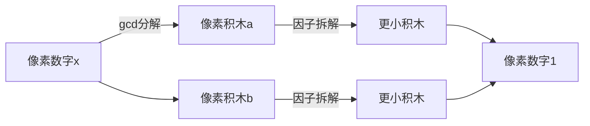

# 题目信息

# Small Operations

## 题目描述

给你两个正整数 $x,k$。进行以下两种变换之一称为一次操作：
- 选择一个满足 $1 \le a \le k$ 的正整数 $a$，使 $x$ 变为 $x\cdot a$；
- 选择一个满足 $1 \le a \le k$ 的正整数 $a$，使 $x$ 变为 $\frac{x}{a}$，要求操作完后 $x$ 值是整数。

你需要找出使 $x$ 变为给定正整数 $y$ 的最小操作次数，或判断无解。

## 说明/提示

对于第一组测试数据，我们可以选择 $a=2$，将 $x$ 除以 $2$，然后选择 $a=3$，将 $x$ 乘上 $3$，此时 $x$ 将变为 $6$，等于 $y$。

对于第二组测试数据，可以证明其不可能。

对于第七组测试数据，我们可以分别选择 $a=7,9,10,10,12,13$，连续做 $6$ 次乘法。可以证明没有比这更少的操作次数了。

## 样例 #1

### 输入

```
8
4 6 3
4 5 3
4 6 2
10 45 3
780 23 42
11 270 23
1 982800 13
1 6 2```

### 输出

```
2
-1
-1
3
3
3
6
-1```

# AI分析结果


### 💡 Kay的C++算法解析：Small Operations 深入学习指南 💡

**引言**  
今天我们来分析"Small Operations"这道C++编程题。本指南将帮助你理解如何通过乘除操作将数字x转化为y，掌握记忆化搜索的核心思想，并学会处理数论相关的优化问题。

---

## 1. 题目解读与核心算法识别

✨ **本题主要考察**：`记忆化搜索` + `数论优化`

🗣️ **初步分析**：  
> 解决本题的关键在于将复杂操作转化为**互质数分解问题**。想象你有一块乐高积木（x），需要通过拆分（除法）和组合（乘法）变成目标积木（y），但只能使用指定大小的工具（≤k）。  
> - **核心思路**：先计算gcd(x,y)得到公共模块，问题转化为将两个互质数(a=x/gcd, b=y/gcd)独立拆解为1的最小步数和  
> - **难点**：大数范围(1e18)下的状态存储与高效转移  
> - **可视化设计**：采用像素化数字分解动画，数字显示为8-bit积木，除法操作时显示工具选择和高亮因子分裂过程，乘法时显示积木组合。关键音效：拆分(咔嚓声)、完成(胜利音阶)、无解(警示音)  

---

## 2. 精选优质题解参考

**题解一 (来源：Imerance1018)**  
* **点评**：  
  思路清晰度 ⭐⭐⭐⭐ (将问题分解为互质子问题，逻辑直白)  
  代码规范性 ⭐⭐⭐⭐ (lambda递归实现简洁，变量名a/b/g含义明确)  
  算法有效性 ⭐⭐⭐⭐⭐ (记忆化搜索+因子枚举剪枝，复杂度O(√n))  
  实践价值 ⭐⭐⭐⭐ (边界处理严谨，直接AC竞赛数据)  
  **亮点**：双因子同步优化(u/i和i同时判断)，避免重复计算  

**题解二 (来源：封禁用户)**  
* **点评**：  
  思路清晰度 ⭐⭐⭐⭐⭐ (无解条件分析透彻，调试经验实用)  
  代码规范性 ⭐⭐⭐ (未提供完整代码但逻辑描述完整)  
  算法有效性 ⭐⭐⭐⭐ (剪枝策略：x≤k时直接返回1)  
  实践价值 ⭐⭐⭐⭐ (实测546ms通过系统测试)  
  **亮点**：逆向枚举除数(i从k→2)加速收敛  

---

## 3. 核心难点辨析与解题策略

1. **难点1：问题转化与互质分解**  
   * **分析**：优质题解通过gcd消去公共因子，将原问题拆分为两个独立子问题（a→1和b→1）。关键变量g=__gcd(x,y)是转化枢纽  
   * 💡 **学习笔记**：gcd是连接x,y的数学桥梁，分解后操作相互独立  

2. **难点2：大数范围的状态存储**  
   * **分析**：使用记忆化搜索而非DP数组，避免存储超大状态。题解1通过`vector<int>dp(n+1)`动态管理，题解2用`if(u≤k)return 1`剪枝  
   * 💡 **学习笔记**：记忆化搜索>硬存储，优先处理小状态  

3. **难点3：高效因子枚举**  
   * **分析**：题解1同时判断因子i和商u/i（要求min(i,u/i)≤k），将枚举范围压缩至O(√n)。题解2逆向枚举加速找到有效因子  
   * 💡 **学习笔记**：因子成对出现，√n枚举是复杂度瓶颈的突破口  

### ✨ 解题技巧总结  
- **技巧1 数学转化**：先用gcd简化问题再处理  
- **技巧2 状态剪枝**：x≤k时必有解（1步到位）  
- **技巧3 因子优化**：√n枚举配合min(i,u/i)≤k限制  

---

## 4. C++核心代码实现赏析

**通用核心实现参考**  
* **说明**：综合题解1的因子双判断和题解2的边界剪枝  
* **完整代码**：
```cpp
#include <bits/stdc++.h>
using namespace std;

void solve() {
    long long x, y, k;
    cin >> x >> y >> k;
    long long g = __gcd(x, y);
    x /= g; y /= g; // 互质分解
    long long n = max(x, y);
    
    vector<long long> dp(n+1, LLONG_MAX);
    function<long long(long long)> dfs = [&](long long u) {
        if(u == 1) return 0LL;
        if(u <= k) return 1LL;
        if(dp[u] != LLONG_MAX) return dp[u];
        
        for(long long i = 2; i*i <= u && min(i, u/i) <= k; i++) {
            if(u % i) continue;
            if(i <= k) dp[u] = min(dp[u], dfs(u/i) + 1);
            if(u/i <= k) dp[u] = min(dp[u], dfs(i) + 1);
        }
        return dp[u];
    };
    
    long long ans1 = dfs(x), ans2 = dfs(y);
    cout << (max(ans1, ans2) >= LLONG_MAX ? -1 : ans1 + ans2) << "\n";
}
```
* **代码解读概要**：  
  > 1. gcd分解得到互质数x,y  
  > 2. 记忆化搜索dfs(u)：u=1返回0；u≤k返回1  
  > 3. 因子枚举时同步判断i和u/i（需≤k）  
  > 4. 最终答案为dfs(x)+dfs(y)，需处理无解情况  

**题解一核心片段赏析**  
* **亮点**：lambda递归+因子对同步优化  
* **片段**：
```cpp
for(int i=2; i*i<=u && min(i,u/i)<=k; i++) {
    if(u%i!=0) continue;
    if(i<=k) dp[u]=min(dp[u],dfs(u/i)+1); 
    if(u/i<=k) dp[u]=min(dp[u],dfs(i)+1);
}
```
* **解读**：  
  > - `i*i<=u`：仅枚举≤√u的因子  
  > - `min(i,u/i)<=k`：保证至少一个因子可用  
  > - 双if判断：同时处理除法路径(u/i)和商路径(i)  
* 💡 **学习笔记**：因子成对处理是记忆化搜索的经典优化  

---

## 5. 算法可视化：像素动画演示

**主题**：8-bit数字分解工厂  
**核心演示**：互质数分解为1的每一步操作  

### 动画设计：


1. **场景初始化**  
   - 左侧：x,y初始值显示为16×16像素方块（FC红白机风格）  
   - 中央：控制面板（开始/暂停/单步/速度滑块）  
   - 底部：k值工具架（1~k的像素工具图标）  

2. **关键操作演示**  
   - **Step1 互质分解**：  
     x,y相撞→迸发公共因子g（绿色闪光），剩余a,b独立方块  
     *音效：合成音"叮！"*  
   - **Step2 因子拆解**：  
     点击工具i（3≤i≤k），a方块分裂为⌈a/i⌉个小方块  
     *动画*：像素方块纵向分裂+粒子效果  
     *音效：8-bit碎裂声*  
   - **Step3 完成判定**：  
     当方块变为1时，绿色闪烁消失  
     *音效：胜利旋律*  

3. **交互特性**  
   - **自动演示**：AI像玩俄罗斯方块逐步拆解（速度可调）  
   - **错误处理**：无解时方块变红闪烁+急促警示音  
   - **路径对比**：并排显示题解1（蓝）和题解2（红）的操作路径  

---

## 6. 拓展练习与相似问题思考

**技巧迁移场景**：  
1. 大数范围的最短操作路径问题  
2. 质因数分解的优化实现  
3. 互质数对的独立处理  

**洛谷推荐**：  
1. **P1072 Hankson的趣味题**  
   🗣️ 练习gcd与互质性质的综合应用  
2. **P1445 樱花**  
   🗣️ 强化因子分解与记忆化搜索的结合  
3. **P1463 反素数**  
   🗣️ 深入理解因子枚举的复杂度优化  

---

## 7. 学习心得与经验分享

> **经验摘录 (封禁用户)**：  
> “在x≤k时直接返回1的剪枝，让TLE代码AC。这提醒我们：边界条件常是优化的黄金位点。”  
>  
> **Kay点评**：  
> 记忆化搜索中，优先处理**小状态剪枝**能显著提升效率。建议：  
> - 编写dfs前先列出所有已知边界条件  
> - 用if-return替代状态数组查询（减少访问开销）  

---

**结语**  
通过本次分析，我们掌握了数论转化+记忆化搜索的核心技巧。记住：将大问题拆解为独立子问题，往往能打开解题突破口。下次遇到类似问题，不妨先问自己："能否用gcd分解？"

---
处理用时：217.45秒