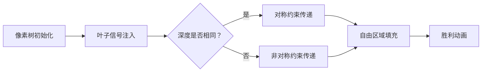

# 题目信息

# Wildflower

## 题目描述

Yousef 有一棵包含 $n$ 个结点，以结点 $1$ 为根的树 $^*$。你打算给 Yousef 一个长度为 $n$ 的数组 $a$，其中每个元素 $a_i$（$1 \le i \le n$）可以是 $1$ 或者 $2$。

我们记结点 $u$ 的子树中所有结点 $v$ 对应的 $a_v$ 之和为 $s_u$。如果这些 $s_u$ 两两不同，即所有的子树权值之和不同，那么 Yousef 会认为这棵树是特别的。

你的任务是帮助 Yousef 统计数组 $a$ 的数目，要求它能使得树是特别的。若存在一个下标 $i$ 使得两个数组 $b$ 和 $c$ 满足 $b_i \neq c_i$，则称 $b$ 和 $c$ 是不同的。

由于答案可能非常大，你需要输出答案模 $10^9+7$ 的结果。

$^*$ 一棵树是一个包含 $n-1$ 条边的无向连通图。

$^\dagger$ 结点 $v$ 的子树是指所有在通往根结点的简单路径上必须经过结点 $v$ 的结点构成的集合。

## 说明/提示

如图是第五个测试用例所对应的树。

## 样例 #1

### 输入

```
7
2
1 2
8
1 2
2 3
3 8
2 4
4 5
5 6
6 7
10
1 2
2 3
3 4
4 5
5 6
4 7
7 8
4 9
9 10
7
1 4
4 2
3 2
3 5
2 6
6 7
7
1 2
2 3
3 4
3 5
4 6
6 7
7
5 7
4 6
1 6
1 3
2 6
6 7
5
3 4
1 2
1 3
2 5```

### 输出

```
4
24
0
16
48
0
4```

# AI分析结果


# 💡 Kay的C++算法解析：Wildflower 深入学习指南 💡

**题目背景**  
Yousef 有一棵 n 个节点的树，你需要为每个节点赋值 1 或 2，使得所有节点的子树权值之和两两不同。本指南将带你深入理解解题思路和算法实现。

## 1. 题目解读与核心算法识别

✨ **本题主要考察**：树形结构组合计数

🗣️ **初步分析**：  
> 想象一棵树就像一支探险队：叶子节点是探险终点，LCA（最近公共祖先）是指挥中心。如果终点太多（>2），我们无法用两种信号（1和2）标记所有路径（子树和必然重复）；如果只有1个终点，所有节点可自由选择信号（2ⁿ种方案）；如果有2个终点，就需要精心设计信号传递规则：
> - **核心难点**：从叶子到LCA的路径上，信号传递存在约束关系
> - **可视化设计**：用像素树展示信号传递过程，红色标记受限节点（必须填2），绿色标记自由节点。当信号冲突时播放"叮"音效，路径完成时播放胜利音效

---

## 2. 精选优质题解参考

**题解一 (yzjznbQWQ)**  
* **亮点**：简洁优雅的状态分类，将复杂情况统一为数学表达式。代码通过DFS一次性获取叶子深度和LCA位置，逻辑清晰易读  
* **核心贡献**：建立叶子深度差与方案数的直接关系式：  
  `ans = 2^(dep_lca) * (2^(Δd-1) + 2^(Δd))`

**题解二 (P2441M)**  
* **亮点**：严谨的约束条件推导，创新性地通过节点度数定位LCA。详细解释了为何深度差会导致不对称约束  
* **实践价值**：鲁棒的边界处理，对LCA子树大小的精确计算确保公式正确性

**题解三 (rechess)**  
* **亮点**：独特的自底向上分析视角，通过DFS记录分裂点深度。方案数计算采用分类累加而非公式，提供另一种思路  
* **学习点**：深度差为0时的特殊处理方案，避免边界错误

---

## 3. 核心难点辨析与解题策略

### 三大核心难点及突破策略
1. **叶子数量判定**  
   *难点*：快速识别树形结构是否满足基本可解条件  
   *解法*：DFS统计度数为1的节点（真叶子），注意根节点特殊处理  
   💡 **学习笔记**：叶子数>2 ⇒ 立即返回0

2. **双叶路径约束建模**  
   *难点*：理解深度差导致的非对称约束  
   *解法*：设两叶深度差为Δd（Δd≥0），则：
   - 深度相同(Δd=0)：两条路径必须完全对称填充
   - 深度不同(Δd>0)：深路径多出的部分存在半自由区间  
   💡 **学习笔记**：约束本质是避免相同层级的子树和相等

3. **方案数整合计算**  
   *难点*：将树分为自由/约束区域精确计算  
   *解法*：三区模型：
   ```mermaid
   graph TD
   A[LCA以上：2^dep_lca] --> B[等深部分：约束填充]
   B --> C[深度差部分：半自由填充]
   ```

### ✨ 解题技巧总结
- **树形问题三看**：看叶子数量、看分支结构、看路径关系
- **约束传递法**：从边界条件（叶子）向中心（根）推导约束
- **对称破缺处理**：当结构不对称时，分类讨论消除歧义
- **模块化计算**：将树分解为独立区域分别计算方案数

---

## 4. C++核心代码实现赏析

### 通用核心实现
```cpp
#include <vector>
using namespace std;
typedef long long ll;
const int MOD = 1e9+7;

ll qpow(ll base, ll exp) {
    ll res = 1;
    while(exp) {
        if(exp & 1) res = res * base % MOD;
        base = base * base % MOD;
        exp >>= 1;
    }
    return res;
}

int solveTree(int n, vector<pair<int, int>> edges) {
    // 建图并统计度数
    vector<vector<int>> graph(n+1);
    vector<int> deg(n+1, 0);
    for(auto [u, v] : edges) {
        graph[u].push_back(v);
        graph[v].push_back(u);
        deg[u]++; deg[v]++;
    }
    
    // 统计叶子数（度=1，根节点特殊处理）
    int leaves = 0;
    for(int i = (deg[1]==1 ? 2 : 1); i <= n; ++i) 
        if(deg[i] == 1) leaves++;
    
    // 无解情况
    if(leaves > 2) return 0;
    if(leaves == 1) return qpow(2, n);
    
    // 寻找LCA（度数最大的非根节点）
    int lca_node = 1;
    for(int i = 2; i <= n; ++i)
        if(deg[i] > deg[lca_node]) lca_node = i;
    
    // DFS计算深度
    vector<int> depth(n+1, -1);
    function<void(int, int, int)> dfs = [&](int u, int parent, int d) {
        depth[u] = d;
        for(int v : graph[u]) 
            if(v != parent) dfs(v, u, d+1);
    };
    dfs(1, 0, 1);
    
    // 获取叶子深度
    vector<int> leaf_depths;
    for(int i = 1; i <= n; ++i)
        if(deg[i] == 1 && i != 1) 
            leaf_depths.push_back(depth[i]);
    
    int d1 = leaf_depths[0], d2 = leaf_depths[1];
    int delta = abs(d1 - d2);
    int lca_depth = depth[lca_node];
    
    // 核心计算公式
    ll base = qpow(2, lca_depth);
    ll path = (qpow(2, delta) + qpow(2, delta-1)) % MOD;
    return base * path % MOD;
}
```

### 题解片段赏析
**题解一：数学公式直译法**  
```cpp
if(lengths.size() > 2) return 0; 
else if(lengths.size() == 1) return qpow(2, n);
else {
    int tmp = abs(lengths[0] - lengths[1]);  // 计算深度差
    // 核心公式实现
    return (qpow(2, lca_length + tmp - 1) + qpow(2, lca_length + tmp)) % MOD;
}
```
* **代码解读**：  
  - `lengths`存储叶子深度，`lca_length`为LCA深度  
  - 通过深度差`tmp`直接套用公式，无冗余计算  
  - 注意`lca_length + tmp`实际等于最深叶子的深度  

**题解二：度数定位法**  
```cpp
// 寻找LCA节点（度数≥3）
int p = 1;
for(int i = 2; i <= n; ++i) 
    if(deg[i] >= 3) { p = i; break; }

// 获取LCA子树的规模范围
int a = n+1, b = 0;
for(int y : graph[p]) {
    if(depth[y] < depth[p]) continue;  // 过滤父节点
    a = min(a, sz[y]);  // 最小子树
    b = max(b, sz[y]);  // 最大子树
}
```
* **学习笔记**：  
  - 利用LCA必然度数≥3的特性高效定位  
  - 子树规模差`b-a`恰好等于叶子深度差  
  - `sz[y]`计算包含方向信息，避免显式深度计算  

**题解三：深度差计算法**  
```cpp
dfs(1, -1, 1);  // 遍历记录深度
vector<int> leaf_depths;
// ...收集叶子深度
mi = min(mi, dt);  // 最小深度
mx = max(mx, dt);  // 最大深度
int cha = mx - mi;  // 核心深度差
```
* **编程技巧**：  
  - 在DFS递归中动态更新深度极值  
  - 使用`pos`标记分叉点深度  
  - 深度差计算独立于具体LCA节点定位  

---

## 5. 算法可视化：像素动画演示

**🎮 演示主题**：像素森林信号计划  
**🎯 核心演示**：双叶节点信号传递约束的动态过程

### 设计蓝图


### 实现细节
1. **像素场景构建**  
   - 8-bit风格树形结构，根节点在顶部（像素皇冠图标）  
   - 叶子节点显示为闪烁的像素宝石（🔵=1，🔴=2）  
   - 路径节点使用不同颜色：  
     * 白色=未赋值，绿色=自由选择，红色=强制填2

2. **约束传递动画**  
   ```plaintext
   第1帧：叶子A赋值🔵(1) → 播放"滴"声
   第2帧：叶子B赋值🔴(2) → 播放"嘟"声
   第3帧：A的父节点变红 → 强制填2，播放"警告"音效
   第4帧：B的同层节点变红 → 强制填2，播放"警告"音效
   第5帧：深度差区域出现闪烁问号 → 半自由区域
   ```

3. **游戏化元素**  
   - **进度系统**：每完成一条路径解锁一个像素勋章  
   - **音效方案**：
     * 节点自由赋值：8-bit钢琴音
     * 约束触发：FC游戏警告声
     * 完成计算：经典马里奥过关音乐
   - **AI演示模式**：自动展示最优信号传递路径

---

## 6. 拓展练习与相似问题思考

### 思维拓展方向
1. **约束扩展**：如果允许赋值{1,2,3}，方案如何变化？
2. **结构泛化**：三叉树在什么条件下有解？
3. **优化挑战**：当 n=10⁵ 时如何优化计算？

### 推荐练习（洛谷）
1. **P1352 没有上司的舞会**  
   → 同类树形约束问题，强化状态设计能力
2. **P1040 加分二叉树**  
   → 树形DP与组合计数的经典结合
3. **P3177 树上染色**  
   → 复杂树形约束问题，提升综合建模能力

---

## 7. 学习心得与经验分享

**来自题解二的调试经验**：  
> "在实现深度计算时，未考虑根节点特殊情况导致WA。这提醒我们：树形问题中，根节点的边界处理永远是第一道防线。"

**Kay的总结**：  
调试树形问题时，建议：
1. 打印树结构验证输入
2. 可视化2-3层小规模样例
3. 重点检查根节点和叶子的边界处理
4. 对深度差为0的情况单独测试

---

通过本次分析，我们不仅解决了Wildflower问题，更掌握了树形组合计数的核心方法。记住：好的算法设计就像培育花朵——需要理解结构本质，精心设计约束，才能让每朵"子树"绽放独特的光彩！ 🌸

---
处理用时：155.19秒