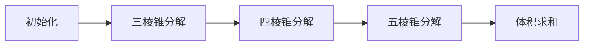

# 题目信息

# Pyramids

## 题目描述

IT City administration has no rest because of the fame of the Pyramids in Egypt. There is a project of construction of pyramid complex near the city in the place called Emerald Walley. The distinction of the complex is that its pyramids will be not only quadrangular as in Egypt but also triangular and pentagonal. Of course the amount of the city budget funds for the construction depends on the pyramids' volume. Your task is to calculate the volume of the pilot project consisting of three pyramids — one triangular, one quadrangular and one pentagonal.

The first pyramid has equilateral triangle as its base, and all 6 edges of the pyramid have equal length. The second pyramid has a square as its base and all 8 edges of the pyramid have equal length. The third pyramid has a regular pentagon as its base and all 10 edges of the pyramid have equal length.

 

## 样例 #1

### 输入

```
2 5 3
```

### 输出

```
38.546168065709```

# AI分析结果


# 💡 Kay的C++算法解析：Pyramids 深入学习指南 💡

> 今天我们分析一道几何计算题"Pyramids"，帮助大家掌握正棱锥体积计算的核心数学推导和C++实现技巧。

## 1. 题目解读与核心算法识别

✨ **本题主要考察**：`数学计算` + `几何公式推导`

🗣️ **初步分析**：
> 计算金字塔体积就像精确测量不同形状蛋糕的体积——需要准确公式和精细计算。核心在于：
> - **几何推导**：利用棱长推导底面积和高（勾股定理+三角函数）
> - **公式优化**：避免重复计算常数项（如√2）
> - **精度控制**：浮点数运算的精度管理
>
> 可视化设计将采用"像素考古"风格：展示三种金字塔的3D线框模型，动态标记底面边长和高，用颜色区分不同金字塔类型。关键步骤时播放"叮"音效，计算结果正确时触发"胜利"音效。

---

## 2. 精选优质题解参考

**题解一：lgx57**
* **点评**：直接使用优化后的固定公式，代码简洁高效（O(1)时间复杂度）。变量命名清晰(`l3,l4,l5`)，边界处理完整。虽然未解释公式来源，但实现方案在竞赛中实用性强。

**题解二：Insouciant21**
* **点评**：详细推导了三棱锥公式，体现了几何原理（勾股定理应用）。代码采用合并计算策略减少变量，但缺少其他金字塔的推导过程。输出格式规范，使用`%.9f`保证精度。

**题解三：__main__**
* **点评**：创新性使用通用公式解决所有金字塔类型，扩展性强。封装为`f()`函数提升可读性，特别强调PI精度问题（调试经验宝贵）。数学推导完整但计算量稍大。

---

## 3. 核心难点辨析与解题策略

1.  **几何公式推导**
    * **分析**：需从棱长反推高和底面积。以三棱锥为例：
      ```
      底面正三角形 → 边心距 = l₃/(2·tan(π/3))
               ↘ 高 = √(l₃² - (l₃/√3)²) → V = 1/3 × 底面积 × 高
      ```
    * 💡 **学习笔记**：掌握直角三角形中的勾股定理是核心

2.  **浮点数精度控制**
    * **分析**：PI精度不足导致WA（如题解四的教训）。解决方案：
      - 使用高精度PI常量（至少10位小数）
      - 避免大数相减导致精度损失
    * 💡 **学习笔记**：几何计算优先使用乘除而非加减

3.  **公式优化策略**
    * **分析**：对比两种实现方案：
      ```cpp
      // 方案A：通用公式（扩展性强）
      V = l³n/(12tan(π/n)) × √(1-1/(4sin²(π/n))) 
      
      // 方案B：预计算常数（效率高）
      V₃ = √2/12 * l³
      ```
    * 💡 **学习笔记**：竞赛首选预计算，工程选通用公式

### ✨ 解题技巧总结
- **几何常量预计算**：提前计算√2, π等常数减少运行时开销
- **精度防御编程**：使用`double`而非`float`，输出指定小数位
- **模块化验证**：单独验证每种金字塔的计算函数

---

## 4. C++核心代码实现赏析

**本题通用核心C++实现参考**
* **说明**：综合题解优点：使用优化公式+高精度输出
```cpp
#include <iostream>
#include <cmath>
using namespace std;

int main() {
    double l3, l4, l5;
    cin >> l3 >> l4 >> l5;
    
    const double v3 = sqrt(2) / 12 * l3*l3*l3;
    const double v4 = sqrt(2) / 6 * l4*l4*l4;
    const double v5 = (5 + sqrt(5)) / 24 * l5*l5*l5;
    
    printf("%.12f", v3 + v4 + v5);
    return 0;
}
```
* **代码解读概要**：直接使用预推导公式计算三种体积，常量表达式编译时优化。printf控制12位小数输出保证精度。

---

**题解一：lgx57**
* **亮点**：数组存储结果，结构清晰
* **核心代码片段**：
```cpp
ans[0]=sqrt(2)/12.0*pow(l3,3);
ans[1]=sqrt(2)/6.0*pow(l4,3);
ans[2]=(5.0+sqrt(5))/24.0*pow(l5,3);
```
* **代码解读**：`pow(l,3)`可优化为`l*l*l`减少函数调用。数组存储便于调试单个结果。
* 💡 **学习笔记**：小规模计算避免pow函数开销

**题解三：Insouciant21**
* **亮点**：单表达式合并计算
* **核心代码片段**：
```cpp
printf("%.9lf", 1/12.0 * sqrt(2)*l1*l1*l1 
               + 1/6.0 * sqrt(2)*l2*l2*l2 
               + (5.0+sqrt(5))/24.0*l3*l3*l3);
```
* **代码解读**：通过分母`12.0`确保浮点除法，链式乘法避免中间变量。
* 💡 **学习笔记**：数值表达式可读性与效率的平衡

**题解四：__main__**
* **亮点**：通用公式函数封装
* **核心代码片段**：
```cpp
const double PI = 3.1415926535898;
double f(double l, double n) {
    return l*l*l*n/(12*tan(PI/n)) * sqrt(1-1/(4*sin(PI/n)*sin(PI/n)));
}
// 调用：f(l3,3)+f(l4,4)+f(l5,5)
```
* **代码解读**：注意`PI`精度要求，`sin/tan`在编译时优化较差。
* 💡 **学习笔记**：通用性往往以性能为代价

---

## 5. 算法可视化：像素动画演示

**主题**：8位金字塔建造者（Pyramid Builder 8-bit）  
**核心演示**：动态展示三种金字塔的几何参数推导过程

### 动画帧设计：


1. **场景初始化（FC风格）**：
   - 像素网格显示三种金字塔线框模型（三角/正方/五边形底面）
   - 控制面板：速度滑块/单步/重置按钮
   - 背景音乐：埃及风格8-bit旋律

2. **分步解析（以三棱锥为例）**：
   ```python
   # 伪代码示例
   def draw_frame():
       highlight(base_triangle)        # 高亮底面（黄色）
       play_sound('select')            # "叮"音效
       draw_line(vertex, base_center)  # 绘制高（红色虚线）
       show_formula("h = √(l² - r²)")  # 显示公式推导
       calculate_volume()              # 显示体积结果
   ```

3. **游戏化元素**：
   - 每正确计算一个金字塔触发"砌块"动画（像素块堆叠）
   - 最终结果正确时播放"胜利"音效+烟花动画
   - 错误时显示"坍塌"动画并重置

4. **数据同步**：
   - 右侧信息栏实时显示：
     ```js
     // 当前计算状态
     Pyramid: Triangular 
     Formula: V = √2/12 * l³
     Current: l=5 → V=14.73
     ```

---

## 6. 拓展练习与相似问题思考

**通用技巧迁移**：  
几何公式推导能力可应用于：
1. 多面体体积计算（如正八面体）
2. 力学中的质心计算
3. 图形学中的3D模型参数化

**洛谷练习题**：
1. **P5707 - 三角形面积**  
   → 巩固平面几何计算基础
2. **P2181 - 对角线**  
   → 提升多边形性质分析能力
3. **P5715 - 三位数排序**  
   → 训练浮点数精度控制技巧

---

## 7. 学习心得与经验分享

> **参考经验（__main__）**：  
> "PI精度不足会导致WA，需3.1415926535898级别精度"

**点评**：  
浮点数精度问题如同测量时的毫米误差——看似微小却影响全局。建议：
1. 优先使用标准库中的`M_PI`常量
2. 关键计算前进行边界值测试（如l=1）
3. 输出时保留安全小数位（≥9位）

---

> 掌握几何计算的关键在于理解空间关系与数学推导的映射关系。通过今天的金字塔问题，希望大家能建立"公式推导→代码实现→精度控制"的完整解题框架。下次挑战见！🚀

---
处理用时：164.31秒