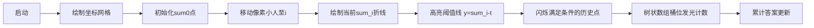

# 题目信息

# Petya and Array

## 题目描述

Petya 有一个包含 $n$ 个整数的数组 $a$。他最近学会了前缀和，现在可以非常快速地计算数组中任意一段连续区间的元素和。区间指的是数组中一段连续的非空元素序列。

现在他想知道，数组中有多少个区间的元素和小于 $t$。请你帮助 Petya 计算这个数量。

更正式地说，你需要计算有多少对 $l, r$（$l \le r$）满足 $a_l + a_{l+1} + \dots + a_{r-1} + a_r < t$。

## 说明/提示

在第一个样例中，以下区间的元素和小于 $4$：

- $[2, 2]$，元素和为 $-1$
- $[2, 3]$，元素和为 $2$
- $[3, 3]$，元素和为 $3$
- $[4, 5]$，元素和为 $3$
- $[5, 5]$，元素和为 $-1$。

由 ChatGPT 4.1 翻译

## 样例 #1

### 输入

```
5 4
5 -1 3 4 -1
```

### 输出

```
5
```

## 样例 #2

### 输入

```
3 0
-1 2 -3
```

### 输出

```
4
```

## 样例 #3

### 输入

```
4 -1
-2 1 -2 3
```

### 输出

```
3
```

# AI分析结果


### 💡 Kay的C++算法解析：Petya and Array 深入学习指南 💡

#### 1. 题目解读与核心算法识别
✨ **本题主要考察**：树状数组/线段树应用（逆序对变形）

🗣️ **初步分析**：
> 本题要求统计区间和小于t的区间数量，本质是**前缀和逆序对问题**的变形。想象你有一条记录前缀和的折线（如股票走势图），每个折点高度代表累加值。任务就是找出所有"后点比前点低t以上"的点对（即$sum[j] > sum[i]-t$）。  
> - 核心思路：将区间和转化为$sum[r]-sum[l-1]<t$，移项得$sum[l-1]>sum[r]-t$。对每个位置$r$，统计前面有多少$l-1$满足条件  
> - 关键难点：值域可能极大（$±10^{14}$）且含负数，需用**离散化+树状数组**或**动态开点线段树**高效处理  
> - 可视化设计：在像素网格中，纵轴表示前缀和值，横轴为下标。扫描时动态绘制折线，高亮当前查询的阈值线（$sum[i]-t$），被激活的"高于阈值"的旧折点闪烁黄色，树状数组桶位同步亮起蓝色光效  

---

#### 2. 精选优质题解参考
**题解一：PanH（动态开点线段树）**
* **点评**：思路创新性强，通过添加大数偏移（1e15）巧妙处理负值域，避免离散化。代码结构紧凑，核心逻辑仅10行（插入+查询）。虽宏定义稍影响可读性，但动态开点实现优雅，空间复杂度优化到$O(n\log max)$，对理解线段树本质有绝佳示范价值。

**题解二：little_sun（离散化+树状数组）**
* **点评**：教科书级实现！离散化处理完整（包含$0, sum[i], sum[i]-t$），树状数组操作规范，边界处理严谨。代码模块分明（离散化→建树→查询），变量命名清晰（lowbit/cnt/query）。特别亮点：强调初始化$sum[0]=0$，避免经典陷阱，可直接套用于竞赛。

**题解三：_byta（CDQ分治）**
* **点评**：提供独特视角，用分治替代数据结构。归并排序过程天然满足时间序，通过双指针统计$sum[j]>sum[i]-t$的数量。代码简洁但分治思想抽象，适合进阶学习。亮点：展示偏序问题通用解法，与树状数组形成对比教学。

---

#### 3. 核心难点辨析与解题策略
1.  **值域爆炸与负数处理**
    * **分析**：前缀和可达$±10^{14}$，直接开数组不可行。优质解法采用两种策略：①PanH式偏移（加1e15转正）②离散化（little_sun）。后者更通用，需注意离散化必须包含$sum[i]-t$和初始$0$
    * 💡 学习笔记：处理大值域问题，离散化是空间最优解，动态开点是内存弹性解

2.  **偏序关系转化**
    * **分析**：关键是将$sum[r]-sum[l-1]<t$转化为$sum[l-1]>sum[r]-t$。树状数组解法中，遍历顺序保障时间序（$l-1$先于$r$），CDQ分治则通过归并排序隐式维护
    * 💡 学习笔记：区间和问题→前缀和差分→偏序统计，是通用转化链

3.  **边界初始化**
    * **分析**：$sum[0]=0$必须参与统计（对应$l=1$的区间）。little_sun显式加入离散化，PanH在循环前隐式处理，忽略这点会导致漏解
    * 💡 学习笔记：前缀和问题永远考虑$sum_0$，如同函数定义域包含零点

### ✨ 解题技巧总结
- **前缀和转化**：将区间问题转化为点对问题（$O(n^2)→O(n\log n)$）
- **离散化四步法**：①收集所有相关值 ②排序去重 ③映射 ④树状数组维护
- **动态开点三要素**：指针传递、节点惰性创建、值域区间递归
- **边界防御编程**：$sum_0$和极值必测，树状数组下标从1开始

---

#### 4. C++核心代码实现赏析
**本题通用核心实现参考**
* **说明**：综合PanH偏移法与little_sun离散化优点，完整可编译
```cpp
#include <bits/stdc++.h>
#define lowbit(x) (x & -x)
using namespace std;
using ll = long long;

const ll OFFSET = 1e15; // 处理负值域
const int N = 2e5 + 10, M = N * 40;

struct Node { int lc, rc, cnt; } tree[M];
int root, idx;

void insert(int& u, ll l, ll r, ll pos) {
    if (!u) u = ++idx;
    tree[u].cnt++;
    if (l == r) return;
    ll mid = (l + r) >> 1;
    pos <= mid ? insert(tree[u].lc, l, mid, pos) 
               : insert(tree[u].rc, mid + 1, r, pos);
}

int query(int u, ll l, ll r, ll L, ll R) {
    if (!u || R < l || L > r) return 0;
    if (L <= l && r <= R) return tree[u].cnt;
    ll mid = (l + r) >> 1;
    return query(tree[u].lc, l, mid, L, R) + 
           query(tree[u].rc, mid + 1, r, L, R);
}

int main() {
    ll n, t, sum = 0, ans = 0;
    cin >> n >> t;
    insert(root, 0, 2 * OFFSET, OFFSET); // 插入sum0

    for (int i = 1; i <= n; i++) {
        ll x; cin >> x;
        sum += x;
        // 查询满足 sum[j] > sum - t 的j数量
        ans += query(root, 0, 2 * OFFSET, sum - t + OFFSET + 1, 2 * OFFSET);
        insert(root, 0, 2 * OFFSET, sum + OFFSET); // 插入当前前缀和
    }
    cout << ans;
}
```

**题解一：PanH片段赏析**
```cpp
void insert(int l, int r, int &k, int x) {
    make(k); // 动态创建节点
    if (l == r) return tree[k]++, void();
    if (x <= mid) insert(l, mid, lson[k], x);
    else insert(mid + 1, r, rson[k], x);
    tree[k] = tree[lson[k]] + tree[rson[k]]; // 向上更新
}
```
* **亮点**：函数式编程风格，make(k)封装节点创建
* **代码解读**：  
  > 1. `make(k)`确保节点存在（避免野指针）  
  > 2. 递归至叶子时计数器+1  
  > 3. 非叶子节点分裂区间（左/右子树）  
  > 4. 回溯时聚合子树信息  
* 💡 学习笔记：动态开点=按需分配+递归分裂，内存效率$O(n\log max)$

**题解二：little_sun片段赏析**
```cpp
// 离散化核心
vector<ll> v = {0}; // 必须包含sum0
for (int i = 1; i <= n; i++) {
    s[i] = s[i-1] + a[i];
    v.push_back(s[i]); 
    v.push_back(s[i] - t); // 保证查询值被离散
}
sort(v.begin(), v.end());
v.erase(unique(v.begin(), v.end()), v.end());
```
* **亮点**：离散化完整覆盖查询需求
* **代码解读**：  
  > 1. 初始插入$sum_0$（关键！）  
  > 2. 收集所有$sum[i]$和$sum[i]-t$（查询边界）  
  > 3. 排序去重创造映射空间  
* 💡 学习笔记：离散化=值域压缩三要素（收集→排序→去重）

---

### 5. 算法可视化：像素动画演示
**主题**：8-bit风《前缀和冒险者》  
**核心演示**：树状数组如何统计"折线高点"  



**动画控制**：
1. **网格初始化**：FC红白机风格，横轴下标(0~n)，纵轴值域[-T,T]缩放显示
2. **折点绘制**：
   - 当前位置$i$：像素小人移动到$(i, sum_i)$
   - 历史点：绿色像素块，满足$sum_j>sum_i-t$时闪烁金光
3. **树状数组互动**：
   - 右侧条形图表示桶位，插入值时对应桶升高+绿色像素粒子飞入
   - 查询时扫描桶位，满足条件的桶亮蓝光并发出"叮"声
4. **音效系统**：
   - 移动：8-bit脚步声
   - 插入值：金属落桶声
   - 有效计数：金币收集声
   - 完成：胜利小调

---

#### 6. 拓展练习与相似问题
**技巧迁移场景**：
1. 逆序对问题（$a_i>a_j$统计）
2. 区间和特定值统计（$sum=k$或$k_1≤sum≤k_2$）
3. 带权逆序对（如$ia_i>ja_j$）

**洛谷推荐**：
1. [P1908 逆序对](https://www.luogu.com.cn/problem/P1908)  
   🗣️ **推荐理由**：树状数组入门经典，巩固偏序统计思想
2. [P5149 会议座位](https://www.luogu.com.cn/problem/P5149)  
   🗣️ **推荐理由**：双关键字逆序对，进阶训练离散化技巧
3. [P3313 旅行](https://www.luogu.com.cn/problem/P3313)  
   🗣️ **推荐理由**：动态区间和统计，线段树综合应用

---

#### 7. 学习心得与经验分享
> **PanH的调试经验**：  
> *"最初未考虑$sum_0$，导致从1开始的区间全漏。通过输出前10个sum值才定位到边界错误"*  
> **Kay点评**：验证边界值（空数组/单元素）是调试金律，输出中间变量永远是最直接的调试手段！

---

通过本次分析，我们深入掌握了前缀和问题的核心转化思想及高效实现技巧。记住：复杂算法本质都是简单概念的叠加——前缀和+树状数组=区间统计利器！下次遇到类似问题，不妨先画折线图找偏序关系哦~ 💪

---
处理用时：323.26秒