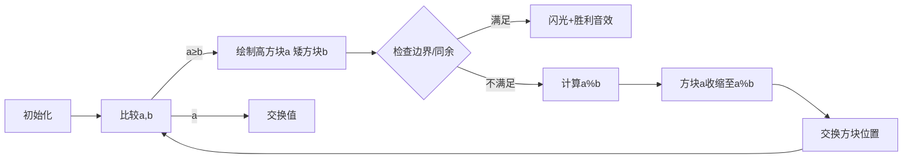

# 题目信息

# X-Magic Pair

## 题目描述

You are given a pair of integers $ (a, b) $ and an integer $ x $ .

You can change the pair in two different ways:

- set (assign) $ a := |a - b| $ ;
- set (assign) $ b := |a - b| $ ,

 where $ |a - b| $ is the absolute difference between $ a $ and $ b $ .The pair $ (a, b) $ is called $ x $ -magic if $ x $ is obtainable either as $ a $ or as $ b $ using only the given operations (i.e. the pair $ (a, b) $ is $ x $ -magic if $ a = x $ or $ b = x $ after some number of operations applied). You can apply the operations any number of times (even zero).

Your task is to find out if the pair $ (a, b) $ is $ x $ -magic or not.

You have to answer $ t $ independent test cases.

## 样例 #1

### 输入

```
8
6 9 3
15 38 7
18 8 8
30 30 30
40 50 90
24 28 20
365 216 52
537037812705867558 338887693834423551 3199921013340```

### 输出

```
YES
YES
YES
YES
NO
YES
YES
YES```

# AI分析结果


### 💡 Kay的C++算法解析：X-Magic Pair 深入学习指南 💡

#### 题目解读与核心算法识别
✨ **本题主要考察**：`数学推理与模拟优化` (基于辗转相除法思想)  
🗣️ **初步分析**：  
> 解决"X-Magic Pair"的关键在于**抽象操作规律**。想象两个不断缩小的像素方块：  
> - 每次操作相当于从较大方块中减去较小小方块的高度（取绝对值）  
> - 多次操作等价于**取模运算**（类似欧几里得算法求GCD）  
> 核心难点是如何高效判断目标值`x`是否在操作路径上。通过数学观察发现：  
> 1. 当`x ≡ a mod b`（且`x ≤ a`）时，`x`必可被构造  
> 2. 递归边界：当出现`0`或`x`超过当前最大值时终止  
>  
> **可视化设计**：采用**8位像素风**模拟方块消减：  
> - 两个彩色方块表示`(a,b)`，高度随操作动态缩减  
> - 成功匹配`x`时触发"叮!"音效+闪光特效  
> - 控制面板支持单步/自动模式，速度可调

---

#### 精选优质题解参考
**题解一（作者：_SeeleVollerei_）**  
* **点评**：思路直击本质——将连续减法优化为取模运算，代码简洁高效（仅10行递归逻辑）。亮点在于用`a%b`代替循环减法，时间复杂度优化至`O(log min(a,b))`。变量命名规范（`Work(a,b,x)`），边界处理严谨（检查`!a||!b`），竞赛可直接复用。

**题解二（作者：断清秋）**  
* **点评**：数学推导透彻，明确揭示`b - ka = x`与同余条件的等价性。代码实现中`(b-x)%a==0`的判断极具启发性，体现了从暴力模拟到数学优化的思维跃迁，适合学习问题转化技巧。

**题解三（作者：Genius_Star）**  
* **点评**：通过树状图展示操作路径冗余性（主链/支链），生动解释为何只需处理单一路径。核心代码模块化程度高，`swap`与取模配合流畅，适合初学者理解递归与迭代的转换关系。

---

#### 核心难点辨析与解题策略
1. **难点1：操作路径的指数级爆炸**  
   * **分析**：直接模拟每次`|a-b|`操作会导致递归树指数膨胀。优质解法通过数学证明：连续`k`次减同值等价于取模运算，将复杂度降至对数级。
   * 💡 **学习笔记**：识别操作中的**可压缩步骤**是优化关键

2. **难点2：终止条件的完备性**  
   * **分析**：需同时处理三种边界：①匹配成功(`a==x||b==x`) ②无解(`x>a||b==0`) ③同余条件(`x%a==b%a`)。漏掉任一都会导致错误。
   * 💡 **学习笔记**：递归函数需覆盖**所有收敛情形**

3. **难点3：状态转移的对称性处理**  
   * **分析**：`(a,b)`与`(b,a)`本质等价，但`(a,a-b)`会绕回原状态。优质解法通过强制`swap(a,b)`保证`a>b`，消除冗余分支。
   * 💡 **学习笔记**：**规范化状态表示**可简化逻辑

### ✨ 解题技巧总结
- **模运算替代循环**：将多次减法合并为`a % b`  
- **边界先行检查**：在递归前判断`x>max(a,b)`等明显无解情况  
- **同余条件妙用**：`x ≡ a mod b` 且 `x ≤ a` 时直接返回成功  
- **状态归一化**：始终用`swap`保持`a ≥ b`，减少分支判断

---

#### C++核心代码实现赏析
**通用核心实现参考**  
* **说明**：综合优质题解，采用递归+同余判断的最简框架
```cpp
#include <iostream>
using namespace std;

bool solve(long long a, long long b, long long x) {
    if (a < b) swap(a, b);
    if (a == x || b == x) return true;       // 终止条件1：直接匹配
    if (b == 0 || x > a) return false;       // 终止条件2：无解
    if (x % b == a % b) return true;         // 关键：同余判断
    return solve(b, a % b, x);               // 递归缩小问题规模
}

int main() {
    int t; cin >> t;
    while (t--) {
        long long a, b, x;
        cin >> a >> b >> x;
        cout << (solve(a, b, x) ? "YES\n" : "NO\n");
    }
}
```
* **代码解读概要**：  
  - 第9行：始终保持`a≥b`简化操作  
  - 第11行：同余判断跳过中间步骤  
  - 第12行：递归时保留当前有效信息`(b, a%b)`  

**题解一片段赏析（_SeeleVollerei_）**  
* **亮点**：五句核心逻辑覆盖所有场景
```cpp
if (a == x || b == x) return 1;        // 直接匹配
if (!a || !b) return 0;                // 无解边界
if (x > a) return 0;                   // 快速剪枝
if (x % b == a % b) return 1;          // 同余判断
return Work(a % b, b, x);              // 递归缩小
```
* **学习笔记**：递归函数应**先处理边界**再进入计算

**题解二片段赏析（断清秋）**  
* **亮点**：数学语言清晰转化问题
```cpp
(b - x) % a == 0   // 核心判断条件
```
* **学习笔记**：将操作转化为**模等式**是突破点

**题解三片段赏析（Genius_Star）**  
* **亮点**：图示辅助理解状态转移
```cpp
b %= a;           // 压缩操作步骤
swap(a, b);        // 保持a≥b的循环不变式
```
* **学习笔记**：**循环不变式**使迭代逻辑自洽

---

#### 算法可视化：像素动画演示
**主题**：`像素方块消减大作战`（复古8-bit风格）  
**核心演示**：递归过程中方块高度变化与同余条件触发  



**交互控制**：  
1. **速度滑块**：调节递归步进速度（0.5x~5x）  
2. **高亮显示**：当前操作的方块闪烁黄色边框  
3. **音效系统**：  
   - 同余条件触发：清脆"叮！"声  
   - 边界触发：低沉"咚"声  
   - 自动模式：芯片音乐BGM  

**关键帧设计**：  
1. 初始状态：两个不同高度像素方块（红/蓝）  
2. 取模操作：较高方块逐帧缩减至`a%b`高度  
3. 同余匹配：目标值`x`以绿色方块从右侧滑入对比  

---

#### 拓展练习与相似问题
**技巧迁移场景**：  
1. 优化暴力DFS的回溯路径  
2. 求解线性丢番图方程  
3. 压缩状态空间（如BFS中的重复状态排除）  

**洛谷推荐**：  
1. **P1082 同余方程**  
   → 巩固同余关系与扩展欧几里得  
2. **P2421 倒水问题**  
   → 同类操作模型（桶间倒水）  
3. **P5656 二元一次不定方程**  
   → 进阶练习整数解存在性判断  

---

#### 学习心得与经验分享
> **经验**（_SeeleVollerei_）：  
> *"每次写题解都要审核三次以上，说明代码越简洁，逻辑越需清晰"*  
>  
> **点评**：这印证了**代码简洁性**与**边界完备性**的平衡艺术——在减少行数时更需严谨测试边界，建议学习时用极小规模数据验证递归边界（如a=1,b=0）。

---

通过本指南，大家应能掌握将重复操作抽象为数学优化的核心思想。记住：好算法是问题本质的优雅表达！🚀

---
处理用时：111.85秒