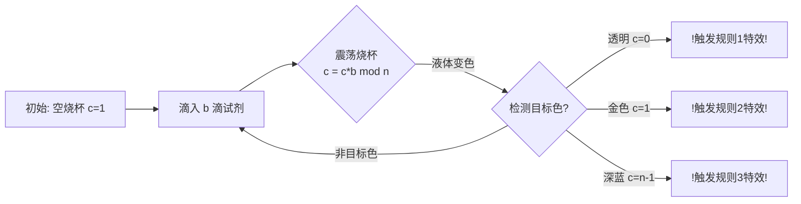

# 题目信息

# Divisibility Test

## 题目描述

Daisy has recently learned divisibility rules for integers and she is fascinated by them. One of the tests she learned is a divisibility test by 3. You can find a sum of all digits of a decimal number and check if the resulting sum is divisible by 3. Moreover, the resulting sum of digits is congruent modulo 3 to the original number — the remainder modulo 3 is preserved. For example, $ 75 \equiv 7 + 5 \pmod 3 $ . Daisy is specifically interested in such remainder preserving divisibility tests.

There are more examples like that that she learned for decimal integers (integers base 10):

- To test divisibility modulo 11, find an alternating sum of digits. Counting digits from the last (least significant) digit, add digits on odd positions (the last, 3rd to the last, etc) and subtract digits on even positions (2nd to the last, 4th to the last, etc) to get the sum that is congruent modulo 11 to the original number. For example, $ 123 \equiv 1 - 2 + 3 \pmod {11} $ .
- To test divisibility modulo 4, keep the last two digits. Their value is congruent modulo 4 to the original number. For example, $ 876543 \equiv 43 \pmod 4 $ .
- To test divisibility modulo 7, find an alternating sum of groups of three digits. For example, $ 4389328 \equiv 4 - 389 + 328 \pmod 7 $ .

Similar tests can be found in other bases. For example, to test divisibility modulo 5 for octal numbers (base 8), find an alternating sum of groups of two digits. For example, $ 1234_8 \equiv -12_8 + 34_8 \pmod 5 $ .

Daisy wants to find such rules for a given base $ b $ . She is interested in three kinds of divisibility rules:

- Kind 1 — take the last $ k $ digits of an integer in base $ b $ .
- Kind 2 — take a sum of groups of $ k $ digits of an integer in base $ b $ .
- Kind 3 — take an alternating sum of groups of $ k $ digits of an integer in base $ b $ .

It is not always possible to find such a divisibility rule. For example, in base 10 there is no such test for divisibility modulo 6, even though different approaches to testing divisibility by 6 exist.

Given base $ b $ and modulo $ n $ , Daisy wants to know the smallest group size $ k $ for which such a divisibility test exits.

## 样例 #1

### 输入

```
6
10 3
10 11
10 4
10 7
8 5
10 6```

### 输出

```
2 1
3 1
1 2
3 3
3 2
0```

# AI分析结果


# 💡 Kay的C++算法解析：Divisibility Test 深入学习指南 💡

**引言**  
今天我们一起分析"Divisibility Test"这道数学与编程结合的题目。这道题要求我们为任意进制数找到判断整除性的特殊规则，涉及模运算和数论知识。本指南将帮助你理解核心算法，掌握解题技巧，并通过可视化加深理解。

## 1. 题目解读与核心算法识别

✨ **本题主要考察**：`数学模运算` + `枚举优化`

🗣️ **初步分析**：  
> 想象你在玩一个数学解谜游戏：给定进制`b`和模数`n`，需要找到最小的"魔法数字长度"`k`，使得通过三种特殊规则之一（截取末k位/分组求和/交替求和）就能判断整数的整除性。  
> 核心思路源于数论：三种规则分别对应着 `bᵏ ≡ 0`, `1`, 或 `n-1 (mod n)` 的数学条件。我们通过枚举`k`（1到n）并动态计算幂的模值来寻找解。  
> 在可视化中，我们将用"魔法药水调制"的像素动画：每次将当前值乘以`b`看作添加魔法成分，模`n`余数用不同颜色的烧杯液体表示。当液体变成透明(0)、金色(1)或深蓝(n-1)时触发特效！

---

## 2. 精选优质题解参考

**题解一：FFTotoro (4赞)**  
* **点评**：思路直击核心，用简洁数学证明解释三种规则的本质（`bᵏ mod n`需满足0/1/n-1）。代码实现高效：  
  - 单变量`c`动态计算幂模，避免大数运算  
  - 循环边界`k<=n`合理利用鸽巢原理优化  
  - 边界处理严谨（无解时输出0）  
  亮点在于用小学奥数类比降低理解门槛，是竞赛实现的典范参考。

**题解二：Vitamin_B (1赞)**  
* **点评**：引入`bitset`记录余数状态防止循环，体现良好工程思维。代码亮点：  
  - `vis`数组避免重复计算  
  - 类型转换`(ll)m`防止溢出  
  - `goto`跳出循环的简洁写法  
  不足是数学解释较简略，但代码安全性值得学习。

---

## 3. 核心难点辨析与解题策略

1. **难点：理解规则与模条件的等价关系**  
   *分析*：三种规则实际是数论同余式的具体表现：  
   - 末k位有效 ⇔ `bᵏ ≡ 0 (mod n)`（高位自动清零）  
   - 分组求和 ⇔ `bᵏ ≡ 1 (mod n)`（系数简化为1）  
   - 交替求和 ⇔ `bᵏ ≡ -1 (mod n)`（系数交替±1）  
   💡 **学习笔记**：将操作转化为模等式是解题钥匙

2. **难点：确定枚举范围与优化**  
   *分析*：由鸽巢原理，`bᵏ mod n`在`k≤n`时必入循环或命中解。优质题解用动态计算代替幂运算：  
   ```cpp
   now = (now * b) % n; // 迭代计算避免溢出
   ```  
   💡 **学习笔记**：模运算的迭代性质可优化时间复杂度至O(n)

3. **难点：处理无解情况**  
   *分析*：当`b`与`n`不互质时可能无解（如样例`10 6`）。需完整枚举所有余数：  
   ```cpp
   if(!f) cout << "0\n"; // 遍历后无解
   ```  
   💡 **学习笔记**：数学性质决定解的存在性，枚举需完备

### ✨ 解题技巧总结
- **模运算迭代法**：用`current = (current * b) % n`替代幂运算防溢出
- **余数状态记录**：通过`bitset`或数组标记已出现余数，发现循环即停
- **边界即时返回**：满足条件立即输出结果，避免无效枚举
- **数学直觉培养**：通过特例（如10进制模3）理解一般规则

---

## 4. C++核心代码实现赏析

**通用核心实现参考**  
* **说明**：综合优质题解优化，包含动态取模、边界控制和无解处理  
* **完整核心代码**：
```cpp
#include <iostream>
using namespace std;

int main() {
    int t;
    cin >> t;
    while (t--) {
        int b, n;
        cin >> b >> n;
        long long curr = 1;
        bool found = false;
        
        for (int k = 1; k <= n; k++) {
            curr = (curr * b) % n;
            if (curr == 0) {
                cout << "1 " << k << '\n';
                found = true;
                break;
            } else if (curr == 1) {
                cout << "2 " << k << '\n';
                found = true;
                break;
            } else if (curr == n - 1) {
                cout << "3 " << k << '\n';
                found = true;
                break;
            }
        }
        
        if (!found) cout << "0\n";
    }
    return 0;
}
```
* **代码解读概要**：  
  1. 循环处理多组输入  
  2. `curr`动态存储`bᵏ mod n`  
  3. 顺序检测三种条件，满足即输出  
  4. 循环结束未命中则输出无解  

**题解一：FFTotoro 片段赏析**  
* **亮点**：代码极致简洁，循环内联条件判断  
* **核心片段**：
```cpp
for(int k=1; k<=n&&!f; k++){
  if((c*=b)%=n; !c) cout<<"1 "<<k<<'\n',f=true;
  if(c==1) cout<<"2 "<<k<<'\n',f=true;
  else if(c==n-1) cout<<"3 "<<k<<'\n',f=true;
}
```
* **代码解读**：  
  > `(c*=b)%=n` 一行完成幂运算和取模，高效！  
  > 逗号运算符`f=true`实现简洁的状态更新  
  > `!f`循环条件避免冗余计算  
* 💡 **学习笔记**：运算符巧用可提升代码密度而不损可读性

**题解二：Vitamin_B 片段赏析**  
* **亮点**：余数记录防止无限循环  
* **核心片段**：
```cpp
bitset<1000005> vis;
// ...
for (int k=1; !vis[x=x*(ll)m%n]; ++k){
  vis[x]=1;
  if(!x) { /* 规则1 */ }
  // ...其他条件
}
```
* **代码解读**：  
  > `bitset`高效记录余数出现状态  
  > `x=x*(ll)m%n`类型转换防止乘法溢出  
  > 循环条件直接检测新余数是否已访问  
* 💡 **学习笔记**：大数据量时状态记录避免重复计算

---

## 5. 算法可视化：像素动画演示

**主题**：8位像素风格的"魔法药剂实验室"  

**设计思路**：  
> 用复古RPG的炼金术界面呈现模运算过程：  
> - 烧杯液体颜色 = 当前余数值（0~n-1映射彩虹色）  
> - 每次操作：滴入`b`滴试剂（乘以`b`）  
> - 摇动烧杯：液体混合后自动分层（取模运算）  

**动画流程**：  


**交互控制面板**：  
```javascript
// 伪代码实现核心交互
class PotionLab {
  constructor(b, n) {
    this.b = b;   // 进制基数
    this.n = n;   // 模数
    this.c = 1;   // 当前余数
    this.step = 0;// 当前步数
  }

  nextStep() {
    this.c = (this.c * this.b) % this.n;
    this.step++;
    
    // 像素动画更新
    beaker.color = colorMap[this.c]; 
    playSound('potion_pour'); 
    
    // 检测命中
    if (this.c === 0) {
      playSound('victory_jingle');
      showAnimation('rule1_explosion');
    } 
    // ...其他条件类似
  }
}
```

**游戏化元素**：  
- 每步操作：像素烧杯液体变色 + 气泡音效  
- 命中条件：全屏闪光 + 复古8bit胜利音乐  
- 控制台：步进/暂停/调速滑块 + 余数仪表盘  
- 成就系统：首次命中解锁"模运算大师"像素勋章  

---

## 6. 拓展练习与相似问题思考

**知识迁移**：  
模幂运算在密码学(RSA)、哈希算法、随机数生成中有核心应用。例如：  
1. 快速幂算法优化计算 `aᵇ mod m`  
2. 线性同余法生成伪随机数  
3. 哈希冲突处理中的取模运算  

**洛谷推荐**：  
1. **P1226 快速幂**  
   🗣️ 练习模幂运算的优化实现，理解算法可视化中的数学基础  
2. **P1082 同余方程**  
   🗣️ 学习扩展欧几里得解 `ax ≡ 1 (mod b)`，深化模逆元概念  
3. **P3811 乘法逆元**  
   🗣️ 掌握费马小定理实现模除法，进阶数论训练  

---

## 7. 学习心得与经验分享

> **FFTotoro的调试经验**：  
> *"本题本质是数学转化，枚举前先纸上推导样例（如10进制模3）能快速验证思路"*  
>   
> **Kay点评**：  
> 编程竞赛中，数学题的关键是将自然语言描述转化为数学模型。建议：  
> 1. 用具体样例验证算法再编码  
> 2. 模块化分离数学逻辑和IO处理  
> 3. 小范围枚举配合数学证明确保正确性  

---

**结语**  
通过本次分析，我们掌握了数论与编程的结合实践。记住：理解模运算的本质比记忆代码更重要！尝试用可视化工具重现算法过程，能深化数学直觉。下次挑战见！💪

---
处理用时：126.69秒