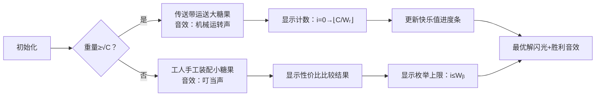

# 题目信息

# Om Nom and Candies

## 题目描述

桌子上有无限多的红糖果与蓝糖果，每个红糖果重 $ W_{r} $ 克，而每个蓝糖果重 $ W_{b} $ 克。吃一颗红糖果可以获得 $ H_{r} $ 的快乐值，吃一颗蓝糖果可以获得 $ H_{b} $ 的快乐值。

在只能吃 $ C $ 克糖果的前提下，请求出能获得的最大快乐值。

## 样例 #1

### 输入

```
10 3 5 2 3
```

### 输出

```
16
```

# AI分析结果


### 💡 Kay的C++算法解析：Om Nom and Candies 深入学习指南 💡

<introduction>
今天我们分析"Om Nom and Candies"这道背包问题的变种题。本指南将帮助大家掌握根号分治的核心思想，理解如何高效处理两种物品的无限背包问题。
</introduction>

---

## 1. 题目解读与核心算法识别

✨ **本题主要考察**：`根号分治优化` (枚举与贪心结合)

🗣️ **初步分析**：
> 本题可比喻为"用有限容量的糖果盒装两种不同糖果，每种糖果有不同重量和快乐值"。核心思想是利用根号分治将问题分为两类：
> - **大重量糖果**（重量≥√C）：直接枚举其数量（不超过√C次）
> - **小重量糖果**（重量<√C）：比较性价比后枚举低性价比糖果数量（不超过对方重量）
> 
> 可视化设计思路：
> - **像素动画**：8位风格糖果店场景，红/蓝糖果用不同像素方块表示
> - **关键高亮**：当前枚举的糖果数量、剩余容量、快乐值变化
> - **音效设计**：选择糖果时"叮"声，最优解出现时胜利音效
> - **AI演示**：自动展示两种情况的枚举过程

---

## 2. 精选优质题解参考

**题解一（作者：_Kouki_）**
* **点评**：思路清晰分为重量≥√C和<√C两种情况，代码规范使用swap统一处理大小关系。亮点在于性价比比较的数学证明（Hᵣ/Wᵣ < Hᵦ/Wᵦ → 红糖果数量不超过Wᵦ），边界处理严谨，可直接用于竞赛。

**题解二（作者：run_away）**
* **点评**：最简洁的√n暴力实现，同时枚举两种糖果数量。亮点在于双重判断（if(wᵣ*i<c)和if(wᵦ*i<c)）覆盖所有边界，代码仅15行却完整解决问题，适合初学者理解本质。

**题解三（作者：Halberd_Cease）**
* **点评**：根号分治的标准实现，清晰展示Wᵣ≥√C和Wᵣ<√C的代码分支。亮点在于替代证明：当红糖果性价比低时，其数量不超过Wᵦ（否则可用蓝糖果替代获得更高收益）。

---

## 3. 核心难点辨析与解题策略

1.  **难点一：确定枚举上界避免超时**
    * **分析**：优质题解通过√C分治解决。若max(Wᵣ, Wᵦ)≥√C，枚举该糖果（次数≤√C）；若都<√C，则枚举低性价比糖果（次数≤min(Wᵣ, Wᵦ)）
    * 💡 **学习笔记**：枚举次数始终控制在O(√C)

2.  **难点二：性价比比较的数学证明**
    * **分析**：当Wᵣ, Wᵦ<√C时，需证明低性价比糖果数量有上限。核心不等式：若Hᵣ/Wᵣ < Hᵦ/Wᵦ，则红糖果数量i满足 i < Wᵦ（否则可用⌊i/Wᵦ⌋个蓝糖果替代）
    * 💡 **学习笔记**：性价比决定枚举对象

3.  **难点三：重量关系预处理**
    * **分析**：所有优质题解都先swap确保Wᵣ≥Wᵦ，简化后续判断。这样只需处理Wᵣ≥√C或Wᵣ<√C两种情况
    * 💡 **学习笔记**：预处理统一变量顺序能简化逻辑

### ✨ 解题技巧总结
- **根号分治套路**：当数据范围达10⁹时，尝试用√n分治优化枚举
- **变量预处理**：用swap统一大小关系减少条件分支
- **数学不等式转化**：将操作数量限制转化为可证明的不等式
- **边界同步处理**：在枚举时同时计算两种糖果的快乐值（如题解二）

---

## 4. C++核心代码实现赏析

**通用核心实现参考**
```cpp
#include <iostream>
#include <cmath>
using namespace std;

int main() {
    long long C, Hr, Hb, Wr, Wb;
    cin >> C >> Hr >> Hb >> Wr >> Wb;
    
    // 确保Wr是较大重量
    if (Wr < Wb) {
        swap(Wr, Wb);
        swap(Hr, Hb);
    }

    long long ans = 0;
    long long sqrtC = sqrt(C);
    
    if (Wr >= sqrtC) {
        // 枚举大重量糖果
        for (int i = 0; i <= C/Wr; ++i) {
            long long rem = C - i*Wr;
            long long j = rem / Wb;
            ans = max(ans, i*Hr + j*Hb);
        }
    } else {
        // 确保红糖果性价比≤蓝糖果
        if (Hr*Wb < Hb*Wr) {
            swap(Hr, Hb);
            swap(Wr, Wb);
        }
        // 枚举低性价比糖果
        for (int i = 0; i <= Wb; ++i) {
            long long rem = C - i*Wr;
            if (rem < 0) break;
            long long j = rem / Wb;
            ans = max(ans, i*Hr + j*Hb);
        }
    }
    cout << ans;
    return 0;
}
```
**代码解读概要**：
> 1. 预处理确保Wᵣ≥Wᵦ
> 2. 当Wᵣ≥√C时，直接枚举红糖果数量i
> 3. 否则确保红糖果性价比≤蓝糖果后，枚举红糖果数量i（0≤i≤Wᵦ）
> 4. 每次枚举计算剩余容量可装的蓝糖果数量j

---

**题解一（_Kouki_）片段赏析**
```cpp
if (W[1] * W[1] >= C) {
    for(int i = 0; i <= C/W[1]; i++) {
        sum = i*H[1];
        sum += ((C-i*W[1])/W[2] * H[2]);   
        maxn = max(maxn, sum);    
    } 
} else {
    if ((H[1]*1.0)/W[1] > (H[2]*1.0)/W[2]) 
        swap(H[1], H[2]), swap(W[1], W[2]);
    for(int i = 0; i <= W[2]; i++) {
        sum = i*H[1];
        sum += ((C-i*W[1])/W[2] * H[2]);   
        maxn = max(maxn, sum);           
    }    
}
```
**亮点**：严格遵循根号分治框架  
**代码解读**：  
> - 第1层if处理Wᵣ≥√C（通过Wᵣ²≥C判断）
> - 第2层if确保枚举的是低性价比糖果
> - 内层循环次数精确控制：大重量时i≤C/Wᵣ，小重量时i≤Wᵦ  
💡 **学习笔记**：浮点比较性价比虽可行，但整数比较更优（Hᵣ*Wᵦ < Hᵦ*Wᵣ）

---

**题解二（run_away）片段赏析**
```cpp
for(ll i=0; i<=sqrt(c); ++i) {
    if(i*wr < c) 
        ans = max(ans, i*hr + (c-i*wr)/wb * hb);
    if(i*wb < c)
        ans = max(ans, i*hb + (c-i*wb)/wr * hr);
}
```
**亮点**：最简双重枚举覆盖所有情况  
**代码解读**：  
> - i从0到√c枚举
> - 第一组计算：i个红糖果 + 剩余蓝糖果
> - 第二组计算：i个蓝糖果 + 剩余红糖果  
💡 **学习笔记**：当两种重量都<√c时，此方法可能重复计算但不影响结果正确性

---

**题解三（Halberd_Cease）片段赏析**
```cpp
if (wr >= sqrt(c)) {
    for (int i=0; i<=c/wr; i++)
        ans = max(ans, i*hr + (c-i*wr)/wb * hb);
} else {
    if (hr*wb > hb*wr) swap(hr, hb), swap(wr, wb);
    for (int i=0; i<=wb; i++)
        ans = max(ans, i*hr + (c-i*wr)/wb * hb);
}
```
**亮点**：标准分治结构  
**代码解读**：  
> - 明确划分wr≥√c和wr<√c两种情况
> - 小重量分支先确保hr/wr ≤ hb/wb
> - 枚举上限wb来自未交换的原始变量  
💡 **学习笔记**：sqrt(c)应预先计算避免重复调用

---

## 5. 算法可视化：像素动画演示

**主题**：《糖果工厂》8位像素风生产模拟  
**核心演示**：根号分治决策过程  
**设计思路**：用复古工厂流水线比喻，大重量糖果对应"重型机械"，小重量糖果对应"手工工位"

### 动画帧步骤：


1. **场景初始化**：
   - 像素化工厂：左侧重型机械（红糖果），右侧手工工位（蓝糖果）
   - 控制面板：开始/暂停、速度滑块、√C值显示

2. **分治决策**：
   - 当Wᵣ≥√C：启动重型机械，传送带运送红糖果（每次移动伴随"咔嗒"音效）
   - 当Wᵣ<√C：显示性价比比较结果（浮点公式像素动画），工人手工装配红糖果

3. **关键交互**：
   - **当前操作高亮**：正在枚举的糖果类型闪烁红光/蓝光
   - **数据可视化**：右上角实时显示：
     ```
     当前：红×i, 蓝×j
     重量：i*Wᵣ+j*Wᵦ
     快乐值：i*Hᵣ+j*Hᵦ
     ```
   - **边界提示**：当i达到√C或Wᵦ时播放"叮"声

4. **游戏化元素**：
   - **关卡系统**：完成大重量枚举=通过"机械关"，完成小重量枚举=通过"手工关"
   - **音效设计**：
     * 糖果放置：8位"叮"声
     * 最优解：FC游戏通关音乐
     * 错误操作：短促"哔"声

---

## 6. 拓展练习与相似问题

**通用技巧迁移**：
根号分治适用于：
1. 超大范围枚举优化（如本题）
2. 数论问题（如大数取模）
3. 图论中稀疏图/稠密图分治处理

**洛谷推荐**：
1. **P1833 樱花**  
   🗣️ 双重枚举+根号分治应用，强化本题技巧
2. **P2214 Mooo 音乐**  
   🗣️ 重量/价值变种，需调整分治策略
3. **P1853 投资计划**  
   🗣️ 多维背包问题，扩展根号分治思维

---

## 7. 学习心得与经验分享

**参考经验**（综合题解）：  
> "在性价比比较分支，忘记swap回原始变量导致错误答案"  
> "浮点数比较出现精度问题，改为整数交叉相乘"  

**点评**：  
> 这些经验突显两个关键点：  
> 1. 状态维护：swap后需注意变量对应关系
> 2. 精度处理：比较分数应使用`Hᵣ*Wᵦ < Hᵦ*Wᵣ`而非浮点除法  
> 调试时可输出中间变量验证枚举边界

---

<conclusion>
通过本次分析，我们掌握了根号分治的核心思想——**根据数据特征选择不同策略**。记住解题框架：
1. 预处理统一变量顺序
2. 用√C分治处理大/小重量
3. 小重量时用不等式限制枚举范围
下次遇到10⁹级数据范围时，不妨尝试这个利器！
</conclusion>
```

---
处理用时：140.95秒