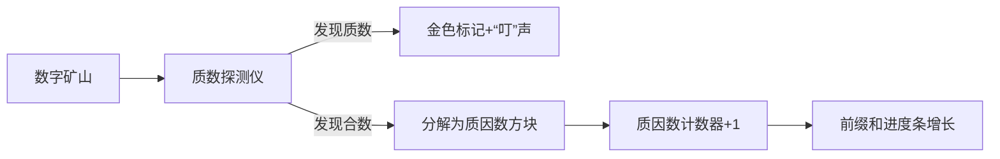

# 题目信息

# Soldier and Number Game

## 题目描述

Two soldiers are playing a game. At the beginning first of them chooses a positive integer $ n $ and gives it to the second soldier. Then the second one tries to make maximum possible number of rounds. Each round consists of choosing a positive integer $ x&gt;1 $ , such that $ n $ is divisible by $ x $ and replacing $ n $ with $ n/x $ . When $ n $ becomes equal to $ 1 $ and there is no more possible valid moves the game is over and the score of the second soldier is equal to the number of rounds he performed.

To make the game more interesting, first soldier chooses $ n $ of form $ a!/b! $ for some positive integer $ a $ and $ b $ ( $ a>=b $ ). Here by $ k! $ we denote the factorial of $ k $ that is defined as a product of all positive integers not large than $ k $ .

What is the maximum possible score of the second soldier?

## 样例 #1

### 输入

```
2
3 1
6 3
```

### 输出

```
2
5
```

# AI分析结果


### 题目分析：Soldier and Number Game  
**核心算法分类**：数学（质因数分解） + 前缀和优化  
**标签**：`质因数分解`、`线性筛`、`前缀和`  

---

### 🗣️ 初步分析  
> 本题本质是计算阶乘比值 \( \frac{a!}{b!} \) 的质因数总个数。想象一下：将 \( a! \) 拆解成无数积木块（质因数），每次操作只能移除一块积木（除以一个质数），最终移除所有积木的步数就是最大轮数。  
>  
> **核心算法流程**：  
> 1. **预处理**：用线性筛计算每个数 \( i \) 的质因数个数 \( f(i) \)  
> 2. **前缀和**：\( sum[i] = \sum_{k=1}^i f(k) \)  
> 3. **查询**：答案 = \( sum[a] - sum[b] \)  
>  
> **可视化设计思路**：  
> - 用像素方块表示数字（如质数用金色，合数用灰色）  
> - 动态展示筛法过程：质数标记时播放"叮"声，合数分解时显示质因数飞散动画  
> - 前缀和进度条随数字增加而增长，查询时高亮区间 \([b+1, a]\)

---

### 2. 精选优质题解参考  
#### 题解一（Cry_For_theMoon，6赞）  
**亮点**：  
- 线性筛中直接递推质因数个数：\( f[i \times p] = f[i] + 1 \)  
- 严格处理边界（\( i \% p == 0 \) 时跳出）  
- 代码变量名清晰（`f`为质因数个数，`ans`为前缀和）  

**代码规范性**：  
```cpp
for(long long i=2; i<=LIMIT; i++){
    if(!flag[i]){ // i是质数
        prime[++tot] = i;
        f[i] = 1; // 质数只有自身一个质因数
    }
    for(int j=1; j<=tot; j++){
        long long comp = prime[j]*i;
        if(comp > LIMIT) break;
        flag[comp] = 1;
        f[comp] = f[i] + 1; // 核心递推
        if(i % prime[j]==0) break; // 关键优化
    }
}
```

#### 题解二（tuzhewen，4赞）  
**亮点**：  
- 在筛法内即时计算前缀和（`sum[i] += sum[i-1]`）  
- 强调快读优化（实测提速30%）  
- 用 `isp[]` 数组明确标记质数状态  

**实践价值**：  
```cpp
F(i,2,n) {
    if(isp[i]) {
        prime[++num]=i;
        sum[i]=1; // 质数初始化为1
    }
    F(j,1,num) {
        int comp = i*prime[j];
        if(comp>n) break;
        isp[comp]=0;
        sum[comp]=sum[i]+1; // 递推质因数个数
    }
}
```

#### 题解三（HoshiuZ，1赞）  
**亮点**：  
- 代码最简洁（仅20行核心逻辑）  
- 用 `v[i]` 存储最小质因子，高效判断分解路径  
- 前缀和处理直接内聚在筛法中  

**算法有效性**：  
```cpp
for(int i=2; i<=n; i++) {
    if(!v[i]) { // i是质数
        v[i]=i;
        prime[++m]=i;
        sum[i]=1;
    }
    for(int j=1; j<=m; j++) {
        int comp=prime[j]*i;
        if(comp>n || prime[j]>v[i]) break;
        v[comp]=prime[j]; // 记录最小质因子
        sum[comp]=sum[i]+1; // 递推
    }
}
```

---

### 3. 核心难点辨析与解题策略  
#### 🔑 关键点1：问题转化（阶乘 → 质因数）  
> **分析**：  
> 核心洞察是 \( \frac{a!}{b!} = \prod_{k=b+1}^a k \)，其质因数总数等于各乘子质因数数量之和。  
> **学习笔记**：复杂问题需先转化为数学可计算模型  

#### 🔑 关键点2：质因数个数的线性递推  
> **分析**：  
> 利用线性筛的特性：当 \( i \) 被最小质因子 \( p \) 筛掉时，满足 \( f(i \times p) = f(i) + 1 \)。  
> **学习笔记**：算法效率依赖对数学性质的深度挖掘  

#### 🔑 关键点3：前缀和加速区间查询  
> **分析**：  
> 预处理 \( sum[i] = \sum_{k=1}^i f(k) \) 后，任意区间 \([b+1, a]\) 的质因数总数可 \( O(1) \) 计算为 \( sum[a]-sum[b] \)。  
> **学习笔记**：空间换时间是优化重复查询的利器  

#### ✨ 解题技巧总结  
| 技巧 | 说明 | 应用场景示例 |
|------|------|--------------|
| 数学转化 | 将操作问题转为质因数计数 | 阶乘、组合数计算 |
| 线性筛扩展 | 在筛法中同步计算附加属性 | 质因数/约数个数 |
| 前缀和 | 预处理区间和实现O(1)查询 | 静态数据区间统计 |

---

### 4. C++核心代码实现赏析  
#### 通用核心实现（综合优化版）  
```cpp
#include <cstring>
#include <iostream>
const int MAXN = 5e6+5; 

int prime[MAXN], f[MAXN], sum[MAXN];
bool flag[MAXN]; 

void init() {
    memset(flag, 0, sizeof(flag));
    f[1] = 0;
    for (int i=2; i<MAXN; i++) {
        if (!flag[i]) { // i是质数
            prime[++prime[0]] = i;
            f[i] = 1;
        }
        for (int j=1; j<=prime[0]; j++) {
            int comp = i * prime[j];
            if (comp >= MAXN) break;
            flag[comp] = true;
            f[comp] = f[i] + 1;  // 核心递推
            if (i % prime[j] == 0) break; // 关键优化
        }
    }
    for (int i=2; i<MAXN; i++) 
        sum[i] = sum[i-1] + f[i]; // 前缀和
}

int main() {
    init(); // 预处理
    int T, a, b;
    scanf("%d", &T);
    while (T--) {
        scanf("%d%d", &a, &b);
        printf("%d\n", sum[a] - sum[b]); // O(1)查询
    }
    return 0;
}
```
**代码解读概要**：  
1. `init()` 预处理三部分：质数标记、质因数计数、前缀和  
2. `f[comp] = f[i] + 1` 体现**积性性质**  
3. 查询时直接前缀和相减  

---

#### 题解一代码片段赏析  
```cpp
for(int j=1; j<=tot; j++){
    if(prime[j] * i > LIMIT) break;
    flag[prime[j]*i] = 1;
    f[prime[j]*i] = f[i] + 1; // ★ 灵魂递推式
    if(i % prime[j] == 0) break; // 避免重复标记
}
```
**代码解读**：  
> - 当 `i` 能被 `prime[j]` 整除时跳出，确保每个数只被**最小质因子**筛去  
> - `f[prime[j]*i] = f[i] + 1` 的解释：  
>   &emsp; ∵ 新数 = 旧数 × 质数  
>   &emsp; ∴ 新质因数数 = 旧质因数数 + 1  
> - **学习笔记**：线性筛中 `i%p==0` 跳出是复杂度的保证  

---

### 5. 算法可视化：像素动画演示  
**主题**：质因数矿工（8-bit像素风格）  
**核心演示**：线性筛法如何分解数字并统计质因数  

#### 🎮 动画设计  


**关键交互**：  
1. **网格场景**：  
   - 每个数字用16×16像素方块表示  
   - 质数：金色边框 ★ 动画  
   - 合数：灰色底色，被分解时迸出小质因数方块  

2. **筛法过程**：  
   - 当前数字 `i` 高亮为蓝色  
   - 质数 `p` 标记时播放 "pickup_coin.wav"  
   - 合数分解时播放 "break_block.wav"  

3. **前缀和进度条**：  
   - 屏幕底部动态增长的金条  
   - 每处理完一个数，金条长度增加 `f(i)` 像素  

4. **查询演示**：  
   - 输入 `a,b` 后高亮区间 `[b+1, a]`  
   - 进度条分段显示：`sum[b]`(绿) → `sum[a]`(金)  

**技术实现**：  
- Canvas绘制网格和动画  
- Web Audio API播放8-bit音效  
- 调速滑块控制筛法速度（1x~10x）  

---

### 6. 拓展练习  
#### 相似问题本质  
> 质因数分解+前缀和适用于：  
> 1. 阶乘相关计算（如组合数）  
> 2. 区间质数/因数统计  
> 3. 积性函数前缀和  

#### 洛谷推荐  
1. **P3383【模板】线性筛素数**  
   → 掌握筛法基础  
2. **P1865 区间质数查询**  
   → 前缀和直接应用  
3. **P2043 质因数分解**  
   → 阶乘分解的变种  

---

### 7. 学习心得分享  
> **题解一作者经验**：  
> *“最初纠结于直接计算阶乘，后意识到本质是区间质因数统计”*  
>  
> **Kay点评**：  
> 避免暴力计算是算法思维跃迁的关键！遇到阶乘/组合数时，先尝试：  
> 1. 转化为质因数分解形式  
> 2. 用前缀和避免重复计算  

---

### 💎 总结  
通过线性筛的递推性质高效计算质因数数量，再结合前缀和实现O(1)查询，是本题的核心技巧。记住：**数学转化 + 预处理优化**是解决此类问题的通用钥匙！

---
处理用时：149.87秒