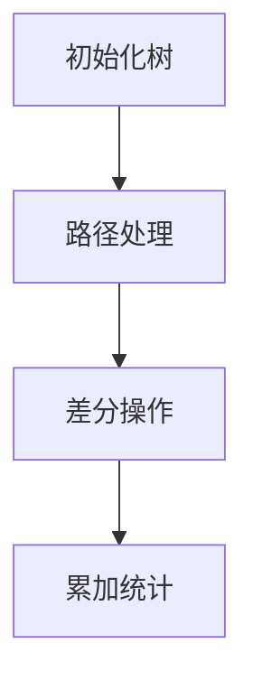

# 题目信息

# Fools and Roads

## 题目描述

有一颗 $n$  个节点的树，$k$  次旅行，问每一条边被走过的次数。

## 样例 #1

### 输入

```
5
1 2
1 3
2 4
2 5
2
1 4
3 5
```

### 输出

```
2 1 1 1 
```

## 样例 #2

### 输入

```
5
3 4
4 5
1 4
2 4
3
2 3
1 3
3 5
```

### 输出

```
3 1 1 1 
```

# AI分析结果


### 💡 Kay的C++算法解析：Fools and Roads 深入学习指南 💡

#### 1. 题目解读与核心算法识别
✨ **本题主要考察**：`树上差分（边差分） + LCA算法`  

🗣️ **初步分析**：
> 解决"Fools and Roads"的关键在于运用**树上差分**技术。想象每条路径像一根绳子连接两个树节点（u和v），我们在绳子的两端打结（u和v处+1），在绳子交汇点（LCA）解开两个结（-2）。最后从树叶到树根扫描，累加每个节点的"结数"，即得每条边的覆盖次数。  
> - **核心流程**：  
>   1. 预处理LCA（倍增/树剖）  
>   2. 对每条路径(u,v)：`diff[u]++`, `diff[v]++`, `diff[lca]-=2`  
>   3. DFS后序遍历累加差分值  
> - **可视化设计**：  
>   采用**8位像素风格**（类似FC游戏），树节点为彩色像素方块，边为发光线条。演示时：  
>   - 高亮当前路径的u/v节点（橙色闪烁+“叮”音效）  
>   - 高亮LCA节点（红色闪烁+两次“咚”音效）  
>   - 叶子→根累加过程用颜色渐变表示（浅蓝→深蓝）  
>   - 控制面板含“单步执行”、“调速滑块”、“AI自动演示”（贪吃蛇式路径探索）

---

### 2. 精选优质题解参考
**题解一：MY_Lee（倍增LCA）**  
* **点评**：  
  思路推导清晰（从基础差分→树上差分），代码变量名规范（`diff`/`lca`），采用倍增求LCA时间复杂度$O(n \log n)$。亮点在于用**深度较大节点代表边**的巧妙处理，边界严谨（如`depth`比较），可直接用于竞赛。作者强调“边差分公式推导”对理解至关重要。

**题解二：ModestCoder_（倍增LCA）**  
* **点评**：  
  代码简洁高效（仅30行核心逻辑），突出**点差分vs边差分**的公式对比（`power[lca]-=2`）。读入优化提升效率，实践性强。亮点在于直击本质：边是深度较大节点的父边，省去额外映射数组。

**题解三：_H1kar1（树剖LCA）**  
* **点评**：  
  树剖实现LCA更具教学意义，详细解释`sz/hs/tp`等数组含义。亮点是**调试技巧**：在LCA计算后输出验证，并分享“变量映射混淆”的踩坑经验，对实战调试极具参考价值。

---

### 3. 核心难点辨析与解题策略
1. **边→点的转化逻辑**  
   *分析*：每条边唯一对应其深度较大的端点。优质题解用`depth[u]>depth[v]?u:v`确定边的代表点，输出时直接取该点差分值。  
   💡 学习笔记：边的物理意义是子节点与父节点的连接。

2. **LCA算法选择与实现**  
   *分析*：倍增法（通用）vs树剖法（更快）。关键在`fa[][]`数组预处理和跳跃查询。可视化时需高亮跳跃过程（如从u→fa[u][i]的像素箭头）。  
   💡 学习笔记：树上差分必须快速求LCA，掌握至少一种$O(\log n)$方法。

3. **差分累加方向**  
   *分析*：必须从叶子向上累加（DFS后序），因父节点的值依赖子节点。逆向累加将导致错误。  
   💡 学习笔记：树形DP思想——子问题解组合成父问题解。

✨ **解题技巧总结**：  
- **问题转化**：将边覆盖转为端点统计  
- **LCA选择**：1e5数据用倍增，2e5+用树剖  
- **调试技巧**：打印`diff`数组中间值验证  
- **边界处理**：根节点（深度1）无父边不参与计算  

---

### 4. C++核心代码实现赏析
**通用核心实现（综合优化版）**：  
```cpp
#include <iostream>
#include <vector>
using namespace std;
const int N = 1e5 + 10;

vector<int> G[N];
int depth[N], fa[N][20], diff[N];
pair<int, int> edges[N]; // 存储输入边

void dfs_lca(int u, int par) {
    depth[u] = depth[par] + 1;
    fa[u][0] = par;
    for (int i = 1; i < 20; ++i) 
        fa[u][i] = fa[fa[u][i-1]][i-1];
    for (int v : G[u]) 
        if (v != par) dfs_lca(v, u);
}

int lca(int u, int v) {
    if (depth[u] < depth[v]) swap(u, v);
    for (int i = 19; i >= 0; --i)
        if (depth[fa[u][i]] >= depth[v])
            u = fa[u][i];
    if (u == v) return u;
    for (int i = 19; i >= 0; --i)
        if (fa[u][i] != fa[v][i])
            u = fa[u][i], v = fa[v][i];
    return fa[u][0];
}

void dfs_sum(int u, int par) {
    for (int v : G[u]) {
        if (v == par) continue;
        dfs_sum(v, u);
        diff[u] += diff[v]; // 累加子节点差分值
    }
}

int main() {
    int n, k; cin >> n;
    for (int i = 1; i < n; ++i) {
        auto& [u, v] = edges[i];
        cin >> u >> v;
        G[u].push_back(v); G[v].push_back(u);
    }
    dfs_lca(1, 0); // 初始化LCA
    
    cin >> k;
    while (k--) {
        int u, v; cin >> u >> v;
        diff[u]++; diff[v]++;
        diff[lca(u, v)] -= 2; // 边差分核心操作
    }
    dfs_sum(1, 0); // 从叶子向上累加
    
    for (int i = 1; i < n; ++i) {
        auto [u, v] = edges[i];
        // 输出深度较大节点的差分值
        cout << (depth[u] > depth[v] ? diff[u] : diff[v]) << " ";
    }
}
```

**代码解读概要**：  
1. `dfs_lca`：预处理倍增数组，计算深度  
2. `lca`：二进制跳跃查询最近公共祖先  
3. `dfs_sum`：后序遍历累加差分值（关键！）  
4. 边表示法：存储输入边，输出时取深度较大端点  

---

### 5. 算法可视化：像素动画演示
**主题**：像素森林寻宝之旅 🌲✨  
**核心演示流程**：  


1. **场景设计**：  
   - 8位像素树（棕色树干+绿叶节点）  
   - 路径显示为发光蓝线，覆盖次数用金币图标数表示  
   - 控制面板：方向键移动角色，A键单步，B键自动播放  

2. **关键帧演示**：  
   - **Frame 1**：角色移动到节点u（"叮！"音效），u闪烁橙色  
   - **Frame 2**：角色移动到节点v（"叮！"音效），v闪烁橙色  
   - **Frame 3**：角色跳转到LCA（两次"咚"音效），LCA闪烁红色  
   - **Frame 4**：从叶子节点开始，向上传递金币（渐变蓝光流动动画）  

3. **游戏化元素**：  
   - 每正确累加一条路径+10分  
   - 通关条件：所有边金币数=真实覆盖次数  
   - 失败音效：LCA计算错误时播放8位故障音  

---

### 6. 拓展练习与相似问题思考
**通用技巧迁移**：  
树上差分适用于：  
1. 路径点覆盖统计（如P3128）  
2. 子树修改查询（如DFS序+差分）  
3. 结合二分答案（如P2680运输计划）  

**洛谷推荐**：  
1. **P3128 [USACO15DEC]最大流**  
   → 点差分模板，巩固`diff[lca]--, diff[fa[lca]]--`  
2. **P3258 松鼠的新家**  
   → 点差分变形，注意端点重复处理  
3. **P2680 运输计划**  
   → 树上差分+二分答案，挑战级应用  

---

### 7. 学习心得与经验分享
> **来自_H1kar1的调试经验**：  
> “树剖LCA调试时，先打印`tp[x]`值验证重链划分，再检查差分累加方向。”  
> **Kay点评**：  
> 调试树形问题必备两件套：  
> 1. **可视化小数据**：n=5时模拟差分过程  
> 2. **链式数据测试**：退化成链的边界测试  

---  
掌握树上差分就像获得森林寻宝地图，理解核心公式`±1, ±2`的操作意义，你就能在树形问题中游刃有余！下次见！🚀

---
处理用时：174.86秒