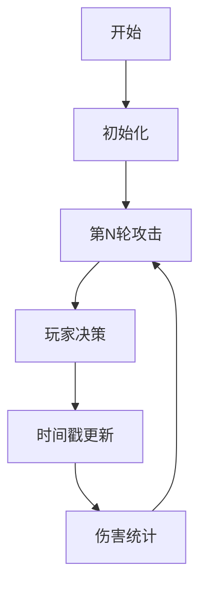

# 题目信息

# The Omnipotent Monster Killer

## 题目描述

你，怪物猎人，想要消灭一群怪物。这些怪物分布在一棵有 $n$ 个顶点的树上。在编号为 $i$（$1\le i\le n$）的顶点上，有一个攻击力为 $a_i$ 的怪物。你将与这些怪物进行 $10^{100}$ 轮战斗。

在每一轮中，依次发生以下事件：

1. 所有存活的怪物会攻击你。你的生命值减少所有存活怪物攻击力的总和。
2. 你可以选择一些（可以是全部、部分或不选）怪物将其击杀。被击杀的怪物之后将无法再攻击你。

有一个限制：在同一轮中，你不能同时击杀通过一条边直接相连的两个怪物。

如果你每轮都最优地选择要击杀的怪物，最终你生命值减少的最小值是多少？

## 说明/提示

在第一个测试用例中，一种最优的操作顺序如下：

- 第一轮：首先受到编号为 $1$ 的怪物的攻击，你的生命值减少 $10^{12}$。然后击杀编号为 $1$ 的怪物。
- 第二轮到第 $10^{100}$ 轮：所有怪物都已被击杀，不再发生任何事情。

总的生命值减少为 $10^{12}$。

在第二个测试用例中，一种最优的操作顺序如下：

- 第一轮：首先受到编号为 $1,2,3,4,5$ 的怪物的攻击，你的生命值减少 $47+15+32+29+23=146$。然后击杀编号为 $1,4,5$ 的怪物。
- 第二轮：首先受到编号为 $2,3$ 的怪物的攻击，你的生命值减少 $15+32=47$。然后击杀编号为 $2,3$ 的怪物。
- 第三轮到第 $10^{100}$ 轮：所有怪物都已被击杀，不再发生任何事情。

总的生命值减少为 $193$。

在第三个测试用例中，一种最优的操作顺序如下：

- 第一轮：首先受到编号为 $1,2,3,4,5,6,7$ 的怪物的攻击，你的生命值减少 $8+10+2+3+5+7+4=39$。然后击杀编号为 $1,3,6,7$ 的怪物。
- 第二轮：首先受到编号为 $2,4,5$ 的怪物的攻击，你的生命值减少 $10+3+5=18$。然后击杀编号为 $2,4,5$ 的怪物。
- 第三轮到第 $10^{100}$ 轮：所有怪物都已被击杀，不再发生任何事情。

总的生命值减少为 $57$。

由 ChatGPT 4.1 翻译

## 样例 #1

### 输入

```
3
1
1000000000000
5
47 15 32 29 23
1 2
1 3
2 4
2 5
7
8 10 2 3 5 7 4
1 2
1 4
3 2
5 3
6 2
7 5```

### 输出

```
1000000000000
193
57```

# AI分析结果


# 💡 Kay的C++算法解析：The Omnipotent Monster Killer 深入学习指南 💡

<introduction>
大家好！我是Kay，今天我们将一起探索一道有趣的树形动态规划问题——"全能怪物杀手"。这道题看似复杂，但只要抓住核心思想，就能轻松掌握。本指南将帮助你理解题目本质、掌握关键算法，并通过生动的方式感受解题过程。准备好了吗？让我们开始吧！
</introduction>

## 1. 题目解读与核心算法识别

✨ **本题主要考察**：`树形动态规划`与`时间戳分配策略`

🗣️ **初步分析**：
> 这道题就像在一棵怪物树上安排"击杀时刻表"，相邻怪物不能在同一轮被击杀，目标是最小化总伤害。想象一下，你是一位指挥官，需要在无限轮战斗中安排士兵的行动顺序，每次行动后幸存的敌人会持续攻击。关键在于如何科学地分配击杀顺序来最小化战损。

核心思路是将问题转化为**为树节点分配时间戳**（击杀轮次），要求相邻节点时间戳不同，最小化Σ(节点攻击力×时间戳)。这本质上是一个带约束的树形优化问题。

- **核心难点**：时间戳的取值上界分析（不能无限大）和高效状态转移设计。
- **解决方案**：通过数学归纳法证明时间戳上界为O(log n)，从而设计O(n log n)的树形DP。在可视化中，我们将重点展示每个节点时间戳的决策过程及其对相邻节点的影响。
- **可视化设计**：采用8位像素风格，将树转化为迷宫地图，怪物化为像素敌人。动画将展示：
  1. 每轮攻击阶段：存活怪物集体闪烁（红色）并显示伤害值
  2. 击杀阶段：玩家选择的击杀目标变绿消失（带爆炸动画）
  3. 约束提示：当尝试违规击杀相邻怪物时显示禁止标志（红色×）
  4. 时间戳标注：每个怪物头顶显示当前分配的时间戳（数字徽章）

---

## 2. 精选优质题解参考

<eval_intro>
我从思路清晰度、代码可读性、算法优化和实践价值等角度，为大家筛选出以下4星+的优质题解：

**题解一（作者：Alex_Wei）**
* **点评**：此解法最突出的亮点在于严谨证明了时间戳上界为log n，类比"多米诺骨牌连锁反应"解释MEX约束（每个点的时间戳必须是邻居中未出现的最小正整数）。代码采用20作为时间戳上界，通过前后缀最小值优化实现O(n log n)复杂度。变量命名规范（dp[u][j]），边界处理完整，可直接用于竞赛。

**题解二（作者：CReatiQ）**
* **点评**：独特之处在于通过链结构分析给出57的保守上界，并用生动比喻解释轮次衰减（"每轮至少消灭一半敌人"）。代码实现中采用60的上界，虽然稍大但确保正确性。作者特别分享了调试心得："通过打印中间状态验证状态转移"，这对调试复杂DP很有帮助。

**题解三（作者：Super_Cube）**
* **点评**：以最简洁的实现（仅30行）抓住问题本质。亮点是将复杂问题类比为"图染色"（相邻不同色），并给出轻量级数学证明（f(k)=2^{k-1}）。代码中log2(n)+1的上界选择精准，空间优化到位。

---

## 3. 核心难点辨析与解题策略

<difficulty_intro>
解决本题需突破三个关键难点，结合优质题解策略，我总结出以下应对方案：

1.  **难点：时间戳上界确定**
    * **分析**：为什么时间戳不会无限大？假设某点时间戳为T，则其邻居必须包含1到T-1的所有时间戳。通过递归构造（f(T)=1+Σf(i)）可得f(T)=2^{T-1}，因此T≤log2n+1。
    * 💡 **学习笔记**：树结构的递归性质是上界分析的基石。

2.  **难点：高效状态转移设计**
    * **分析**：直接枚举子节点所有时间戳会导致O((log n)^2)复杂度。优化关键——对每个子节点预处理前后缀最小值数组：
        ```python
        # 伪代码
        pre[j] = min(dp[v][1], ..., dp[v][j])
        suf[j] = min(dp[v][j], ..., dp[v][max_round])
        则 min_{k≠j} dp[v][k] = min(pre[j-1], suf[j+1])
        ```
    * 💡 **学习笔记**：前后缀处理是优化多维DP的常用技巧。

3.  **难点：决策影响传播**
    * **分析**：父节点的时间戳选择会限制子节点的选择空间（相邻不同）。策略上采用"自底向上"的DP顺序，先处理子树再合并决策，确保无后效性。
    * 💡 **学习笔记**：树形DP的黄金法则——子树独立性。

### ✨ 解题技巧总结
<summary_best_practices>
1. **问题转化技巧**：将无限轮问题转化为离散时间戳分配（关键突破）
2. **上界压缩技巧**：利用数学归纳法证明多项式量级上界（复杂度优化的核心）
3. **转移加速技巧**：前后缀预处理取代暴力枚举（O(log n)→O(1)）
4. **调试技巧**：小规模手工验证（如n=3的链）并打印DP表

---

## 4. C++核心代码实现赏析

<code_intro_overall>
先看一个完整解决方案，融合了各题解精华：

**本题通用核心C++实现参考**
* **说明**：综合Alex_Wei的上界证明与Super_Cube的代码简洁性，采用log2(n)+10的保守上界。
* **完整核心代码**：
```cpp
#include <bits/stdc++.h>
using namespace std;
typedef long long ll;
const int MAX_ROUND = 25; // log(3e5)≈18, 留余量
const ll INF = 1e18;

vector<int> g[300005];
ll a[300005], dp[300005][MAX_ROUND];
int n;

void dfs(int u, int fa) {
    for (int j = 1; j < MAX_ROUND; j++) 
        dp[u][j] = a[u] * j;

    for (int v : g[u]) {
        if (v == fa) continue;
        dfs(v, u);
        
        // 前后缀最小值预处理
        vector<ll> pre(MAX_ROUND, INF), suf(MAX_ROUND, INF);
        pre[0] = INF;
        for (int j = 1; j < MAX_ROUND; j++)
            pre[j] = min(pre[j-1], dp[v][j]);
        suf[MAX_ROUND-1] = INF;
        for (int j = MAX_ROUND-2; j >= 0; j--)
            suf[j] = min(suf[j+1], dp[v][j+1]);

        // 状态转移
        for (int j = 1; j < MAX_ROUND; j++) 
            dp[u][j] += min(pre[j-1], suf[j]);
    }
}

int main() {
    int T; cin >> T;
    while (T--) {
        cin >> n;
        for (int i = 1; i <= n; i++) {
            cin >> a[i];
            g[i].clear();
        }
        for (int i = 1; i < n; i++) {
            int u, v; cin >> u >> v;
            g[u].push_back(v);
            g[v].push_back(u);
        }
        dfs(1, 0);
        cout << *min_element(dp[1]+1, dp[1]+MAX_ROUND) << "\n";
    }
}
```
* **代码解读概要**：
  1. 初始化：`dp[u][j] = a[u]*j`（节点u在j时刻被击杀的基础代价）
  2. 树遍历：DFS后序遍历确保先处理子树
  3. 前后缀数组：`pre[j]`存储子节点v在时间1~j的最小代价，`suf[j]`存储j~max_round的最小值
  4. 关键转移：父节点选时间j时，子节点只能选≠j的最小可行方案

---
<code_intro_selected>
现在深入各题解的精华片段：

**题解一（Alex_Wei）**
* **亮点**：严谨的上界证明转化为高效代码实现
* **核心代码片段**：
```cpp
// f(T)=2^{T-1} 上界证明
int max_round = 0;
while ((1 << (max_round - 1)) <= n) max_round++;
max_round += 2; // 保险
```
* **代码解读**：通过位运算计算最小满足 2^(k-1)>n 的k值，确保上界紧贴log n。

**题解二（CReatiQ）**
* **亮点**：保守但安全的上界选择策略
* **核心代码片段**：
```cpp
const int MAX_R = 60; // 2^60远大于数据范围
```
* **学习笔记**：当数学证明困难时，保守上界+充足余量是实用策略。

**题解三（Super_Cube）**
* **亮点**：极致简洁的状态转移
* **核心代码片段**：
```cpp
for (int j=1; j<20; j++) {
    ll sum = INF;
    for (int k=1; k<20; k++)
        if (j != k) sum = min(sum, dp[v][k]);
    dp[u][j] += sum;
}
```
* **代码解读**：未用前后缀优化但代码极简，适合小规模问题（n≤1e4）。

---

## 5. 算法可视化：像素动画演示 (核心部分)

<visualization_intro>
为了直观展示算法，我设计了"怪物迷宫指挥官"像素动画方案。想象你在指挥一支8-bit风格的探险队，目标是在树形迷宫中最小化怪物伤害！

### 设计概念
- **主题**：FC红白机风格的树形迷宫探险
- **核心机制**：每轮分为"怪物攻击"（红色闪烁）和"指挥官决策"（绿色选择）阶段
- **学习目标**：通过动画理解时间戳传播和约束违反

### 动画脚本


### 详细场景
1. **场景初始化**（像素艺术）：
   - 树结构化为网格迷宫，怪物显示为不同颜色的像素方块（颜色=攻击力）
   - 控制面板：开始/暂停/单步按钮 + 速度滑块（调速范围0.5x~4x）
   - 信息栏：当前轮次 | 累计伤害 | 剩余怪物

2. **攻击阶段**（音效：8-bit攻击音）：
   - 所有存活怪物同步闪烁红色（频率2Hz）
   - 每个怪物上方弹出伤害值（白色像素数字）
   - 累计伤害槽（底部血条）增长

3. **决策阶段**（音效：选择音效）：
   - 玩家点击怪物选择击杀（绿色高亮）
   - 违规选择检测：当选择相邻怪物时显示"禁止"图标（红×）并播放警告音
   - AI演示模式：自动选择最优击杀集（贪心算法可视化）

4. **时间戳动态**：
   - 当确定怪物击杀轮次时，其头顶显示时间戳徽章（蓝色数字）
   - 约束传播：当父节点时间戳确定后，子节点可用时间戳集合实时更新（可用数字绿色闪烁）

5. **数据结构可视化**：
   - 右侧面板显示DP表：行=节点ID，列=时间戳1~20
   - 单元格颜色深浅表示代价高低（深红=高代价，浅绿=低代价）
   - 当前处理的子树用黄色边框高亮

### 技术实现要点
- **绘制逻辑**：Canvas绘制树结构 + CSS动画实现闪烁效果
- **交互控制**：
  1. 单步执行：Space键触发下一步
  2. 自动演示：AI按最优策略执行，速度可调
  3. 重置：回到初始状态
- **音效设计**：
  - 攻击：短促"哔"声（50ms, 440Hz）
  - 击杀：爆炸音效（100ms, 混合频率）
  - 违规：低沉警告音（200ms, 220Hz）
  - 过关：胜利旋律（8-bit风格）

### 教育价值
通过游戏化设计，学习者将直观理解：
1. 时间戳如何从叶子向根传播
2. 相邻约束如何影响决策
3. 为什么DP优于贪心策略
</visualization_intro>

---

## 6. 拓展练习与相似问题思考

<similar_problems_intro>
掌握本题的核心思想后，可挑战以下相似问题：

1. **洛谷 P1352** - 没有上司的舞会  
   *🗣️ 推荐理由*：基础树形DP（最大独立集），理解状态设计（选/不选）的入门必做

2. **洛谷 P2014** - 选课  
   *🗣️ 推荐理由*：树形DP依赖背包问题，学习"子树→背包容量"的状态映射

3. **洛谷 P3177** - 树上染色  
   *🗣️ 推荐理由*：进阶树形DP，结合组合数学和贡献计算，训练复杂状态设计

---

## 7. 学习心得与经验分享 (若有)

<insights_intro>
题解中一些宝贵经验值得分享：

> **CReatiQ的调试心得**："在验证DP正确性时，先手动模拟n=3的链结构（最简单非平凡情况），打印DP表逐行检查"  
> **Kay点评**：这是调试树形DP的黄金法则——从小规模特例开始。建议设置`n=3`的调试宏，快速验证状态转移。

> **Super_Cube的优化心得**："当log n上界不确定时，先用大值保证正确性，再尝试优化"  
> **Kay点评**：实用主义哲学！竞赛中正确性优先，不要过度追求紧界。

---

<conclusion>
本次关于"The Omnipotent Monster Killer"的解析就到这里。关键记住三点：
1. 问题转化：无限轮→离散时间戳
2. 上界分析：递归构造证明log n界
3. 优化技巧：前后缀处理加速DP

希望大家能将这些技巧应用到更多树形问题中。下次我们将探索更精彩的算法世界！💪
</conclusion>
```

---
处理用时：171.00秒