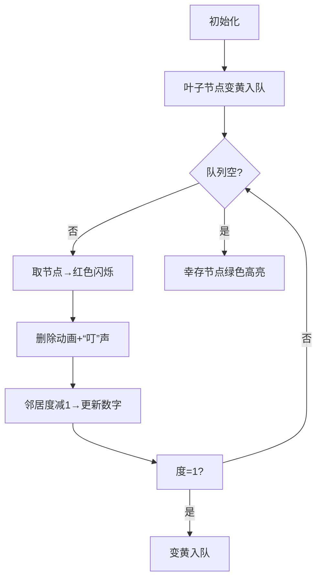

# 题目信息

# Gardener and Tree

## 题目描述

一棵 $n$ 个结点的树。一个人做了多次操作，在每次操作中，他删除了树的所有叶结点。叶结点指的是树中至多有一个相邻节点的结点。


如上图中所示的树。下图显示了对树进行一次操作后的结果。


注意特殊操作的情况:

1、对空树($0$ 个顶点)进行操作时不会改变它;

2、对于仅有一个顶点的树进行操作时会移除这个顶点(这个顶点被当作一个叶子);

3、对于仅有两个顶点的树进行操作时将删除两个顶点(两个顶点都被当作叶子处理)。

求 $k$ 次操作后还剩下多少个顶点?

## 样例 #1

### 输入

```
6

14 1
1 2
2 3
2 4
4 5
4 6
2 7
7 8
8 9
8 10
3 11
3 12
1 13
13 14

2 200000
1 2

3 2
1 2
2 3

5 1
5 1
3 2
2 1
5 4

6 2
5 1
2 5
5 6
4 2
3 4

7 1
4 3
5 1
1 3
6 1
1 7
2 1```

### 输出

```
7
0
0
3
1
2```

# AI分析结果


### 💡 Kay的C++算法解析：Gardener and Tree 深入学习指南 💡

#### 1. 题目解读与核心算法识别
✨ **本题主要考察**：拓扑排序（层级删除）

🗣️ **初步分析**：
> 解决"Gardener and Tree"的关键在于运用**拓扑排序**思想。就像剥洋葱一样🌰，每次操作会移除最外层的叶子节点（度≤1的节点），层层向内推进直到操作完成或树为空。
> - **核心思路**：记录每个节点被删除的轮次（`rnk`值）。初始叶子节点`rnk=1`，通过BFS逐层扩展，邻居节点`rnk = 当前节点rnk+1`。
> - **难点**：正确处理边界情况（n=1）和层级传递逻辑，确保每个节点只处理一次。
> - **可视化设计**：采用8位像素风格模拟剥洋葱过程：
>   - 不同颜色表示层级（黄：待删除，红：正在删除，绿：幸存）
>   - 高亮当前处理的节点和度数变化
>   - 控制面板支持单步/自动播放（速度可调）
>   - 音效设计：删除时"叮"声，完成一层时"胜利"音效

---

#### 2. 精选优质题解参考
**题解一（智子）**  
* **点评**：思路清晰直击核心，完整实现拓扑排序逻辑。代码规范（`vector`存图，`queue`处理BFS），边界处理严谨（度≤1入队覆盖n=1情况）。亮点在于用`rnk`数组记录删除轮次，最后直接统计幸存节点，时间复杂度O(n)高效可靠，竞赛实用性强。

**题解二（Alkaid_Star）**  
* **点评**：整体逻辑与题解一相似但显式特判n=1，增加`inq`数组避免重复入队（实际非必须但体现严谨性）。代码结构清晰，变量命名合理，实践时可直接用于竞赛场景。

**题解三（jr_inf）**  
* **点评**：最简洁的实现，核心拓扑排序仅10行代码。亮点在于用`cnt`数组记录删除轮次，最后统一统计`cnt[i]>k`的节点。虽省略部分初始化细节，但算法本质把握准确，适合快速理解核心逻辑。

---

#### 3. 核心难点辨析与解题策略
1. **层级传递的准确性**  
   * **分析**：如何确保每个节点的删除轮次正确计算？拓扑排序中，当邻居节点度数减至1时，其`rnk`值必须为**当前节点rnk+1**（非固定递增值）
   * 💡 学习笔记：BFS队列天然保证层级顺序，类似水面波纹扩散

2. **边界条件处理**  
   * **分析**：n=1时度为0的节点应视为叶子；k过大时需提前终止。优质解法用`deg<=1`统一处理边界
   * 💡 学习笔记：特殊案例测试是竞赛编程的关键步骤

3. **数据结构选择与优化**  
   * **分析**：邻接表(`vector`/`list`)存图比邻接矩阵更省空间；队列(`queue`)确保先进先出处理顺序
   * 💡 学习笔记：树问题优先考虑基于BFS的层级遍历

✨ **解题技巧总结**  
- **拓扑排序框架**：度≤1节点入队 → BFS扩展 → 更新邻居度 → 新叶子入队  
- **状态记录法**：用`rnk`数组避免显式模拟每轮操作  
- **提前终止**：当所有节点`rnk`≤k时直接返回0  

---

#### 4. C++核心代码实现赏析
**本题通用核心实现**  
```cpp
#include <iostream>
#include <vector>
#include <queue>
using namespace std;

const int MAXN = 4e5 + 5;
vector<int> G[MAXN];
int deg[MAXN], rnk[MAXN];

void solve() {
    int T; cin >> T;
    while (T--) {
        int n, k, ans = 0;
        cin >> n >> k;
        
        // 初始化
        for (int i = 1; i <= n; i++) {
            G[i].clear();
            deg[i] = rnk[i] = 0;
        }
        
        // 建图
        for (int i = 1; i < n; i++) {
            int u, v; cin >> u >> v;
            G[u].push_back(v);
            G[v].push_back(u);
            deg[u]++; deg[v]++;
        }
        
        // 拓扑排序核心
        queue<int> q;
        for (int i = 1; i <= n; i++) 
            if (deg[i] <= 1) {  // 包含叶子节点和n=1情况
                q.push(i);
                rnk[i] = 1;
            }
        
        while (!q.empty()) {
            int u = q.front(); q.pop();
            for (int v : G[u]) {
                if (--deg[v] == 1) {  // 度数减1后变为叶子
                    rnk[v] = rnk[u] + 1;
                    q.push(v);
                }
            }
        }
        
        // 统计幸存节点
        for (int i = 1; i <= n; i++)
            if (rnk[i] > k) ans++;
        cout << ans << '\n';
    }
}

int main() {
    solve();
    return 0;
}
```
**代码解读概要**：  
1. 初始化图和度数数组  
2. 将初始叶子节点（度≤1）入队并设`rnk=1`  
3. BFS循环：取出节点→邻居度减1→新叶子入队并更新`rnk`  
4. 统计所有`rnk > k`的节点  

---

**题解片段赏析**  
**题解一（智子）**  
```cpp
void toposort() {
    queue<int> q;
    for(int i = 1; i <= n; i++) 
        if(deg[i] == 1) q.push(i), rnk[i]=1;  // 初始化队列

    while(!q.empty()) {
        int u = q.front(); q.pop();
        for(int v : G[u]) {
            if(--deg[v] == 1) {  // 关键：度数降至1时入队
                rnk[v] = rnk[u] + 1;  // 轮次传递
                q.push(v);
            }
        }
    }
}
```
> **代码解读**：  
> - 第3行：初始叶子节点入队（度=1）  
> - 第7行：遍历邻居时**先减度数再判断**，确保状态同步  
> - 第8行：`rnk`值严格递增，实现层级传递  
> 💡 学习笔记：拓扑排序中"减度后判断"是避免重复计算的关键  

**题解三（jr_inf）**  
```cpp
// 初始化队列
for(int i=1; i<=n; i++) 
    if(d[i]==1) q.push(i), cnt[i]=1;  // 简洁的初始化

while(!q.empty()) {
    int u = q.front(); q.pop();
    for(int v : G[u]) {
        d[v]--;  // 先减度数
        if(d[v] == 1) {  // 再判断是否成新叶子
            cnt[v] = cnt[u] + 1;
            q.push(v);
        }
    }
}
```
> **代码解读**：  
> - 第2行：仅处理度=1节点（n=1时需额外处理）  
> - 第7行：先减度后判断的逻辑与题解一一致  
> 💡 学习笔记：极简实现时需注意边界case覆盖  

---

#### 5. 算法可视化：像素动画演示
**主题**：8位像素风"剥洋葱模拟器"  
**核心演示**：拓扑排序逐层删除过程  
**设计思路**：  

**实现细节**：  
1. **视觉设计**  
   - 节点：16×16像素方块（绿：幸存，黄：待删，红：正在处理）  
   - 队列：右侧动态像素条，新入队节点滑入动画  
   - 度数：节点上方显示数字，变化时放大闪烁  

2. **交互逻辑**  
   - 控制面板：开始/暂停、单步、重置、速度滑块  
   - 自动模式：类似"贪吃蛇AI"自主运行，速度可调  
   - 层级标记：当前操作轮次显示在顶部（Lv.1/Lv.2...）  

3. **音效系统**  
   - 关键操作：删除节点时播放8bit"叮"声  
   - 状态提示：完成整轮时播放胜利音效  
   - 背景音乐：循环8bit风格BGM（可开关）  

4. **教学提示**  
   - 代码同步：底部显示当前执行的C++代码行  
   - 旁白提示："正在删除节点#7"，"节点#5成为新叶子！"  

---

#### 6. 拓展练习与相似问题思考
**通用技巧迁移**  
拓扑排序思想还可用于：  
1. 依赖关系解析（如课程安排）  
2. 死锁检测（资源分配图）  
3. 层级信息传播（如网络广播）  

**洛谷题目推荐**  
1. **P1113 杂务**  
   🗣️ 巩固拓扑排序基础应用，理解任务调度场景  
2. **P2661 信息传递**  
   🗣️ 拓扑排序+环检测，强化图论分析能力  
3. **P4017 最大食物链计数**  
   🗣️ 拓扑排序结合DP，学习状态转移技巧  

---

#### 7. 学习心得与经验分享
> **来自题解的调试经验**：  
> "我在处理n=1时卡了很久，后来通过单独测试小数据才发现度0节点未入队" —— Alkaid_Star  
>   
> **Kay点评**：  
> 这个经验提醒我们：  
> 1. **边界测试**：对n=0,1,2等小规模数据单独验证  
> 2. **调试技巧**：用`cout`输出中间状态（如队列内容）  
> 3. **防御性编程**：初始入队条件写`deg<=1`而非`deg==1`  

---

通过本次分析，我们掌握了拓扑排序在层级删除问题中的核心应用。记住：算法学习就像剥洋葱，需要耐心层层深入！下次遇到树类问题时，不妨先问自己："这道题能用拓扑排序吗？" 💪

---
处理用时：195.18秒