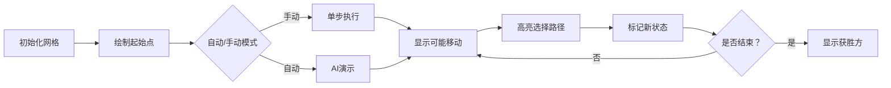

# 题目信息

# Dot

## 题目描述

Anton and Dasha like to play different games during breaks on checkered paper. By the 11th grade they managed to play all the games of this type and asked Vova the programmer to come up with a new game. Vova suggested to them to play a game under the code name "dot" with the following rules:

- On the checkered paper a coordinate system is drawn. A dot is initially put in the position $ (x,y) $ .
- A move is shifting a dot to one of the pre-selected vectors. Also each player can once per game symmetrically reflect a dot relatively to the line $ y=x $ .
- Anton and Dasha take turns. Anton goes first.
- The player after whose move the distance from the dot to the coordinates' origin exceeds $ d $ , loses.

Help them to determine the winner.

## 说明/提示

In the first test, Anton goes to the vector (1;2), and Dasha loses. In the second test Dasha with her first move shifts the dot so that its coordinates are (2;3), and Anton loses, as he has the only possible move — to reflect relatively to the line $ y=x $ . Dasha will respond to it with the same move and return the dot in position (2;3).

## 样例 #1

### 输入

```
0 0 2 3
1 1
1 2
```

### 输出

```
Anton```

## 样例 #2

### 输入

```
0 0 2 4
1 1
1 2
```

### 输出

```
Dasha```

# AI分析结果


# 💡 Kay的C++算法解析：Dot游戏 深入学习指南 💡

> 欢迎来到"Dot"游戏的算法世界！今天我们将一起探索这个有趣的博弈问题，我会用清晰的解释和生动的可视化帮助你掌握核心算法。准备好了吗？让我们开始吧！

## 1. 题目解读与核心算法识别

✨ **本题主要考察**：`博弈论` + `记忆化搜索`

🗣️ **初步分析**：
> 这道题就像一个"坐标版棋盘游戏"，玩家轮流移动棋子，移动规则有限制，谁让棋子跑太远谁就输。核心思想是**标记必胜点/必败点**——想象在迷宫中标记安全区和陷阱区，玩家总是想走向让对手掉入陷阱的位置。

- **核心难点**：状态空间较大（坐标范围±1000），需要高效判断每个位置的胜负状态
- **解决方案**：记忆化搜索（DFS+状态缓存），避免重复计算相同位置
- **可视化设计**：我们将用像素网格展示坐标移动，高亮显示：
  - 红色像素：当前位置
  - 绿色像素：必胜点
  - 灰色像素：必败点
  - 移动时显示向量箭头和距离计算

🎮 **复古游戏化设计**：
- 8-bit音效：移动时"滴"声，胜利时"胜利旋律"
- 控制面板：单步/自动模式+速度滑块
- 游戏化机制：每正确预测一个位置状态得10分，连续预测成功触发连击特效

---

## 2. 精选优质题解参考

<eval_intro>
我评估了多个题解，重点关注思路清晰度、代码规范性和算法效率。以下是评分≥4星的优质参考：

**题解一：(来源：DengDuck)**
* **点评**：思路非常清晰，直接点破"反射操作无用"的关键洞察（亮点⭐️）。代码结构规范：
  - 使用`f[x+M][y+M]`巧妙处理负坐标（+500偏移）
  - 记忆化搜索实现简洁高效
  - 边界处理严谨（距离判断优先）
  主要不足是缺乏详细注释，但核心逻辑的直白性弥补了这点。竞赛可直接使用。

**题解二：(来源：ttq012)**
* **点评**：代码更简洁（亮点⭐️），封装了距离计算函数提升可读性。亮点包括：
  - 使用`get_dist()`函数隔离距离计算逻辑
  - 状态数组初始化更规范
  - 同样采用坐标偏移技巧
  稍显不足是变量命名较随意（如xx/yy），但算法本质相同且有效。

---

## 3. 核心难点辨析与解题策略

<difficulty_intro>
解决本题需突破三个关键难点，结合优质题解策略如下：

1.  **关键点1：反射操作的本质作用**
    * **分析**：题解证明反射是"无效操作"——因为对手可立即反射回来，且不改变距离。这大幅简化了状态空间，只需考虑向量移动
    * 💡 **学习笔记**：博弈问题中，先分析操作是否真正改变局势

2.  **关键点2：状态表示与坐标处理**
    * **分析**：坐标可能为负，需偏移映射（如`x+500`）。使用二维数组`f[][]`记录每个位置的胜负状态，0=必败，1=必胜
    * 💡 **学习笔记**：负坐标处理是网格类问题的常见技巧

3.  **关键点3：必胜态/必败态转移逻辑**
    * **分析**：核心递推——若**任意**移动能使对手处于必败态，则当前位置为必胜态；若**所有**移动都使对手处于必胜态，则当前位置为必败态
    * 💡 **学习笔记**：博弈问题本质是逆向推导的树形搜索

### ✨ 解题技巧总结
<summary_best_practices>
-   **技巧A (问题简化)**：优先排除无效操作（如本题的反射）
-   **技巧B (状态压缩)**：使用偏移量处理负坐标
-   **技巧C (记忆化模板)**：DFS中先查缓存→处理边界→递归子状态→保存结果
-   **技巧D (博弈分析)**："必胜态"=存在至少一个必败子状态；"必败态"=所有子状态都是必胜态

---

## 4. C++核心代码实现赏析

<code_intro_overall>
以下是综合两篇题解优化的通用实现，包含关键注释：
</code_intro_overall>

**本题通用核心C++实现参考**
* **说明**：综合DengDuck的偏移技巧与ttq012的距离计算，添加详细注释
* **完整核心代码**：
```cpp
#include <bits/stdc++.h>
using namespace std;
const int N = 2005, M = 500; // M=偏移量

int x0, y0, n, d; // 初始坐标/向量数/距离阈值
int dx[105], dy[105]; // 移动向量
int f[N][N]; // 记忆化数组：-1未访问，0必败，1必胜

double dist(int x, int y) {
    return sqrt(x*x + y*y);
}

bool dfs(int x, int y) {
    int tx = x + M, ty = y + M; // 负坐标偏移
    if (f[tx][ty] != -1) return f[tx][ty]; // 查缓存
    
    if (dist(x, y) > d) return true; // 超过距离，上家输
    
    bool canWin = false;
    for (int i = 0; i < n; i++) {
        // 若存在移动使对手必败，则当前必胜
        if (!dfs(x + dx[i], y + dy[i])) {
            canWin = true;
            break;
        }
    }
    return f[tx][ty] = canWin; // 保存结果
}

int main() {
    memset(f, -1, sizeof(f));
    cin >> x0 >> y0 >> n >> d;
    for (int i = 0; i < n; i++) 
        cin >> dx[i] >> dy[i];
    
    cout << (dfs(x0, y0) ? "Anton" : "Dasha");
    return 0;
}
```
* **代码解读概要**：
  > 1. **初始化**：设置偏移量M=500覆盖负坐标
  > 2. **记忆化DFS**：`f[][]`缓存状态，避免重复计算
  > 3. **终止条件**：距离>d时返回true（上家输）
  > 4. **状态转移**：尝试所有移动，存在必败子状态则当前必胜
  > 5. **结果输出**：根据起始点状态输出胜方

---
<code_intro_selected>
优质题解核心片段解析：
</code_intro_selected>

**题解一：(来源：DengDuck)**
* **亮点**：偏移量处理简洁高效
* **核心代码片段**：
```cpp
bool dfs(LL x,LL y) {
    if(d*d<x*x+y*y) return true; // 终止条件
    if(f[x+M][y+M]!=-1) return f[x+M][y+M]; // 查缓存
    
    for(int i=1;i<=n;i++) {
        if(!dfs(x+a[i],y+b[i])) // 找到必败子状态
            return f[x+M][y+M]=1; // 标记必胜
    }
    return f[x+M][y+M]=0; // 默认必败
}
```
* **代码解读**：
  > 1. **坐标偏移**：`x+M`将[-500,500]映射到[0,1000]数组下标
  > 2. **提前返回**：发现必胜路径立即返回，减少不必要的递归
  > 3. **隐含逻辑**：循环中未找到必败子状态 → 当前位置必败
* 💡 **学习笔记**：博弈DFS中，找到必胜路径即可提前返回

**题解二：(来源：ttq012)**
* **亮点**：封装距离计算提升可读性
* **核心代码片段**：
```cpp
bool dfs(int x, int y) {
    if (get_dist(x, y) > m) return true;
    if (f[x+500][y+500]) return f[x+500][y+500];
    
    for (int i=1; i<=n; i++) 
        if (!dfs(x+xx[i], y+yy[i])) 
            return f[x+500][y+500]=true; 
            
    return f[x+500][y+500]=false;
}
```
* **代码解读**：
  > 1. **距离封装**：`get_dist()`隔离计算逻辑，方便修改距离公式
  > 2. **状态初始化**：默认`f[][]`为0，利用C++零初始化特性
  > 3. **对称逻辑**：与题解一相同的必胜/必败判断逻辑
* 💡 **学习笔记**：独立函数封装核心计算，提升代码可维护性

-----

## 5. 算法可视化：像素动画演示

<visualization_intro>
下面是我设计的8-bit风格可视化方案，帮助你直观理解状态搜索过程：
</visualization_intro>

* **动画主题**：`像素探险家：坐标迷宫大冒险`
* **核心演示**：记忆化搜索中状态标记与路径探索
* **设计思路**：用FC游戏风格降低学习压力，音效强化关键操作记忆

### 🎮 实现方案


* **像素美术设计**：
  - **调色板**：8-bit复古风（16色）
  - **网格单元**：32x32像素，含坐标值
  - **角色**：像素小人表示当前位置
  - **状态标记**：
    - 🟥 红色：当前位置
    - 🟩 绿色：必胜点
    - ⬜ 灰色：必败点
    - 💀 骷髅：超过距离d的禁区

* **交互控制**：
  - **控制面板**：复古游戏机按钮风格
    - ▶️ 开始/暂停
    - ⏩ 单步执行
    - 🔧 速度滑块（1x-5x）
    - 🔄 重置
  - **AI演示模式**：自动展示最优路径

* **音效系统**：
  - 🎵 BGM：8-bit循环背景乐
  - 🔔 效果音：
    - 移动："滴"
    - 标记状态："叮"
    - 获胜："胜利旋律"
    - 失败："低沉嗡鸣"

* **动画流程**：
  1. **初始化**：绘制坐标系网格，起始点闪烁红光
  2. **单步演示**：
     - 显示可用向量（蓝色箭头）
     - 玩家/AI选择移动方向
     - 像素小人沿路径移动，伴随"滴"声
  3. **状态标记**：
     - 到达新位置时检测距离（显示距离计算）
     - 若超距：显示骷髅标记+失败音效
     - 否则：递归检查子状态
     - 标记必胜/必败状态（绿/灰）
  4. **回溯显示**：用半透明路径显示递归栈
  5. **结果展示**：获胜时像素小人跳舞+烟花特效

---

## 6. 拓展练习与相似问题思考

<similar_problems_intro>
掌握记忆化搜索博弈后，可挑战更复杂场景：
</similar_problems_intro>

* **通用技巧迁移**：
  1. **多玩家博弈**：扩展为三方博弈（如洛谷P2580）
  2. **状态压缩**：当坐标范围大时用数对哈希（如洛谷P1463）
  3. **组合游戏**：混合移动与道具系统（如洛谷P1243）

* **练习推荐**：
  1. **洛谷 P2197** - Nim游戏
     * 🗣️ **推荐理由**：基础Nim博弈，巩固必胜/必败态概念
  2. **洛谷 P1288** - 取数游戏II
     * 🗣️ **推荐理由**：环形博弈问题，训练逆向思维
  3. **洛谷 P2965** - 游戏
     * 🗣️ **推荐理由**：状态更复杂的网格博弈，需优化记忆化策略

-----

## 7. 学习心得与经验分享

<insights_intro>
题解中未包含作者个人心得，但根据解题过程提炼：
</insights_intro>

> 💡 **Kay的调试建议**：
> 1. **负坐标陷阱**：忘记偏移会导致数组越界（用`x+M`解决）
> 2. **终止条件顺序**：必须先检查距离再查缓存，否则可能漏判
> 3. **状态初始化**：`-1`表示未访问，避免与0/1状态冲突
> 4. **小数据测试**：用样例2验证反射操作无效的洞察

-----

<conclusion>
通过这次分析，我们掌握了博弈问题的核心分析方法——识别有效操作、设计状态表示、实现记忆化搜索。记住：**好的算法像下棋，要预见多步后的局势**。多练习拓展题目，你会越来越擅长这类问题！下次见！🚀
</conclusion>
```

---
处理用时：137.84秒