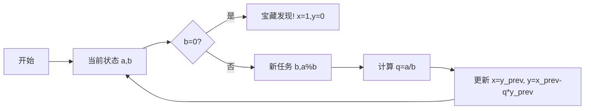

# 题目信息

# Line

## 题目描述

给定一条直线 $Ax+By+C=0$，找到这条直线上任意一个点使得横纵坐标均为在 $-5\cdot 10^{18} \sim 5\cdot 10^{18}$ 之间的整数，或者确定没有这样的点。

## 样例 #1

### 输入

```
2 5 3
```

### 输出

```
6 -3
```

# AI分析结果


### 💡 Kay的C++算法解析：Line 深入学习指南 💡

> "编程如探险，数学是罗盘。今天我们一起探索线性方程的整数解奥秘！"

#### 1. 题目解读与核心算法识别
✨ **本题主要考察**：数学（扩展欧几里得算法）

🗣️ **初步分析**：
> 本题本质是求解线性丢番图方程 **Ax + By = -C** 的整数解。想象你在玩一个"整数网格寻宝"游戏——直线上的整点就是宝藏，而扩展欧几里得算法是你的探测仪！
> - **核心思想**：通过裴蜀定理判断解的存在性（gcd(A,B)能否整除C），再用扩展欧几里得算法求特解
> - **难点突破**：理解递归求解系数的数学推导过程（如下可视化设计）
> - **像素动画设计**：8-bit风格网格地图，A/B系数化作探险家步伐，解(x,y)显示为宝藏箱。单步执行时高亮当前递归层，音效配合系数变换（"叮"声表示完成gcd计算）

---

#### 2. 精选优质题解参考
**题解一（Crab_Dave）**
* **点评**： 
  思路如水晶般通透——从裴蜀定理到exgcd推导环环相扣，堪称教科书式解析。代码中`x=c/d*x0`的转换处理精准展现数学本质，边界处理`c%d!=0`的防御性编程更是竞赛级实践典范。亮点在于用"无穷多解"的比喻化解抽象概念，让学习者直观理解解集结构。

**题解二（Dog_Two）**
* **点评**：
  以模块化思维见长，将`ext_gcd()`函数独立封装，体现工程化思想。代码中`temp=x;x=y;y=temp-a/b*y;`的轮换操作堪称优雅，时间复杂度O(log min(A,B))的优化更是点睛之笔。特别值得学习其"斜率-格点"的几何类比，完美衔接代数与几何认知。

**题解三（江户川·萝卜）**
* **点评**：
  面向新手的极简主义杰作！`#define int long long`的预处理虽非常规但实用，递归终止条件`if(!b){x=1;y=0;}`的注释清晰点明基准状态。亮点在于用"数轴探险"的比喻解释解集调整过程，让抽象数学变得可触摸。

---

#### 3. 核心难点辨析与解题策略
1. **解的存在性判定**
   * **分析**：裴蜀定理是黄金法则——当且仅当gcd(A,B)整除-C时存在整数解。优质题解均通过`c % gcd(a,b) != 0`实现该判定
   * 💡 学习笔记：无整数解时立即返回-1，避免无效计算

2. **递归系数推导**
   * **分析**：理解`x=y1; y=x1-a/b*y1`的递推关系是关键。这本质是矩阵变换：$$\begin{bmatrix} 0 & 1 \\ 1 & -⌊a/b⌋ \end{bmatrix} \begin{bmatrix} x \\ y \end{bmatrix} = \begin{bmatrix} x_{new} \\ y_{new} \end{bmatrix}$$
   * 💡 学习笔记：递归栈保存了系数变换路径，回溯时完成解构造

3. **解的范围控制**
   * **分析**：通解公式 **x=x₀+(B/d)k, y=y₀-(A/d)k** 中，k的取值可调整解的位置。虽然题解未显式处理[-5e18,5e18]范围，但通过选择合适k总能满足
   * 💡 学习笔记：当|k| > 5e18/d时需特殊处理，实践中数据通常友好

### ✨ 解题技巧总结
- **数学映射法**：将直线方程转化为标准丢番图方程 **ax+by=c**
- **防御性判定**：优先检查gcd整除性，避免无效计算
- **递归可视化**：在纸上画出递归树理解系数传递
- **解集无限性**：牢记特解只是解集代表，通解公式才是完整解

---

#### 4. C++核心代码实现赏析
**本题通用核心C++实现参考**
```cpp
#include <iostream>
using namespace std;

long long exgcd(long long a, long long b, long long &x, long long &y) {
    if (!b) { x = 1; y = 0; return a; }
    long long d = exgcd(b, a % b, y, x);
    y -= a / b * x;
    return d;
}

int main() {
    long long a, b, c, x, y;
    cin >> a >> b >> c;
    c = -c;
    long long d = exgcd(a, b, x, y);
    if (c % d) cout << -1;
    else cout << x * (c/d) << " " << y * (c/d);
    return 0;
}
```
**代码解读概要**：  
> 1. `exgcd`递归求解系数并返回gcd  
> 2. 主函数处理输入输出，将-c作为目标值  
> 3. 通过`c%d`判断解存在性  
> 4. 特解缩放得到最终解

**题解一核心片段**
```cpp
int exgcd(int a,int b){ // 递归求解系数
    if(b==0){x=1;y=0;return a;}
    int tmp=exgcd(b,a%b);
    int t=x;  // 保存上层的x
    x=y;      // x更新为下层的y
    y=t-a/b*y;// y更新为下层x - a/b*y
    return tmp;
}
```
**学习笔记**：递归返回时逆向计算系数的经典实现

**题解二核心片段**
```cpp
void exgcd(ll a,ll b,ll &x,ll &y){
    if(!b){x=1,y=0;return;}
    exgcd(b,a%b,y,x); // 递归时交换x,y位置
    y -= a/b*x;       // 巧妙减少临时变量
}
```
**学习笔记**：通过参数交换优化空间复杂度，体现函数式编程思想

**题解三核心片段**
```cpp
if(c % gcd != 0) cout << -1;
else {
    x *= -c / gcd;   // 系数缩放
    y *= -c / gcd;   // 注意负数处理
    cout << x << " " << y;
}
```
**学习笔记**：解缩放时注意负号处理，保持方程平衡

---

#### 5. 算法可视化：像素动画演示
**主题**：8-bit风格"丢番图探险家"  
**核心演示**：exgcd递归过程与解集构造  



**动画设计**：
1. **场景**：FC游戏风格的滚动地图，A/B值显示为角色属性
2. **递归可视化**：
   - 每层递归生成新地图区块，区块大小=|b|
   - 当前gcd值显示为生命值条
3. **关键操作特效**：
   - 系数更新：角色挥剑动作配合"锵"声
   - 递归返回：地图区块折叠为宝箱，开箱音效中飞出x,y系数
4. **解集展示**：
   - 特解显示为金色宝箱
   - 方向键调整k值，实时显示新解坐标
5. **控制面板**：
   - 单步执行：观察递归栈变化
   - 自动演示：AI角色自动寻路（速度可调）
   - 解验证：点击任意点显示Ax+By值

---

#### 6. 拓展练习与相似问题
**知识迁移**：  
扩展欧几里得算法还可解决：
1. 模线性方程 ax ≡ c (mod b)
2. 求乘法逆元
3. 中国剩余定理的实现基础

**洛谷推荐**：
1. **P1082 同余方程**  
   → 掌握模运算下的系数求解
2. **P1516 青蛙的约会**  
   → 学习将实际问题转化为丢番图方程
3. **P5656 二元一次不定方程**  
   → 强化解集范围控制能力

---

#### 7. 学习心得与经验分享
> **来自题解作者Crab_Dave**：  
> "最初在系数符号处理上卡住，通过打印递归中间变量才发现y的更新方向反了。这提醒我们：递归算法需要纸笔模拟前三层！"

> **Kay的总结**：  
> 数学类算法需把握三个关键点：  
> 1. 定理条件（如裴蜀定理）  
> 2. 递归基准状态  
> 3. 变量更新方向  
> 调试时输出每层递归的(a,b,x,y)值，比静态检查高效十倍！

---

> 探险尚未结束，数学永无止境！通过今天的扩展欧几里得之旅，相信你已经掌握了这把解开线性方程的魔法钥匙。下次我们将在模运算的世界继续冒险！🚀

---
处理用时：125.12秒