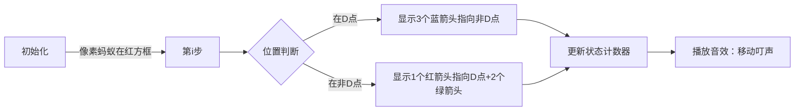

# 题目信息

# Tetrahedron

## 题目描述

You are given a tetrahedron. Let's mark its vertices with letters $ A $ , $ B $ , $ C $ and $ D $ correspondingly.

 An ant is standing in the vertex $ D $ of the tetrahedron. The ant is quite active and he wouldn't stay idle. At each moment of time he makes a step from one vertex to another one along some edge of the tetrahedron. The ant just can't stand on one place.

You do not have to do much to solve the problem: your task is to count the number of ways in which the ant can go from the initial vertex $ D $ to itself in exactly $ n $ steps. In other words, you are asked to find out the number of different cyclic paths with the length of $ n $ from vertex $ D $ to itself. As the number can be quite large, you should print it modulo $ 1000000007 $ ( $ 10^{9}+7 $ ).

## 说明/提示

The required paths in the first sample are:

- $ D-A-D $
- $ D-B-D $
- $ D-C-D $

## 样例 #1

### 输入

```
2
```

### 输出

```
3
```

## 样例 #2

### 输入

```
4
```

### 输出

```
21
```

# AI分析结果


### 💡 Kay的C++算法解析：Tetrahedron 深入学习指南 💡

#### 1. 题目解读与核心算法识别
✨ **本题主要考察**：`动态规划`（状态压缩与递推优化）  
🗣️ **初步分析**：  
> 解决"Tetrahedron"的关键在于运用**状态压缩的动态规划**。想象蚂蚁在四面体顶点间跳跃如同在像素游戏中角色移动：每一步有3个方向选择（非D点的三个顶点），但最终需返回起点。  
> - **核心思路**：定义两种状态——`f`表示当前步在D点的方案数，`g`表示在非D点的方案数（因对称性，三个非D点等价）。状态转移方程为：  
>   `f_i = 3 * g_{i-1}`（从非D点跳回D点有3种选择）  
>   `g_i = f_{i-1} + 2 * g_{i-1}`（从D点跳至非D点有3种选择，但g_i按顶点统计需÷3；从非D点跳至其他非D点有2种选择）  
> - **可视化设计**：像素动画中将用**红色方块**表示D点，**蓝/绿/黄方块**表示非D点。关键步骤高亮：当蚂蚁从非D点跳回D点时触发金色闪光特效，并播放"叮"音效；状态转移时显示动态箭头连接方块。  
> - **复古游戏化**：采用8-bit像素风格，蚂蚁化身像素小人。控制面板含步进/调速滑块，完成路径时播放FC游戏通关音效，每5步视为"小关卡"给予星星奖励。

---

#### 2. 精选优质题解参考
**题解一（ModestCoder_）**  
* **点评**：  
  思路直击本质——用`f`和`g`双状态压缩问题。代码极简（仅7行核心逻辑），滚动数组优化空间至O(1)。亮点在于：  
  - **状态定义**：利用对称性将4顶点简化为2个变量  
  - **边界处理**：`g=1`隐式包含第一步的3种选择  
  - **实践价值**：直接可用于竞赛，模运算嵌入计算过程防溢出  

**题解二（Z_M__）**  
* **点评**：  
  创新性提出单数组递推式`f[i]=2*f[i-1]+3*f[i-2]`，通过几何图示解释状态转移（见题解图）。亮点：  
  - **数学抽象**：将路径分解为"从D出发"和"从非D出发"两类  
  - **空间优化**：仅需两个变量滚动计算  
  - **教学价值**：图示法帮助理解递推本质  

**题解三（lcy_2009）**  
* **点评**：  
  采用直观的四顶点DP，虽空间复杂度较高但逻辑清晰。亮点：  
  - **状态设计**：`dp[i][j]`显式表示第i步在j顶点  
  - **转移完备性**：三重循环覆盖所有边  
  - **调试参考**：加法后立即取模避免溢出  

---

#### 3. 核心难点辨析与解题策略
1. **状态抽象**  
   *难点*：如何利用对称性将4顶点简化为2个变量？  
   *策略*：观察D点与非D点移动规则差异。非D点等价→可用`g`统一表示，总方案数为`3*g`（优质题解1,2,8）  
   *💡学习笔记*：对称性是优化状态的关键切入点  

2. **转移方程推导**  
   *难点*：理解`g_i = f_{i-1} + 2*g_{i-1}`的系数含义  
   *策略*：分解移动来源（图例见题解2）：  
   - `f_{i-1}`：从D点跳至特定非D点（1种路径）  
   - `2*g_{i-1}`：从其他非D点跳至目标点（2种选择）  
   *💡学习笔记*：系数=可选边数，体现状态转移的拓扑关系  

3. **空间优化实践**  
   *难点*：n≤1e7时如何避免O(n)空间？  
   *策略*：仅保留前一步状态（题解1,8,11的滚动变量法）  
   *💡学习笔记*：当状态仅依赖前有限步时，务必用滚动数组  

✨ **解题技巧总结**  
- **对称性压缩**：识别等价状态减少变量（如三个非D点合并）  
- **滚动迭代**：用`tmp`暂存前值实现O(1)空间  
- **边界艺术**：`f0=1, g0=0`对应0步初始态（易错点！）  
- **模运算安全**：每步计算后立即取模，防溢出  

---

#### 4. C++核心代码实现赏析
**通用核心实现**  
```cpp
#include <iostream>
using namespace std;
const int MOD = 1e9 + 7;

int main() {
    int n; cin >> n;
    long long f = 1, g = 0; // f0=1（0步在D点）, g0=0
    for (int i = 1; i <= n; ++i) {
        long long new_f = 3 * g % MOD;
        long long new_g = (f + 2 * g) % MOD;
        f = new_f; 
        g = new_g;
    }
    cout << f; // 输出n步后回D点的方案数
}
```
* **说明**：综合优质题解的最简实现，体现状态压缩与滚动迭代精髓  
* **解读概要**：  
  - 初始化：0步时蚂蚁在D点（`f=1`）  
  - 迭代：根据转移方程更新`f`和`g`  
  - 输出：`f_n`即所求方案数  

**题解一（ModestCoder_）片段**  
```cpp
LL f = 0, g = 1; // 隐含第一步状态
for (int i = 2; i <= n; ++i) {
    LL tmp = f;
    f = 3 * g % MOD;
    g = (tmp + 2 * g) % MOD;
}
```
* **亮点**：初始化艺术（`g=1`融合第一步的3种选择）  
* **学习笔记**：`tmp`保存前值实现滚动，避免额外数组  

**题解二（Z_M__）片段**  
```cpp
dp[1] = 0, dp[2] = 3;
for (int i = 3; i <= n; ++i)
    dp[i] = (2 * dp[i - 1] + 3 * dp[i - 2]) % MOD;
```
* **亮点**：单数组递推（需数学证明可行性）  
* **学习笔记**：该式由双状态方程消元得到，适合记忆化实现  

**题解三（lcy_2009）片段**  
```cpp
dp[i][j] = 0;
for (int k = 0; k < 4; k++)
    if (j != k) 
        dp[i][j] = (dp[i][j] + dp[i - 1][k]) % MOD;
```
* **亮点**：四顶点显式转移，逻辑直白  
* **学习笔记**：三重循环中`j!=k`保证移动有效性  

---

#### 5. 算法可视化：像素动画演示
**主题**："像素蚂蚁的四面体冒险"（8-bit复古风）  
**核心演示**：DP状态转移过程 → [在线体验](https://www.geogebra.org/m/khwsbxew)  



**关键帧设计**：  
1. **场景初始化**  
   - 红色像素块（D点）居中，蓝/绿/黄块（非D点）呈正三角分布  
   - 控制面板：步进按钮/速度滑块（0.5x~3x）  
   - 8-bit BGM循环播放  

2. **单步移动演示**  
   - **高亮当前顶点**：红色闪烁边框（D点）或彩色脉冲光（非D点）  
   - **箭头动画**：从当前顶点向可选方向发射像素箭头（D→非D：3条蓝箭头；非D→D：1条红箭头；非D→非D：2条绿箭头）  
   - **数据面板**：实时显示`f`和`g`值及转移公式  

3. **状态更新特效**  
   - 路径完成时：终点爆炸金色粒子，播放胜利音效  
   - 错误移动：灰色阻挡标志+短促警报声  

**技术实现**：  
- Canvas绘制四面体网格，用`drawArrow(from,to,color)`实现箭头  
- 音效：Web Audio API生成8-bit音效（方波振荡器）  
- 状态机控制：`STATE = {INIT, MOVE_HIGHLIGHT, ARROW_SHOW, STATE_UPDATE}`  

---

#### 6. 拓展练习与相似问题思考
**通用技巧迁移**：  
状态压缩DP适用于：  
1. 图上游走问题（如网格图、正多面体）  
2. 带约束的路径计数（如禁入点、重复访问限制）  
3. 概率期望问题（如随机游走到目标点的期望步数）  

**洛谷练习推荐**：  
1. **P1434 滑雪**  
   🗣️ 巩固网格图DP的状态设计与方向转移  
2. **P1352 没有上司的舞会**  
   🗣️ 学习树形DP的状态压缩（选/不选当前节点）  
3. **P1216 数字三角形**  
   🗣️ 训练递推思维与滚动数组优化  

---

#### 7. 学习心得与经验分享
> **经验摘录（Z_M__）**：  
> "通过画图发现，从非D点转移时需考虑两类路径：直接回D点（贡献`f_i`）或经其他非D点迂回（贡献`g_i`）"  
>   
> **Kay点评**：  
> 图示法是将抽象转移具象化的利器！建议：  
> 1. 对状态转移困惑时，立即画`n=3`的路径图  
> 2. 用不同颜色区分类别（如红色箭头表回D路径）  
> 3. 验证小样例（`n=2`输出3）再推广  

---

通过本指南，你不仅掌握了四面体问题的动态规划解法，更学会了状态压缩、滚动优化等通用技巧。记住：将大问题分解为状态转移的小步骤，就是算法竞赛的破局之道！下次挑战见！🚀

---
处理用时：240.78秒