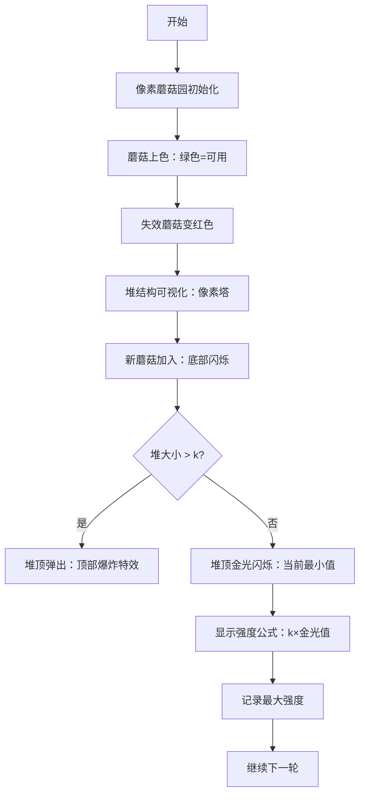

# 题目信息

# Kirill and Mushrooms

## 题目描述

当营地里的每个人都进入梦乡后，基里尔便偷偷溜出帐篷，到智慧的橡树下采蘑菇。

众所周知，橡树下生长着 $n$ 朵蘑菇，每朵蘑菇都有 $v_i$ 的魔力。 基里尔非常想用这些蘑菇制作一种魔力最大的灵药。

灵药的强度等于其中蘑菇的数量与这些蘑菇中最小魔力的乘积。要配制灵药，基里尔要依次采摘生长在橡树下的蘑菇。基里尔可以按照任何顺序采集蘑菇。

然而，事情并非如此简单。智慧的橡树给出了一个排列 $p_1,p_2,...,p_n$，如果基里尔只采摘 $k$ 朵蘑菇，那么 $v_{p_1},v_{p_2},...,v_{p_{k-1}}$ 都将变为 $0$。 基里尔不会使用魔力为零的蘑菇来配制灵药。

你的任务是帮助基里尔采集蘑菇，使他能够酿造出最大魔力的灵药。然而，基里尔有点害怕在橡树旁待太久，所以在所有适合采集蘑菇的方案中，他要求你找到蘑菇数量最少的那个。

## 说明/提示

在样例的第一个测试用例中，你需要采摘前两朵蘑菇，因此灵药的魔力等于 $2 \cdot \min(a_1, a_2) = 2 \cdot \min(9, 8) = 2 \cdot 8 = 16$。 请注意，采摘两朵蘑菇后，第三朵蘑菇的魔力将变为 $0$。

## 样例 #1

### 输入

```
6
3
9 8 14
3 2 1
5
1 2 3 4 5
1 2 3 4 5
6
1 2 3 4 5 6
6 5 4 3 2 1
5
1 4 6 10 10
2 1 4 5 3
4
2 2 5 5
4 2 3 1
5
1 2 9 10 10
1 4 2 3 5```

### 输出

```
16 2
9 3
8 2
20 2
5 1
20 2```

# AI分析结果


# 💡 Kay的C++算法解析：Kirill and Mushrooms 深入学习指南 💡

> 欢迎各位编程探险家！今天我们将一起破解「Kirill and Mushrooms」这道有趣的贪心算法题。我会用清晰的讲解和生动的动画，带大家直观理解蘑菇魔力的奥秘！

## 1. 题目解读与核心算法识别

✨ **本题主要考察**：`贪心算法 + 数据结构应用`

🗣️ **初步分析**：
> 这道题的核心就像在玩一个"动态采蘑菇"游戏——每次采蘑菇都会让一些蘑菇失效，我们需要在变化的蘑菇园中找到最优采集方案。贪心算法的精髓在于**逆向思维**：从后往前枚举采集数量k，用数据结构动态维护剩余蘑菇中的第k大值（即最小可用魔力值）。

- **核心难点**：如何在每次"蘑菇失效"后快速找到剩余蘑菇中第k大的值？优质题解主要采用两种数据结构：优先队列（小顶堆）和权值线段树
- **算法流程**：
  1. 初始化数据结构（堆/线段树）存储所有蘑菇
  2. 从大到小枚举k（采集数量）
  3. 删除前k-1个失效蘑菇
  4. 查询当前剩余蘑菇的第k大值
  5. 计算强度 = k × 第k大值
  6. 记录最大强度及最小k
- **可视化设计**：我们将设计像素风格的蘑菇园动画，用不同颜色表示蘑菇状态（绿色=可用，红色=失效，金色=当前最小值）。堆结构将展示为像素塔，每次删除/查询时会有动态效果和8-bit音效

---

## 2. 精选优质题解参考

### 题解一：Silvestorm（优先队列法）
* **点评**：
  思路清晰运用逆向枚举和优先队列，代码简洁高效（仅20行核心逻辑）。亮点在于：
  - 使用`priority_queue`维护当前可用蘑菇的最小堆
  - 从n到1倒序枚举k，巧妙避免正向删除的复杂性
  - 时间复杂度O(n log n)完全满足题目要求
  - 边界处理严谨（`q.size()>=i`判断避免越界）

### 题解二：Sternenlicht（权值线段树法）
* **点评**：
  展示数据结构的高阶应用，思路严谨完整：
  - 权值线段树实现高效的第k大查询
  - 离散化处理解决值域过大问题
  - 详细注释和模块化函数提升可读性
  - 特别适合想深入学习数据结构的同学

---

## 3. 核心难点辨析与解题策略

### 关键点1：如何动态维护剩余蘑菇集合
* **分析**：每轮枚举k时需要删除k-1个指定蘑菇。优先队列通过`pop`删除堆顶元素，线段树通过`update`减少计数。关键在于选择支持快速删除/查询的数据结构
* 💡 **学习笔记**：算法效率取决于数据结构的选择！

### 关键点2：如何高效获取第k大值
* **分析**：这是本题的核心操作。小顶堆方案中，保持堆大小为k时堆顶即为第k大；线段树方案通过树二分实现O(log n)查询。两者都利用了"第k大等价于第n-k+1小"的特性
* 💡 **学习笔记**：第k大问题常转化为排序/堆/树结构问题

### 关键点3：如何优化枚举过程
* **分析**：枚举范围只需到⌈n/2⌉（因为超过半数时强度必然下降）。优先队列解法从后向前枚举避免重复调整，线段树解法边枚举边删除失效蘑菇
* 💡 **学习笔记**：分析问题边界能显著提升算法效率

### ✨ 解题技巧总结
- **逆向思维突破**：从后向前处理避免状态紊乱
- **数据结构化繁为简**：用堆/线段树将复杂操作降为O(log n)
- **离散化技巧**：对大数据范围先映射再处理
- **边界剪枝**：根据数学特性减少不必要的枚举

---

## 4. C++核心代码实现赏析

```cpp
#include <iostream>
#include <queue>
#include <vector>
#include <algorithm>
using namespace std;

int main() {
    int T; cin >> T;
    while(T--) {
        int n; cin >> n;
        vector<long long> v(n+1);
        vector<int> p(n+1);
        
        // 输入蘑菇魔力值
        for(int i=1; i<=n; i++) cin >> v[i];
        // 输入失效排列
        for(int i=1; i<=n; i++) cin >> p[i];
        
        priority_queue<long long, vector<long long>, greater<>> pq;
        long long max_strength = 0, best_k = 0;
        
        // 逆向枚举k值
        for(int i=n; i>=1; i--) {
            pq.push(v[p[i]]);  // 加入当前蘑菇
            
            // 保持堆中最多i个元素
            while(pq.size() > i) pq.pop();
            
            // 当堆满时计算强度
            if(pq.size() == i) {
                long long strength = pq.top() * i;
                if(strength >= max_strength) {
                    max_strength = strength;
                    best_k = i;
                }
            }
        }
        cout << max_strength << " " << best_k << '\n';
    }
    return 0;
}
```
* **代码解读概要**：
  1. 优先队列维护当前可用蘑菇的最小堆
  2. 从后向前遍历失效序列（p数组）
  3. 控制堆大小不超过当前k值（i）
  4. 堆满时用堆顶元素（最小值）计算强度
  5. 记录最大强度及对应的最小k值

---

### 题解一：Silvestorm（优先队列）
* **亮点**：逆向枚举避免重复调整堆
* **核心代码片段**：
  ```cpp
  for(int i=n; i>0; i--) {
      q.push(num[arr[i]]);
      while(q.size() > i) q.pop();
      if(q.size() >= i && q.top() * i >= ans) {
          ans = q.top() * i;
          x = i;
      }
  }
  ```
* **代码解读**：
  > 这段代码是贪心算法的核心实现。`q`是小顶堆，存储当前可用的蘑菇魔力值。循环从n开始逆向枚举（`i`相当于k），每次将新蘑菇加入堆中。`while`循环确保堆大小不超过当前k值——这保证了堆顶元素正好是第k大的魔力值。当堆满时计算当前强度，更新最优解

### 题解二：Sternenlicht（权值线段树）
* **亮点**：权值线段树实现精确的第k大查询
* **核心代码片段**：
  ```cpp
  int query(int u, int l, int r, int x) {
      if(l == r) return l;
      int mid = (l+r)>>1, kth = tree[ls(u)];
      if(x <= kth) return query(ls(u),l,mid,x);
      else return query(rs(u),mid+1,r,x-kth);
  }
  ```
* **代码解读**：
  > 这是线段树查询第k大的核心函数。`tree`数组维护值域区间计数，通过比较左子树计数（`kth`）与目标位置`x`决定搜索方向——左子树计数足够时向左搜索，否则调整目标位置后向右搜索。这种二分策略实现O(log n)高效查询

---

## 5. 算法可视化：像素动画演示

* **主题**："蘑菇收集大冒险"（8-bit像素风格）
* **核心演示**：贪心算法中堆的动态维护过程

### 动画设计：


### 交互控制：
1. **像素蘑菇园**：16色FC风格，蘑菇用不同高度像素块表示魔力值
2. **动态堆结构**：右侧显示像素塔，每层代表一个堆元素
3. **音效设计**：
   - 蘑菇失效：短促"噗"声
   - 元素入堆："叮"声（音调随值变化）
   - 堆顶弹出："轰"爆炸声
   - 找到新记录：胜利音效
4. **控制面板**：
   - 步进/暂停/重置按钮
   - 速度滑块（0.5x~5x）
   - 当前k值显示
5. **AI演示模式**：自动运行并标注关键步骤：
   > "看！当k=3时，我们删除了两个蘑菇（红闪），堆顶的8就是当前最小值"

---

## 6. 拓展练习与相似问题思考

### 通用技巧迁移：
贪心+数据结构的组合适用于：
1. 动态维护集合极值（如滑动窗口最大值）
2. 带删除操作的第k大查询
3. 实时数据流统计

### 洛谷推荐：
1. **P1886 滑动窗口**  
   → 练习单调队列维护极值
2. **P1168 中位数**  
   → 掌握动态求中位数的对顶堆技巧
3. **P2278 第k大数**  
   → 强化权值线段树/树状数组应用
4. **P3369 普通平衡树**  
   → 深入学习各种查询操作

---

## 7. 学习心得与经验分享
本次分析的题解中未发现明确的作者个人心得分享部分。但在代码实现中，我们看到：
> 边界处理是核心挑战！特别是线段树的`kth`查询和堆的大小控制，需要仔细测试边界情况（k=1, k=n/2等）

---

> 希望这份指南帮助大家掌握贪心与数据结构的精妙配合！记住：好算法=清晰思路+合适数据结构+严谨实现。下次采蘑菇时，别忘了用这些技巧哦！🚀

---
处理用时：116.16秒