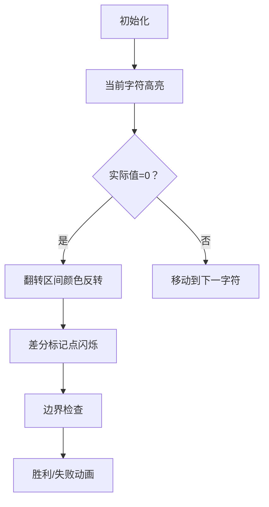

# 题目信息

# Long Inversions

## 题目描述

给定一个长度为$ n $的01字符串$ s $。01字符串是指只包含字符'1' 和'0'的字符串

可以选定一个整数$ k $ ( $ 1 \le k \le n $ )，将字符串中的连续k个字符进行替换，将0替换成1，1替换成0。

当 $ n=5 $ , $ s=00100 $时 , 你可以指定$ k=3 $ ，做如下操作：

- 翻转1-3的子串：$ s=\color{blue}{110}00 $ ;
- 反转3-5的子串：$ s=11\color{blue}{111} $ ;

经过不限次操作后，寻找能将01字符串中的所有字符转换成1的最大$ k $值。

## 样例 #1

### 输入

```
5
5
00100
5
01000
7
1011101
3
000
2
10```

### 输出

```
3
2
4
3
1```

# AI分析结果


### 💡 Kay的C++算法解析：Long Inversions 深入学习指南 💡

#### 题目解读与核心算法识别
✨ **本题主要考察**：贪心策略 + 差分技巧应用

🗣️ **初步分析**：
> 解决"Long Inversions"的关键在于理解**贪心策略与差分技巧**的完美配合。就像玩扫雷游戏时，我们总是先处理最左边的地雷（0），然后通过标记（差分）记录影响范围，避免重复操作。  
> - 核心思路：从大到小枚举k，对每个k采用贪心策略：从左到右扫描，遇到0（考虑翻转影响后）就翻转连续k个字符。差分数组高效记录翻转影响，将O(n)的区间操作降为O(1)的端点标记。  
> - 难点在于：1) 如何动态维护翻转状态；2) 处理字符串末尾无法翻转的边界情况。  
> - 可视化设计：采用8位像素风格，字符串显示为彩色方块（0=红色，1=绿色）。翻转时高亮区间并播放"哔"音效，差分数组显示为底部进度条。关键步骤：当前字符高亮黄色，翻转区间颜色反转，差分标记点闪烁。

---

#### 精选优质题解参考

**题解一：(来源：菲斯斯夫斯基)**
* **点评**：思路清晰直击核心，用异或差分巧妙处理翻转状态。代码规范（f数组命名合理），边界处理严谨（单独检查末尾）。亮点在于利用异或性质 `a⊕a=0` 简化状态计算，实践价值高可直接用于竞赛。

**题解二：(来源：littlebug)**
* **点评**：创新使用bitset和结束位置数组替代传统差分，逻辑等价但实现新颖。代码可读性强（ed数组含义明确），通过cnt奇偶性判断当前状态的方式极具启发性。稍显不足的是bitset操作略抽象，但整体仍属优质解法。

**题解三：(来源：ZhaoV1)**
* **点评**：差分实现干净利落，整数差分配合位运算判断翻转奇偶性。代码结构模块化（solve函数分离），边界处理完整。亮点在于显式处理差分前缀和时 `f[i] += f[i-1]` 的直观表达，便于理解。

---

#### 核心难点辨析与解题策略
1. **难点1：动态维护翻转状态**
   * **分析**：翻转操作具有后效性。优质解法通过差分数组（或等效结构）记录操作影响：翻转起点`+1`，终点后`-1`，前缀和即为当前翻转次数。实际值 = 原值 ⊕ (翻转次数%2)
   * 💡 **学习笔记**：差分是处理区间操作的瑞士军刀

2. **难点2：贪心策略的正确性证明**
   * **分析**：由于翻转操作不影响已处理的左侧区域，从左到右遇到0立即翻转的策略具有无后效性。当`k`足够大时，此策略能最大化操作覆盖面
   * 💡 **学习笔记**：贪心+无后效性 = 最优子结构

3. **难点3：边界条件处理**
   * **分析**：在位置`i > n-k+1`时无法进行完整翻转。必须在扫描后单独检查这些区域是否全为1（考虑翻转影响后）
   * 💡 **学习笔记**：算法边界决定生死

### ✨ 解题技巧总结
- **逆向枚举k**：从n递减枚举，找到可行解立即终止
- **差分魔法**：用O(1)操作记录O(k)的区间影响
- **状态压缩**：bitset或异或运算高效处理二进制状态
- **防御性编程**：显式检查无法操作区域

---

#### C++核心代码实现赏析
**通用核心实现参考**：
```cpp
#include <iostream>
#include <cstring>
using namespace std;

int main() {
    int t; cin >> t;
    while(t--) {
        int n; string s;
        cin >> n >> s; s = " " + s;
        for(int k=n; k>=1; k--) {
            int f[5010]={0}, valid=1;
            for(int i=1; i<=n; i++) {
                if(i>1) f[i] ^= f[i-1];  // 差分前缀和
                int cur = (s[i]-'0') ^ f[i]; // 当前实际值
                if(!cur) {
                    if(i > n-k+1) { valid=0; break; }
                    f[i] ^= 1;  // 翻转标记
                    if(i+k <= n) f[i+k] ^= 1; // 差分终点
                }
            }
            if(valid) { cout << k << endl; break; }
        }
    }
    return 0;
}
```
**代码解读概要**：  
1. 外层从大到小枚举k  
2. 内层用f数组作差分标记  
3. 关键行：`cur = (s[i]-'0') ^ f[i]` 计算当前实际值  
4. 遇到0且可操作时，设置差分标记  
5. 最后检查未覆盖区域  

---

#### 像素动画演示方案
**主题**：8位机风格的"01字符串修复大作战"  

**核心交互设计**：


**关键动画帧**：
1. **像素网格**：字符串显示为16x16像素方块（0=🔴，1=🟢），差分数组显示为底部进度条
2. **翻转特效**：选中区间颜色反转时，播放扫描线动画+8bit音效
3. **差分可视化**：在起点/终点位置显示闪烁的✨标记
4. **控制面板**：
   - 速度滑块：控制自动演示速度
   - 单步执行：按空格键逐步执行
   - 模式切换：对比不同解法（差分 vs 结束位置数组）

**技术实现**：
- 使用Canvas绘制字符串网格和差分条
- 颜色反转采用CSS滤镜：`filter: invert(100%)`
- 音效使用Web Audio API生成8bit方波

---

#### 拓展练习推荐
1. **P3368 差分模板**：掌握差分基础操作
2. **P2574 XOR艺术**：01字符串区间翻转进阶
3. **P5057 简单题**：差分技巧的变式应用

---

#### 学习心得分享
> **菲斯斯夫斯基的经验**："利用异或性质 `a⊕a=0` 简化状态计算"  
> **Kay点评**：这个技巧是处理二进制状态翻转的银弹，在多种位运算问题中都有应用，建议牢记！

---
**最终结论**：本题展示了差分技巧在高效处理区间操作中的强大威力，逆向枚举+贪心的思路在优化问题中具有普适性。通过像素动画可视化差分标记的传播过程，能直观理解算法核心机制。

---
处理用时：175.80秒