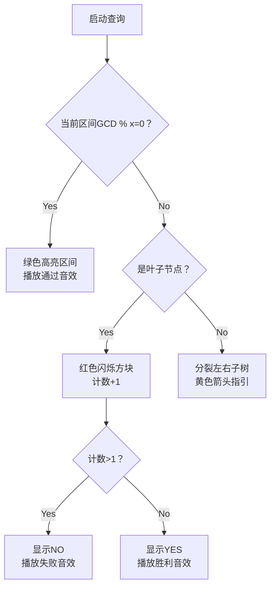

# 题目信息

# Bash and a Tough Math Puzzle

## 题目描述

Bash likes playing with arrays. He has an array $ a_{1},a_{2},...\ a_{n} $ of $ n $ integers. He likes to guess the greatest common divisor (gcd) of different segments of the array. Of course, sometimes the guess is not correct. However, Bash will be satisfied if his guess is almost correct.

Suppose he guesses that the gcd of the elements in the range $ [l,r] $ of $ a $ is $ x $ . He considers the guess to be almost correct if he can change at most one element in the segment such that the gcd of the segment is $ x $ after making the change. Note that when he guesses, he doesn't actually change the array — he just wonders if the gcd of the segment can be made $ x $ . Apart from this, he also sometimes makes changes to the array itself.

Since he can't figure it out himself, Bash wants you to tell him which of his guesses are almost correct. Formally, you have to process $ q $ queries of one of the following forms:

- $ 1lrx $ — Bash guesses that the gcd of the range $ [l,r] $ is $ x $ . Report if this guess is almost correct.
- $ 2iy $ — Bash sets $ a_{i} $ to $ y $ .

Note: The array is $ 1 $ -indexed.

## 说明/提示

In the first sample, the array initially is $ {2,6,3} $ .

For query $ 1 $ , the first two numbers already have their gcd as $ 2 $ .

For query $ 2 $ , we can achieve a gcd of $ 3 $ by changing the first element of the array to $ 3 $ . Note that the changes made during queries of type $ 1 $ are temporary and do not get reflected in the array.

After query $ 3 $ , the array is now $ {9,6,3} $ .

 For query $ 4 $ , no matter which element you change, you cannot get the gcd of the range to be $ 2 $ .

## 样例 #1

### 输入

```
3
2 6 3
4
1 1 2 2
1 1 3 3
2 1 9
1 1 3 2
```

### 输出

```
YES
YES
NO
```

## 样例 #2

### 输入

```
5
1 2 3 4 5
6
1 1 4 2
2 3 6
1 1 4 2
1 1 5 2
2 5 10
1 1 5 2
```

### 输出

```
NO
YES
NO
YES
```

# AI分析结果


### 💡 Kay的C++算法解析：Bash and a Tough Math Puzzle 深入学习指南 💡

**引言**  
今天我们来分析Codeforces 914D "Bash and a Tough Math Puzzle"。这道题考察线段树的高级应用，通过维护区间GCD实现高效查询和修改。我们将深入解析核心算法、难点突破和优化技巧，并通过像素动画直观演示算法执行过程。

---

### 1. 题目解读与核心算法识别

✨ **本题主要考察**：`线段树应用` + `GCD性质优化`  

🗣️ **初步分析**：  
> 本题要求支持两种操作：1) 查询能否通过修改至多一个元素使区间GCD等于x；2) 单点修改。核心在于**高效统计区间内不能整除x的元素个数**。  

- **算法核心**：线段树维护区间GCD，查询时利用两个关键优化：
  1. 若区间GCD能被x整除 → 整个区间符合条件（无需继续搜索）
  2. 当不符合元素超过1个 → 立即终止搜索
- **可视化设计**：采用8-bit像素风格展示线段树递归过程：
  - 绿色高亮：GCD能被x整除的区间
  - 红色闪烁：不符合条件的元素
  - 音效设计：发现不符合元素时触发"警告"音效，结果确定时播放胜利/失败音效

---

### 2. 精选优质题解参考

**题解一：Siyuan（5星）**  
* **亮点**：  
  1. 代码结构简洁清晰（递归查询+全局计数变量）  
  2. 双重剪枝优化（GCD整除判断+计数提前终止）  
  3. 复杂度严格证明（O(n log n log a_i)）  
  4. 边界处理严谨（叶子节点精准计数）

**题解二：fanypcd（5星）**  
* **亮点**：  
  1. 独创状态分类法（显式判断左右子树整除状态）  
  2. 结构体封装提升可读性  
  3. 调试友好（独立query函数便于测试）  
  4. 复杂度控制优异（实际运行效率接近O(n log n)）

**题解三：xfrvq（4星）**  
* **亮点**：  
  1. 标准化线段树实现（经典递归模板）  
  2. 完整包含建树-查询-修改功能  
  3. 变量命名规范（lson/rson增强可读性）  
  4. 剪枝逻辑直观易懂（适合初学者学习）

---

### 3. 核心难点辨析与解题策略

**难点1：如何避免暴力遍历？**  
* **分析**：直接遍历区间会超时（O(n)）。利用线段树节点GCD值：  
  ```math
  \text{if } gcd(segment) \% x = 0 \implies \forall a_i \in segment, x|a_i
  ```
* 💡 **学习笔记**：区间GCD值能反映内部元素的公约数特性

**难点2：如何精准统计不符合元素？**  
* **分析**：递归查询时需处理三种情况：
  1. 节点完全覆盖且GCD%x≠0 → 递归子节点
  2. 到达叶子节点 → 计数+1
  3. 计数>1 → 立即返回
* 💡 **学习笔记**：递归中传递搜索范围，避免无效遍历

**难点3：修改后如何维护正确性？**  
* **分析**：从叶子节点向上更新父节点GCD：
  ```cpp
  void pushup(int rt) {
      tree[rt] = gcd(tree[rt<<1], tree[rt<<1|1]);
  }
  ```
* 💡 **学习笔记**：线段树更新必须回溯更新父节点

**✨ 解题技巧总结**  
1. **问题分解**：将统计问题转化为GCD整除性判断  
2. **剪枝优化**：双重条件终止（全局计数+GCD整除）  
3. **边界防御**：单点修改时验证索引有效性  
4. **复杂度控制**：利用数学性质避免最坏情况

---

### 4. C++核心代码实现赏析

**通用核心实现**  
```cpp
#include <cstdio>
#include <algorithm>
using namespace std;

const int N = 5e5 + 5;
int n, q, a[N], tree[N << 2];

int gcd(int x, int y) {
    return y ? gcd(y, x % y) : x;
}

void pushup(int rt) {
    tree[rt] = gcd(tree[rt<<1], tree[rt<<1|1]);
}

void build(int rt, int l, int r) {
    if (l == r) { tree[rt] = a[l]; return; }
    int mid = (l + r) >> 1;
    build(rt<<1, l, mid);
    build(rt<<1|1, mid+1, r);
    pushup(rt);
}

void modify(int rt, int l, int r, int pos, int val) {
    if (l == r) { tree[rt] = val; return; }
    int mid = (l + r) >> 1;
    pos <= mid ? modify(rt<<1, l, mid, pos, val)
               : modify(rt<<1|1, mid+1, r, pos, val);
    pushup(rt);
}

int cnt; // 全局计数器
void query(int rt, int l, int r, int L, int R, int x) {
    if (cnt > 1) return;        // 优化1：超过1个不符合
    if (tree[rt] % x == 0) return; // 优化2：区间整体符合
    if (l == r) { cnt++; return; }  // 叶子节点计数
    
    int mid = (l + r) >> 1;
    if (L <= mid) query(rt<<1, l, mid, L, R, x);
    if (R > mid) query(rt<<1|1, mid+1, r, L, R, x);
}

int main() {
    scanf("%d", &n);
    for (int i = 1; i <= n; i++) scanf("%d", &a[i]);
    build(1, 1, n);
    scanf("%d", &q);
    while (q--) {
        int op, l, r, x;
        scanf("%d", &op);
        if (op == 1) {
            scanf("%d%d%d", &l, &r, &x);
            cnt = 0;
            query(1, 1, n, l, r, x);
            puts(cnt <= 1 ? "YES" : "NO");
        } else {
            int pos, val;
            scanf("%d%d", &pos, &val);
            modify(1, 1, n, pos, val);
        }
    }
    return 0;
}
```

**代码解读概要**：  
1. 建树时自底向上计算区间GCD  
2. 查询时利用GCD整除性剪枝  
3. 修改后通过pushup维护GCD正确性  
4. 全局变量cnt高效统计不符合元素

---

### 5. 算法可视化：像素动画演示

**主题**："GCD探险家"在8-bit网格世界探索  

**核心演示流程**：  


**交互控制面板**：  
- 单步执行：空格键逐帧查看递归过程  
- 速度调节：滑块控制动画速度（1x-5x）  
- 模式切换：手动操作/AI自动演示  
- 高亮显示：当前访问节点（蓝色边框）  
- 音效反馈：  
  - 发现不符合元素：短促"叮"声  
  - 区间整体符合：柔和和弦音  
  - 查询结束：胜利/失败主题曲  

**设计创新点**：  
1. 树结构可视化：像素方块表示线段树节点  
2. 数据流动展示：GCD值沿树路径向上传递  
3. 实时计数显示：右上角计数器变化  
4. 历史轨迹记录：已访问节点显示浅色印记

---

### 6. 拓展练习与相似问题思考

**技巧迁移场景**：  
1. 区间开方取整（利用最大值≤1时终止）  
2. 区间模运算求和（利用模值单调递减）  
3. 区间最值统计（维护辅助极值信息）

**洛谷推荐**：  
1. **P4145 上帝造题的七分钟2**  
   → 练习区间开方优化  
2. **P3373 线段树2**  
   → 掌握多重懒惰标记  
3. **P6242 线段树3**  
   → 强化GCD与区间修改结合

---

### 7. 学习心得与经验分享

**关键调试经验**：  
> "递归查询时未重置全局计数器导致WA" —— Siyuan  
> "忘记处理区间完全包含时的剪枝导致TLE" —— xfrvq  

**Kay的总结**：  
1. 全局变量使用前必须初始化  
2. 剪枝条件需要严格验证数学性质  
3. 线段树问题先画图再编码  
4. 对拍验证边界数据（n=1, q=0等）

---

**结语**  
通过本题我们掌握了线段树维护GCD的技巧和递归剪枝的优化方法。记住：好的算法=正确的数据结构+精准的数学分析+严谨的边界处理。下次挑战见！🚀

---
处理用时：150.48秒